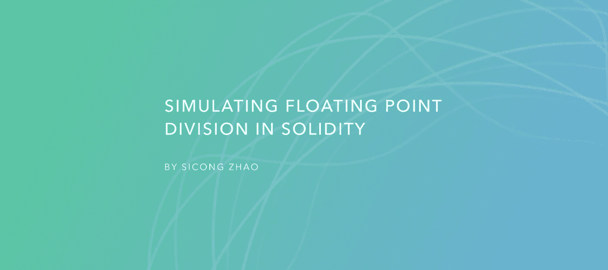
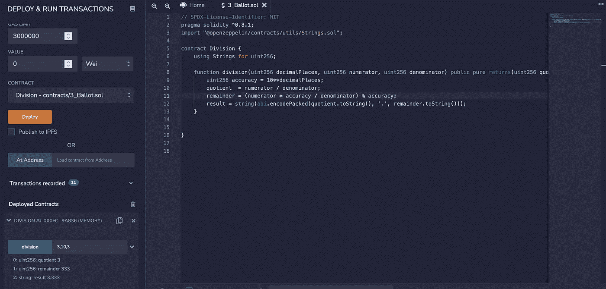

# 在 Solidity 中模拟浮点除法

> 原文：<https://levelup.gitconnected.com/simulating-floating-point-division-in-solidity-35b56d2b597e>

## 区块链开发教程 04



无意义的封面图片。

目前，我正在做一个 NFT 项目，它需要浮点除法来计算稀有度。经过一番研究，我了解到 Solidity 并不完全支持浮点数。然而，我还是完成了任务。在本教程中，我将分享我的方法。

# 当前状态

在 Solidity 中，定点数是浮点数的类型。然而，根据[官方文件](https://docs.soliditylang.org/en/latest/types.html#fixed-point-numbers):

> Solidity 还不完全支持定点数。它们可以被声明，但不能被赋值给或从。

换句话说，没用。

# 现有的解决方案

很多人选择 [ABDK Math 64.64 库](https://github.com/abdk-consulting/abdk-libraries-solidity/blob/master/ABDKMath64x64.sol#L219)。函数`divi()`处理浮点除法。它接受两个有符号的 256 位整数，并返回一个有符号的 128 位整数，模拟 64.64 位定点数。

# 我的解决方案

经过一些研究，我想出了我的解决方案，这是代码。

这个想法很简单。小数有整数部分和小数部分。就整体而言，该部门将完成这项工作。对于小数部分，该函数首先将分子缩放`10^n`倍，然后用分母除数，最后用缩放因子`10^n`取余数。

此外，出于可读性和显示目的，还有一个返回为`result`的浮点字符串版本。



图一。混音演示

我用 Remix 部署了这个契约来测试。如你所见，输入是`3, 10, 3`，这意味着我想将 10 除以 3，并保留 3 个小数点。而结果是`3.333`。

# 警告和更好的解决方案

当我在写上面的部分时，我意识到有一个问题，**舍入误差**。我试着计算 20 除以 3，会得到`6.666`，而预期的结果是`6.667`。

为了解决舍入误差，我改进了像专家一样处理舍入误差的代码。请随意部署此合同并亲自试用:)

如果你尝试过，你可能会发现这个问题。用两位小数计算 34 / 33 得出的结果是 1.3，而正确的结果应该是 1.03。问题是该函数将余数从百分之一位移到十分之一位，因为余数是个位数，而我们期望它是两位数。为了提高性能，这个函数应该在余数之前加上 0，然后再组合成输出字符串。下面是解决方案。

# 离别赠言

你有它！我希望这篇教程对你有所帮助。如果您有任何问题或建议(例如，如何改进代码)，请随时留下评论。如果你想让我写其他关于区块链发展的话题，也请告诉我！

```
**Want to Connect?**Please feel free to reach out ([my LinkedIn](https://www.linkedin.com/in/zhaosicong/)).
```