# 用 Java 模拟魔方动作

> 原文：<https://levelup.gitconnected.com/simulating-rubik-cube-actions-with-java-10cf44bc6014>

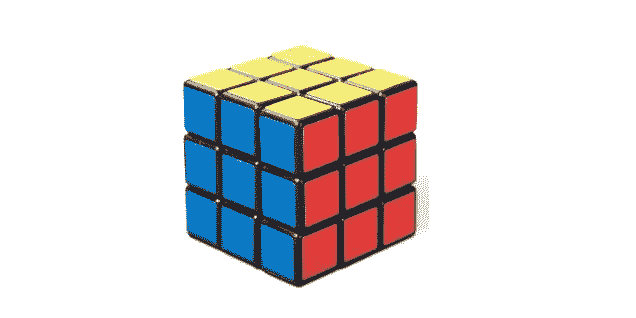

今天让我们做一些有趣的事情，模拟一个魔方。这是我下一个主题的前奏，提供解决魔方的方法。

# 系统模型化

我们可以有很多方法来模拟魔方模型作为一个类，但我在这里的目标是使它尽可能简单和易于理解。一个看起来更科学的方法是拥有三维数据，但这将涉及一些 3D 数学，可能会令人困惑，所以我不打算这样做。相反，我会把魔方分成 6 个面，然后平放。

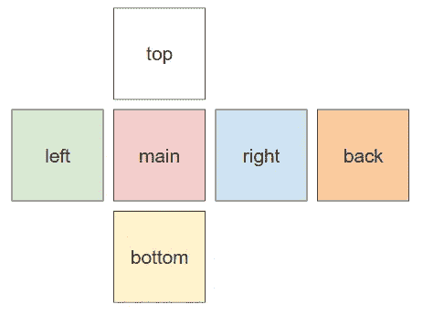

所以我们声明了一个名为`RubikSide`的类来建模，用立方体的大小和每个位置的值来表示颜色。我们只是在做一个 3x3 的魔方，但是代码应该可以处理不同的大小。我们没有保存 6 种颜色，而是用数字 1 - 6 来表示颜色——红色、蓝色、橙色、绿色、白色和黄色。

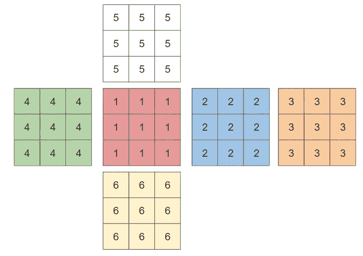

```
public class RubikSide implements Cloneable{
    private final int size;
    private int[][] values; public RubikSide(int size, int value){
        this.size = size;
        int[] dimension = IntStream.generate(() -> value).limit(size).toArray();
        values = IntStream.range(0, size)
                .boxed()
                .map(i -> dimension.clone())
                .toArray(int[][]::new);
    }
}
```

每一边的值都存储在名为`values`的 2D 数组中。第一维是行，第二维是列。

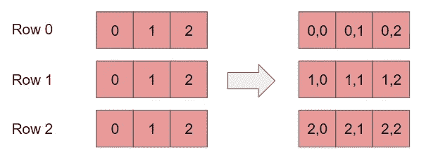

当我们将所有 6 个面组合在一起形成魔方时，我们定义了平放时的位置。这对我们后期的作品非常重要，尤其是上下翻柱的时候。

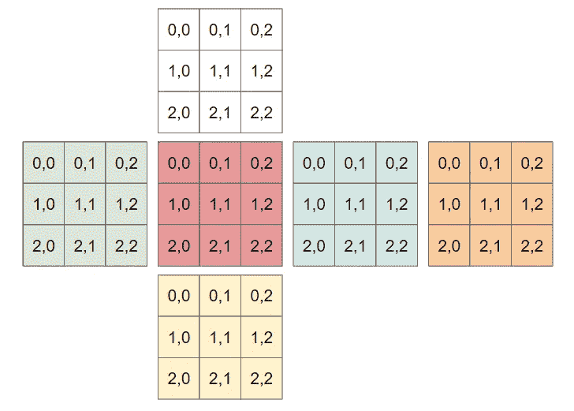

```
public class RubikCube{
    private RubikSide main;
    private RubikSide right;
    private RubikSide left;
    private RubikSide back;
    private RubikSide top;
    private RubikSide bottom;
    private int size; public RubikCube(int size){
        this.size = size;
        main = new RubikSide(size, 1);
        right = new RubikSide(size, 2);
        back = new RubikSide(size, 3);
        left = new RubikSide(size, 4);
        top = new RubikSide(size, 5);
        bottom = new RubikSide(size, 6);
    }}
```

# 基本功能

为了准备我们可以在魔方上执行的操作，我们应该创建一些方法来获取和设置每个`RubikSide`的行和列。获取行非常简单，获取列只需要一点点操作。

```
public int[] getRow(int row){
    return values[row];
}public int[] getCol(int col){
    return IntStream.range(0, size)
            .map(i -> values[i][col])
            .toArray();
}
```

设置这些值几乎是一样的。

```
public void setRow(int row, int[] newValues){
    values[row] = newValues;
}public void setCol(int col, int[] newValues){
    IntStream.range(0, size).forEach(i -> values[i][col] = newValues[i]);
}
```

# 行动

现在，我们已经准备好创建可以在魔方上执行的操作。我的简化策略是只针对可以在`main`端执行的动作。在不指定行和列的情况下，行和列应该是动态的，因为我们想要迎合不同的魔方大小(3x3、4x4、5x5)，我可以将一侧可用的所有操作总结如下:

1.  向左拐行`X`
2.  向右转动第`X`排
3.  将列“Y”向上转
4.  向下转动“Y”列
5.  顺时针旋转`main`侧
6.  逆时针旋转`main`侧。

# 转弯行

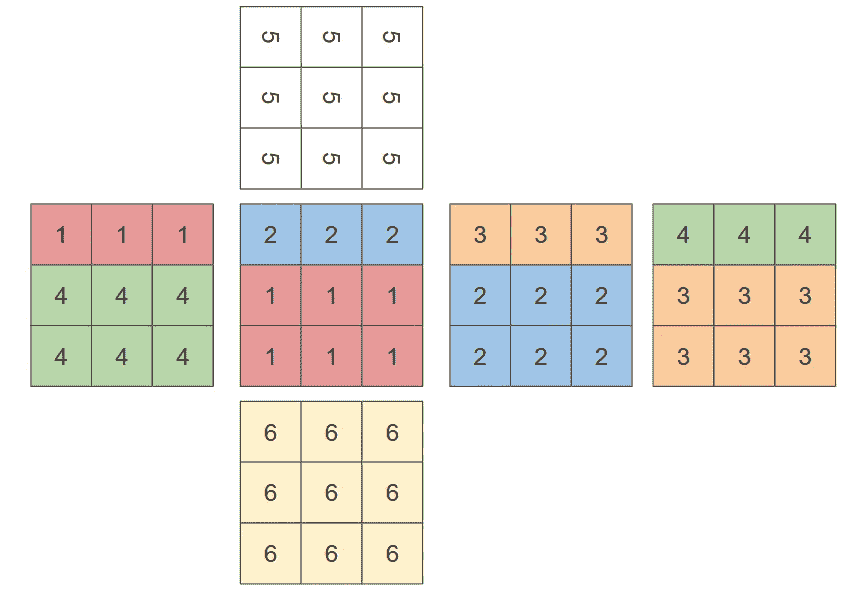

向左和向右旋转行是最简单的，我只需要重新分配每一边的值。例如，向左旋转一行只是用同一行在`right`侧的值重新分配在`main`侧的值。然后我们用同一行在`back`端的值替换`right`端的值。我们用`left`侧的行值替换`back`侧的行值。最后，在我们开始所有这些之前，我们应该有一个`main`侧的行值的副本，这样我们就可以用`main`侧的行值替换`left`侧的行值。但是，我们需要确保如果涉及到顶行或底行，我们需要旋转相应的顶边和底边。

```
public void turnRowToRight(int row) throws Exception{
        int[] mainTopRow = getMain().getRow(row);
        getMain().setRow(row, getLeft().getRow(row));
        getLeft().setRow(row, getBack().getRow(row));
        getBack().setRow(row, getRight().getRow(row));
        getRight().setRow(row, mainTopRow);
        if(row == 0){
            getTop().rotateAntiClockwise();
        }else if(row == (getSize() - 1)){
            getBottom().rotateClockwise();
        }
    } public void turnRowToLeft(int row) throws Exception{
        int[] mainTopRow = getMain().getRow(row);
        getMain().setRow(row, getRight().getRow(row));
        getRight().setRow(row, getBack().getRow(row));
        getBack().setRow(row, getLeft().getRow(row));
        getLeft().setRow(row, mainTopRow);
        if(row == 0){
            getTop().rotateClockwise();
        }else if(row == (getSize() - 1)){
            getBottom().rotateAntiClockwise();
        }
    }
```

所以现在，我们需要在`RubikSide`中创建旋转函数。顺时针旋转也可以这样想象。

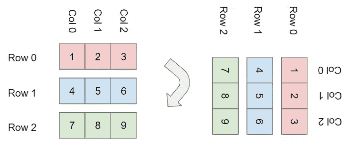

从上图中可以看出，新行只是每列的反转，因此我们可以轻松地创建`rotateClockwise`函数。

```
public void rotateClockwise(){
    values = IntStream.range(0, size)
                      .boxed()
                      .map(i -> Utils.reverseArray(getCol(i)))
                      .toArray(int[][]::new);
}
```

注意，我们将`reverseArray`函数重构为一个实用程序类，以确保符合[坚实原则](https://thecodinganalyst.github.io/software%20engineering/solid-principle/)。

```
public class Utils {
    public static int[] reverseArray(int[] arr){
        return IntStream.rangeClosed(1, arr.length)
                        .map(i -> arr[arr.length - i])
                        .toArray();
    }
}
```

逆时针旋转，我们的新`row 0`就是我们的`column n`，我们的`row n`就是我们的`column 0`，就像这样可以看到的。

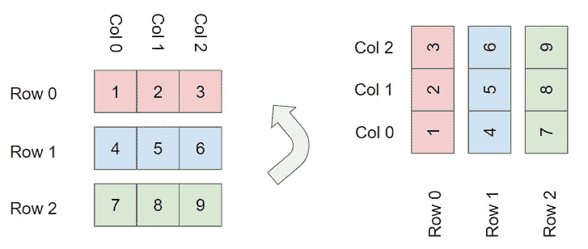

```
public void rotateAntiClockwise(){
        values = IntStream.rangeClosed(1, size)
                            .boxed()
                            .map(i -> getCol(size - i))
                            .toArray(int[][]::new);
}
```

# 转向柱

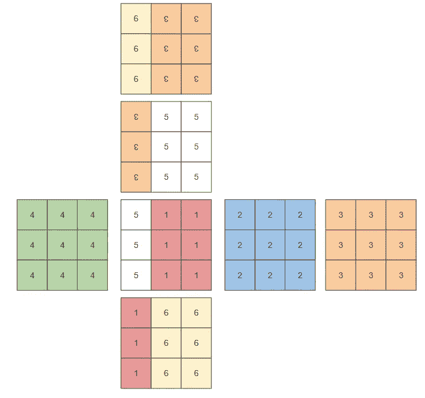

我们希望将旋转行的相同逻辑应用于旋转列。同样，要向下翻转一列，我们首先在`main`端保存该列值的副本。然后我们用`top`侧的列值替换`main`侧的列值，用`back`侧的列值替换`top`侧的列值。继续，我们用`bottom`侧的`column`值替换`back`侧的列值，用之前保存的`main`侧的列值替换`bottom`侧的列值。如果是第一列或最后一列，我们需要旋转`left`和`right`侧的值。

然而，如果我们想使用这种方法，有一点棘手，因为`back`面的顶部现在是底部，而`back`面的左侧现在是右侧。

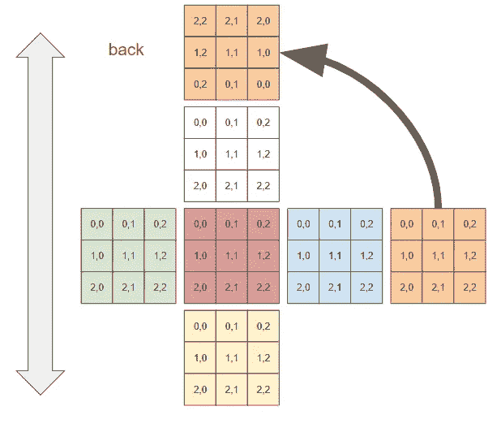

我们需要翻转`back`面，然后才能对值进行简单的重新分配，所以我们提供了一个`reverse2dArray`函数。

```
public static int[][] reverse2dArray(int[][] arr){
    int[][] interim =  IntStream.range(0, arr.length)
                                .boxed()
                                .map(i -> reverseArray(arr[i]))
                                .toArray(int[][]::new); return IntStream.rangeClosed(1, interim.length)
                    .boxed()
                    .map(i -> interim[interim.length - i])
                    .toArray(int[][]::new);
}
```

然后我们可以使用这个新函数将`back` face 的值临时更改为我们需要的透视图，这样我们就可以进行简单的列重新分配。但是，我们需要在完成列赋值后立即将视角切换回来。

```
public void turnColUp(int col) throws Exception{
        int[] mainCol = getMain().getCol(col);
        RubikSide reversedBack = getBack().cloneReversed();
        getMain().setCol(col, getBottom().getCol(col));
        getBottom().setCol(col, reversedBack.getCol(col));
        reversedBack.setCol(col, getTop().getCol(col));
        getTop().setCol(col, mainCol);
        back = reversedBack.cloneReversed();
        if(col == 0){
            getLeft().rotateAntiClockwise();
        }else if(col == (getSize() - 1)){
            getRight().rotateClockwise();
        }
    } public void turnColDown(int col) throws Exception{
        int[] mainCol = getMain().getCol(col);
        RubikSide reversedBack = getBack().cloneReversed();
        getMain().setCol(col, getTop().getCol(col));
        getTop().setCol(col, reversedBack.getCol(col));
        reversedBack.setCol(col, getBottom().getCol(col));
        getBottom().setCol(col, mainCol);
        back = reversedBack.cloneReversed();
        if(col == 0){
            getLeft().rotateClockwise();
        }else if(col == (getSize() - 1)){
            getRight().rotateAntiClockwise();
        }
    }
```

# 旋转`main`侧

因为我们的目标是让事情简单明了，所以我们希望将所有操作都集中在`main`侧。旋转`main`侧与旋转`right`侧的第一柱相同。但是我们不想在另一边做手术，然而我们仍然需要提供所有可能的手术。因此，我的解决方案是不要有旋转动作，而是用`face`动作将其他边变成`main`边。

# 面部动作

这应该是最简单的行动，只需更换两侧。而我们只需要提供 5 个这样的`face`动作——`face right`、`face back`、`face left`、`face top`、`face bottom`。

```
public void face(FACE newFace){
    Map<FACE, RubikSide> old = Map.of(
            FACE.MAIN, getMain().clone(),
            FACE.RIGHT, getRight().clone(),
            FACE.BACK, getBack().clone(),
            FACE.LEFT, getLeft().clone(),
            FACE.TOP, getTop().clone(),
            FACE.BOTTOM, getBottom().clone()
    );
    main = getFace(newFace);
    right = old.get(getRightFaceOf(newFace));
    back = old.get(getBackFaceOf(newFace));
    left = old.get(getLeftFaceOf(newFace));
    top = old.get(getTopFaceOf(newFace));
    bottom = old.get(getBottomFaceOf(newFace));
}public static FACE getBackFaceOf(FACE face){
    if(face == FACE.MAIN) return FACE.BACK;
    if(face == FACE.RIGHT) return FACE.LEFT;
    if(face == FACE.BACK) return FACE.MAIN;
    if(face == FACE.LEFT) return FACE.RIGHT;
    if(face == FACE.TOP) return FACE.BOTTOM;
    return FACE.TOP;
}public static FACE getRightFaceOf(FACE face){
    if(face == FACE.MAIN) return FACE.RIGHT;
    if(face == FACE.RIGHT) return FACE.BACK;
    if(face == FACE.BACK) return FACE.LEFT;
    if(face == FACE.LEFT) return FACE.MAIN;
    return FACE.RIGHT;
}public static FACE getLeftFaceOf(FACE face){
    if(face == FACE.MAIN) return FACE.LEFT;
    if(face == FACE.RIGHT) return FACE.MAIN;
    if(face == FACE.BACK) return FACE.RIGHT;
    if(face == FACE.LEFT) return FACE.BACK;
    return FACE.LEFT;
}public static FACE getTopFaceOf(FACE face){
    if(face == FACE.TOP) return FACE.BACK;
    if(face == FACE.BOTTOM) return FACE.MAIN;
    return FACE.TOP;
}public static FACE getBottomFaceOf(FACE face){
    if(face == FACE.TOP) return FACE.MAIN;
    if(face == FACE.BOTTOM) return FACE.BACK;
    return FACE.BOTTOM;
}
```

# 定义和执行操作

既然建模魔方的动机是为了解决它，我们需要一种方法来轻松地调用任何动作。一个简单的方法是将所有可能的动作放在一个列表中，这样每个动作都被分配了一个编号。但是由于我们的魔方大小是动态的，所以可能的动作数量也是动态的，这取决于行数和列数。

接下来，我们有两种不同类型的动作— `Turn`和`Face`。但它们都是动作，所以我们把它们概括为一个接口——`RubikCubeAction`。

```
public interface RubikCubeAction {
    String getName();
    void performAction(RubikCube rubikCube);
    RubikCubeAction oppositeAction();
}
```

这里我们提供了三个功能:`getName`、`performAction`和`oppositeAction`。`getName`应该打印动作的名称，这样我们可以直观地看到发生了什么。`performAction`利用一个[策略模式](https://refactoring.guru/design-patterns/strategy)用相同的方法调用不同的动作，而没有一长串 if-else 或 switch 语句。最后，为了确保我们的动作正确地更新了值，我们想要运行一个完整的动作列表，然后运行每个动作的相反动作的反向列表，它应该会返回给我们完美的魔方。所以我们需要每个动作都有一个相反的动作。

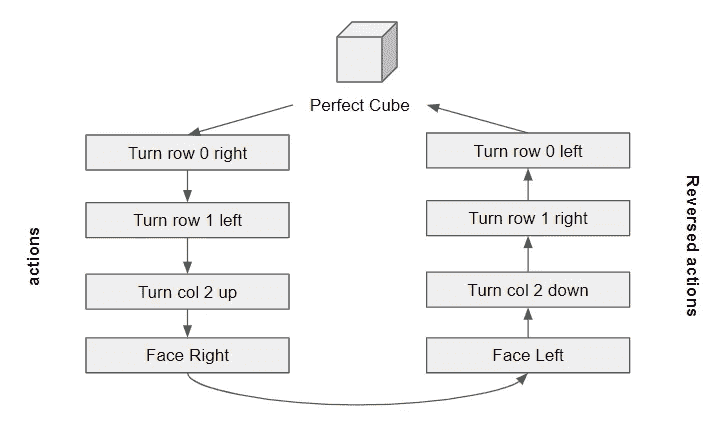

所以我们有一个`FaceAction`和一个`TurnAction`，它们实现了`RubikCubeAction`。这两个动作中的每一个都有助于为多维数据集提供所有可能的动作。

```
public class FaceAction implements RubikCubeAction{ private final RubikCube.FACE face; private FaceAction(RubikCube.FACE face){
        this.face = face;
    } public static FaceAction[] allActions(){
        return Arrays.stream(RubikCube.FACE.values())
                .filter(face -> face != RubikCube.FACE.MAIN)
                .map(FaceAction::new)
                .toArray(FaceAction[]::new);
    } @Override
    public void performAction(RubikCube rubikCube){
        rubikCube.face(face);
    } ...
}public class TurnAction implements RubikCubeAction{ public enum DIRECTION { LEFT, RIGHT, UP, DOWN}
    public enum TURN_TYPE { ROW, COL }
    public int turnPosition;
    public DIRECTION direction;
    public TURN_TYPE turnType; private TurnAction(TURN_TYPE turnType, DIRECTION direction, int turnPosition){
        this.turnType = turnType;
        this.direction = direction;
        this.turnPosition = turnPosition;
    } public static TurnAction[] allActions(int size){
        return IntStream.range(0, size)
                        .boxed()
                        .flatMap(i -> Stream.of(
                            new TurnAction(TURN_TYPE.ROW, DIRECTION.LEFT, i),
                            new TurnAction(TURN_TYPE.ROW, DIRECTION.RIGHT, i),
                            new TurnAction(TURN_TYPE.COL, DIRECTION.UP, i),
                            new TurnAction(TURN_TYPE.COL, DIRECTION.DOWN, i)
                        ))
                        .toArray(TurnAction[]::new);
    } @Override
    public void performAction(RubikCube rubikCube){
        try {
            if(turnType == TURN_TYPE.COL){
                if(direction == DIRECTION.UP) rubikCube.turnColUp(turnPosition);
                if(direction == DIRECTION.DOWN) rubikCube.turnColDown(turnPosition);
            }else if(turnType == TURN_TYPE.ROW){
                if(direction == DIRECTION.LEFT) rubikCube.turnRowToLeft(turnPosition);
                if(direction == DIRECTION.RIGHT) rubikCube.turnRowToRight(turnPosition);
            }
        }catch (Exception e){
            e.printStackTrace();
        }
    }
    ...
}
```

对于策略模式，我们只需要从`RubikCubeAction`接口进行简单的调用来执行`RubikCube`中的动作。

```
public void performAction(RubikCubeAction action) {
    action.performAction(this);
}
```

最后，我们可以在`RubikCube`的构造函数中定义所有可能的动作。

```
private RubikCubeAction[] allActions;public RubikCube(int size){
        this.size = size;
        main = new RubikSide(size, 1);
        right = new RubikSide(size, 2);
        back = new RubikSide(size, 3);
        left = new RubikSide(size, 4);
        top = new RubikSide(size, 5);
        bottom = new RubikSide(size, 6);
        allActions = Stream.concat(
                        Stream.of(FaceAction.allActions()),
                        Stream.of(TurnAction.allActions(size)))
                    .toArray(RubikCubeAction[]::new);
    }
}
```

# 核查

# 检验反向行动列表假设

为了确保我们到目前为止所做的是正确的，我们创建了一个`RubikSolution`来初始化一个 3x3 的魔方，并执行一系列随机动作，以及打印出魔方每边的值。然后，我们运行所执行的动作的反向列表，并再次打印立方体。我们应该得到一个完美的立方体。

# 打印

为了更容易地可视化操作的结果，让我们提供一个打印方法。

```
public void print(){
    String[] box = join(RubikSide.getEmptyString(getSize()), getTop().getString());
    Arrays.stream(box).forEach(System.out::println); box = join(getLeft().getString(), getMain().getString(), getRight().getString(), getBack().getString());
    Arrays.stream(box).forEach(System.out::println); box = join(RubikSide.getEmptyString(getSize()), getBottom().getString());
    Arrays.stream(box).forEach(System.out::println); System.out.println(" ");
}
```

# 随机动作

```
public List<RubikCubeAction> randomActions(RubikCube rubikCube, int count){
    Random random = new Random();
    int actionCount = rubikCube.getAllActions().length;
    return IntStream.range(0, count).boxed().map(i -> {
      RubikCubeAction action = rubikCube.getAllActions()[random.nextInt(actionCount)];
      rubikCube.performAction(action);
      return action;
    }).toList();
}
```

# 反向操作

```
public List<RubikCubeAction> reverseActions(List<RubikCubeAction> originalActions){
    return IntStream.rangeClosed(1, originalActions.size())
                .boxed()
                .map(i -> originalActions.get(originalActions.size() - i))
                .map(RubikCubeAction::oppositeAction)
                .toList();
}
```

# 运行假设

```
public static void main(String[] args) {
    RubikCube cube = new RubikCube(3);
    RubikSolution solution = new RubikSolution();
    List<RubikCubeAction> randomActions = solution.randomActions(cube, 20);
    randomActions.forEach(action -> System.out.println(action.getName()));
    cube.print();
    System.out.println(cube.check()); List<RubikCubeAction> reverseActions = solution.reverseActions(randomActions);
    reverseActions.forEach(action -> System.out.println(action.getName()));
    reverseActions.forEach(cube::performAction);
    cube.print();
    System.out.println(cube.check());
}
```

我们有一个行动列表

```
TURN_ROW_0_RIGHT
TURN_ROW_1_LEFT
FACE_RIGHT
TURN_COL_2_DOWN
FACE_TOP
FACE_LEFT
TURN_COL_1_UP
TURN_ROW_0_LEFT
TURN_COL_2_UP
FACE_LEFT
FACE_TOP
TURN_ROW_1_LEFT
TURN_COL_1_DOWN
TURN_COL_2_DOWN
TURN_ROW_0_LEFT
FACE_BACK
TURN_COL_2_DOWN
TURN_ROW_0_RIGHT
TURN_COL_2_DOWN
FACE_RIGHT
```

并打印出魔方。

```
 [4, 2, 4]
          [5, 1, 5]
          [3, 4, 2]
[2, 6, 5] [5, 3, 6] [6, 2, 3] [1, 2, 5]
[3, 6, 4] [6, 2, 1] [3, 5, 4] [5, 4, 2]
[4, 1, 1] [3, 5, 6] [1, 1, 3] [5, 3, 1]
          [4, 6, 2]
          [6, 3, 4]
          [6, 1, 2]
```

然后我们得到了相反的行动列表

```
FACE_LEFT
TURN_COL_2_UP
TURN_ROW_0_LEFT
TURN_COL_2_UP
FACE_BACK
TURN_ROW_0_RIGHT
TURN_COL_2_UP
TURN_COL_1_UP
TURN_ROW_1_RIGHT
FACE_BOTTOM
FACE_RIGHT
TURN_COL_2_DOWN
TURN_ROW_0_RIGHT
TURN_COL_1_DOWN
FACE_RIGHT
FACE_BOTTOM
TURN_COL_2_UP
FACE_LEFT
TURN_ROW_1_RIGHT
TURN_ROW_0_LEFT
```

我们拿回了完美的魔方！

```
 [5, 5, 5]
          [5, 5, 5]
          [5, 5, 5]
[4, 4, 4] [1, 1, 1] [2, 2, 2] [3, 3, 3]
[4, 4, 4] [1, 1, 1] [2, 2, 2] [3, 3, 3]
[4, 4, 4] [1, 1, 1] [2, 2, 2] [3, 3, 3]
          [6, 6, 6]
          [6, 6, 6]
          [6, 6, 6]
```

该主题的代码可在[https://github.com/thecodinganalyst/RubiksCube](https://github.com/thecodinganalyst/RubiksCube)获得。

*本文原载于*[*https://the coding analyst . github . io/fun/Simulating-Rubik-Cube-Actions-with-Java/*](https://thecodinganalyst.github.io/fun/Simulating-Rubik-Cube-Actions-with-Java/)

# 分级编码

感谢您成为我们社区的一员！更多内容见[升级编码出版物](https://levelup.gitconnected.com/)。
跟随:[推特](https://twitter.com/gitconnected)，[领英](https://www.linkedin.com/company/gitconnected)，[通迅](https://newsletter.levelup.dev/)
**升一级正在改造理工大招聘➡️** [**加入我们的人才集体**](https://jobs.levelup.dev/talent/welcome?referral=true)