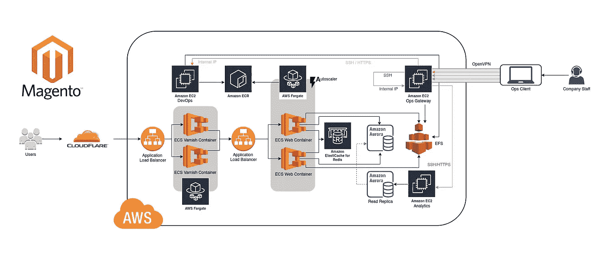
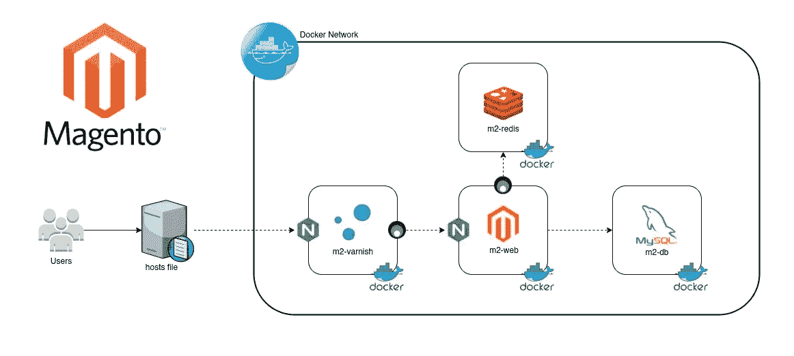

# 单命令 Magento 2 设置

> 原文：<https://levelup.gitconnected.com/single-command-magento-2-setup-67c041a032d1>

## 基本安装 w/ Nginx + Redis 和清漆配置在 5 分钟！

Magento 之所以对电子商务行业如此有吸引力，是因为一旦你正确地设置和配置了它，从 web dashboard 进行管理是非常用户友好的，这使得不太懂技术的人能够非常灵活地运行他们的电子商务商店，特别是如果他们想要部署一个多店面的电子商务实例。这些非常相同的原因是为什么 Magento 变得如此受欢迎，并在可预见的未来继续如此。然而，有利必有弊，最大的痛苦之一来自于“正确设置 Magento”的过程。正因为如此， [3DF](https://3df.io) 继续收到[一个接一个的请求，为那些为他们的电子商务网站运行 Magento](https://hkdb.medium.com/a-scalable-magento-2-architecture-107f5fe7a813) 的客户提供服务。这自然导致我们的团队多年来建立了一个相当全面的安装、配置和故障排除 Magento 的知识库。

现在，让我们来看看我们的一个客户的生产环境是什么样子的，以说明安装 Magento 意味着什么:

要“正确设置 magento”，通常需要花费几个小时到几个星期的时间(取决于你的经验水平),按照 [Adobe 文档](https://devdocs.magento.com/guides/v2.4/install-gde/install-flow-diagram.html)到“命令行忍者”的方式设置一个基本的环境，包括一个空白的商店和管理面板。然后，你开始思考为什么在进行了所有的定制之后，它运行得如此之慢，所以你最终会陷入 Redis 和 Varnish 兔子洞。当然，如果你的背景是系统管理或系统集成，这对你来说可能是轻而易举的事，但对最好的开发人员来说可能是相反的。我不知道有多少次听到 Magento 开发者告诉我，他们不是 devops 类型的，所以他们很难正确设置。他们只想继续他们的发展。事实上，我甚至收到了一些来自主要技术巨头的高级技术领导的消息，询问我如何将一个可扩展的 Magento 设置部署到以前与 Fargate、EFS、Elasticache 和 Aurora 一起使用的 AWS 上。

有一段时间，我最初的反应是，肯定有一些开源项目可以解决这个问题，对吗？所以我一有时间就会去找它。然而，虽然这些项目确实存在，我真的没有找到任何似乎符合要求的东西。它们要么已经过时，仍然需要太多的手动干预，缺乏 Redis 和 Varnish 的自动化，要么设置与我们设计的目标生产环境不匹配。

有鉴于此，有一天我坐下来，收集了我们项目的一点一滴，编辑了它们，并用 Nginx(没有 Apache) + Redis 和 Varnish 构建了 Magento 2 的单一命令/引导/交互设置。这个想法是能够在 5 分钟内快速设置一个具有所有基本配置的 Magento 实例，这样开发者就可以立即开始构建网站。一旦他们完成了站点的构建，他们就可以将数据库导入到 Aurora 中，并对 web 和 Varnish 容器进行映像，以部署到 Fargate。结果看起来像这样:

repo 实际上是在本地计算机或云中的虚拟机上安装和配置以下环境，尽可能减少开发人员的干预:

也许值得一提的是，虽然您可能觉得让容器在虚拟局域网或 AWS 所谓的 VPC 内相互通信足够安全，但我仍然觉得整个环境的容器之间的通信采用端到端加密更好。因此， [stunnel](https://stunnel.org) 会自动应用于任何不支持 SSL 的地方。

Varnish 容器还有一些集群配置，可以在启动时由环境变量激活，这样我们就可以在生产中的负载平衡器后面有一个 Varnish 容器集群，以实现可伸缩性。

当然，Varnish 是可选的，以防出现刚刚开始并希望降低复杂性的低流量部署。您可以随时返回 repo 来构建一个配置了 Varnish 的新环境，稍后只需将现有的 Magento 目录复制到新环境中。然而，我建议一开始就使用清漆，因为它确实能显著提高 Magento 的性能。

如果您有兴趣尝试一下，请登录 GitLab 查看回购:

 [## 带有 NGINX-REDIS 清漆的 hkdb / Magento 2

### dockered Magento 2+NGINX+REDIS 在 5 分钟内完成

gitlab.com](https://gitlab.com/hkdb/m2-nginx) 

或者，如果您愿意，也可以访问 GitHub 上的镜像回购:

 [## 3dfosi/m2-nginx

### 维护者:@hkdb A repo 预打包 Magento 2 实例(w/ NGINX、REDIS 和 Varnish)用于开发和…

github.com](https://github.com/3dfosi/m2-nginx) 

我希望通过在 [3DF OSI](https://osi.3df.io) 的部分赞助下开源这个解决方案，更多的开发者能够驯服这个叫做 Magento 的怪兽。如果有人有任何反馈，我很想听听。欢迎直接给我写信或在 [GitLab repo](https://gitlab.com/hkdb/m2-nginx/-/issues) 提交问题。如果在尝试之后，你觉得它对你有用，请随意给团队买些咖啡😉

尽情享受吧！