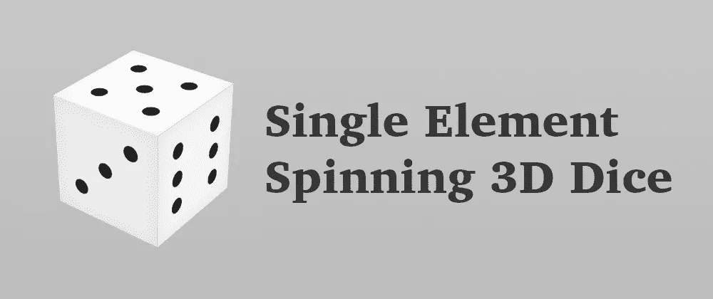

# 带有 CSS 的单元素 3D 骰子

> 原文：<https://levelup.gitconnected.com/single-element-dice-with-css-2a4827bf058>

## 用 CSS 和一个 HTML 元素创建一个 3D 外观的骰子。



用 CSS 创建一个 3D 外观的骰子并不特别困难。这很有可能是你在练习 3D CSS 时构建的第一个演示，因为它是一个简单的立方体，每一面都有不同的东西。

因此，HTML 看起来像这样的骰子是常见的:

```
<div class="dice">
  <div class="side side-1"></div>
  <div class="side side-2"></div>
  <div class="side side-3"></div>
  <div class="side side-4"></div>
  <div class="side side-5"></div>
  <div class="side side-6"></div>
</div>
```

其中每个面都被平移和/或旋转以形成立方体。然后相应地设置内容(记住一个骰子的对边总和总是 7。)这可能是一个基本立方体的 CSS:

```
.dice {
  animation: rotate 10s linear infinite;
  width: 30vmin;
  height: 30vmin;
  background: #ccc;
  transform: rotate3d(1, 1, 0, 60deg);
  transform-style: preserve-3d;
}

.side {
  background: #f003;
  position: absolute;
  width: 100%;
  height: 100%;
}

.side-1 { transform: rotateX(000deg) translateZ(15vmin); }
.side-2 { transform: rotateY(270deg) translateZ(15vmin); }
.side-3 { transform: rotateX(270deg) translateZ(15vmin); }
.side-4 { transform: rotateX(090deg) translateZ(15vmin); }
.side-5 { transform: rotateY(090deg) translateZ(15vmin); }
.side-6 { transform: rotateX(180deg) translateZ(15vmin); }
```

这里你可以看到这个立方体的演示(添加一些内容和颜色后):

画这个“很容易”…我们在推特上与[特玛尼·阿菲夫](https://twitter.com/ChallengesCss)和[官方](https://twitter.com/InHuOfficial)讨论这个问题，我们讨论了通过画一个 3D 骰子但使用单一元素来使它更具挑战性的可能性。这可能吗？怎么会？

理论上，用单个元素创建 3D 骰子是可能的，因为在任何给定的时间，最多有三个面是可见的，并且我们可以使用三个元素:元素本身以及与其相关联的`::before`和`::after`伪元素。所以我开始编码，这是我最后得到的结果:

# 这是如何做到的

这个解决方案使用单一元素，看起来是三维的，但是你可能已经注意到了，不是所有的面都是可见的！由于旋转只发生在一个轴上，其中一个边将总是可见的(而它的另一边将总是隐藏的，所以我们不需要画它。)这大大方便了工作:可见的一面将永远是元素本身。然后，我们只需要担心动画的伪元素。

但不止如此。总共有四个动画:

1.  旋转骰子的一般动画。这是一个应用于元素本身的动画，因此它绕 Z 轴旋转。
2.  两种不同的伪元素动画。让伪代码从一边“跳到”另一边，并改变它们的内容(从 1 到 6，从 3 到 4)。
3.  伪元素的附加动画，因此它们的颜色会随着旋转而改变。这样，一边会比另一边亮，一边会变暗，模拟一种光。

# 问题是

这个解决方案就是“作弊”。它只在一个轴上旋转，这使它更简单。但是如果我们让骰子在一个以上的轴上运动(所以所有的边都是可见的),事情就变得棘手了。)然后，它将要求伪元素“跳转”…元素本身也是如此。这就是问题的开始:改变组件的位置会弄乱伪元素的动画和位置。

我还没能完成那部分。可能是因为我有一个复杂的动画，或者可能是因为我不够努力，但我总是会遇到一个点，我想使用不同的变换源进行变换，这在 CSS 中是不允许的。

另一个“欺骗”选项是绕不同的轴旋转，但不在同一轴上。这样，所有骰子的面都将可见，但它只不过是这个技巧版本的扩展。

尽管如此，我认为用单个元素创建骰子同时在多个轴上旋转应该是可行的。所以我可能需要改变我对这个问题的看法。我们会看到它如何发展。

*原载于 2021 年 11 月 29 日*[*【https://alvaromontoro.com】*](https://alvaromontoro.com/blog/67992/single-element-dice-with-css)*。*