# 中的单文件可执行文件。NET Core 3.1 和对低于 50MB Docker 容器的追求

> 原文：<https://levelup.gitconnected.com/single-file-executables-in-net-core-3-1-and-the-quest-for-a-sub-50mb-docker-container-f44cb1274121>

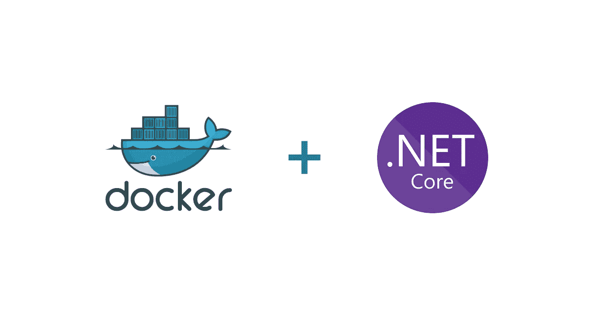

回购:[https://github.com/atkinsonbg/netcore-small-docker-image](https://github.com/atkinsonbg/netcore-small-docker-image)

我一直在建造。NET Core Web API 微服务已经有一段时间了，我一直很喜欢它。然而，就 Docker 图像大小而言，它无法与使用 SCRATCH base 图像的 Golang API 相提并论。我的一些作品图片是用。NET Core 2.0 通常在 200-300 MB 左右。虽然 Go 速度很快，编译起来也非常好，但我发现语言和工具还有待改进，有时我仍然渴望 Visual Studio 和它所有的语法。随着的发布。NET Core 3.1 LTS 去年，我决定是时候重新使用它来构建一个小型 WebAPI 容器了。

这趟旅程有几个要求。这些是我为自己设定的目标，目的是挑战极限。在这个实验中。

*   **仅 Linux 环境**:这些微服务将部署在 Kubernetes 上的 Docker 容器中，因此 Linux 环境是必须的。
*   **微小的集装箱足迹**:突突。NET Core 降到 10MB 以下很可能是不可能的，但目标是 50MB。
*   **没有多级 Dockerfile** :大部分的在线例子。容器中的. NET 核心 API 使用多阶段 docker 文件。我不想把这个要求作为项目的一部分。多阶段 Docker 构建非常好，但是会带来复杂性和时间。另外。NET Core 3.0，不再需要这个了。
*   **MacOS 开发环境**:我的开发环境是 MacOS，所以这个对我来说是硬性要求。

# 搭建 WebAPI

让我们开始建造一个基地。Visual Studio 核心 WebAPI。我们将使用“新建项目”向导，并从。网络核心应用“左手导航。

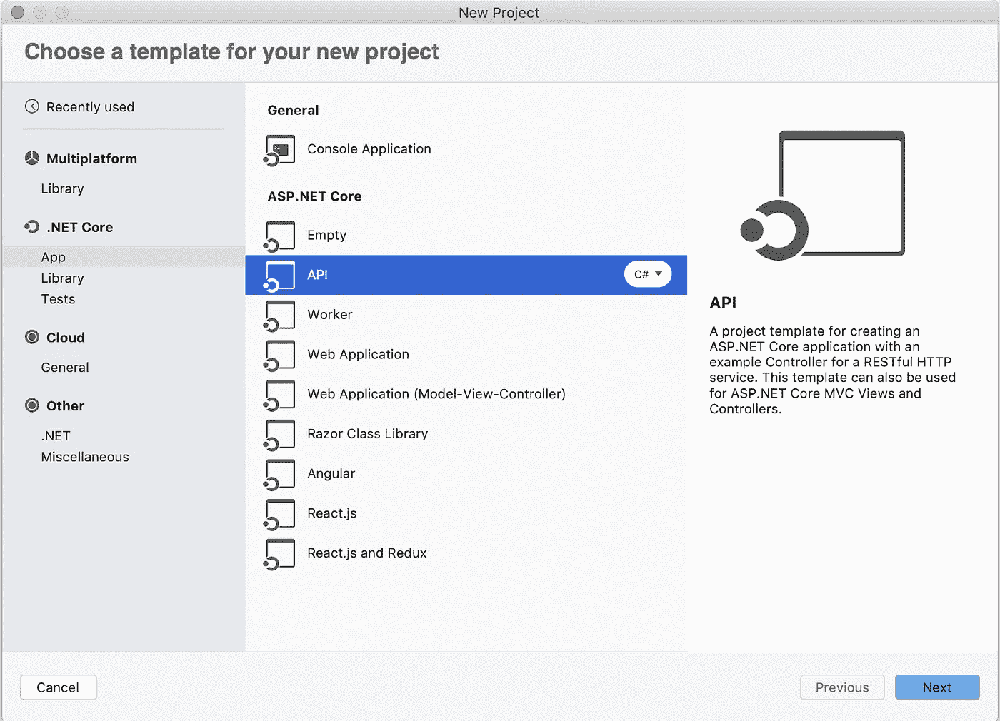

接下来，我们将选择我们的运行时”。网芯 3.0”当然。

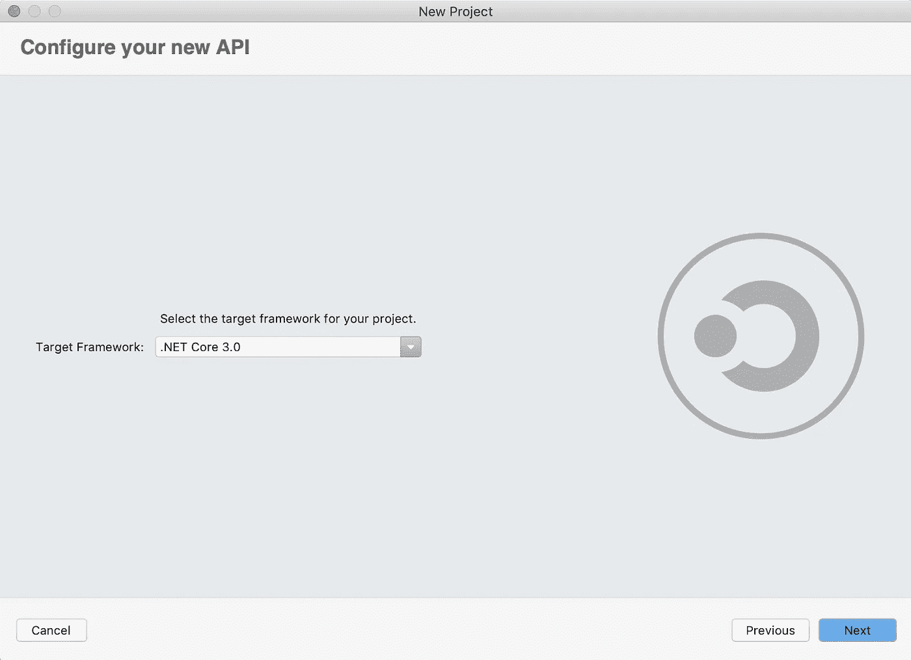

作为参考，我将我的解决方案命名为“Singlefile ”,将我的 WebAPI 项目命名为“Medium ”,这在 Visual Studio 中产生了以下结构。

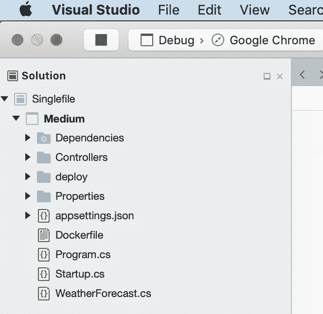

这将为我们提供一个具有单个控制器(WeatherForecastController)和 GET 端点的基本 WebAPI 框架。如果你不熟悉。NET Core WebAPI，默认的现成 API 是返回天气数据的单端点 API。这对于本教程来说已经足够了。此时，您可以构建并运行 API，以确保一切都正确连接。如果一切正常，您应该会获得一些不错的天气数据。

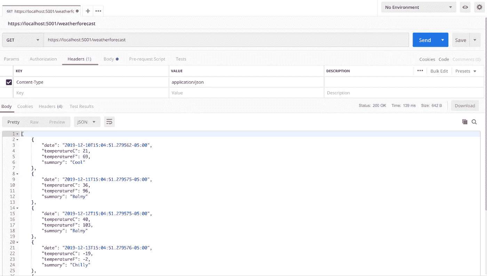

# 修改。csproj 文件

我们需要修改我们的。csproj 项目文件使用[程序集链接](https://docs.microsoft.com/en-us/dotnet/core/whats-new/dotnet-core-3-0#assembly-linking)，通过指定“PublishTrimmed”属性。这个属性将导致 [IL 链接器](https://github.com/mono/linker)工具在您发布 API 时运行。该工具扫描您的代码，检测任何没有被利用的库，并将它们从您发布的 API 中移除。这极大地减小了项目的大小，并保持了较小的容器大小。

```
<PropertyGroup>
    <TargetFramework>netcoreapp3.0</TargetFramework
    <PublishTrimmed>true</PublishTrimmed>
    <CrossGenDuringPublish>false</CrossGenDuringPublish> </PropertyGroup>
```

我们还包括“CrossGenDuringPublish”属性，并将其设置为 false。

*关于这个财产的免责声明，我在另一个博客* *上发现了它，目前它还没有在任何地方被记录。也就是说，它是 IL 链接器的一个标志，基本上告诉它在发布时只关注目标运行时。例如，如果我们发布的是“linux-x64 ”,只针对这个目标，不要担心 ARM 或 macOS。我倾向于把它留在家里，因为我不确定是否还需要它，但把它放在那里也不会有什么坏处。*

这些是我们将在中设置的唯一属性。这项工作的 csproj 文件。我们需要指定的其他属性将通过“dotnet publish”命令来完成。这样做的原因是我们希望能够从 Visual Studio 中调试 API，我们将讨论的下一个属性使这成为不可能，并且我们可以通过 CLI 轻松地传递它们。

# 。网络发布命令

接下来，我们将检查进一步减小 API 大小所需的发布命令:

**" dot net publish-r Linux-musl-x64-p:PublishSingleFile = true-c Release-o ./deploy "**

让我们解包这个命令:

*   **-r linux-musl-x64** :为构建设置[运行时标识符(RID)](https://docs.microsoft.com/en-us/dotnet/core/tools/dotnet-publish?tabs=netcore21#options) 。关注这些标识符非常重要。在本文中，我们的目标是 Linux x64 Alpine Docker 映像，因此我们必须使用“Linux-musl-x64”RID。如果您只是将“Linux-x64”RID 作为目标，那么 API 将无法在容器中启动。阿尔卑斯山的图像很小，我们想要小的！
*   **-p:PublishSingleFile = true**:该参数将 API 打包成一个特定于平台的[单文件可执行文件](https://docs.microsoft.com/en-us/dotnet/core/whats-new/dotnet-core-3-0#single-file-executables)。拥有一个单文件可执行文件有很多好处。例如，您可以指定要从包中排除的文件。对于这篇文章，它将简化我们的 docker 文件，这很好。
*   **-c 发布**:如果你有经验。你已经知道这个了。如果没有，它是一个标志，指示使用哪个构建配置，在本例中是发布或生产。
*   **-o ./deploy** :这是输出标志，我们希望发布的工件进入一个特定的文件夹。

运行这个 publish 命令将构建我们的 API，并在我们指定的“deploy”文件夹中输出一个可执行文件。对于这个项目，可执行文件被命名为“Medium ”,这是我们的解决方案中项目的名称。

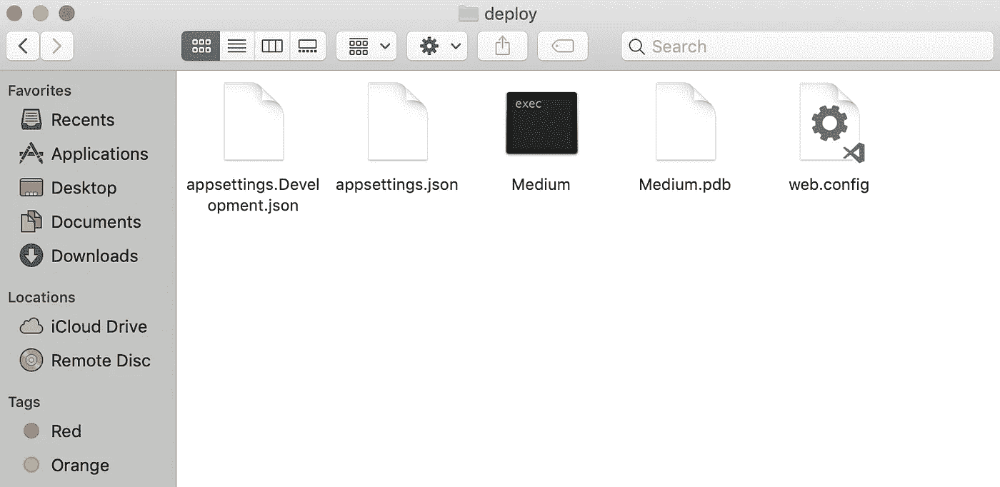

您会注意到，在发布过程中，文件夹中放置了一些额外的文件。您确实可以控制将哪些文件放在输出文件夹以及可执行文件中。虽然我们不会在本帖中涉及它们，但也许改天，你可以在这里阅读更多关于[的内容。](https://github.com/dotnet/designs/blob/master/accepted/single-file/design.md#the-bundler)

您可以查看可执行文件的属性，并看到我们即将达到惊人的 55.8MB！

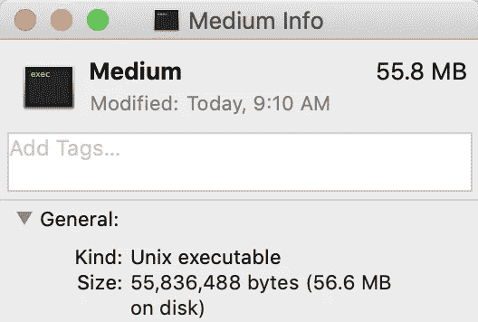

如果你一直在和。无论多少时间，这个数字都会让你很开心。虽然有可能制造小型的独立装置。NET 核心应用程序，分别使用像 [IL 链接器](https://github.com/mono/linker)和 [Warp](https://github.com/dgiagio/warp) 这样的工具，将所有这些都包装在。NET CLI 让它变得如此简单。

现在我们已经有了可执行文件，让我们集中精力让它在 Docker 容器中运行。就像 publish 命令中的运行时标识符一样，我们也必须密切注意我们使用的基本 Docker 映像。例如，如果你去[。Docker Hub 上的 NET Core 页面](https://hub.docker.com/_/microsoft-dotnet-core)你会发现很多选项:。NET 核心 SDK，ASP.NET 核心运行时，。NET 核心运行时等。因为我们是为 Alpine Linux 容器编译的，所以我们需要关注[。NET 核心运行时依赖关系](https://hub.docker.com/_/microsoft-dotnet-core-runtime-deps/)基础镜像。该页面上的描述说明了一切:*“该映像包含。网芯。它不包括。网芯。它适用于独立的应用程序。”*

即使在这个页面上，仍然有许多标签可供选择:3 . 1 . 0-巴斯特-苗条，3 . 1 . 0-仿生，等等。同样，我们的目标是 Alpine，以便获得尽可能最小的容器，所以我们将选择 **3.1.0-alpine3.10** 标签。Docker Hub 给你一个链接，链接到图片的 Docker 文件，如果你[仔细看](https://github.com/dotnet/dotnet-docker/blob/dcb185a49e2ed8e7a40cf4bbce522853ba5f1b8d/3.0/runtime-deps/alpine3.10/amd64/Dockerfile)你会发现里面没有很多。他们基本上安装了一些。NET Core 来运行，并设置到端口 80 的绑定。作为参考，您可以看到基本图像大小变化很大。NET 核心运行时依赖 Alpine 标签是明显的赢家:

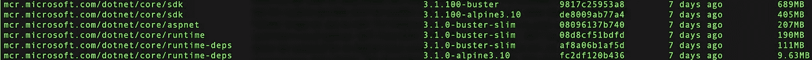

# Dockerfile —错误的方式

现在我们准备编写 Dockerfile 并运行这个 API。对于单个可执行文件，这再简单不过了:

```
FROM mcr.microsoft.com/dotnet/core/runtime-deps:3.1.0-alpine3.10
COPY deploy/Medium medium
CMD [“./medium”]
```

我们甚至不需要解压缩这个文件，它是如此简单和直接，但我们还是要这样做。拉底座。NET 核心运行时依赖 Docker 镜像，复制我们发布的可执行文件，然后运行它。我们可以使用标准的 Docker build 命令" **docker build -t medium 来构建这个映像。**“生成的图像只有 65.5MB！

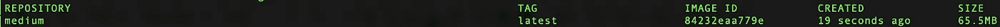

现在，让我们发出一个 Docker run 命令，看看是否一切正常，" docker run -p 80:5000 medium "

> 仅供参考，在 Linux 中，只有根用户可以在低于 1024 的端口上启动进程。现在，我们的 API 被配置为在端口 5000 上运行，所以我们很好。但是当你继续你的码头之旅时，请记住这一点。

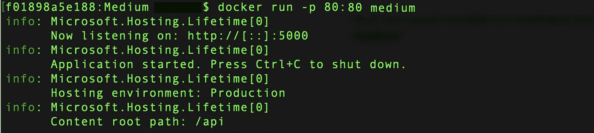

您应该看到 API 启动时没有任何问题，然后您可以通过 Postman 或任何其他 REST 客户端调用它。这很简单，但不一定是制作 docker 文件的最佳方式。这里的主要问题是 API 是由 root 用户运行的。Docker 的最佳实践是在容器中以非特权用户的身份运行您的流程。为了实现这一点，我们需要对 API 和 Dockerfile 做一些简单的修改。

# Dockerfile —正确的方式

让我们把 docker 文件改得更安全一点:

```
FROM mcr.microsoft.com/dotnet/core/runtime-deps:3.1.0-alpine3.10 WORKDIR /api 
RUN addgroup -S mediumgroup && \     
    adduser -S mediumuser USER mediumuser 
COPY --chown=mediumuser:mediumgroup deploy/Medium medium 
ENV ASPNETCORE_URLS=http://+:5000 
CMD ["./medium"]
```

在这个 docker 文件中还有很多东西需要解开，让我们开始吧:

*   **FROM**——就像之前我们把 Docker 形象建立在。NET 核心运行时依赖库。
*   **工作目录** —我们在做任何事情之前都会设置一个工作目录。这很好，因为它将我们复制的任何内容都移动到它自己的目录中。如果我们需要“执行”容器中的任何内容，这样会更干净。
*   **运行**添加组&添加用户——接下来我们创建一个新的组和用户，供 API 运行。
*   **USER**—USER 命令设置运行映像时使用的用户帐户，以及 docker 文件中其后的任何指令。此时，我们不再以 root 用户身份运行。这是一个关键的安全问题。如果攻击者能够获得对容器的访问权限，他们就处于“mediumuser”的上下文中，而不是根用户。
*   **复制** —我们使用“— chown”命令复制 API 可执行文件，使我们的新“mediumuser”成为文件的所有者。
*   **ENV ASPNETCORE_URLS** —我们必须将 ASPNETCORE_URLS 环境变量更新为在“appsettings.json”文件中定义的新端口。如果你看一下。NET 核心运行时依赖项 Dockerfile，它被设置为端口 80。我们需要覆盖它。
*   **CMD** —最后，我们可以用 RUN 命令启动我们的可执行程序。

现在，让我们发出一个 Docker run 命令，看看是否一切正常，这次使用我们新的端口映射，"**Docker run-p 80:5000 medium "**

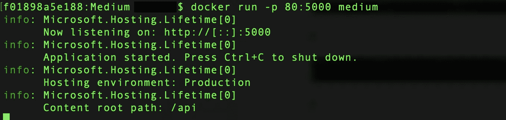

# 容器资源足迹

到目前为止，我们已经构建了一个运行. NET Core WebAPI 的容器，它只有 65.5MB。仅此一点就令人印象深刻，但是它的资源占用呢？运行这个容器需要多少 RAM 和 CPU？当您的 API 在 Docker 中运行时，发出“docker container ls”命令来列出正在运行的容器。

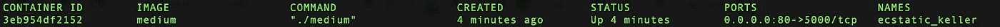

您应该会看到所有正在运行的容器的列表。接下来，我们可以发出一个“docker stats”命令，传入容器 ID 的前三个字符。在我的例子中，这个命令看起来像“docker stats 3eb”。

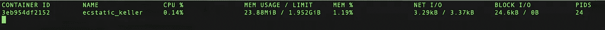

正如你在屏幕截图中看到的，这个容器运行在 23.88 兆字节和 0.14%的 CPU 上！再说一次如果你和。网过去，这些数字会让你很开心。这些数字确实代表了容器的空闲状态，一旦有负载，它们就会上下跳动，所以不能全信。也就是说，这些数字，加上集装箱的整体尺寸，比以往任何一次都要小。我构建的 NET 核心容器。

# 摘要

在这篇文章的开始，我为这一努力定义了一个个人目标列表:

*   仅限 Linux 环境
*   微小的集装箱占地面积
*   没有多级 Dockerfile 文件
*   macOS 开发环境

除了 50MB 容器大小之外，所有这些都得到满足。然而，最终的容器只有 65.5MB，比我以前构建的任何容器都要小得多，所以我称之为成功。请记住，这个 API 目前没有任何真正的功能，所以默认情况下它*应该*很小。一旦你开始添加更多的类、依赖项、文件等，你会希望留意你的容器的大小，因为它可能会增长。

我确实添加了一些依赖项，看看它会给容器增加多少。我引入了 Newtonsoft 并添加了一个利用 HttpClient 的类。在我看来，这是每一个 API 都有的两个特点。NET 很可能会有。我还添加了几个模型类，并连接了一个 HTTP GET 调用。全部实现后，容器的大小增加了 1MB 以上。这让我对真实世界的 API 在大小上不会增加太多抱有希望。

# 更新

自从我最初写了这篇文章，我已经走到了关于多阶段构建的争论的另一边。为此，我将 Dockerfile 文件更新为多阶段版本:

```
FROM mcr.microsoft.com/dotnet/core/sdk as BUILD
WORKDIR /api
COPY . .
RUN dotnet publish -r linux-musl-x64 -p:PublishSingleFile=true -c Release -o ./deployFROM mcr.microsoft.com/dotnet/core/runtime-deps:3.1.0-alpine3.10
WORKDIR /api
RUN addgroup -S mediumgroup && \
    adduser -S mediumuser
USER mediumuser
COPY --from=BUILD --chown=mediumuser:mediumgroup api/deploy/Medium medium
ENV ASPNETCORE_URLS=http://+:5000
CMD ["./medium"]
```

# 参考资料:

*   中的新功能。NET Core 3.0:[https://docs . Microsoft . com/en-us/dot NET/Core/whats-new/dot NET-Core-3-0](https://docs.microsoft.com/en-us/dotnet/core/whats-new/dotnet-core-3-0)
*   dot net publish:[https://docs . Microsoft . com/en-us/dot net/core/tools/dot net-publish？tabs=netcore21](https://docs.microsoft.com/en-us/dotnet/core/tools/dotnet-publish?tabs=netcore21)
*   。网芯 RID 目录:[https://docs.microsoft.com/en-us/dotnet/core/rid-catalog](https://docs.microsoft.com/en-us/dotnet/core/rid-catalog)
*   单一文件发布:[https://github . com/dot net/designs/blob/master/accepted/single-File/design . MD](https://github.com/dotnet/designs/blob/master/accepted/single-file/design.md)
*   怎么跑。NET Core 2 在 Docker 中的应用在 Linux 上作为非 root:[https://stack overflow . com/questions/53544469/how-to-run-NET-Core-2-application-in-Docker-on-Linux-as-non-root/53544813](https://stackoverflow.com/questions/53544469/how-to-run-net-core-2-application-in-docker-on-linux-as-non-root/53544813)
*   chmod/chown/mv 在你 Dockerfile 中的反冲:[https://medium . com/@ lmakarov/the-backlash-of-chmod-chown-mv-in-your-docker file-f 12 Fe 08 c 0 b 55](https://medium.com/@lmakarov/the-backlash-of-chmod-chown-mv-in-your-dockerfile-f12fe08c0b55)
*   优化。NET Docker Image Size:[https://medium . com/@ MAF shin/optimizing-ASP-NET-core-Image-Size-5e 763602 b29e](https://medium.com/@mafshin/optimizing-asp-net-core-image-size-5e763602b29e)
*   一个完整的集装箱。尽可能小的. NET 核心应用微服务:[https://www . hanselman . com/blog/acompletecontainerizednetcoreapplicationmicroservicethathisassmallaspossible . aspx](https://www.hanselman.com/blog/ACompleteContainerizedNETCoreApplicationMicroserviceThatIsAsSmallAsPossible.aspx)

[](https://ko-fi.com/O5O63ENS7)