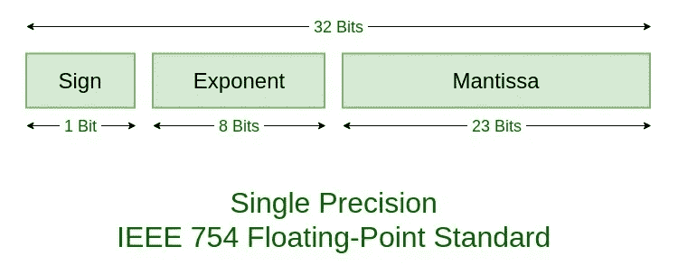
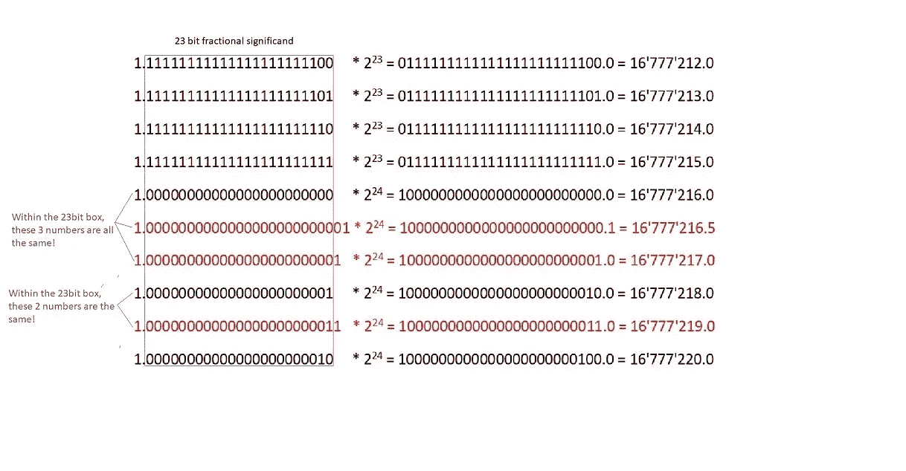
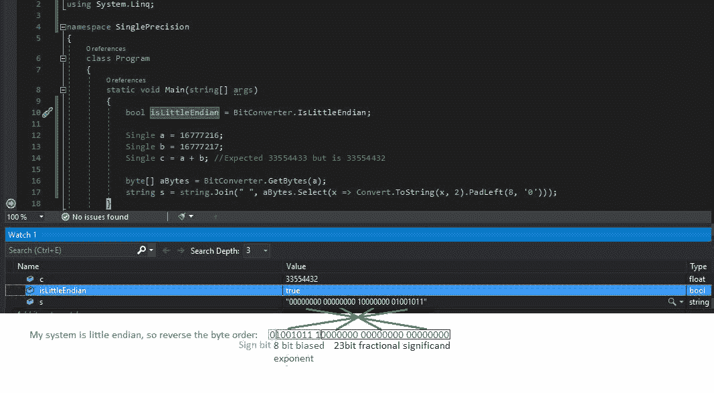

# 单精度输入。网

> 原文：<https://levelup.gitconnected.com/single-precision-in-net-c3d7901f743e>

在这篇文章中，我将谈论在`Single`类型背后的数学。NET(以`float` C#关键字为代表)，以及为什么在处理这种类型时可以得到一些奇怪的结果。

# 浮点与定点

“浮点”数字之所以有这个名字，是因为小数点可以移动到任何位置。与“定点”数字相比，小数点总是在同一个位置。

# 科学符号

十进制数在工程/科学中以一种叫做科学记数法的形式书写:

`0.049x10¹³ = 0.49x10¹² = 4.9x10¹¹ = 49x10¹⁰ = 490x10⁹`

`4.9x10¹¹`首选(小数点前一位)，这是科学记数法的“规范化”形式。

在科学记数法中有 4 个组成部分，符号(`+` / `-`，如果没有显示符号，则默认为`+`)、有效数(又名尾数) (在本例中为`4.9`)、基数(在本例中为`10`)和指数(在本例中为`11`)。

如果基数等于你正在使用的数字系统的基数，即。如果你使用十进制数字系统，并且你的基数是`10`，那么指数告诉你小数点移动多少位以得到实际的数字。

`4.9*10¹¹ = 490000000000.0`

`4.9*10^(–11) = 0.000000000049`

有效位(本例中为`4.9`)始终为`>= 1`且小于基数，即`10`。

让我们看一个二进制的例子:

`101.1101`等于:

`1*2² + 0*2¹ + 1*2⁰ + 1*2^–1 + 1*2^–2 + 0*2^–3 + 1*2^–4 = 5.8125`，或者用规范化的科学记数法，`5.8125*10⁰.`

# 规则

规则是有效位必须是`>=1`并且小于基数(在前面的例子中基数是 2)。所以因为小数点前的部分是十进制中的`101 = 5`，所以我们需要让二进制小数点前的部分等于`1`。

事实上，**所有用规范化科学记数法写成的二进制数都将以** `**1**`开头，因为它是二进制中唯一的数字`>= 1`并且小于基数(二)。

所以`101.1101 = 1.011101*2²`。

# 单精度和双精度

IEEE 二进制浮点运算标准定义了需要`4`字节的单精度和需要`8`字节的双精度。

在 C#中，等价的是由关键字`float`表示的`System.Single`结构和由关键字`double`表示的`System.Double`。

这些类型在大小上等同于由`int` C#关键字表示的`System.Int32` ( `4 bytes = 4 * 8bits = 32 bits`)和由`long`关键字表示的`System.Int64` ( `8 bytes = 8 * 8bits = 64 bits`)。

在单精度中，数字使用科学记数法存储。

底座始终是`2`，所以有`3`个零件可以更换:

*   1 位符号位(`0`表示`+ve`，而`1`表示 `-ve`)
*   8 位指数(又名“幂”)
*   23 位有效小数(二进制小数点后的部分)

这意味着总共有`1 + 8 + 23 = 32bits`或`4 bytes` 。

`s = sign, e = exponent, f = significand`

还记得我之前说过`1`总是二进制小数点后的数字吗？正因为如此，这个数不需要存储，只存储有效位的 23 位小数部分。

然而，即使只为有效位存储了`23`位，也称“精度”为`24`位。

# 有偏指数

8 位指数的范围可以从`0`到`255`。您需要从指数中减去一个数字(称为“偏差”)来获得实际使用的有符号指数。

单精度偏置为`127`。

单精度公式可以写成这样:

`((-1)^s) * (1.f) * (2^(e-127))`

# 符号位

在上面的公式中，如果`s`是`0`，那么数字就是`+ve`，因为`0`的任何次方都是`+1`。如果`s`是`1`，那么数字是负数，因为`(-1)¹ = -1`。

# 零

`+0`:

如果`s = 0`、`e = 0`、`f = 0`，则数字为`+0`。

这意味着所有 32 位都被设置为`0`。

`-0`:

如果 `s = 1`、`e = 0`、`f = 0`，则编号为`-0`。

如果符号位设置为`1`但所有其他位都为`0`，这表示负`0`，这表示一个非常小的数，不能仅用`32`位表示，但仍小于`0`。

# 无穷

`+ve`无穷大:

如果`s = 0`、`e = 255`、`f = 0`，则数字为`+`无穷大。

`-ve`无穷大:

若`s = 1`、`e = 255`、`f = 0`，则数字为`-`无穷大。

不是数字:

如果`e = 255`和`f != 0`，则值为`NaN`(不是数字)，即。未知数字或无效操作的结果。

# 未标准化

如果`e = 0`和`f != 0`，数字有效但未归一化:

`((-1)s) * (0.f) * (2^–127)`

# 最小的数字

大小最小的数字，`+ve`或`-ve`可用`f = 0`和`e = 1`表示:

`1.00000000000000000000000 * 2^–126 = 1.175494351 * 10^–38`具有**低量级高精度**。

# 最大数量

这里的公式再次供参考:`((-1)^s) * (1.f) * (2^(e-127))`

最大的数字是当`s = 0`(正数)、`e = 254`(不能是`255`因为那是无穷大)和`f`都设置为`1` s 时，如果`e = 254`，那么功率就是`254–127=127`。

`11111111111111111111111 * 2¹²⁷ = 3.402823466 * 10³⁸`有**高量级但精度低**。

比较最小和最大的数字，你会注意到数量和精度是互斥的。

# 准确(性)

因为精度是`24`位，这意味着单精度浮点数在`16'777'216`(或`2²⁴`)中精确到一位。

要了解这意味着什么，让我们看看这个数字:

如果`s = 0`、`f = 00000000000000000000000`、`e = 151 = 10010111`为二进制

`((-1)s) * (1.f) * (2e^-127) = 1 * 1.00000000000000000000000 * 2²⁴ = 1000000000000000000000000.0 = 16'777'216`。

在存储器中，这将存储为符号位`s`，后面是指数`e`，后面是有效位`f`:

`0 10010111 00000000000000000000000`

如果我们把`1`加到有效数字上会发生什么？

如果`s = 0`、`f = 00000000000000000000001`、`e = 151 = 10010111`为二进制

`((-1)s) * (1.f) * (2(e^-127)) = 1.00000000000000000000001 * 2²⁴ = 1000000000000000000000010.0= 16'777'218`。

**`**16'777'217**`**怎么了？****

**查看下图，了解为什么跳过了向有效位加 1 的操作`16'777'217`:**

****

**使用单精度存储数字**

**如图所示，任何不符合`23`位小数有效位的位都无法存储。**

**如果我们想要表示`16'777'217`，我们想要将最后一个`0`设置为`1`，但是我们不能访问那个位，因为它是第 25 位，我们没有单精度。**

**如你所见，由于单精度位数有限，我们无法在`16'777'216`和`16'777'218`之间精确地表示数字。**

**事实上，任何需要位在有效数位最后一位右侧的数字都不能被表达。**

**这就是为什么`**16'777'216.5**`**`**16'777'217**`**等和** `**16'777'216**`一样存储在内存中。****

****如果您想表示`16'777'217`，您需要在有效位中增加一位来提高精度:****

****如果`s = 0`、`f = 000000000000000000000001`(24 位而不是 23 位)、`e = 151 = 10010111`为二进制:****

****`((-1)^s) * (1.f) * (2e^-127) = 1 * 1.000000000000000000000001 * 2²⁴ = 1000000000000000000000001.0 = 16'777'217`****

****为了表示更精确的数字，如`16'777'216.5`，您需要在有效位上添加另一位:****

****如果`s = 0`、`f = 0000000000000000000000001`(25 位而不是 24 位)、`e = 151 = 10010111`为二进制****

****`((-1)^s) * (1.f) * (2e^-127) = 1 * 1.0000000000000000000000001 * 2²⁴ = 1000000000000000000000000.1 = 16'777'216.5`****

# ****Visual Studio 中的一个示例****

****以下示例向您展示了由于. NET 中的`System.Single`类型缺乏精度而可能发生的各种错误。****

****这个例子也向你展示了数字是如何存储在内存中的。****

********

****查看浮点数在内存中的存储方式。网****

****将这两个数字相加得到的结果比你预期的少一个，因为在内存中`16'777'216`和`16'777'217`都存储为`16'777'216`！****