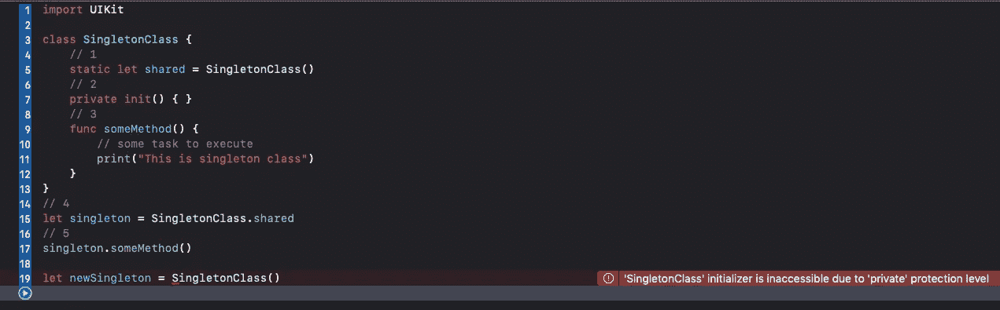

# Swift 中的单例模式

> 原文：<https://levelup.gitconnected.com/singleton-pattern-in-swift-5a135873715c>

图片由来自 [Pixabay](https://pixabay.com/?utm_source=link-attribution&utm_medium=referral&utm_campaign=image&utm_content=865297) 的[自由照片](https://pixabay.com/photos/?utm_source=link-attribution&utm_medium=referral&utm_campaign=image&utm_content=865297)提供

Singleton 是一种创造性的设计模式。这是一种常用的设计模式，很容易在项目中实现。简而言之，我们可以将 singleton 定义为——singleton 模式允许一个类只有一个实例，这个类的每个引用都指向同一个实例。

## **实施**

单例类的实现

1.  `static let shared = SingletonClass()` —您在这里创建了一个静态 let 属性，它将负责 singleton 实例。
2.  `private init() { }` —您在此定义初始化器访问级别，这将阻止创建其他实例。
3.  `func someMethod()` —你正在创造一种方法来完成某项任务。
4.  `let singleton = SingletonClass.shared` —您将获得该类的单例实例。
5.  `singleton.someMethod()` —您将调用 singleton 类的方法。

上面的例子是一个纯粹的单例类。现在，让我们通过添加以下代码来创建一个`SingletonClass`的实例-

`let newSingleton = SingletonClass()`

单一类访问级别错误

您将无法创建 singleton 类的新实例，因为我们已经将访问级别设置为 private。

现在让我们改变访问级别，尝试相同的代码—

以不同的方式实现 singleton。

这个实现类似于前面的实现，唯一的不同是我们改变了`private init() { } to init() { }`。

这将允许您通过编写代码— `let newSingleton = SingletonClass()`来创建 SingletonClass 的新实例，您也将通过调用此代码— `let singleton = SingletonClass.shared`来获得 singleton 实例。

实现 singleton 的两种方法都是正确的，甚至苹果也根据场景遵循两种方法。

示例 1

示例 2

示例 3

与示例 1、2 一样，我们可以创建 UserDefaults 和 FileManager 的新实例，而在示例 3 中，UIApplication 不允许您创建该类的新实例，这将导致编译错误。所以我们可以说 UIApplication 是一个纯粹的 singleton。

## 什么时候使用单例模式？

如果一个类的多个实例影响您在项目中的实现，在这种情况下，您可以使用这种模式。每种模式都有优点和缺点，所以当你为你的项目选择一种模式时，一定要清楚。记住，永远不要过度使用任何模式，从长远来看，这会导致问题。

感谢您阅读这篇文章。如果你觉得这篇文章有帮助，请不要忘记鼓掌。

如果您有任何问题或意见，请随时通过 [Twitter](https://twitter.com/nomadicsheldon) 联系我。