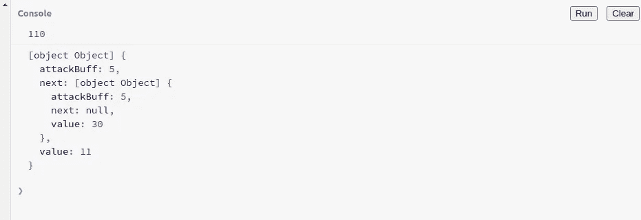

# 带类型脚本的单链表

> 原文：<https://levelup.gitconnected.com/singly-linked-lists-with-typescript-ca0b93845769>

数据结构是编程的核心，经常在你最不经意的时候派上用场。即使他们没有，你也确实需要他们来完成很多面试。


链表是一种常见的数据结构，本博客将帮助您理解如何使用 typescript 实现链表。

在这篇文章中，我们将会看到单链表。

为了保持有趣，我们将使用一个非常酷的用例。游戏是我最喜欢的爱好之一，所以我们将使用链表来计算一个角色在攻击序列结束时造成的伤害。

# 链表如何适应我们的用例

如果我们想象一个角色攻击另一个角色，那么在最好的情况下，这个特定的角色应该能够无限命中，直到受害者的 HP 耗尽。

因此，我们有一个不确定长度的攻击输入，可以收到了。

之后，我们将需要计算整个攻击链来反映总伤害，并在必要时应用特殊的 buffs，如移动乘数。

链表在这里可以派上用场，因为我们可以使用它们来容纳插入的不确定数量的节点。

与数组不同，这些节点不必是连续的，因此我们可以将它们分布在内存空间中，并使用指针来链接它们。

这也有助于消除使用相同的连续内存块上下移动节点的问题，或者由于数组通常为存储元素分配上限而浪费内存的问题。可能永远也到不了。

然而，缺点是访问特定的节点来检查它们的状态。这在阵列中可能会更快，但在我们的情况下，我们只关心所造成的总损害。

我们可以重新计算每次添加或删除节点所造成的总伤害。

那么，我们开始吧。

# 单链表

让我们首先为链表创建节点，并为主链表类创建基本的 shell。

我们可以这样做:

我们已经创建了一个 **ListNode** ，它将用于表示我们的链表中的每个单独的节点。这将保存一个**值**，以及一个**下一个**属性，该属性带有一个指向列表中下一个节点的指针。

我们的 **LinkedList** 类保存当前的“ **head** ”，列表的开始。 **size** 属性只是用来跟踪列表中当前节点的总数**。**

现在让我们继续向 LinkedList 类添加方法来管理节点。

## 推

此方法将用于将节点推送到列表中，即将节点添加到列表的末尾。

**push** 方法接受一个与 LinkedList 对象实例化类型相同的值，因此我们使用了一个通用类型“T”。然后我们用这个传递的值创建一个新的 **ListNode** 。

如果链表为空，我们的 **head** 属性将被设置为 null(默认)。在这种情况下，我们可以直接将我们的新节点指定为头节点。

然而，如果列表中已经存在节点，那么我们必须遍历列表来找到最后一个节点。最后一个节点将位于列表的末尾，因此它的 **next** 属性将指向 **null** 。

使用这个条件，我们创建一个 while 循环来遍历列表的末尾，并在那里插入我们的新节点。

每当我们添加一个新的节点，我们还会将列表的大小增加 1，以跟踪当前节点的总数。

## 流行音乐

这个方法将用于从列表末尾移除一个节点。由于我们目前处理的是一个单向链表，**我们不会有一个“tail”属性来指示链表的确切结束位置(双向链表的情况就是如此)。**

因此，要找到最后一个节点，我们需要遍历到末尾，然后从列表中删除它。

我们可以这样做:

在 pop 方法中，我们首先检查列表是否已经为空。因为那样的话从列表中弹出任何一项都没有意义。

然后，我们通过查看它的大小来检查列表是否只有一个节点。这意味着列表只有一个 head。因此在这种情况下，我们可以直接将 head 赋值为 null 并清空列表。

在每次删除操作后，我们都会小心减小列表的大小。

## 推动和弹出动作

要查看 push 和 pop 的运行情况，让我们获取一个 **LinkedList** 的实例，然后记录这些方法的输出:

我建议使用 **jsbin** 在线处理这段代码。这将是您的控制台中的输出:


我们第一次尝试弹出一个空列表时得到“false ”,就像我们编程时那样。

和预期的一样，它后面的所有操作都成功了。我们已经有了足够好的基础，可以开始实际实施我们的攻击系统。

# 让链表发挥作用

我们现在将继续使用我们的链表来追踪游戏中角色的攻击伤害。

为此，让我们修改现有的 **ListNode** 和 **LinkedList** 。首先让我们看看新的**列表节点**，我们现在称之为**攻击节点**:

我们在我们的 **AttackNode** 中添加了一个名为 **attackBuff** 的新属性，以防任何新的 Buff 与攻击一起应用(这在游戏中很常见)。

然后，我们将使用我们的链接列表来跟踪造成的总损失。为了更好的语义，我们的 **LinkedList** 类现在将被称为 **AttackList** :

修改 LinkedList 类，以及 push 和 pop 方法

我们添加了一个 **totalDamage** 属性，并且每当一个新的节点被推入或者一个现有的节点从列表中弹出时重新计算总损害。

此外，在推送一个新节点时，我们现在需要同时传递 attackBuff 值。

让我们看看它是如何工作的:

这将记录以下输出:


如预期的那样工作，我们有一个在我们弹出一个节点后重新计算的总伤害。

我们为什么要弹出一个节点？好吧，想象另一个角色能够偏转攻击，因此我们从总伤害中减去偏转的攻击。

# 更多链表方法

向我们的链表中添加更多的方法会很有用，这样我们可以更灵活地使用它。添加在两端添加和移除节点的能力可以帮助我们将链表用作堆栈和队列

## 变化

shift 方法可用于从链表的开头移除一个列表节点。与数组相比，这里的优势在于我们不必重新调整剩余的元素，因为它们不存储在连续的内存块中。

和预期的一样，shift 方法首先检查一个空列表。在这之后，我们将分配列表的第二个节点作为新的头。

然后，我们通过将它的 next 属性设置为 null，从列表中删除前一个 head，因此它现在不指向任何地方。

稍后，我们重新计算总伤害和列表大小。

如果列表开始时只有一个节点，那么它的 **next** 属性将会为空。因此，新报头也将被设置为空。

## 松开打字机或键盘的字型变换键

unshift 方法可用于在链表的开头添加一个新节点。同样，因为我们没有将节点存储在连续的内存块中，所以我们不必重新计算间距或重新调整内存中的节点。

类似于 push 方法，只是我们在列表的开头添加了一个节点。我们创建一个新节点并将其链接到现有的 head，然后将现有的 head 重新分配为这个新节点。

由于新节点在此操作之前已链接到前一个头，因此旧头现在是列表中的第二个元素。

现在让我们看看换档和取消换档的效果:

```
// create a new list instance
const ll = new AttackList<number>();// try to shift an empty list
console.log(ll.shift());// unshift with passed value and attackBuff
ll.unshift(10, 20);
ll.unshift(5, 5);// log total damage
console.log(ll.totalDamage);// shift to remove first node
console.log(ll.shift());console.log(ll.totalDamage);
```

上述操作的输出符合预期:


当我们把两个节点相加后，如果移动一个空数组，就会得到一个 false。

然后我们移动一个节点，记录重新计算的总伤害。

## GetAtIndex

getAtIndex 方法可用于从用户处获取给定的索引或位置，然后返回该特定节点。

这就是链表与数组相比效率低下的地方，因为我们必须遍历每个节点才能到达一个特定的索引。

这里，我们首先验证传递的索引。然后，我们使用一个计数器遍历列表，直到到达特定的索引。

然后我们返回这个索引处的节点。


列表中索引 2 处的节点

## 移除索引

我们也可以类似地从特定索引中删除一个节点。这将再次要求我们遍历到特定的索引值，然后将索引之前的节点和索引之后的节点链接在一起。

要删除的节点也应该被分离，这样它就不包含对列表或其任何节点的引用。

运行上面的代码，我们得到以下输出:


这正是我们想要的。

以下当然也行得通:

```
const ll = new AttackList<number>();ll.push(10, 5);
ll.push(20, 5);
ll.push(30, 5);console.log(ll.totalDamage);
console.log(ll.removeAtIndex(2));
console.log(ll.totalDamage);Output:75
true
50
```

## 插入索引

如果到目前为止你已经掌握了链表是如何工作的要点，你可以自己实现这个方法作为练习。

请自行尝试，如果无法找到解决方案，请参考下面的代码:

这个方法将接受一个索引，在它后面插入一个节点。

我们获得一个新节点，并验证传递的索引。我们遍历列表，直到到达索引，并将我们的新节点**插入到这个索引的**之后。

因此，当从列表中获取这个新节点时，我们必须传递 n+1 作为索引。



## 发现

find 方法可以用来检查一个特定的值是否存在于我们的链表中。

实现起来非常简单，我们将遍历列表，如果发现一个值等于当前值，我们将返回节点。

输出显示了特定节点的数据:


# 把所有的放在一起

我们现在有一些有用的方法可以使用，同时登记一个角色所做的一连串攻击。

我们可以使用这些方法在任何给定的位置创建新的攻击节点，如果接收者偏离任何攻击节点，则删除攻击节点，并在我们想要显示攻击统计数据时找到特定的节点。

所有这些都是在链表的帮助下实现的，尽管它们对于某些特定的操作来说效率很低，但是对于插入和删除来说，它们真的很好。

例如，当我们将攻击推送到一个列表中时，单链表会更好地使用，但不适合访问特定的节点来查看其统计数据。数组更适合这种情况。

只要我们的需求是推送攻击节点和计算造成的总损害，链表将是更好的选择，因为它们不需要存储在连续的内存块中。

关于利弊的完整列表，请看[这篇文章](https://www.geeksforgeeks.org/linked-list-vs-array/)。

我将很快在另一个博客中讨论双向链表。