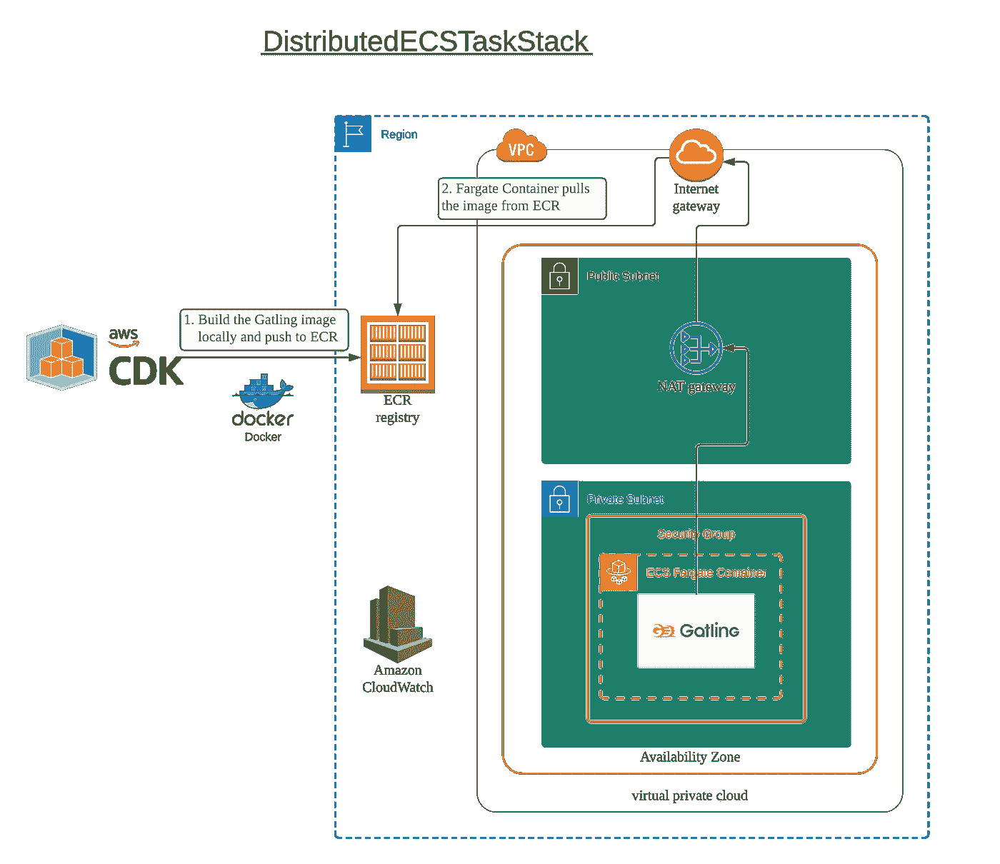
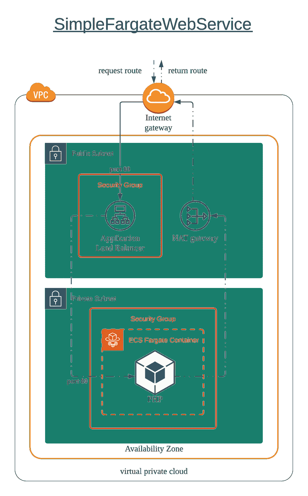

# 使用 AWS Fargate 和 CDK 和加特林的站点可靠性

> 原文：<https://levelup.gitconnected.com/site-reliability-using-aws-fargate-with-cdk-and-gatling-18d340a43588>

站点的可靠性需要持续监控，以确保系统性能不会偏离非功能性要求，因为系统性能可能会受到新版本或数据增长的影响。

衡量性能的一种方法是使用一个能够模拟关键业务活动的客户机，并能够衡量关键指标，如响应时间或每秒请求数。Gatling 是常用于此目的的流行库之一。

[Gatling](https://gatling.io) 是一个 SCALA 库，它利用 SCALA 灵活的语法来提供负载测试领域特定语言(DSL ),以及性能测量的关键指标。Gatling 将 AKKA 用于分布式加载代理，与普通 Java 线程相比，它提供了更好的资源利用率。

本文考察了与测试相关的三个重要概念:可靠性、可重复性和再现性。然后，它向您展示了如何使用`Gatling`来建立一个使用`AWS’s Cloud Development Kit` (CDK)的性能测试基础设施，并为您提供了在对您自己的系统运行性能测试时需要考虑的一些要点。

# 测试的可靠性

在任何监测和测量中，我们都需要可以信任的真正积极的结果。例如，当测试工具向 web 服务报告连接性问题时，我们希望结果是 web 服务不可用的*真肯定*，而不是由于错误配置运行该工具的坏主机而导致的*假肯定* 。

因此，利用无服务器架构来运行测试工具对于确保工具执行的可靠性是理想的。

# 测试的再现性

当从测试中报告问题时，我们希望能够复制结果以便于故障排除，或者试验不同的因素以减少任何不确定性。例如，当 QA 团队发现测试工具报告的问题时，开发团队可以复制相同的结果来解决报告的相同问题。

自动化构建和容器化测试框架允许我们冻结代码变更和预定义测试框架的库依赖。使用文档化的映像，可以在团队和环境中重复相同的测试。

# 测试的可重复性

我们希望在事件触发时(比如在部署新版本之前)或者在时钟事件触发时(比如每个月末)重复运行测试，以根据服务级别目标衡量系统性能。

为了一遍又一遍地运行测试，我们需要自动构建容器映像以实现可再现性，并在触发时启动基础设施，在不需要时拆除，并在下一次触发时重复。

为了实现这一目标， [AWS 云开发套件(AWS CDK)](https://aws.amazon.com/cdk/) 提供了一些功能，我们可以利用这些功能来构建 docker 映像并提供必要的基础设施，以实现测试的可靠性。

# 使用 AWS 云开发工具包(AWS CDK)创建 AWS 资源

在 https://github.com/kangks/distributed_gatling 可以找到 CDK 和加特林的仓库。

存储库的结构由两个主文件夹组成，`cdk/`和`gatling/`。

`cdk/bin/app.ts`是用打字稿写的 CDK 应用程序。当用命令`cdk deploy ecsLoadTestTask`调用时，它将从`cdk/lib/ecsTaskStack.ts`创建堆栈`DistributedECSTaskStack`。

堆栈使用 [AWS CDK Docker 映像资产 API](https://docs.aws.amazon.com/cdk/api/latest/docs/aws-ecr-assets-readme.html#aws-cdk-docker-image-assets) ，它使用`gatling/Dockerfile`在本地构建 Docker 映像，并将 Docker 映像部署到 ECR。然后，堆栈将继续提供 AWS Fargate 资源以及其他必要的基础设施，如 NAT 网关。

部署的架构如下所示:



在`sdk/lib/ecsTaskStack.ts`中，堆栈`DistributedECSTaskStack`使用`ContainerDefinition`创建`FargateService`，使用 API `ContainerImage.fromAsset()`在本地构建映像:

```
const containerDef = new ecs.ContainerDefinition(this, 'containerDef', {[...]image: ecs.ContainerImage.fromAsset(path.resolve(__dirname, '../../gatling'), {file: "Dockerfile"}),[...]})
```

`gatling`容器使用包装器脚本`gatling.sh`来运行`Gatling Highcharts`。

```
const containerDef = new ecs.ContainerDefinition(this, 'containerDef', {[...]command: [ "gatling.sh", "-sf", "/tests/test", "-s", "perfTest.simulations.WebServiceSimulation" ],[...]})
```

标志`-sf`告诉加特林在哪里可以找到模拟类，模拟类是`/tests/test`在 Dockerfile 文件中构建的，模拟运行时带有标志`-s`。

对于 Gatling 容器，还需要测试服务的端点，定义为`web.baseUrl`，通过`JAVA_OPTS`传入:

```
const containerDef = new ecs.ContainerDefinition(this, 'containerDef', {[...]environment: {"GATLING_CONF": "/tests/test/resources","JAVA_OPTS": "-Dweb.baseUrl=http://simpl-simpl-1tvem419lsgf7-18442615.us-west-1.elb.amazonaws.com"},[...]})
```

# 格林机关枪

一个典型的加特林`simulation`由一个或多个`scenarios`组成，每个`scenarios`调用一个或多个`requests`。

例如，负载测试购物车服务的模拟可能包含两个场景，一个场景到`search product`，另一个场景到`add-to-cart`。

对于`search product`场景，请求将是向搜索服务发送一个搜索字符串，并验证来自搜索服务的响应。

这个场景可能需要多个请求。一个请求调用身份验证服务，并在会话中存储 JWT 令牌。另一个请求将从搜索结果中检索产品 ID，从会话中检索 JWT 令牌，并发送到添加到购物车服务，并验证响应。最后，一个验证请求通过对`cart`服务的 GET 调用来验证产品已经被添加到购物车中。

因此，在这个例子中，我们将关注点分离到单独的文件夹中，即，

*   `gatling/src/test/simulations`对于所有使用负载曲线设置场景的模拟
*   `gatling/src/test/scenarios`针对所有场景的用例，如`product search`
*   `gatling/src/test/requests`为实际请求，如`authentication`请求

当调用`gatling.sh`时，它将在用标志`-sf`指定的文件夹中查找扩展`io.gatling.core.scenario.Simulation`的类。如果在文件夹中发现不止一个模拟，并且没有用标志`-s`指定的模拟类，`gatling.sh`将提示选择运行哪个模拟类。

为了参数化 Fargate 任务中`gatling`的执行，自定义配置器`perfTest.config.Configurations`将首先从`System properties`中读取配置值，如果没有找到，则从`GATLING_CONF`文件夹中默认为`application.conf`的配置文件中读取值。

通过`JAVA_OPTS`可以配置的 3 个参数是:

*   `web.baseUrl`哪一个是待测系统的端点；
*   `load.rps`哪个是并发用户模拟的场景；
*   `load.durationInSeconds`是整个模拟的持续时间。

# 针对简单的 web 服务运行 Gatling

使用 Docker image `amazon/amazon-ecs-sample`的示例 web 服务将被用作测试中的系统。

CDK 应用程序包含示例 web 服务`SimpleFargateWebService`，它可以用命令`cdk deploy simpleWebFargate`部署。

堆栈将按如下方式部署:



一旦创建了堆栈，就可以使用 AWS CLI 从 CloudFormation 获取 URL

```
% aws cloudformation describe-stacks --stack-name simpleWebFargate --query "Stacks[0].Outputs[?OutputKey=='SvcUrl'].OutputValue" --output text
simpl-simpl-1TVEM419LSGF7-18442615.us-west-1.elb.amazonaws.com
```

在 CDK 应用程序`new SimpleFargateWebService(app, ‘simpleWebFargate’)`中定义了`stack-name`，返回值将是应用程序负载平衡器的端点。

接下来，我们将更新`simpleWebFargate`的端点，在`cdk/lib/ecsTaskStack.ts`中作为`web.basedUrl`:

```
export class DistributedECSTaskStack extends cdk.Stack {constructor(scope: cdk.App, id: string, props?: cdk.StackProps) {[...]const containerDef = new ecs.ContainerDefinition(this, 'containerDef', {[...]environment: {[...]"JAVA_OPTS": "-Dweb.baseUrl=http://simpl-simpl-1tvem419lsgf7-18442615.us-west-1.elb.amazonaws.com"},[...]})[...]}}
```

随着`web.baseUrl`根据`simpleWebFargate`堆栈的输出更新，我们可以使用命令`cdk deploy ecsLoadTestTask`部署`DistributedECSTaskStack`来部署堆栈。

一旦栈`ecsLoadTestTask`被部署，Fargate 任务将运行。`Gatling`的日志输出将在`CloudWatch log`中可用。

为了检查 Gatling 输出，我们可以使用 AWS CLI 来`tail`log group`perfTest`，它是在创建 [ECS AWSLogDriver](https://docs.aws.amazon.com/cdk/api/latest/docs/@aws-cdk_aws-ecs.AwsLogDriver.html) 时定义的:

```
const logging = new ecs.AwsLogDriver({[...]logGroup: new log.LogGroup(this, 'gatlingLogGroup', {logGroupName: 'perfTest',[...]
})})
```

要运行的 AWS CLI 是`aws logs tail perfTest`。如果执行成功，您应该能够看到断言通过了:

```
2021-04-03T15:06:43.886000+00:00 gatling/containerDef/8b703ac477474209b0b1ef076c90fd56 Global: percentage of successful events is greater than 99.0 : true
2021-04-03T15:06:43.886000+00:00 gatling/containerDef/8b703ac477474209b0b1ef076c90fd56 Global: max of response time is less than 5000.0 : true
```

加特林模拟中的断言是

```
package perfTest.simulations[...]class WebServiceSimulation extends Simulation {[...]setUp([...]).assertions(global.successfulRequests.percent.gt(99),global.responseTime.max.lt(5000),)[...]}
```

# 结论

在本文中，我们介绍了加特林测试的基本组件，从一个`Simulation`的入口点开始，它调用由多个`Requests`组成的`Scenarios`。

我们创建了一个简单的 Gatling 模拟来测试 web 服务，并将其构建到 Gatling Docker 映像中，该映像允许通过 Docker 运行时将负载配置文件参数化为环境变量，这些变量是 web 服务的 URL、压力的`concurrent requests per second`和`duration`。

我们使用 AWS Fargate 运行负载测试，以利用无服务器计算，这样我们就可以专注于测试策略。例如，为了确保系统性能在非功能性需求范围内，可以安排在每天结束时运行一个 1 小时的小并发负载测试。另一方面，跨越多个 AWS Fargate 任务的大型并发负载可以在任何主要产品发布之前用作发布检查。