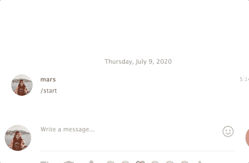
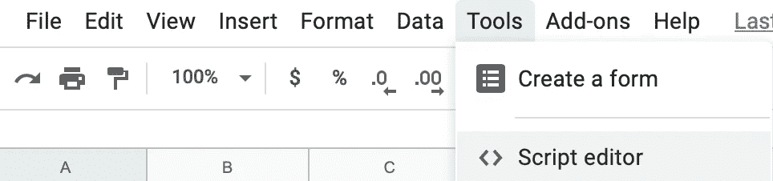

# 如何使用 Webhooks 创建电报机器人

> 原文：<https://levelup.gitconnected.com/six-easy-steps-to-create-a-telegram-bot-from-a-google-spreadsheet-b62008d2b81f>

创建你自己的电报机器人只需要很少的编码。事实上，您甚至不需要安装代码编辑器就可以开始构建代码编辑器。在这篇文章结束时，你已经学会了如何用谷歌电子表格创建你的个人互动电报机器人。最终产品将是一个可以回复你信息的机器人。大概是这样的:

在我详细说明一步一步的说明之前，重要的是你要对你的机器人如何工作有一个概念性的了解。为此，我们将触及 webhooks 的概念，我们将频繁引用 [Telegram Bot 的 API 文档](https://core.telegram.org/bots/api#getwebhookinfo)。

*注意:这篇文章是关于电报机器人的三点教程的一部分(第二部分是* [这里](https://medium.com/the-innovation/creating-your-own-trivia-bot-on-telegram-d6cc9cddcc7f#getwebhookinfo)。

## 作为鱼钩的网钩

把 app 集成想成钓鱼。这就像试图获取一条新捕获的鱼，只是这一次，你的应用程序试图从另一个应用程序获取一条新捕获的数据。现在有两种钓鱼的方法——第一，你在水面上撒一张网，每隔一段时间检查一下，看看你有没有钓到鱼；第二，你把一条虫子放在鱼钩上，等着，直到你感觉到一条游动的鱼在水中的拉力。这就是 API**轮询*和 *webhooks* 分别工作的方式。使用 API 轮询，一个应用程序每隔一段时间就会检查另一个应用程序，看看是否有数据可供获取，而使用 webhooks，一个应用程序只是等待数据被发送给它。该数据传输由*事件触发。**

## *等等，什么是事件？*

*事件是人类在应用程序上触发的动作。例如，点击*添加到购物车*，给某人发送消息或者转到特定的网页都是人触发的事件。这些事件都附有数据。例如，当您将一件商品放入购物车时，时间戳、商品和价格很可能是从该事件中生成的数据的一部分。在 Telegram 上，当你向机器人发送消息时，时间戳、用户 ID、消息 ID 和消息都是生成的数据的一部分。*

# *要求:*

*使用 webhooks 创建一个 bot 需要两件事情:*

1.  ***入口通行证**——我们不能就这样从另一个应用程序访问数据。开发人员需要一种方法来追溯谁从后门访问了他们的应用程序。为此，他们向任何希望在主用户界面之外进入其应用程序的人发放唯一的密钥。一会儿我会告诉你如何从电报中获取密钥。*
2.  ***一个装载台**——一旦我们可以访问另一个应用程序，我们现在就可以开始从它那里获取数据。但为了做到这一点，我们需要有一个装货码头或接收数据的地方。我们的装载平台应该是 web 应用程序 URL 的形式。如果我们没有装载平台，应用程序就无法向我们卸载任何数据。从那个码头，我们可以对数据做任何我们想做的事情。我们可以检查它，操纵它，将它发送到另一个应用程序，甚至将其发送回其源应用程序。*

*这里有一个海港的图片来说明 webhooks 是如何工作的。首先，起重机将集装箱从船上吊起，停放在装卸码头上。从那里，控制海港的任何人都可以选择再次提起集装箱，并将其放在另一艘船上。现在想象一下，起重机是 webhook，两艘船是两个不同的应用程序，而装载码头是 webapp url。webhook 从 App 1 获取数据，并将其发送到 webapp url。在那里，你可以选择将数据发送到 App 2 或者做任何你想做的事情。这个集装箱现在由你来打开、检查或装运。*

**

# *创建机器人*

*现在您已经对 webhooks 的工作原理有了一个概念性的了解，我们现在可以创建这个机器人了！需要遵循六个步骤:*

## *第一步:获得入境通行证*

*首先，我们需要通行证。在非商业应用中，这可能需要开发者手动询问，但幸运的是，有一种非常简单的方法可以在 Telegram 中获得这些进入密钥或授权令牌。你去问爸爸！*

**

*按照以下步骤获取您的授权令牌:*

1.  *在电报上寻找父亲。@他在/@botfather*
2.  *向父亲问好(要表达敬意)*
3.  *把你的机器人名字发给他*
4.  *嘭！你拿到授权令牌了😃*

**

## *第二步:设置你的谷歌电子表格*

*一旦我们有了令牌，拉起一个空的谷歌电子表格，并前往工具>脚本编辑器。这是我们编写代码的地方。*

**

## *步骤 3:创建一个装货码头(webapp url)*

*我们需要 webapp url 来从 Telegram 接收数据。谢天谢地，Google 提供了一个非常简单的方法来通过它的脚本编辑器发布 web 应用程序。当我们*发布*一个脚本时，我们将获得一个唯一的 webapp url。因此，请在谷歌电子表格的脚本编辑器中点击*发布*。请注意下图中的下拉选项。每次你发布你的作品，版本应该总是设置为**新的，你的电子邮件**应该是执行应用程序的邮件**任何人，甚至是匿名的**都应该能够访问它。*

**

*现在我们有了一个 webapp url！😃*

**

## *步骤 4:将所有链接存储在变量中*

*现在我们有了一个入口通行证和一个装货码头，让我们来建造 webhook。根据 [Telegram Bot API 文档](https://core.telegram.org/bots/api#getwebhookinfo)，对其 API 的所有查询(**A**PP**P**programming**I**interface)必须以这种形式呈现:`https://api.telegram.org/bot<token>/METHOD_NAME`看起来我们在代码中会经常需要这个链接。让我们继续将我们需要的所有链接存储在变量中，以便我们以后可以轻松地引用它们:*

## *步骤 5:设置网页挂钩*

*要设置 webhook，让我们编写一个函数，允许我们使用从 Botfather 获得的令牌从 Telegram 获取数据。这些数据应该直接发送到我们的 webapp url。你可以复制粘贴下面的代码，完成后点击发布。*

*当您发布或部署代码时，可能会提示您授权您自己的应用程序访问您在 Google 上的数据:*

**

*继续检查权限并授权，生命太短暂，无法回到安全的地方:*

**

## *步骤 6:设置消息传递*

*我们的机器人在给人发消息之前需要知道两件事:*

1.  *它会给谁发信息？我们需要给它一个聊天 id。*
2.  *它应该说什么？我们需要给它传递一个信息。*

*让我们把这些需求写成函数的参数。请随意复制并粘贴以下代码:*

## *步骤 7:设置发布请求*

*根据 [Telegram 的开发者](https://medium.com/faun/http-and-everything-you-need-to-know-about-it-8273bc224491)的说法，所有对其 API 的查询都必须通过 HTTPS 请求来提供。他们还提到他们只支持 GET 和 POST 请求。GET 请求意味着有人试图检索数据，而 POST 请求意味着有人试图发送数据。这是本教程中的一个概念，我认为我还没有掌握，所以我将不再假装我知道我在说什么，只是把你链接到这篇帮助我更好地理解它的文章。*

*不管是谁，重要的是要知道你必须写一个可以发送 POST 请求到 Telegram 的函数，这样你就可以在每次人类与你的机器人对话时发送一条消息。请随意复制并粘贴这段代码，稍后我会解释它的作用:*

*我们需要这个功能，因为(1)这是我们向 Telegram 发送数据的方式，以及(2)当我们发布一个网络应用程序时，谷歌本身要求其应用程序脚本用户(我们)包含一个 *doGet* 或 *doPost* 功能。这是它的[书面文件](https://developers.google.com/apps-script/guides/web)。在这篇文档中，Google 还解释了函数中的( *e* )参数是什么意思。它表示从我们的 webhook 所连接的应用程序内部的人工生成事件中创建的数据。在我们的用例中，这个 *e* 参数将包含每当人类向我们的电报机器人发送消息时创建的所有数据。这是我们获取用户聊天 id 的地方。最后，之前所有的闲扯都有了回报😃 ..(可能？)*

***这是我们机器人的故事:***

1.  *当用户与我们的电报机器人聊天时，那就是一个事件。并且该事件产生由 *e.* 表示的数据*
2.  *我们的 webhook 自动将 *e* 发送到一个 webapp url。*
3.  *一旦 *e* 到达 webapp url，webapp 将会向 Telegram 发送 POST 请求。它将请求电报向用户发回一条消息。*
4.  *但是，它不能发送带有不完整需求的请求。我们需要我们希望电报发送的人的聊天 id 和我们希望电报发送的消息。doPost 函数在变量*文本*中携带消息。*
5.  *doPost 函数也携带了*聊天 id* ，但是它首先需要解析 *e* 来定位该数据。*
6.  *一旦定位，它将通过 *sendMessage* 功能将这两个要求传递给电报。这将触发一条消息发送回用户。呜！请求完成。你现在有一个工作机器人:*

**

# *万一你在路上迷路了…*

*以下是完整的代码:*

*这里还有一个 Youtube 视频:*

*下一步是什么*

*   *第 2 部分— [如何将电报信息直接存储到 Google 电子表格单元格中。我创建了一个琐事机器人作为演示。](https://medium.com/the-innovation/creating-your-own-trivia-bot-on-telegram-d6cc9cddcc7f?source=friends_link&sk=1b9c98f95d241396939b59f7c17d8931)*
*   *第 3 部分——如何在你的电报机器人上创建内嵌键盘按钮。我的远程团队个人使用它来跟踪出勤、绩效和激励。仍然在鼓足勇气写一个完整的教程，但与此同时，你可以看看我一年前写的这篇文章。*

**待调。**

*附注:感谢 Wim 提供的电报直列键盘基础教程。你可以在 [Wim 的编码教程](https://www.youtube.com/watch?v=24EyItKfm50)上查看额外的资源。*