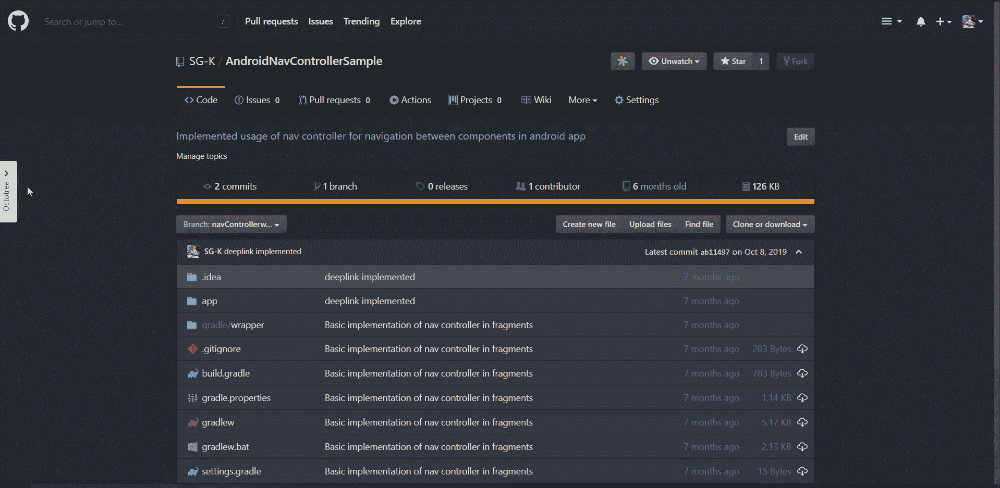
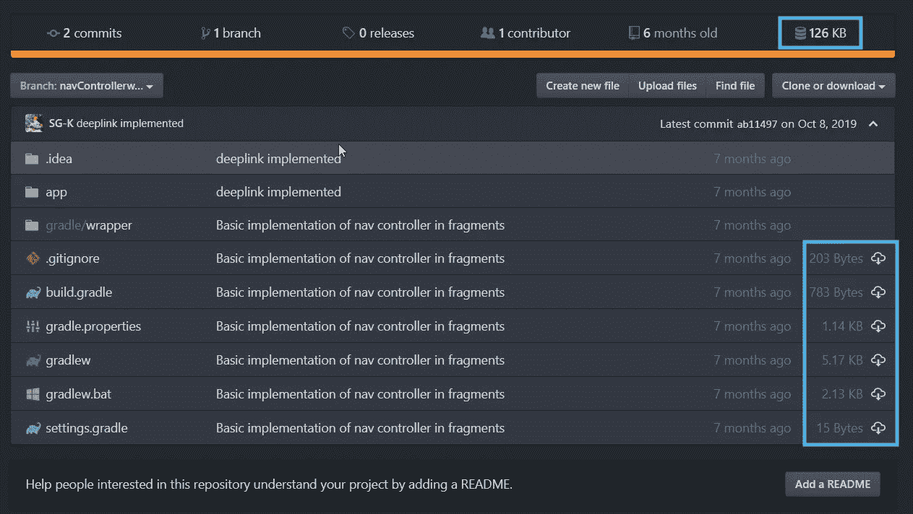
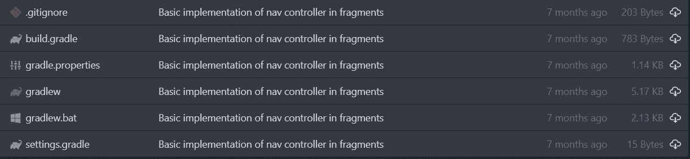
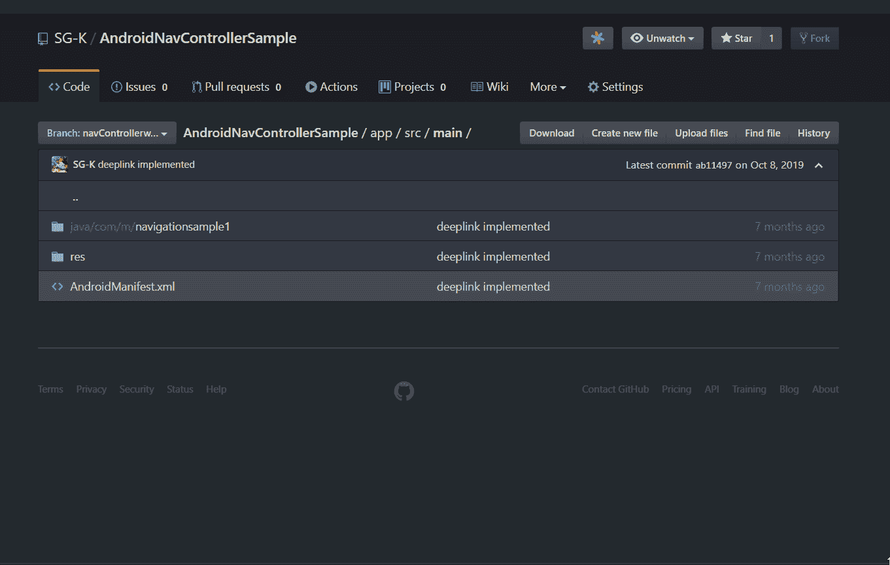
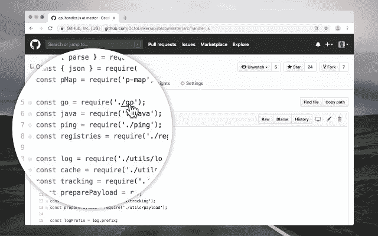
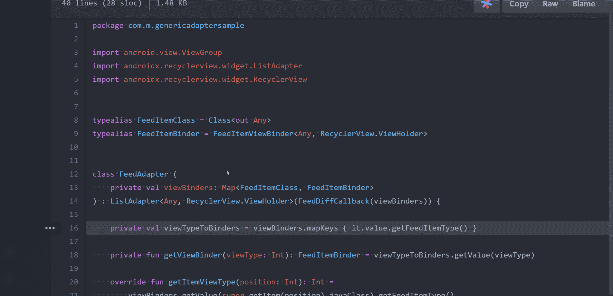
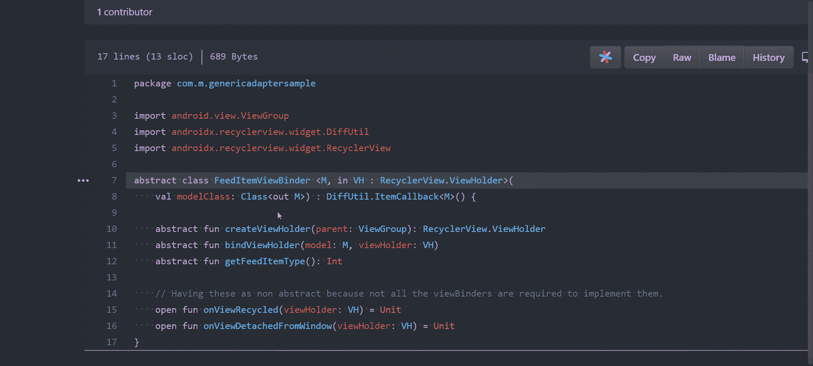

# 六个 Web 扩展来改善您的 GitHub 体验

> 原文：<https://levelup.gitconnected.com/six-web-extensions-to-improve-your-github-experience-dcb94c16bc86>

## 八叉树、Sourcegraph 和更多

卢克·切瑟在 [Unsplash](https://unsplash.com?utm_source=medium&utm_medium=referral) 上的照片

无论你是后端工程师、设计师，还是跨平台移动开发者，我们都需要一个版本控制系统。对于我们大多数人来说，GitHub 是必去之地。这里有六个 web 扩展，可以让你的 GitHub 体验更加愉悦和高效。

我在跨平台开发中使用这些扩展已经有一段时间了。因此，不管您的平台是什么，这些扩展都会在您作为程序员的日常生活中派上用场。

# #1 八叉树

通过 Octotree 扩展在浏览器中显示 GitHub 项目树

Octotree 在 [**Chrome**](https://chrome.google.com/webstore/detail/octotree/bkhaagjahfmjljalopjnoealnfndnagc?hl=en) 和 [**Firefox**](https://addons.mozilla.org/en-US/firefox/addon/octotree/?src=search) 浏览器中都有。

Octotree 为您的 GitHub 网络资源库带来 IDE 体验。如今，大多数开发工具都有一个带有项目树的左侧面板。Octotree 通过一个切换按钮给你的网站带来同样的体验。我们可以像在 IDE 中一样轻松地浏览项目树。

对于公共存储库，它会在你安装插件后立即工作，但是对于私有存储库，我们需要提供一个 GitHub 访问令牌。没有必要对访问令牌感到恐慌，因为插件隐私策略明确提到令牌存储在浏览器本地存储中，仅用于认证 GitHub 存储库。

# #2 增强型 GitHub

增强型 GitHub 扩展仅在 [**Chrome**](https://chrome.google.com/webstore/detail/enhanced-github/anlikcnbgdeidpacdbdljnabclhahhmd?hl=en) 浏览器中可用。

增强型 GitHub 有三个关键特性——显示回购大小、每个文件的大小和下载链接。

1.  **显示回购大小:**通过在顶部创建一个新的选项卡，在分支级别显示存储库的大小。
2.  **每个文件的大小:**在右上角的下载按钮旁边显示每个文件的大小。
3.  **下载链接:**我们可以通过文件右上角的下载按钮下载存储库上的任何文件。

# GitHub 和 GitLab 的#3 文件图标

具有独特图标的不同文件类型

GitHub 和 GitLab 扩展的文件图标在 [**Chrome**](https://chrome.google.com/webstore/detail/file-icon-for-github-and/ficfmibkjjnpogdcfhfokmihanoldbfe?hl=en) 和 [**Firefox**](https://addons.mozilla.org/en-US/firefox/addon/github-file-icon/?src=search) 浏览器中都有。

在 GitHub 上，不管是什么样的文件类型，所有的文件都会有相同的图标。然而，在我们一些花哨的 ide 中，每种文件类型都用一个独特的图标来表示，这提供了一种令人愉快的体验。这个扩展给你的浏览器带来了同样的体验，它也可以和其他版本控制系统一起工作，比如 GitLab，gitea 和 gogs。

# #4 黑暗主题

黑暗模式下的 GitHub

黑暗主题扩展在 [**Chrome**](https://chrome.google.com/webstore/detail/github-dark-theme/odkdlljoangmamjilkamahebpkgpeacp?hl=en) 和 [**Firefox**](https://addons.mozilla.org/en-US/firefox/addon/github-dark-theme/?src=search) 浏览器中都有。

根据流行的研究，70%的开发人员选择在黑暗模式下编码。这并不奇怪，因为在编码时，我们的大脑一直在工作，所以我们需要减少视网膜上的压力，以便更长时间地集中注意力。黑暗主题是将所有 GitHub 页面的外观改为黑暗模式的扩展，大多基于 Atom One Dark。

*编码取决于你的视觉生产力。如果你的眼睛疲劳，你的大脑也会让你远离屏幕。选择更舒适的配色方案，提高工作效率！
—蒂格兰·贝布尔琴*

# #5 八接头

Octolinker 在 [**Chrome**](https://chrome.google.com/webstore/detail/octolinker/jlmafbaeoofdegohdhinkhilhclaklkp?hl=en) 和 [**Firefox**](https://addons.mozilla.org/en-US/firefox/addon/octolinker/?src=search) 浏览器中都有。

Octolinker 将文件之间的 IDE 导航体验带到了 web 上的 GitHub 存储库。首先，它会读取代码，然后根据文件类型分析导入语句。它使用 GitHub API 获取存储库的树形结构来链接相关文件。之后，我们只需轻轻一点就可以在文件间导航。

Octolinker 在编码评审中派上了用场。它将依赖项和文件链接到一个拉请求上，这样您就可以专注于重要的工作——代码审查。

# #6 源图

左—代码导航演示和右—代码参考演示

Sourcegraph 仅在 [**Chrome**](https://chrome.google.com/webstore/detail/sourcegraph/dgjhfomjieaadpoljlnidmbgkdffpack?hl=en) 浏览器中可用。

Sourcegraph 扩展为 web 上的 GitHub 增加了代码导航和代码智能。它在大多数代码主机上支持 20 多种语言。安装这个扩展后，当你悬停在任何一个类上时，它会显示一个有两个选项的窗口

*   **转到定义:**当你点击它时，你会像在你 IDE 中一样导航到类或变量源代码。
*   **查找引用:**这将显示特定类或变量的使用位置。

简单来说，Sourcegraph 为 GitHub 增加了代码智能。

希望你学到有用的东西，感谢阅读。

你可以在[中](https://medium.com/@sgkantamani)、[推特](https://twitter.com/SG5202)、 [Quora](https://www.quora.com/profile/Siva-Ganesh-Kantamani-1) 和 [LinkedIn](https://www.linkedin.com/in/siva-kantamani-bb59309b/) 上找到我。