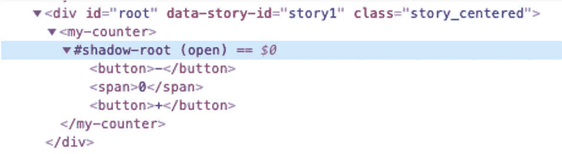

# 使用 Web 组件前应具备的技能

> 原文：<https://levelup.gitconnected.com/skills-you-should-have-before-using-webcomponents-ceb8008fb742>


[哈维·卡夫雷拉](https://unsplash.com/@xavi_cabrera?utm_source=medium&utm_medium=referral)在 [Unsplash](https://unsplash.com?utm_source=medium&utm_medium=referral) 上的照片

当我开始使用 Web 组件的旅程时，我已经熟悉了使用它们的概念和好处，但是我从来没有机会了解细节并实际实现它们。我开始寻找指导，因为我想看看其他人是如何使用它的，以及他们是否分享了一些最佳实践。

我找到的所有关于 WebComponents 的文章都说没有实际的 WebComponents API 它更像是可以一起使用的新浏览器 API 的集合。大部分只引用了其中的 3 个:*自定义元素*、*模板、*和 *ShadowDom* 。

在我开始在我的第一个项目中实现 WebComponents 之后，我注意到那些文章没有错，但是它们**不完整**。在全速前进之前，你还需要学习一些技巧。

以下是我的这些技能的完整列表。我想你对其中一些已经很熟悉了。顺便说一句，我不会详细描述它们中的每一个，但是可以随意访问官方文档的链接。

## 1.自定义元素

我认为这是最重要的 API，因为它允许您用自己的标签扩展 HTML5 原生标签集合。[(更多信息)](https://developer.mozilla.org/en-US/docs/Web/Web_Components/Using_custom_elements)

之后，你将能够在你的 HTML 中使用`my-date-picker`标签。

```
<**my-date-picker** min-date="2020-01-01"></my-date-picker> 
```

## 2.HTML 模板

您可以定义只被浏览器解析一次的模板，然后您可以使用它更快地克隆它。[(更多信息)](https://developer.mozilla.org/en-US/docs/Web/Web_Components/Using_templates_and_slots)

## 3.阴影 DOM

它封装了组件的 DOM 和样式，因此它将与应用程序的其余部分隔离开来。[(更多信息)](https://developer.mozilla.org/en-US/docs/Web/Web_Components/Using_shadow_DOM)

如果你打开开发者工具，你会注意到一个叫做`shadow-root`的特殊节点元素。



## 4.ES 模块

许多帮助构建 WebComponents 的工具都有一个叫做**差异捆绑、**的概念，这意味着你要为不同的浏览器构建多个捆绑包(尤其是如果你必须支持 Internet Explorer 11 的话)。

然后你就可以描述哪些脚本使用了 es 模块，哪些没有。因此，根据他们的支持，每个浏览器将下载其中一个。

```
<script **type="module"** src="/build/my-component**.esm.js**"></script>
<script **nomodule** src="/build/my-component**.js**"></script>
```

不仅如此，您还可以使用`type=module`脚本直接在 HTML 中导入资源。[(更多信息)](https://developer.mozilla.org/en-US/docs/Web/JavaScript/Guide/Modules#applying_the_module_to_your_html)

```
<script **type="module"**>
  import { haveFun } from '/dist/have-fun.js';
  haveFun();
</script>
```

## 5.时间

在大多数情况下，你的组件需要组合，所以你可以在你的组件中定义一些占位符，这样开发者就可以“注入”它们的内容。[(更多信息)](https://developer.mozilla.org/en-US/docs/Web/Web_Components/Using_templates_and_slots#adding_flexibility_with_slots)

## 6.新的 CSS 选择器

这些是新的 CSS 选择器，可以根据组件的使用位置和插槽位置来设计样式。(更多信息:[主机](https://developer.mozilla.org/en-US/docs/Web/CSS/:host())、[主机上下文](https://developer.mozilla.org/en-US/docs/Web/CSS/:host-context())、[插槽](https://developer.mozilla.org/en-US/docs/Web/CSS/::slotted))

## 7.CSS 自定义属性

WebComponent 内部的 DOM 和 CSS 是隔离的，所以没有办法从外部定制它(这意味着不再有`!important`指令)。作为一个组件设计者，你会希望给开发人员从外部定制一些元素的选项。CSS 自定义属性来了。[(更多信息)](https://developer.mozilla.org/en-US/docs/Web/CSS/--*)

或者您可以内联覆盖它:

```
<my-button **style=**"--primary-color: red"></my-button>
```

## 结论

最有可能的是，你不会使用那些 Web 组件的底层 API，至少不会全部使用。我的意思是，在 2021 年，谁还想写类似 jQuery 的代码呢？当然，您将使用 WebComponent 构建工具，如 [StencilJS](http://stenciljs.com/) 、 [LitElement](https://lit-element.polymer-project.org/guide) ，或者只是 React、Vue、Angular 或 Stencil wrappers。

但是我鼓励您学习这些技能，理解幕后发生的事情，并且只有在这之后才开始实现 WebComponents。