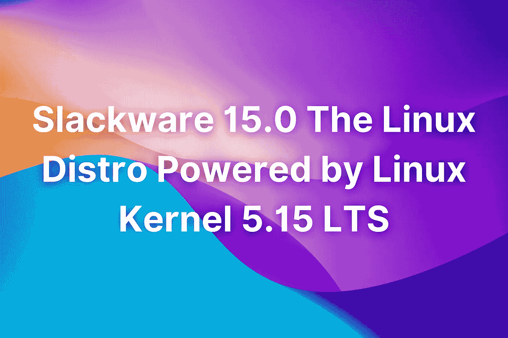
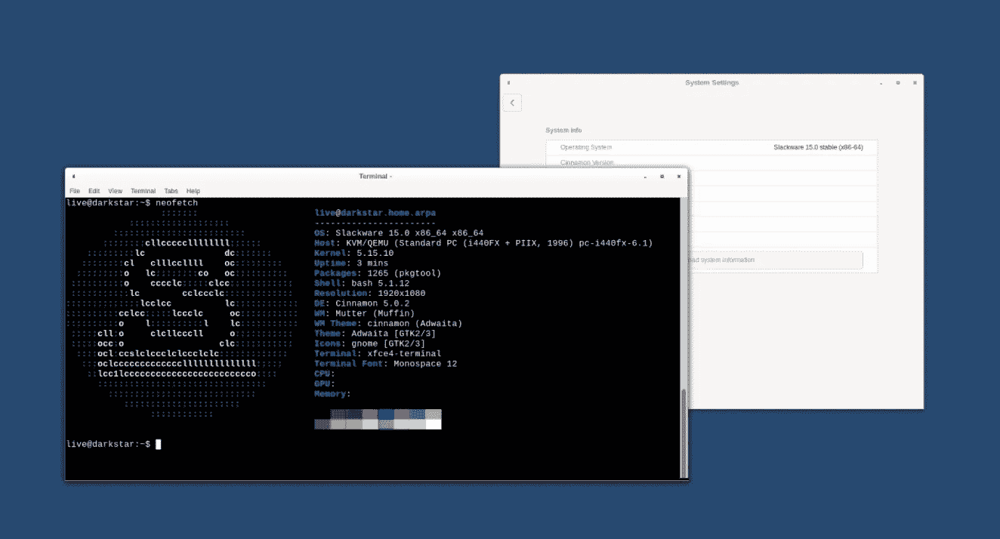

# Slackware 15.0 由 Linux 内核 5.15 LTS 支持的 Linux 发行版

> 原文：<https://levelup.gitconnected.com/slackware-15-0-the-linux-distro-powered-by-linux-kernel-5-15-lts-841608b8a738>

## 我们一直在等待更新的 Linux 发行版

## Slackware 15.0 正式发布

Slackware Linux 项目刚刚在 2 月 3 日发布了 Slackware 15.0 版本，用于桌面计算机，具有新的用户界面、改进的稳定性和性能、更新的应用程序和其他改进。

最新发布的 Slackware 15.0 由最新的长期支持(LTS) Linux 内核 5.15 系列提供支持，采用了基于 PAM 的纯阴影密码认证系统，从 ConsoleKit 切换到 elogin 作为默认会话管理器，采用了 PipeWire 多媒体框架，增加了对 Rust 编程语言的支持，并增加了对 Python3 编程语言的支持。

XFCE 4.16 在 Slackware 15.0 中默认可用，其中包括新的 KDE 等离子 5.23，并替换了旧的 KDE 4.x 环境；添加 Dovecot IMAP/POP3 服务器，以替代旧的 imapd/ipod p3d 服务器；当我们转向 Qt5 时，停止对 Qt4 的支持；并引入新的工具来简化安装构建和软件包创建。

# 什么是 Slackware？

Slackware 是 Linux 的开源发行版，旨在为用户提供稳定可靠的操作系统。它是由 Patrick Volkerding 在 1993 年创建的，从那时起，它就由热衷于自由软件和自由的志愿者开发。

这个项目的主要目标是基于 2.6.18 内核创建一个简单而强大的 GNU/Linux 发行版，为用户提供一套完整的软件包，无需编译或打补丁即可安装。

Slackware 团队还提供了广泛的定制选项，允许用户进一步定制他们的体验，例如安装第三方软件、更改图形环境的外观等等。

此外，Slackware 还提供了一些高级特性，比如预编译的二进制包、滚动发布模型和独立的安装程序。这些特性使得 Slackware 成为经验丰富的 Linux 用户中最受欢迎的发行版之一。

# 特征

发行版的新版本带来了一系列新的很酷的特性和一些技术特性，对于高级用户来说可能会更好。以下是 Slackware 15 中引入的一些新特性。0:

## 新用户界面

Slackware 15.00 中的新用户界面基于 Xfce 4.16，这是默认的桌面环境。这意味着您可以使用 Xfce 4 提供的所有特性。16，包括新的设置面板，新的通知区域，新的任务栏，等等。

## 提高稳定性和性能

随着 LTS Linux 内核 5.15，Slackware 15 的推出。0 现在使用与 Ubuntu 18.04 LTS 相同的内核版本，使用户更容易升级到更新版本的操作系统。此外，开发人员还做了一些改进，以提高操作系统的整体稳定性和性能。

## 更新的应用程序

休闲服 15。0 为各种应用程序提供了许多更新和修复，包括 LibreOffice 6.2.1、Firefox 52 ESR、Thunderbird 45.9.0、GIMP 2.10.8、GNOME 3.22.92、VLC 3.0.7、Transmission 1.88 等。

## Python3 支持

现在 Slackware 支持 Python 3，允许用户使用最新版本的脚本语言安装和运行 Python 程序。

## Rust 编程语言支持

Rust 编程语言现在得到了 Slackware 的官方支持，这意味着用户可以使用这个工具链来开发 C++代码。

## Dovecot IMAP/ POP3 服务器

Dovecot 是 Slackware 15 中包含的默认电子邮件客户端。00，替换旧的 imapd 和 pop3d 服务。新服务器支持多种协议(IMAP、POP3、SMTP ),并支持 SSL 和 TLS 加密。

## KDE 等离子桌面环境

KDE 等离子桌面环境现在在 SlackWare 15 中默认可用。0，为用户提供了一个现代化的、功能丰富的桌面环境。

## Qt5 框架

现在默认使用 Qt5 框架，为用户提供了一个跨平台的应用开发平台。

## 系统服务管理器

在 Slackware 15.0 中，现在默认使用 systemd 服务管理器，取代 Upstart。

## GPG 密钥管理系统

GPG 密钥管理在 Slackware 15 中得到了改进。o，允许用户从其他来源导入密钥并轻松管理它们。

## 主要组件的更新

Slackware 15 中的许多主要组件都得到了重要的升级。o，包括 GCC 8.2，glibc 2.31，libstdc++6 7.4.0，libgcc-ng 9.1.0，binutils 2.32.51.20180709，coreutils 8.28，GNUstep Base 2.14.1，GNUstep 开发工具包 2.14.1。

# 在这里下载 Slackware 15.0

据我们所知，Slackware 支持 32 位和 64 位系统；然而，官方的安全引导支持还没有实现，传言说它计划在下一个版本中实现。当然，如果你不使用任何第三方软件，那就没什么好安装的。

你可以点击底部的下载图片或者点击链接[这里](http://ftp.slackware.com/pub/slackware-iso/slackware64-15.0-iso/slackware64-15.0-install-dvd.iso)来试用这个新的 Linux 发行版。

# 结束语

如果你正在寻找一个易于使用的发行版，看看 Slackware 就知道了。它不仅免费而且非常稳定和强大。这个最新的更新和它所有的特性应该已经让你改变了你的想法，我迫不及待地想知道接下来会发生什么。

如果你对这篇文章有任何问题或建议，请不要犹豫，在评论区回复。喜欢你读的东西吗？为什么不关注我的媒体简讯，这样你就不会错过我未来的任何文章了？很简单，点击[这里](https://kgabeci.medium.com/subscribe)输入你的电子邮件地址，然后点击订阅。

你喜欢阅读媒体上的文章吗？考虑成为会员，这里有很多功能，你每月只需花 5 美元就可以获得所有创作者的内容。使用[这个链接](https://kgabeci.medium.com/membership)，你也可以帮我赚取一小笔佣金，点击成为会员，输入你的信息。