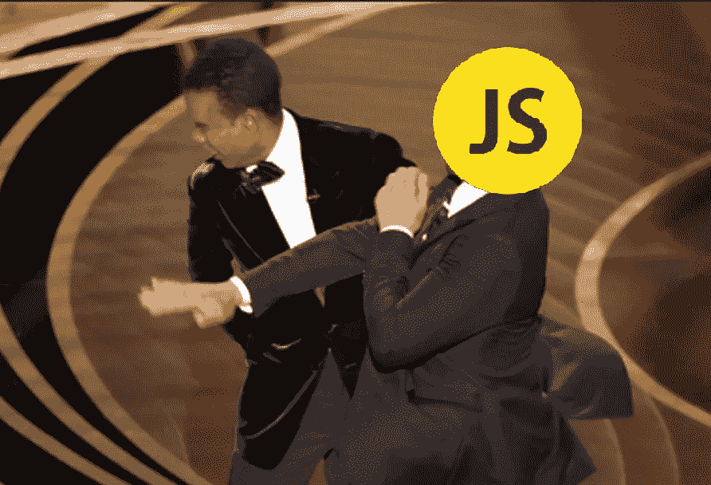
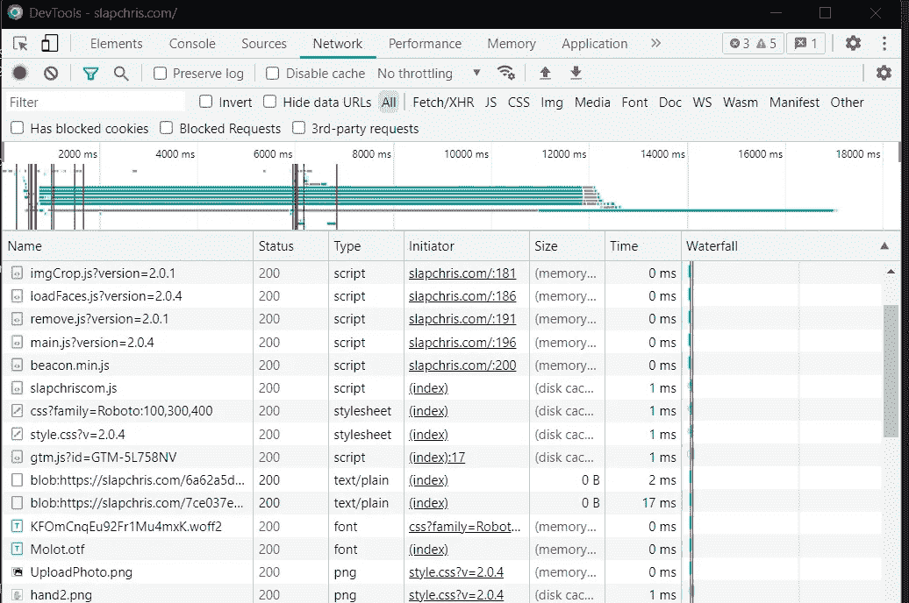
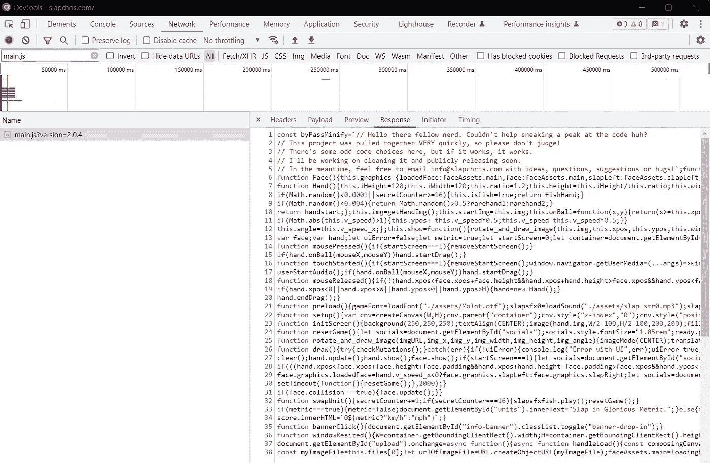
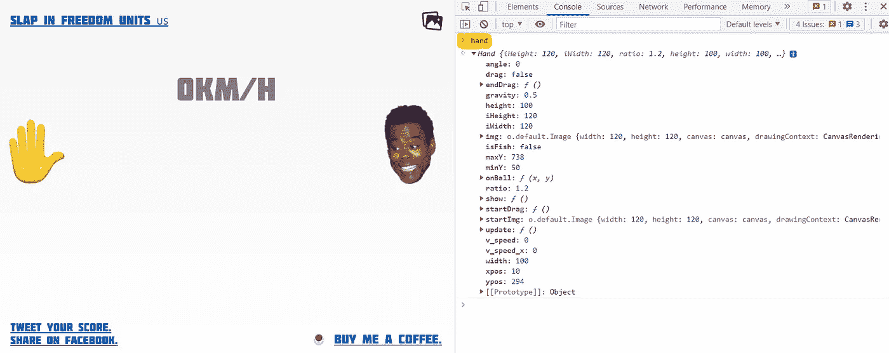
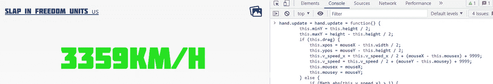

# 用 JavaScript 的力量给克里斯·洛克一巴掌

> 原文：<https://levelup.gitconnected.com/slap-chris-rock-with-the-power-of-javascript-79faabaccfd2>



## 概观

在本文中，我们将看到网页游戏 [*打克里斯*](https://slapchris.com/) 是如何工作的。之后，我们将操纵可访问的 JavaScript 对象来获得更高的分数。

我们将学习如何使用 Chrome DevTools 来读取源代码，以及如何使用 JavaScript 来覆盖一个公共方法以提高命中率。

## 1.获取源代码

为了获得游戏的源代码，我们将打开一个新的 chrome 选项卡，然后通过右键单击页面并选择“ *inspect”来打开 DevTools。*

之后，我们将转到*网络*选项卡，并导航到我们想要分析的页面——在我们的示例中，是[*https://slapchris.com*](https://slapchris.com/)。



打开开发工具并导航至[*https://slapchris.com*](https://slapchris.com/)

在 Network 选项卡中，我们现在可以看到浏览器执行的所有请求。会有各种类型的文件:JavaScript，CSS，图像，音频，gif...等等。所有这些资源对小浏览器游戏都至关重要。

现在，我们正在寻找包含所有逻辑的主 JavaScript 文件。幸运的是，在这种情况下，文件很容易找到:查找 *main.js、*或者简单地在搜索字段中键入 *main* 。



找到 main.js 文件

我们又一次幸运了——源代码被缩小了，但没有混淆！这意味着我们可以简单地格式化代码并容易地理解它。

## 2.对代码进行逆向工程

让我们来看看这个游戏是如何计分的！

首先我们将美化代码，搜索*“score”*变量。经过几次匹配，我们可以找到一些有用的东西:

```
score.innerHTML = `${speed}${speedUnits}`;
```

现在，让我们看看*速度*参数是从哪里来的。再往上几行，我们可以发现这一点:

```
const speed = metric ? Math.floor(speedFloat) : Math.floor(speedFloat / 1.609);
```

让我们继续这个过程，我们将跟随*速度浮动*，然后是*速度:*

```
face.velocity_x = hand.v_speed_x * 0.1;
face.velocity_y = hand.v_speed * 0.1;
```

我们可以看到，最终得分是根据*手*物体的速度计算出来的。

幸运的是，这个对象是公共的，可以访问。让我们看看它提供了哪些方法和领域。

对源代码进行逆向工程

我们可以注意到*手*的速度是用这个 *update()* 方法计算的。

因此，这可能是我们可以插入并覆盖源代码的地方之一。

## 3.重写源代码中的方法

首先，我们将复制*更新*方法的初始内容。之后，我们将改变速度的计算方法，并大幅提高速度:

```
this.v_speed_x = this.v_speed_x / 2 + (mouseX - this.mousex) **+ 9999**;
this.v_speed = this.v_speed / 2 + (mouseY - this.mousey) **+ 9999**;
```

手对象是全局范围的一部分

```
function resetGame() {
  let socials = document.getElementById("socials");
  socials.style.fontSize = "1.05rem";
  ready.play();
  **hand = new Hand();**
  face = new Face();
  // ...
}
```

这意味着我们可以从浏览器控制台访问它，只需键入变量名:



最后，使用浏览器的控制台来覆盖我们的方法:

就这样，你现在可以从浏览器中点击 Chris，并分享你的结果！



## 4.保持好奇心，继续学习

最后，也是最重要的，继续研究代码，并尝试使用它。发现新的挑战，并努力解决它们。

例如，尝试改变重力，从控制台播放声音，尝试解锁罕见的动画…等等。

阅读别人写的代码可以极大地提高你的理解能力，这是一个很好的练习。

# 分级编码

感谢您成为我们社区的一员！在你离开之前:

*   👏为故事鼓掌，跟着作者走👉
*   📰查看[级编码出版物](https://levelup.gitconnected.com/?utm_source=pub&utm_medium=post)中的更多内容
*   🔔关注我们:[推特](https://twitter.com/gitconnected) | [LinkedIn](https://www.linkedin.com/company/gitconnected) | [时事通讯](https://newsletter.levelup.dev)

🚀👉 [**加入升级人才集体，找到一份惊艳的工作**](https://jobs.levelup.dev/talent/welcome?referral=true)