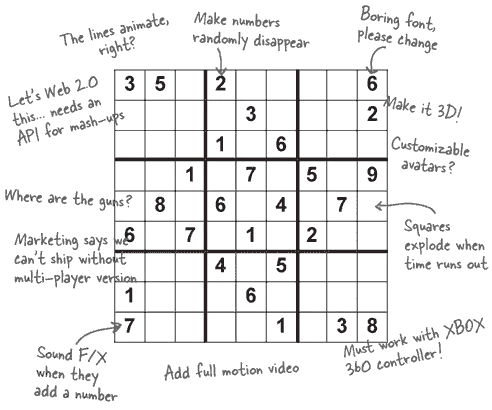
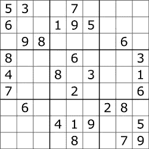
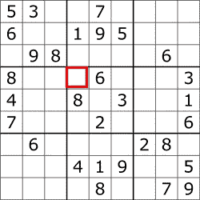
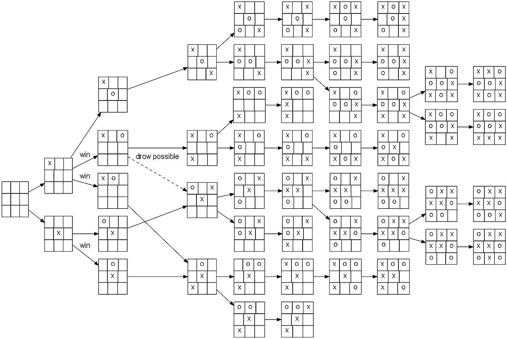

# 破解数独谜题

> 原文：<https://levelup.gitconnected.com/slaying-the-sudoku-puzzle-13bc6dd6ff78>



## 用 Python 实现约束传播和搜索的人工智能技术来解决数独板

> 世界上似乎有两种主要的人，纵横字谜和数独。—丽贝卡·麦肯锡

在本文中，你将通过编写一个程序来解决**数独**棋盘上的`constraint propagation`和`search`。所有代码都是用 **Python3** 编写的，可以在我的 GitHub 个人资料上找到，还有如何使用和执行代码的说明。

[https://github . com/zahash/artificial intelligence/tree/master/sudoku](https://github.com/zahash/ArtificialIntelligence/tree/master/sudoku)

在直接进入代码之前，让我们先熟悉一些数独的术语和规则。



对于所有正在阅读这篇文章的外星人来说，这是一个典型的未解数独棋盘的样子。

# 熟悉数独

每个 **9x9** 数独板被分成九个 **3x3** 部分。

这些行将标有字母 **A、B、C、D、E、F、G、H、I** 。这些列将标有数字 **1、2、3、4、5、6、7、8、9** 。请注意，标签惯例只是为了我们的理解，实际上并不存在于公告板上。

行和列交叉处的单个方块将被称为`boxes`。这些盒子将贴有标签“A1”、“A2”、“I9”。编码时，我们将使用这些标签来唯一地标识板上的每个方框

每个行、列和 3×3 的正方形将被称为一个`unit`。因此，每个单元是一组 9 个盒子，总共有 27 个单元。

对于一个特定的盒子(如‘E7’)，它的`peers`将是属于一个公共单元的所有其他盒子(即，属于同一行、列或 3×3 正方形的那些盒子)。

游戏规则非常简单。用一个数字填充棋盘上所有的空方格，这样在同一行、同一列或同一 3×3 方格中没有一个方格有相同的数字。

# 编码板

我们必须找到一种方法，用一种合适的数据结构来表示棋盘和与之相关的一切。

这可能是项目中最重要的部分，因为其他一切都取决于它。如果你做错了，那么代码要么效率低下，要么不能正常工作。

## 输入

*   未解析纸板的起始值将由一串带点(.)来表示框是否为空。
*   输入的正确格式应该由行中数字的所有读数串联而成，从上到下取行。
*   上面显示的数独的输入字符串是

‘53..7….6..195….98….6.8…6…34..8.3..17…2…6.6….28….419..5….8..79’

## 董事会

*   电路板本身将以**字典**的形式表示，其中键是每个盒子的标签(‘E7’)，值是盒子中的数字

## 单位

*   这 27 个单元将被存储为列表的**列表**，每个内部列表代表一个单元，该单元包含出现在同一行或列或 3×3 正方形中的所有盒子的标签
*   我们将使用这个单元列表来创建一个单元**字典**来存储关于哪个盒子是哪个单元的一部分的信息。它的键是盒子的标签，它的值是盒子所属的所有单元的列表

## 同龄人

*   对等体将被存储为一个**字典**，其中的键代表盒子的标签，值代表盒子的所有对等体的集合

现在我们已经对电路板进行了编码，让我们直接进入编码部分

# 编码部分

现在让我们编写代码来对电路板进行编码

编写一个助手函数，它接受两个可迭代对象(比如一个字符串),并返回它们的笛卡尔积

另一个助手功能，以视觉上吸引人的方式打印数独板

现在是实际的编码

以上代码就是整个**主函数**。现在，只看第 24 行

## 排除法



看着黑板上高亮显示的方框，猜测所有可能的值。

通过观察它的行，我们可以说这个盒子不能包含 3，6，8。通过观察它的列，盒子不能包含 1，4，8，最后通过观察它的 3x3 正方形，盒子不能包含 2，3，6，8。所以这个盒子剩下的选项是 5，7，9。

这是排除法背后的主要思想。我们根据规则排除可能的值，得到一个简化版的谜题。

要在代码中做到这一点，让我们替换所有由点(.)与字符串“123456789”一起使用，因为所有值在消除之前最初都是可能的。

**查看** **上方主函数中第 29 到 32 行的代码**

现在，创建一个函数，它接受未解决的数独棋盘(作为字典)并返回相同的棋盘(作为字典)，但是在对所有的盒子应用“一次”消除之后

对电路板进行编码，并运行一次消除功能。使用给定的显示功能显示消除前后的纸板。

## 唯一的选择方法

运行消除函数后，我们将得到一个部分解决的数独——就像这样

```
 5     3    124  |  26    7    8246 | 1948  1924   82  
  6     47   247  |  1     9     5   | 8347   24   827  
  12    9     8   |  32    34    24  |13547   6    247  
------------------+------------------+------------------
  8     15   195  |  7     6     14  | 9547  9254   3   
  4     2    926  |  8     5     3   |  97   925    1   
  7     15   1935 |  9     2     14  | 854    54    6   
------------------+------------------+------------------
 193    6   19354 |  35    35    7   |  2     8     4   
  2     87   327  |  4     1     9   |  36    3     5   
 132   1254 13254 | 3256   8     26  | 1346   7     9
```

这里，如果一个盒子有一个数字，那么它意味着它的值是固定的，如果一个盒子有一个以上的数字，那么它意味着那些是可以填入那个盒子的可能的值。

现在，仔细观察中上方的 3x3 方块

```
 26    7    8246 
  1     9     5   
  32    34    24 
```

根据游戏规则，我们应该将 1 到 9 的所有数字放在一个 3x3 的正方形内。

如果我们仔细观察包含“8246”的盒子，我们可以看到它是 3×3 正方形中唯一可以包含数字“8”的盒子，因为没有其他盒子有这种可能性。

因此，我们可以很高兴地将数字“8”固定在那个盒子中(因为我们应该将所有数字放在一个 3×3 的正方形中，而其他盒子不能有它)

它不仅限于 3×3 的正方形。事实上，对于一个给定的盒子，我们查看它的所有三个单元，其中一个是 3x3 的正方形(另外两个是盒子的行和列)

这被简单地称为**唯一选择**的方法/策略。

代码看起来像这样…

在对数独的每一个盒子都应用了唯一选择函数之后，我们得到了以下结果

```
 5     3    124  |  6     7     8   |  9     1     2   
  6     7    247  |  1     9     5   |  3     24    8   
  12    9     8   |  3     4     24  |  5     6     7   
------------------+------------------+------------------
  8     15    9   |  7     6     14  |  4     2     3   
  4     2     6   |  8     5     3   |  7     9     1   
  7     15    3   |  9     2     14  |  8     5     6   
------------------+------------------+------------------
  9     6   19354 |  35    35    7   |  2     8     4   
  2     8     7   |  4     1     9   |  6     3     5   
 132   1254 13254 | 3256   8     26  |  1     7     9
```

但是这些方法有一个主要的**缺点**。就是有时候不管你怎么淘汰或者做唯一的选择，都不能再降板了。这叫**卡住**。

试试这块板子' 8……36……7..9.2…5…7…….457…..1…3…1….68..85…1..9….4..'

事实上，那块板子被认为是世界上最难的数独游戏。

## 所以现在我们有两个挑战要解决。

*   找出我们什么时候卡住了
*   卡住后怎么办

应对第一个挑战相当容易。只需记录淘汰和做出唯一选择前后的纸板值。如果价值观没有改变，那就意味着我们被卡住了。

让我们编写一个简单的函数来实现这一点

这里，我们将布尔变量`stuck`初始化为 **False。**然后使用一个 **while 循环**我们在每次迭代中检查棋盘上固定(一位数)值的数量在应用消除和唯一选择策略之前和之后是否相同。如果它们相同，那么`stuck`将为**真**否则为**假。**

但是有一个问题！注意到函数末尾的 **if 语句**了吗？这告诉我们数独在当前的配置下是可解的还是不可解的。

如果在任何一个盒子里都没有可以解决的数字，那么数独就是无解的。

还有，不要局限于只是淘汰和唯一选择。有很多解决数独棋盘的策略。把你最喜欢的策略写成一个函数，和另外两个一起执行。

最后…

我们直到现在所做的一切也被称为 ***约束传播。***

约束传播就是在一个空间中使用局部约束(在数独的情况下，每个方块的约束)来极大地减少搜索空间。当我们实施每个约束时，我们会看到它如何为电路板的其他部分引入新的约束，这可以帮助我们进一步减少可能性的数量。

**进入第二个挑战** …

世界上最难的数独谜题被称为“世界上最难的数独谜题”是有原因的。也就是说，你不能仅仅使用约束传播来解决这个难题，因为你会被卡住！

所以，我要给你介绍一下**搜索。**如果你学过数据结构和算法，你可能已经知道什么是搜索了！如果你不知道，让我解释

假设你有一个想从商店购买的食品清单。你去商店买清单上的商品，不需要遵循任何特定的顺序。将它们添加到购物车后，从列表中删除该商品。现在，比方说，您想知道您是否在购物车中添加了牛奶。为了找到答案，你将打开你的清单，从上到下查看每一项，直到你找到牛奶，看看它是否被划掉。

说白了就是线性搜索！(因为您是以线性方式逐项搜索)

有许多类型的搜索算法，像线性搜索，二分搜索法，等等。在这里，我们将使用**深度优先搜索。**

我不会在这篇文章中详细讨论深度优先搜索，因为它会很长。但是请记住，DFS 使用“回溯”来搜索

我们将使用 DFS 来搜索**游戏树。**

但是什么是博弈树呢？这是一个简单的树，包含了游戏中所有可能的走法。看下图就明白了。



这是井字游戏的完整游戏树

现在，来到数独难题，这背后的主要思想是，当我们陷入困境时，我们将固定具有最少数量的可能值(通常是两个)的单元格的值，并在该方向上扩展博弈树。

我们将重复上述步骤，直到我们解决董事会或发现目前的配置是无法解决的。在这种情况下，我们回溯并扩展另一个节点。

我知道这有点难以理解。我也很难解释课文中的一切。也许用一个视频来解释这个过程会更实际。

> 有时间的话我会做个视频嵌入这篇文章。

代码看起来像这样

# 结论

就这样，现在你知道了如何编写自己的程序来解决数独。但最重要的是，你现在知道了人工智能中最强大的两个概念——“约束传播”和“搜索”。

你可以用这两种技术来解决很多问题，比如密码算法难题(我讨厌它们)。

另外，如果你想看更多关于数据科学、机器学习、人工智能和一般编程的文章，请关注我。

[](https://levelup.gitconnected.com/)[](https://gitconnected.com/learn/python) [## 学习 Python -最佳 Python 教程(2019) | gitconnected

### 77 大 Python 教程。课程由开发者提交并投票，让你找到最好的 Python…

gitconnected.com](https://gitconnected.com/learn/python)