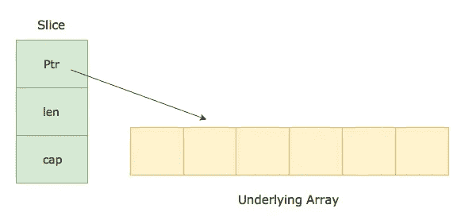

# Golang 中的切片和追加功能

> 原文：<https://levelup.gitconnected.com/slice-and-append-function-in-golang-840ffaef61b5>

首先，让我们看看切片和附加的实际操作:


```
Output:
[10]
[20 2]
[40 2 3]
[40 2 3 4]
```

输出与我们预期的有点不同，对吗？为什么 slice3[0]是 40，而我们把它设置为 30。

根据 golang 文档，让我们了解一下 slice 和 append 函数是如何工作的:

> *func append(切片[]*[*)Type*](https://golang.org/pkg/builtin/#Type)*，elems...* [*型*](https://golang.org/pkg/builtin/#Type)*)*[*型*](https://golang.org/pkg/builtin/#Type)
> 
> " append 内置函数将元素追加到切片的末尾。如果它有足够的容量，目标将被重新分割以容纳新元素。如果没有，将分配一个新的基础数组。Append 返回更新的切片。因此，有必要存储 append 的结果，通常存储在保存切片本身的变量中:
> 
> *切片=追加(切片，elem1，elem2)
> 切片=追加(切片，另一个切片...)*



切片包含三个内容:指向底层数组的指针、切片的长度和底层数组的容量。

**看起来非常简单，但是 golang 如何在 append 函数中增加新的底层数组的容量还有待了解。**

举个例子，我们有一个长度为 1 的切片，我们想添加更多元素:

```
var slice1 = []int{1}slice2 := append(slice1, 2) 
// This will result in creating a new underlying array of **capacity 2:** {1,2}
```

看起来很合理，因为之前它的容量为 1，我们想再添加一个元素，它创建了容量为 2 的新存储片。让我们再试一次:

```
slice3 := append(slice2, 3) 
// This will result in creating a new underlying array of **capacity 4 and slice length will be 3:** {1,2,3}
```

这次我们得到了容量为 4 而不是 3 的新存储片。为什么？降低 append 函数的分摊时间复杂度。底层阵列容量每次增加 1 将具有 O(n)的时间复杂度，而容量加倍将导致 O(3)的摊销时间复杂度。在这个[博客](https://medium.com/@amitj975/the-amortized-time-complexity-of-increasing-array-size-ddf0eb662027)中阅读更多关于摊销时间复杂度的内容。

```
slice4 := append(slice3, 4) 
// This will result in creating a new slice of length 4 and the **underlying array will be the** **same as earlier as the capacity was already 4:** {1,2,3,4}
```

注意:因此 slice4 底层数组保持不变。简而言之，append 函数并不总是每次都创建一个新的底层数组。

现在看看我们在博客开头看到的输出会更有意义。当我们将第一个索引更新为 40 时，底层数组是相同的，因此 slice3 也是相同的，并且由于 slice3 的长度为 3，它将打印切片的前 3 个元素。