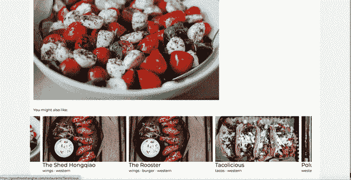

# Rails 5 的滑动转盘教程

> 原文：<https://levelup.gitconnected.com/sliding-carousel-tutorial-for-rails-6-2cdf30ae4a8>

## 用 Owl 旋转木马设置一个漂亮的、反应灵敏的旋转木马



在我的网站上找到现场演示:[https://goodfoodshanghai.com/](https://goodfoodshanghai.com/)

*注意:本教程尚未更新 Turbolinks。让我知道你是否想要一个更新的版本！*

有时候，简单的问题需要简单的解决方案。

我一直在寻找一种方法来为我的 Rails 6 添加轮播导航，而不需要笨重的 JavaScript 或大约在 2013 年停止接收更新的 gem。Bootstrap carousel 是一个潜在的解决方案，但当您希望在每页上添加多个 carousel 卡时，它并不是一个优雅的解决方案。

OwlCarousel 来救援了！这是一个 npm 包，它无缝集成到您的 Rails 6 应用程序中(尽管它也可以与 Rails 5 一起工作),可以在不到 5 分钟的时间内创建一个工作转盘。

我们开始吧！

# 步骤 1:设置 npm 软件包

第一步是安装 [NPM 组件](https://www.npmjs.com/package/owl.carousel)。还有一个 owl-carousel gem，但它与 Rails 6 不兼容。Rails 6 通过 app/javascript 文件夹处理 javascript，而 gem 需要通过旧的 JavaScript 管道添加进来。

首先，通过 yarn 或 npm 安装软件包。您还需要在系统上安装`jquery`作为依赖项。如果您的应用程序中配置了 Bootstrap 4，应该已经完成了。

```
yarn add owl.carousel jquery
npm install --save owl.carousel
```

如果还没有，请在 webpack 配置文件中添加 jQuery 设置:

```
#config/webpack/environment.jsconst webpack = require('webpack')
environment.plugins.prepend('Provide',
  new webpack.ProvidePlugin({
    $: 'jquery',
    jQuery: 'jquery',
    'window.jQuery': 'jquery'
 })
)
```

最后，将包 JS 和 CSS 导入 JavaScript 包:

```
#app/javascript/packs/application.js

import 'owl.carousel/dist/assets/owl.carousel.css';
import 'owl.carousel';#you may also need to add these two lines above the owl carousel code if you get the 'error $ is not a function' error in the consoleimport JQuery from 'jquery';
window.$ = window.JQuery = JQuery;
```

# 步骤 2:将 Owl Carousel 添加到您的视图中

carousel 前端的设置非常简单——在想要制作成 carousel 的对象列表周围添加 div 类`owl-carousel`,然后在它下面添加 JavaScript 代码片段，就完成了！

如果你用一个`each`循环遍历一个数组，它可能看起来像这样:

```
<div class="owl-carousel">
  <% @things.each do |thing| %>
    <div> 
      <%= thing.name %>
      <%= thing.description %>
    </div>
  <% end %>
</div>
```

使用一个`<script>`标签添加代码来初始化同一页面上的 carousel:

```
<script>
$(document).ready(function(){
  $('.owl-carousel').owlCarousel();
});
</script>
```

# 步骤 3:激活页面上的 JavaScript

当您添加这段代码时，有一个小小的警告。因为 jQuery 现在是使用 Webpack 加载的，所以您需要确保`<script>`代码只在加载完包之后才执行。

通常在 Rails 应用程序中，JS pack 标签被加载到应用程序布局中的`<%= yield %>`下面。为了确保代码片段能够使用 jQuery，它需要包含在 JavaScript 正下方的一个单独的 yield 中

在应用程序布局上，使用`:after_js`键添加产量

```
<body>
  <%= yield %>
  <%= javascript_pack_tag 'application', 'data-turbolinks-track': 'reload' %>
  <%= yield :after_js %>
</body>
```

然后，在带有转盘的页面上，将`<script>`标签包装在 content_for 循环中:

```
<%= content_for(:after_js) do %>
  <script>
  $(document).ready(function(){
    $('.owl-carousel').owlCarousel();
  });
  </script>
<% end %>
```

# 步骤 4:定制 Owl Carousel

转盘可以开箱即用，但是在[插件页面](https://owlcarousel2.github.io/OwlCarousel2/demos/demos.html)上有很多整洁的定制。例如，这些是我使用的设置:

```
$(document).ready(function(){
$('.owl-carousel').owlCarousel({
  stagePadding: 50,
  loop: true,
  margin:10,
  responsive:{
    0:{
      items:1
     },
    600:{
     items:3
     }
   }
 })
});
```

*   **阶段** **填充**向包装器添加左右填充
*   **循环**选项允许连续放映幻灯片
*   **页边空白**依次显示下一张和上一张幻灯片
*   **响应**选项提供了以像素为单位的断点和要显示的项目数

在这里找到选项的完整列表:[https://owlcarousel 2 . github . io/owlcarousel 2/demos/demos . html](https://owlcarousel2.github.io/OwlCarousel2/demos/demos.html)