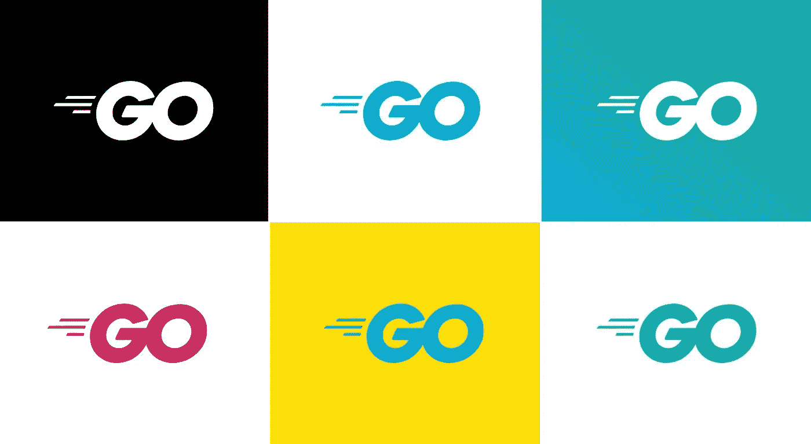
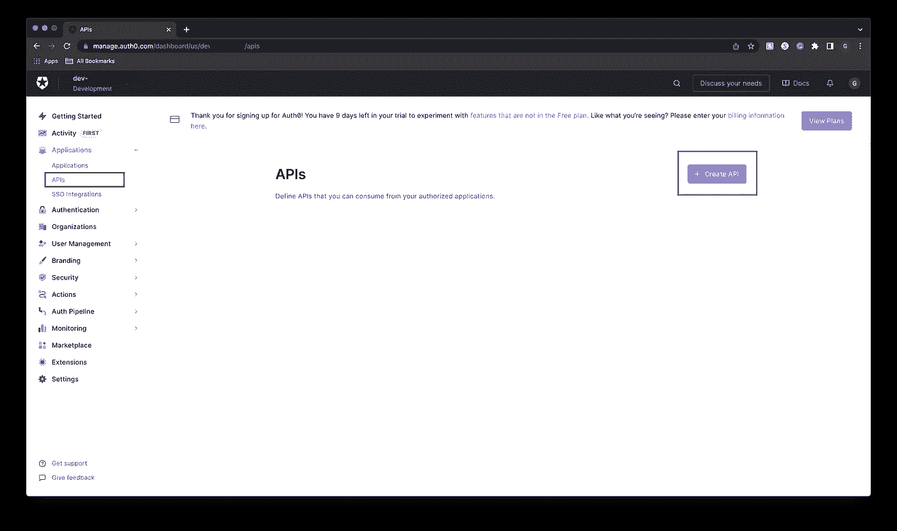
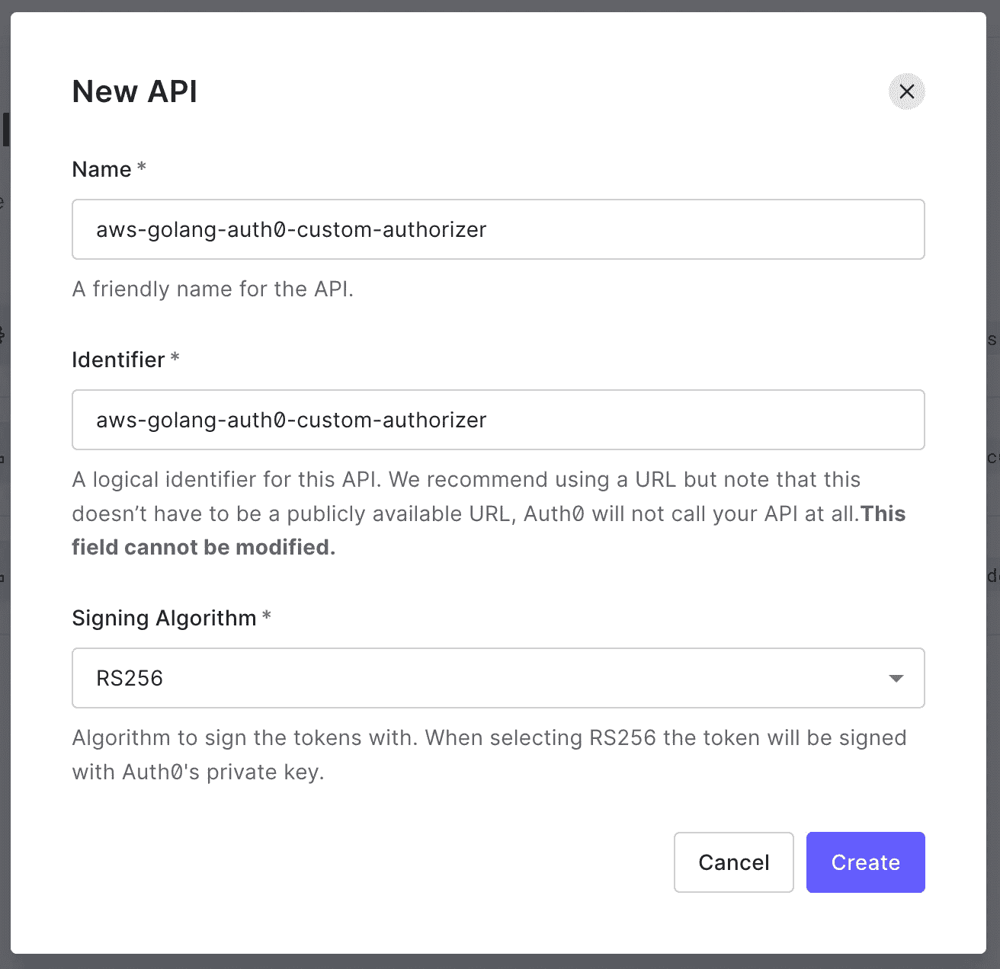
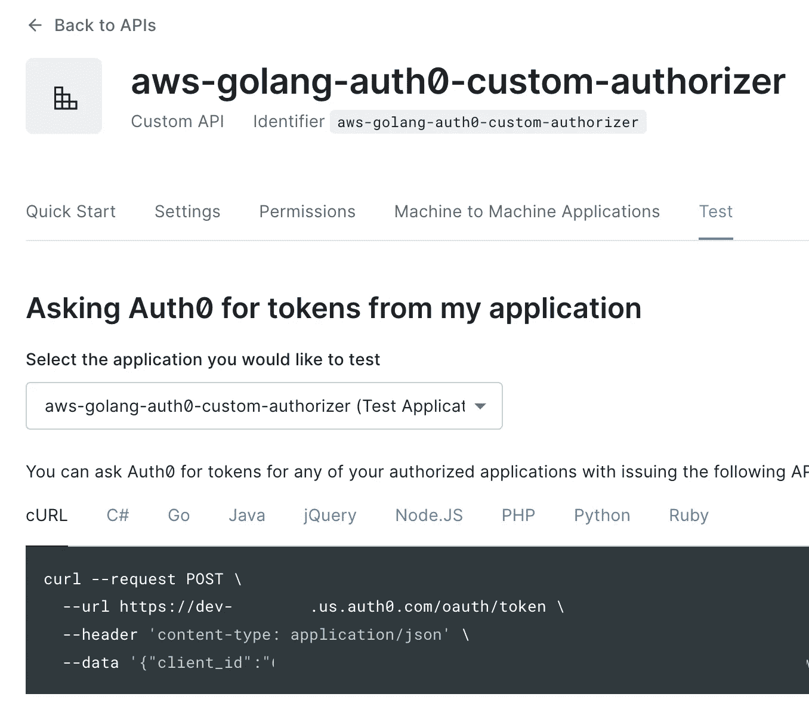

# 使用无服务器框架认证 API 的 5 个步骤，Auth0 和 Go

> 原文：<https://levelup.gitconnected.com/sls-auth0-go-34dfe5fab0b>



[https://go.dev/blog/go-brand](https://go.dev/blog/go-brand)

您是否对无服务器感兴趣，但尚未解决身份验证问题？本指南可能会有所帮助，因为它提供了在无服务器框架和 Auth0 的帮助下从零到认证 API 的逐步演示。

# 步骤 0:安装和先决条件

按照步骤，安装[无服务器框架 CLI](https://serverless.readme.io/docs/configuring-aws) 以及 [AWS CLI](https://docs.aws.amazon.com/cli/latest/userguide/getting-started-install.html) 。您的计算机应该配置有 IAM 角色或有权创建 AWS Lambda 和 API 网关资源的用户。

下面是验证安装的几个命令:

```
# Verify SLS
$ sls --version
Framework Core: 2.29.0
Plugin: 4.5.0
SDK: 4.2.0
Components: 3.7.3# Verivy AWS CLI
$ aws sts get-caller-identity
{
"UserId": "SOMEUSERID",
"Account": "0123456789012",
"Arn": "arn:aws:iam::0123456789012:user/garrett"
}
```

# 步骤 1:项目搭建

第一步是为您的项目创建一个文件夹，将目录更改为新创建的文件夹，并使用`create`命令和`aws-go`模板为我们提供一个启动项目。

```
mkdir aws-golang-auth0-custom-authorizer
cd aws-golang-auth0-custom-authorizer
sls create --template aws-go
```

下面是几行预期的输出，显示项目已成功生成。

```
Serverless: Generating boilerplate...Serverless: Successfully generated boilerplate for template: "aws-go"Serverless: NOTE: Please update the "service" property in serverless.yml with your service name
```

此外，您可以使用`tree`来检查新创建的项目结构:

```
[Sat May 14 18:40:20 EDT 2022] tree
.
├── Makefile
├── go.mod
├── hello
│   └── main.go
├── serverless.yml
└── world
    └── main.go
```

# 步骤 2:创建一个 Auth0 帐户和 API

使用 Auth0 创建一个免费帐户，然后前往[仪表盘](https://manage.auth0.com/dashboard/)。

从那里，在左边面板的`Applications`下面是一个`APIs`部分。点击`Create API`按钮:



用您喜欢的任何名称和标识符填充这个模型。对我来说，我把它命名为类似于这个项目的名字:



最后，从 API 中收集以下信息:

*   权威 URL。示例:` https://dev-ABCD 1234 . us . auth 0 . com/'
*   标识符。示例:` AWS-golang-auth 0-custom-authorizer '

# 步骤 3:创建和配置授权者 Lambda

为函数创建一个新文件夹`auth`和文件`main.go`:

```
mkdir auth && touch auth/main.go
```

在`serverless.yaml`文件中定义新的 Auth lambda 以及另外两个函数`hello`和`world`:

在 Makefile 中添加一行代码来构建和打包新的`auth` lambda 以及`hello`和`world`lambda。

接下来，授权人代码为`auth/main.go`(要点如下)。

每个逻辑代码块上面都有注释，但本质上我们有一个函数接受类型为`APIGatewayCustomAuthorizerRequest`的参数，这与其他 Lambdas 不同。由于这个 Lambda 是一个 API 网关授权器，我们希望传递的对象有一个我们可以访问的`AuthorizationToken`。在那里，我们使用`auth0`模块从我们的观众创建一个`validator`，它将用于验证传递的令牌。

接下来，在`serverless.yaml`中添加从`auth/main.go`代码中访问的环境变量。

```
environment:
  AUTH0_DOMAIN: "<yourdomain>.us.auth0.com"
  AUTH0_AUDIENCE: "https://<some-identifier>"
```

最后，注意这个例子将使用 API 网关的`REST API`而不是`HTTP API`，所以将`serverless.yaml`中的`httpApi`引用改回`http`。

# 步骤 4:部署和测试，无需身份验证

我们几乎准备好添加身份验证了！但首先，让我们部署并确保我们的终端按预期工作。

首先运行部署命令:

```
make deploy
```

如果成功，这将为我们的功能提供一些端点:

```
...
endpoints:
  GET - [https://qgr0ggi8c9.execute-api.us-east-1.amazonaws.com/dev/hello](https://qgr0ggi8c9.execute-api.us-east-1.amazonaws.com/dev/hello)
  GET - [https://qgr0ggi8c9.execute-api.us-east-1.amazonaws.com/dev/world](https://qgr0ggi8c9.execute-api.us-east-1.amazonaws.com/dev/world)
...
```

用`curl`命令测试它们:

```
$ curl --request GET \
>   --url [https://qgr0ggi8c9.execute-api.us-east-1.amazonaws.com/dev/hello](https://qgr0ggi8c9.execute-api.us-east-1.amazonaws.com/dev/hello){"message":"Go Serverless v1.0! Your function executed successfully!"}
```

# 步骤 5:要求认证

为`hello`端点添加一个值为`auth`(或函数)的`authorizer`

```
authorizer: auth
```

然后重新部署

```
make deploy
```

现在确保 API 现在返回`Unauthenticated`

```
$ curl --request GET \
>   --url https://qgr0ggi8c9.execute-api.us-east-1.amazonaws.com/dev/hello{"message":"Unauthorized"}
```

接下来，在`Authorization`头中生成一个令牌传递给 API。下图是样本`curl`，不过你可以直接从 Auth0 复制自己的！只需导航到仪表板，点击您的 API，并继续到`test`选项卡，命令应该准备好复制:



复制 curl 命令以检索令牌

```
curl --request POST \
  --url https://dev-abcd1234.us.auth0.com/oauth/token \
  --header 'content-type: application/json' \
  --data '{
    "client_id":"$CLIENT_ID",
    "client_secret":"$CLIENT_secret",
    "audience":"$AUDIENCE",
    "grant_type":"client_credentials"
}'
```

它应该会产生如下所示的令牌:

```
{"access_token":"someLongAccessToken","expires_in":86400,"token_type":"Bearer"}
```

现在在`Authentication`头中传递`access_token`值:

```
curl --request GET \
  --url [https://qgr0ggi8c9.execute-api.us-east-1.amazonaws.com/dev/hello](https://qgr0ggi8c9.execute-api.us-east-1.amazonaws.com/dev/hello) \
  --header 'Authorization: someLongAccessToken'{"message":"Go Serverless v1.0! Your function executed successfully!"}
```

它返回一个成功的响应！

# Github 上的代码

作为参考，这个例子中的代码可以在 GitHub 上找到:

[](https://github.com/gsweene2/aws-golang-auth0-custom-authorizer) [## GitHub-gsweene 2/AWS-golang-auth 0-自定义-授权者

### 此时您不能执行该操作。您已使用另一个标签页或窗口登录。您已在另一个选项卡中注销，或者…

github.com](https://github.com/gsweene2/aws-golang-auth0-custom-authorizer) 

本文中提到的更改也被浓缩为一个单独的 PR:

[](https://github.com/gsweene2/aws-golang-auth0-custom-authorizer/pull/2) [## gsweene2 拉请求#2 对授权的“Hello”端点的更改…

### 将此建议添加到可以作为单次提交应用的批处理中。此建议无效，因为没有更改…

github.com](https://github.com/gsweene2/aws-golang-auth0-custom-authorizer/pull/2)