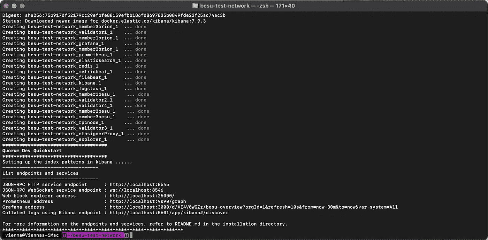
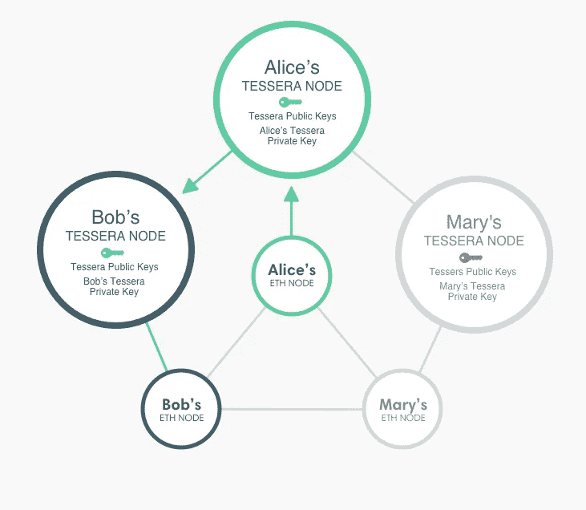

# 智能契约 Java 应用:Web3j 包装器和其他魔法

> 原文：<https://levelup.gitconnected.com/smart-contract-javafication-web3j-wrappers-and-other-sorceries-137ab3a2f4e9>

## 科特林教母入门魔法书


最近我在尝试使用 [Quorum](https://consensys.net/quorum/developers/) ，这是一套开源的工具、API、私钥管理器和客户端来运行一个私有以太网。我的主要目标是弄清楚如何在以太坊区块链之上构建应用程序，以及如何正确地与智能合约交互。我选择了一个使用 Besu 的 Quorum 版本，这是一个由 Hyperledger Foundation 维护的以太坊客户端，它实现了企业用例的私有事务。

作为第一步，我们需要准备贸易工具。当然，拥有一个运行中的区块链是开始工作的基础。在我看来，建立一个区块链本地以太坊是非常棘手的，但是我们很幸运，因为[咨询公司](https://consensys.net/)策划了一个法定人数[快速启动项目](https://consensys.net/quorum/products/guides/getting-started-with-consensys-quorum)，它拥有在几分钟内运行网络所需的一切。《Consensys 实践指南》在使网络部署变得简单明了方面做得很好，所以我不会在这里讨论细节。

[](https://github.com/ConsenSys/quorum-dev-quickstart) [## GitHub-ConsenSys/Quorum-dev-quick start:Quorum Developer quick start 实用程序可用于…

### Quorum Developer Quickstart 实用程序可用于为…快速生成本地 Quorum 区块链网络

github.com](https://github.com/ConsenSys/quorum-dev-quickstart) 

但是，如果一切都做得正确，最后您将在您的机器上举办一场 docker 图像的生动聚会:



图片来自 consensys.net

这里有很多东西需要打开。除了 [ELK](https://www.elastic.co/what-is/elk-stack) 堆栈、监控工具和块资源管理器，我们还可以找到:

*   4 个以太坊节点运行在 QFTP 上。这是拥有抗拜占庭故障网络所需的最小数量
*   3 个 Besu 客户端，保存各自成员的信息
*   3 Tessera 服务，这是管理私人事务及其数据所必需的
*   RPC 服务节点

## [0x 1]Java 签订智能合同

quorum-quickstart 项目的特色是一个名为`SimpleStorage.sol`的智能合约和一些有趣的脚本，这些脚本展示了 *web3js* ，一个在以太坊网络上与智能合约交互的库。然而，作为一个更像 Kotlin 的人，我更愿意尝试一下 ***web3j*** ，一个基于 Java 的库，并重写相同的脚本来弄清楚它们实际上做了什么。

显然，第一步是建立一个项目，然后导入所需的依赖项:

```
*// build.gradle (v6)
dependencies {
  implementation(*"org.web3j:core:4.8.7"*)
  implementation(*"org.web3j:besu:4.8.7"*)
}*
```

我们也不要忘记插件:

```
*// build.gradle (v6)
plugins {* id*(*"org.web3j"*) version* "4.8.7"
*}*
```

在意识到`web3j`插件*目前*不支持 *gradle 7* 之后，要做的第一步是将 *SimpleStorage* solidity 文件转换成一个漂亮的 Java 公主。让我们来看看:

即使对于我们当中那些不精通稳固巫术的人来说，契约逻辑也是简单明了的。`SimpleStorage.sol`只在区块链上存储一个无符号整数，公开一些方便的 get/set 方法与它交互。然而，在我们能够与这份合同合作之前，还有许多工作要做。幸运的是，web3j 插件可以为我们完成这项工作。我们需要做的就是把它放在一个合理的位置，如下所示

```
src
├── main
│   ├── kotlin
│   ├── solidity
│   │   └── **SimpleStorage.sol**
│   └── resources
└── test
```

然后跑`gradle generateContractWrappers`。web3j 插件将在项目的`build`目录中构建一个名为 `SimpleStorage.java`的 Java 包装器，这样我们就可以用 Kotlin 代码轻松处理合同。

## [0x2]设置成员凭据

正如我们在上面看到的，Quorum Quickstart 创建了三个 Besu 成员资格:为了简单起见，我们将分别称它们为 ALICE、BOB 和 CHARLIE。列出的私钥由 Quorum quickstart 示例生成，并存储在`smart_contracts/keys.js`文件中

主要内容包括:

*   **成员节点 URL:**这些是到达 Besu 客户端并提交请求的端点
*   **私钥:**会员提交交易的凭证，从中我们也可以导出他们的公钥和地址。出于演示的目的，这里都是硬编码的，对于真实的用例，最好依靠适当的密钥管理系统
*   **Tessera 公共密钥:**对 Tessera 的飞地 id 的引用，管理私人交易数据需要这些 id

既然我们已经查看了文件内容，那么我们可以将它们翻译成更适合 JVM 的语言，比如 Kotlin:

包含节点 URL、客户端和私钥的 Credentials.kt 文件

一切终于准备好执行一些区块链的诡计。

## [0x3]运行公共事务

一个基本的起点是部署我们的`SimpleStorage`智能契约，并向它提交一个事务。但是我们怎么能呢？老实说，Javascript 示例看起来有点复杂:

那里发生了很多事情，刚开始有点头晕是正常的。简而言之，该示例通过提交智能合约的十六进制编码从头构建了一个`RawTransaction`，使用`Alice`的私钥在本地对交易进行签名，然后提交交易。最后，契约地址不是立即可用的，我们仍然必须等待事务被确认，以便稍后调用契约方法。总之就是拖。

然而，不一定非要这样。

```
val simpleStorage = SimpleStorage.deploy(
  clientAlice, ALICE, GAS_PRICE, GAS_LIMIT, BigInteger.ONE
).send()
```

…魔法！我们刚刚在以太坊上部署了一个智能合约，只有一行小把戏，这都要归功于 web3j 包装器和细节。我们可以习惯性地调用 Kotlin 中的`get`和`set`方法，因为`simpleStorage`是一个常规对象。Alice 凭证嵌入在智能契约实例中，因此我们可以提交任何事务，web3j 将负责编码、签名、发送到 Besu 以及所有这些事情。不言而喻，鲍勃和查理应该有机会获得相同的公共合同，这才是公平的

```
val contractForBob = SimpleStorage.load(
  DEPLOYED_CONTRACT_ADDRESS, clientBob, BOB, GAS_PRICE, GAS_LIMIT
)
```

仅仅通过访问前面提到的一组 API，就可以编写一个非常基本的 dApp。Alice 和 Bob 可以通过访问他们独立的分类帐实例，在智能合同的同一个实例上进行交互，这可能是在世界的另一端:

## [0x4]运行私有事务🥷

既然我们都觉得自己有点像上帝，我们甚至可以考虑涉足私人交易。请注意:当提到私有事务时，我指的是数据有效负载对一个封闭的参与者组可用的事务。Besu 中的这个特性与目标网络是正交的:可以在以太坊主网或一个许可的网络中运行私有事务。

隐私层的使能技术称为 Tessera:它是私有交易数据的分散存储，其中每个参与者都由 Enclave 密钥标识，并且可以访问保留的 Tessera 节点。多个飞地的集合被称为隐私组，隐私组是保存在私人事务期间收集的私人状态的实体。当然，任何愿意处理私有数据的节点都必须有自己的 Tessera 节点。Quorum quickstart 示例将设置现成的 Enclaves:只需记住[通过配置环境变量](https://besu.hyperledger.org/en/stable/HowTo/Use-Privacy/Use-FlexiblePrivacy/#enabling-flexible-privacy-groups)启用隐私组。



[https://besu . hyperledger . org/en/stable/Concepts/Privacy/Privacy-Overview/](https://besu.hyperledger.org/en/stable/Concepts/Privacy/Privacy-Overview/)

运行私有事务比提交公共事务要复杂一些，但是 web3j 仍然很好地惯坏了我们。主要的警告是，我们现在需要一个`private transaction processor`来检查私人交易是否被挖掘，还需要一个`private transaction manager`来代替普通凭证。但是让我们按顺序来。

我们将为爱丽丝和查理创建一个隐私组，并等待它在网上得到确认

部署智能合约并与之交互几乎与公共事务一样简单。我们所需要的是隐私组 ID 和一个特殊的 T2，它可以很容易地从已有的信息中建立起来

最后，我们需要做的就是私下部署一个智能合同

```
val privateSimpleStorage = SimpleStorage.deploy(
  clientAlice, tm, GAS_PRICE, GAS_LIMIT, BigInteger.ONE
).send()
```

我们的私有智能契约包装器现在将公开 Solidity 实现的`set`和`get`方法，但是不出所料，数据将只在隐私组内可用。

## [0xFFF]结论

当讨论 web3 应用程序时，基于 JVM 的语言并不是第一个想到的，但是老实说，它们是相当普遍的，并且已经有了一个很好的生态系统。只由我们来决定建造什么。

如果你度过了一段美好的时光，并想阅读更多关于迪士尼比较的有问题的文章，请在 Medium 上关注我，让我知道你的观点。

好了，我们现在就走吧:我们的 Kotlinderellas 在等着我们呢！

[加入我的时事通讯，了解更多类似的故事](https://blog.lorisocchipinti.com)

## 参考

*   Web3j 网站:[https://docs.web3j.io/4.8.7/](https://docs.web3j.io/4.8.7/)
*   Besu 文件和 API:[https://besu.hyperledger.org/en/stable/](https://besu.hyperledger.org/en/stable/)
*   quorum quick start:[https://consensys . net/quorum/products/guides/getting-started-with-consensys-quorum/](https://consensys.net/quorum/products/guides/getting-started-with-consensys-quorum/)