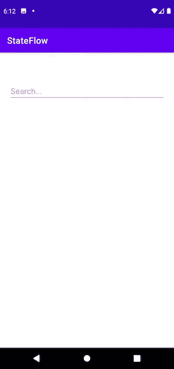

# 在 Android 上使用流的智能文本监听器

> 原文：<https://levelup.gitconnected.com/smart-text-listeners-using-flows-on-android-a37dd5444216>

当您希望在编辑输入文本时触发一个网络请求时，您将最终为每个添加或删除的字母发出大量请求。(例如谷歌搜索)

要解决这个问题，您需要等待一段时间，直到用户输入完整个单词，从而减少请求的数量。例如，当用户输入“Et”…“Eter”…..“永恒”…..《永恒》。当用户键入整个单词“永恒”时，您智能地只想触发一个请求。

# 设置视图模型

设置一个模拟函数，当一个查询文本被传递给它时，它需要 1 秒钟返回一个结果。把这个函数想象成一个网络请求。

现在设置一个 **_searchQuery** 和一个 setter 函数 **setSearchQuery() t** 来设置它的值。

将一个*de bouse()*操作符附加到 **_searchQuery** 流。*de bouse(1000)*操作符将从原始的 **_searchFlow** 中过滤出值，并且仅发出在发出后有 1 秒延迟的值。

现在在 map latest 中返回 *longNetworkOperation()* 的结果。

# 设置活动/视图

向 EditText 添加一个文本更改侦听器，并在文本更改时调用 viewModel 中的 setSearchquery()。

您还可以从我们之前在 viewModel 中定义的 *longNetworkOperation()* 中收集流并打印结果。

您可以在 Github 上找到整个项目以及更多使用流的用例。另一篇关于使用[的类似文章在这里使用流表单验证](/using-flows-for-form-validation-in-android-79016b00c079)。

 [## shivamdhuria/Stateflow

### 一个完全用 Kotlin 编写的 Android 应用程序，探索了流和协程在真实应用程序中的各种用法…

github.com](https://github.com/Shivamdhuria/stateFlows)