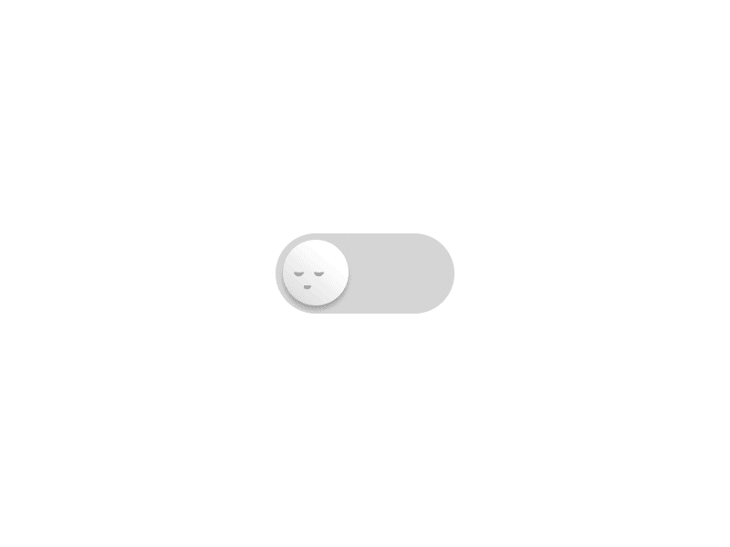
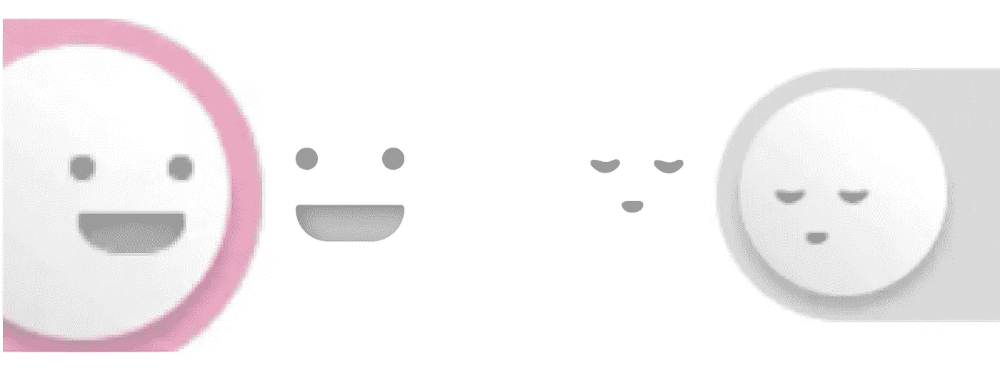
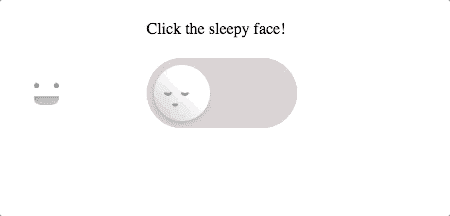

# 使用 HTML 和 CSS 构建一个切换控件笑脸——WotW

> 原文：<https://levelup.gitconnected.com/smiley-toggle-wotw-a3bf7cc1b5c3>

这是本周**小部件系列的第一篇文章。**

> 查看本周所有的 [Widget 文章](https://levelup.gitconnected.com/wotw/home)并关注 Gitconnected，确保你不会错过任何即将到来的 Widget 教程

将一个 **gif** 转换成一个**全功能 HTML** **控件**并不像听起来那么简单，所以我也会写下这个过程，并解释解决棘手部分的原因。

事不宜迟，本周小部件就是这个**切换控件**:



## 准备元素

首先，我们需要识别部件的各个部分。看起来我们需要一个容器来放置控件、背景、球和球里面的面。

几乎所有的事情都可以用 HTML + CSS 完成。面部可以用一些 CSS 魔法来完成，但我认为启动一个应用程序并为它们创建 SVG 节点会更容易。我只是拍了一个截图，然后重画了一下:



SVG 在中间，截图在边缘

我们现在有一切可以开始编码。

## HTML 结构

基本结构看起来是这样的:

开始 HTML

然后我开始给它们添加一些样式，我为背景和球面使用了边界半径，渐变和阴影帮助给球体增加体积。我还必须设置`-webkit-tap-highlight-color`来移除当你点击移动时出现的高亮显示。然后，经过一些试验错误，我定位的面孔 SVG。

开始 CSS 样式

## 互动逻辑

为了让控件工作，我们需要一些 JS 代码，所以我导入了 [Vue.js](https://vuejs.org/v2/guide/) 来快速集成功能。

这样的事情足以开始:

正在启动 Vue.js 逻辑

现在，我们只需要将 toggle 方法绑定到 HTML 中的 toggle 控件，如下所示:

```
<div id="widget" class="center"> 
  <div @click="toggle" class="toggle-container">]
    // ... rest of html
```

目前不会有任何视觉上的变化，但是如果我们检查组件，它已经在工作了，每次点击都切换`active`属性。所以接下来要做的是根据属性改变外观。

## 将 CSS 类绑定到 Vue 属性

首先，我需要创建当开关是`active`时应用的 CSS 规则，所以我创建了如下类

```
// CSS
.ball-face.active {
  left: 87px;
}
```

这将在没有动画的情况下立即移动到正确的球面，因此我们需要在我们的`.ball-face`类中进行转换:

```
// CSS
.ball-face {
  ... other rules
  transition: left .4s ease-in-out;
}
```

这将在 0.4 秒内用类型`in-out`的加速度(ease)的变化来激活属性`left`。如果你想知道更多关于 CSS 中的过渡和什么是缓和，你可以查看[这一页](https://www.w3schools.com/css/css3_transitions.asp)。

之后，当 Vue 属性为真时，我们需要以某种方式将`active`类添加到 HTML 中。我们需要像这样绑定类:

```
// HTML
<div :class="{'active': active}" class="ball-face">
```

注意`:class`中的冒号，它有助于绑定 Vue 属性来显示或隐藏‘active’类。该类将追加到已经定义的类“ball-face”中。

我试图对其余的属性做同样的事情。我遇到的唯一问题是，当试图为容器设置动画背景颜色时，看起来 CSS 过渡还不支持这个属性。我不得不使用两种背景来解决这个问题，一种是灰色的，另一种是彩色的。我只需要制作不透明度的动画，而不是过渡颜色。

对于脸部，我也设置了左边属性的动画，然后在球里放了`overflow: hidden;`来掩盖内容。这是它不带遮罩时的样子:



没有“溢出:隐藏”属性

## 易接近

我们的组件具有复选框的功能，所以根据 [MDN webdocs](https://developer.mozilla.org/en-US/docs/Web/Accessibility/ARIA/ARIA_Techniques/Using_the_checkbox_role) 如果我们想让它可访问，我们需要添加几个属性。它还提到“空格”按钮应该切换控件，我认为“回车”键也应该切换它，所以我最后使用了这些绑定:

```
//HTML
<label for="toggleControl">Click the sleepy face!</label>
<div @click="toggle"
   @keyup.space="toggle"
   @keyup.enter="toggle"
   :aria-checked="isChecked" 
   class="toggle-container" 
   role="checkbox" 
   tabindex="0" id="toggleControl">
     ... rest of html
```

而现在最后的结果！

这就是本周的第一个**小部件。**如果你想在下周申请一个特定的小工具，请在评论区发布。

下周见，关注 [gitconnected](https://levelup.gitconnected.com) 获取每周小工具！

*最初发表于*[*Eder díaz*](http://ederdiaz.com/blog/2018/04/04/smiley-toggle-wotw/)*。*