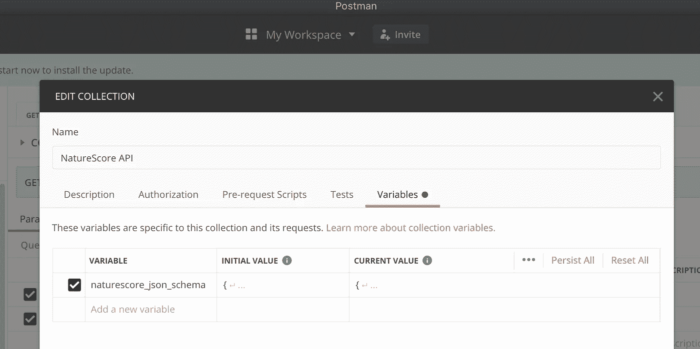
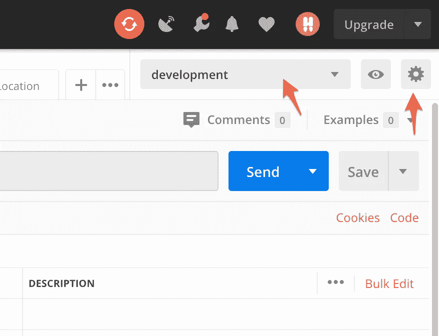
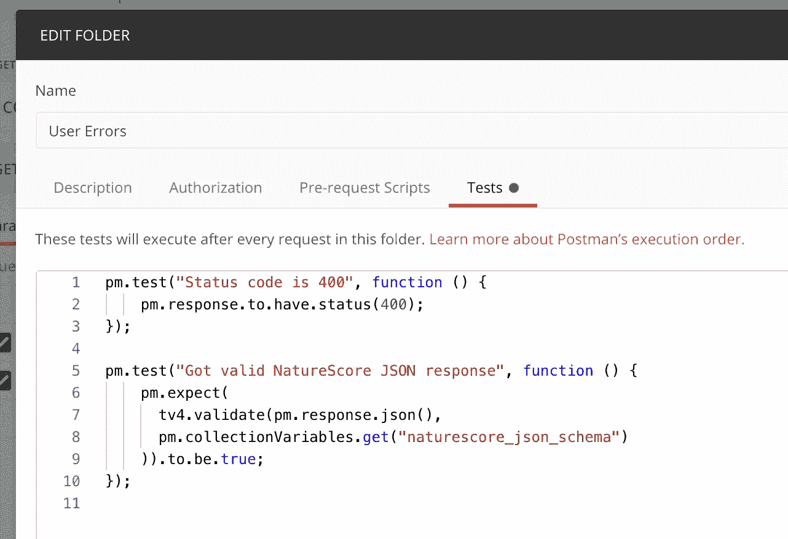
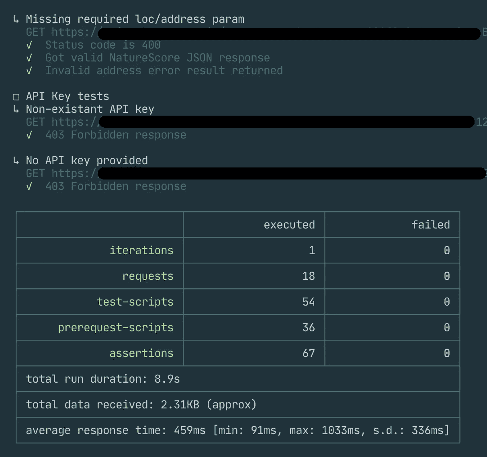

# 用 Postman 对无服务器 API 进行冒烟测试

> 原文：<https://levelup.gitconnected.com/smoke-testing-serverless-apis-with-postman-15a13c58262b>

我是无服务器的超级粉丝，但是测试仍然是其中一个比较难的领域。虽然您可以模拟对函数的 API 调用，但测试 API 端点并不像我在更传统的堆栈中经历的那样容易。这让我在 [Postman](https://www.postman.com/) 中创建了一个测试套件，测试我部署的 API。具体来说，我更多地是将此作为冒烟测试，并最终证明所部署的 API 在真实世界用例中的预期效果。我的代码库中仍然有单元和集成测试，但是这些邮差测试已经被证明是一个额外的信心层。此外还有 [LocalStack](https://github.com/localstack/localstack) 旨在本地模拟 AWS 环境，但我想要的是真正的测试…

*这样做的最终原因是，它给刚刚部署的系统带来了真正的* ***信心*** *，因为这是对系统的 100%真实测试——没有模拟，没有本地堆栈，所有都是真实的 AWS 服务。*

在这篇文章中，我将描述我如何设置这些测试，以及它们在部署后如何被触发。我使用的是[无服务器框架](https://www.serverless.com/)，但是通过他们的命令行工具 [Newman](https://learning.postman.com/docs/running-collections/using-newman-cli/command-line-integration-with-newman/) 运行 Postman 测试，因此你应该能够触发这些任何 CI 系统。

# 邮递员

Postman 是一个非常棒的进行 HTTP 调用的 GUI 工具。这些年来，我的使用增加了很多，我发现我利用它的次数比我预期的要多得多。能够创建用于测试的调用“集合”,并使用它们的“环境”来针对不同的部署执行那些测试是很好的(例如，开发对阶段对生产，等等)。).下面是我如何为最近的一个项目设置烟雾测试套件。注意，我假设你对 Postman 不太熟悉，或者安装后你会很容易理解，所以我将避免真正的逐步说明…

在 Postman 中，有四个主要部分需要设置:

1.  创建一个集合来组织您的测试/请求，并保存测试中引用的通用全局值。
2.  创建允许在不同环境中运行测试的环境(开发/测试/生产)
3.  在您的集合中创建文件夹，以组织文件夹中的请求所使用的公共变量和测试。我用它来按照一般的类别或主题来区分测试，比如成功与失败，或者需要 auth 的测试与不需要 auth 的测试。
4.  编写您的测试。

首先，我强烈推荐查看一下[邮递员的测试文件](https://learning.postman.com/docs/writing-scripts/test-scripts/)。你可以做很多事情，阅读这篇文章是很好的背景。此外，[无服务器大师有一个关于邮递员纽曼的文档](https://github.com/serverless-guru/docs/tree/master/postman-newman-cli)，它也从 AWS CodeBuild 等开始使用它们。

## 收藏品

首先，创建一个集合。然后，单击旁边的“…”菜单，并选择编辑。在这里，您会找到变量选项卡。在我的收藏中，我所有的东西都是我的 API 的 JSON 模式定义，因为所有的测试都会验证这一点。

邮递员集合变量选项卡

然后，您可以在请求中使用这些变量，如下所示:

> pm . collection variables . get(" my _ JSON _ schema ")

## 环境

我为我想要测试的每个部署设置了一个环境。这也可以包括本地主机。在每个环境中，我为基本 URL/主机/域和 API 键之类的值设置变量——即特定于该环境的东西。然后，您可以通过在请求中放入`{{my_variable}}`来在请求中使用它们，例如，对于基本 URL，您可以将请求 URL 设置为:

> [https://{ { my _ API _ host } }/some/path](https://{{my_api_host}}/some/path)

同样的语法也适用于 Headers 部分，所以如果您有一个正在使用的 API 键或类似的键，您可以简单地将`{{api_key}}`作为头的值(假设您已经在您的环境中定义了一个`api_key`变量)。

## 文件夹

在集合中，我创建文件夹来组织具有共性的测试。这允许将测试添加到*文件夹*中，这允许您只定义一次测试，但是让它用于文件夹中的所有请求。在我目前的小 API 中，我有三个文件夹:成功案例、用户错误(畸形请求，等等。)，以及 api 关键测试。例如，成功案例在该文件夹上定义了测试，以确保 HTTP 成功响应、有效(符合 JSON 模式，并包含成功数据)响应、响应时间检查，以及一些更详细的测试，如验证 JSON 中的值在范围内。您可以通过点击文件夹的`…`菜单并选择编辑，然后在测试选项卡中定义测试来定义这些测试。

邮递员文件夹测试

## 试验

最后，我们有所有单独的“测试”——或者更确切地说，一组不同的请求(在每个文件夹中)，我们有特定的测试。这些是常规的 Postman 请求，但是您可以在该请求的 tests 选项卡上添加测试(您现在可以看到您可以定义测试的所有不同级别)。这些测试是您确定特定请求已经正确执行所需的任何东西。这不应该是通用的 JSON 格式，因为这是在一个更高的层次上完成的，您要为所有请求验证您的 JSON 模式。但是，这可以验证特定请求的确切响应，或者如果适用的话，验证不太严格的内容，例如测试响应值是否在某个范围内，或者不为空，等等。

# 运行测试

为了运行测试，您将使用 Newman CLI。首先，您需要导出您的测试和环境。

## 导出环境

您将为您拥有的每个环境导出一个 JSON 文件。单击环境下拉列表旁边的齿轮图标，调出环境。然后单击下载图标，这将提示您保存环境文件。对每个环境都这样做。

## 导出测试

接下来，导出测试本身。这将是一个单独的文件，因为所有特定于环境的值都在环境文件中。在 Postman 的“精选”面板中，点按精选旁边的三个点，然后选取“导出”。保存集合(生成另一个 JSON 文件)。

## 安装 Newman 并执行测试

最后，要执行测试，请确保您已经安装了 Newman。你可以通过 NPM 或家酿啤酒做到这一点。详见[纽曼 GitHub 页面](https://github.com/postmanlabs/newman)。然后使用命令行，如:

> node_modules/。bin/Newman run-e postman _ dev _ env . JSON postman _ API _ tests . JSON

**-e** 标志指向要使用的环境文件，然后是最后一个。json 文件是你的测试文件。

还有其他方式来运行它，这也取决于你如何安装它-我的安装是通过 NPM 本地以上，你可以猜到。您也可以从代码中运行它。

# 无服务器框架部署集成

最后，在我的设置中，我为这些添加了 NPM 脚本条目，每个环境一个。然后我使用[无服务器插件脚本](https://www.serverless.com/plugins/serverless-plugin-scripts)插件，将脚本添加到我的无服务器配置中，这样我就可以在我的无服务器部署中集成运行这些脚本。

在我的例子中，您会看到我还增加了一个对 API 的初始调用来预热，在开发环境中，我们将 Aurora 无服务器数据库配置为在不活动时进入睡眠状态(生产环境则不是这样)。因此，serverless.yml 文件中的这些脚本如下所示:

但是您还会注意到在`hooks`部分，在部署完成步骤中，我们会自动触发这些测试。进行常规的无服务器部署，然后作为最后一步运行测试，这决定了部署实际上是成功还是失败(仅仅根据`serverless deploy`命令)。然后，您可以回滚您的部署，或者在您的情况下任何有意义的事情。

Postman/Newman 有很好的输出，它显示了每个请求的测试，按文件夹组织，然后是所有结果的最终总结。以下内容被截断，但您可以看到一个测试(“缺少所需的 loc/address 参数”)，然后您会看到最后两个测试来自“API Key tests”文件夹:

邮递员纽曼输出

就是这样！我希望这是有用的，或者它创造了你自己的测试思想。