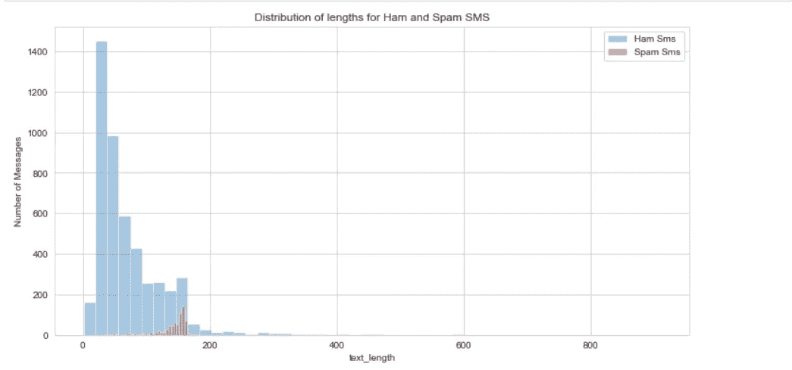
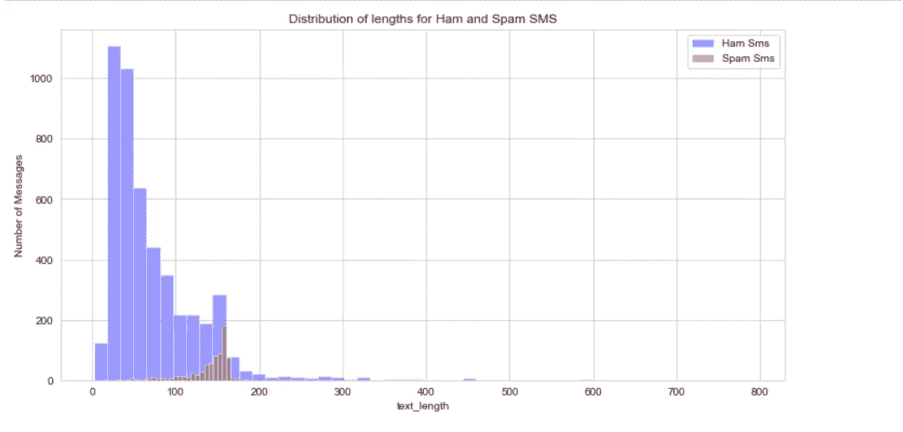
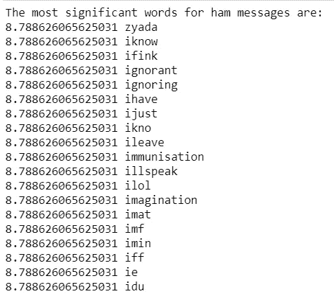
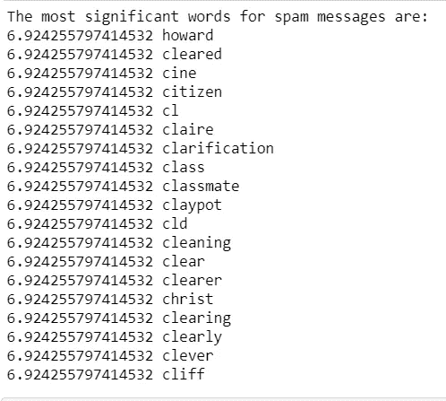

# 垃圾短信检测

> 原文：<https://levelup.gitconnected.com/sms-spam-detection-dbb494c3a5ac>

# 肯定

几乎每天都有数千甚至数百万条信息和电子邮件被发送出去。其中有多少是垃圾邮件？有没有办法在第一眼就把它们分类？我们在垃圾短信中最常看到的词是什么？我们可以建立一个分类器来很好地分类一个消息是不是垃圾邮件吗？

# 介绍

我们处理了[垃圾短信收集](http://www.dt.fee.unicamp.br/~tiago/smsspamcollection/)数据集。它由 5574 条消息组成，其中只有 747 条是垃圾消息。这意味着这个数据集是不平衡的，我们的最终模型可能有一些偏差。

# 探索性数据分析

数据集只有两列，“标签”和“文本”。通过创建名为“text_length”的新列，我们可以使用它来可视化两个类别的分布:“ham”和“spam”。

> “ham”子集的最大长度为 910 个字符。下面我们引用了有和没有这个值的两个分布图。

有了极值

如果没有极值

分布和统计分析的见解:

*   垃圾消息的分布具有较小的标准偏差，并且其平均值远高于垃圾消息的平均值，
*   几乎 50%的垃圾消息具有从 133 到 157 的长度，另一方面，75%的垃圾消息具有小于或等于 93 的长度

这些见解可以帮助我们回答第一个问题。我们可以说，有一种隐藏模式可以根据消息的长度将其分类为垃圾邮件或垃圾邮件。我们不能 100%肯定，但有很大的机会将其归类为垃圾邮件，是正确的。

# 自然语言过程

使用 NLP，我们要做的第一件事就是查看每个消息类别中最常见和最重要的单词。下面我们提到了我们用于 NLP 的工具。

我们还创建了一个新的助手函数来标记每个文本。使用正则表达式，我们清除每个消息中最不重要的信息。

## 词汇袋模型

机器学习模型需要以结构化的形式摄取数据，即矩阵，其中行代表观察值，列是特征/属性。当处理文本数据时，我们需要一种方法来将这种非结构化数据转换为机器学习模型可以处理的形式。将文本数据转换成矩阵的一种技术是计算每个单词在每个文档中出现的次数。这种技术被称为**词汇袋模型**。这个模型之所以得名，是因为每个文档都被看作是一个包含所有单词的袋子，不考虑词序、上下文和语法。在将单词袋模型应用于语料库之后，得到的矩阵将展示机器学习模型可以利用的模式。

## 计数向量转换器

单词袋模型可以在 scikit-learn 中用*计数矢量器*转换器找到。注意，scikit-learn 使用单词**矢量器**来指代将数据结构(如字典)转换为 NumPy 数组的转换器。既然是 transformer，我们需要先拟合对象，然后调用 transform。

## 词干化和词汇化

**词干化**是将一个单词缩减为其词干的过程。注意，词干化过程并不是 100%有效的，有时产生的词干并不是一个真正的单词。例如，应用于“arguments”和“arguments”的流行波特词干算法返回`"argu"`。

**词条化**是将一个单词简化为其词条，或者该单词的字典形式的过程。这是一个比词干提取更复杂的过程，因为它考虑了上下文和词性。此外，得到的引理是一个实际的单词。

## 术语频率-逆文档频率

`CountVectorizer`创建原始计数的特征矩阵。使用原始计数有两个问题，文档的长度变化很大，对于常见的单词，如“the”和“is ”,计数会很大。我们需要使用考虑上述属性的加权方案。术语频率-逆文档频率，简称为 **tf-idf** 是一种流行的加权方案，用于改进单词袋模型中简单的基于计数的数据。它是两个值的乘积，术语频率和逆文档频率。有几个变种，但最流行的定义如下。

以下是每个类别中最重要的单词。

火腿信息最重要的词

垃圾邮件最重要的词

# 构建我们的分类器

对于这一部分，我们使用两种不同的模型，并比较它们的结果。第一个是`RandomForestClassifier`，第二个是`SGDClassifier`。

为了调整每个分类器的超参数，我们创建了管道来描述工程和`GridSearchCv`。我们的模型似乎在预测方面做得很好，只要两者的准确度都高于 0.97。

# 结论

即使我们的模型足够好，我们也必须记住，我们的数据集是不平衡的，这会影响我们的预测。改进我们模型的一个方法是找到更多的信息，并创建一个更平衡的数据集。

我们还可以在正则表达式中使用不同的模式来清除每条消息的文本。

你可以在 Github 中看到这个项目的完整代码。