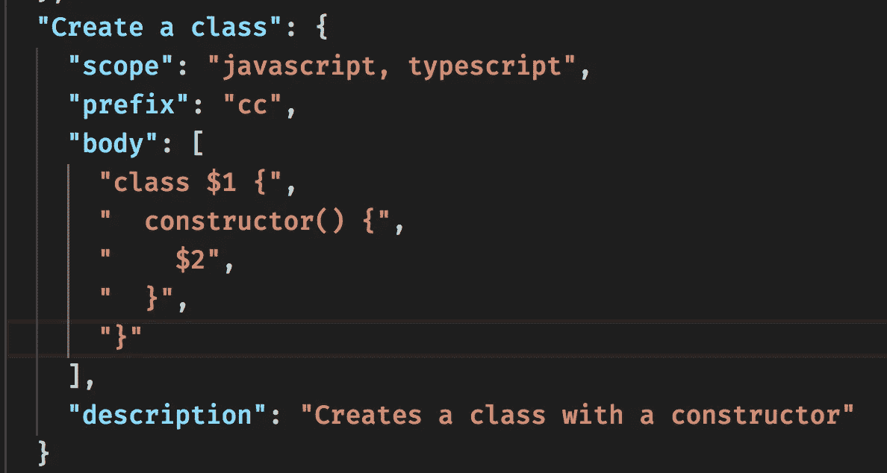
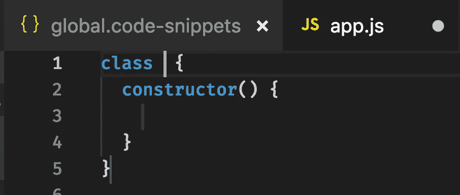
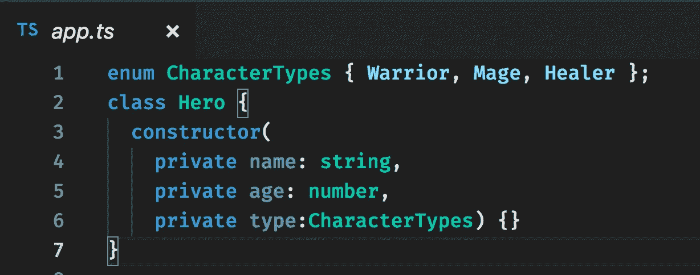

# 如何为 VS 代码创建代码片段

> 原文：<https://levelup.gitconnected.com/snippets-for-vs-code-6b36fc4ef11f>

这篇文章是面向 *JavaScript* 和 *TypeScript* 的，所以代码示例将用提到的语言编写。然而，这篇文章以一种通用的方式描述了代码片段的创建，所以即使您不选择 JavaScript 或 *TypeScript* ，您也有望理解代码片段的创建是如何工作的。

一般来说一下片段。代码片段是我们可以在代码项目中反复使用的代码片段。创建它们通常是为了加快我们的开发工作，这样我们就可以花时间解决有趣的问题，而不是键入*_ 老一套 _**_ 无聊的代码 _* 。

我们倾向于使用别人为我们创建的代码片段，或者我们自己创建适合我们编码风格的代码片段。

那么什么是一个很好的候选片段呢:

*   **类**，我们经常在解决方案中创建大量的类
*   **If** 我们往往会写相当多的 *if* 、 *if else* 、 *if else if、else* 语句
*   **Try-catch** ，这也是一个很常见的构造。如果有一个支持 *try，catch* 和 *finally* 的片段不是很好吗？
*   我们创建了大量的函数，所以某种带有合适数量参数的默认函数是有意义的
*   **登录到屏幕**，出于调试的目的，我们经常这样做
*   **你的选择**，你可能会经常做一些对你来说很独特的事情——比如读取文件、访问数据库等等。你到底需要什么样的片段，取决于你自己。

## VS 代码中的片段

您可以在 VS 代码中创建两种类型的代码片段:

*   **全局**，可选择所有语言
*   **特定语言**，只可能用于特定语言

## 创建我们的第一个片段

创建一个代码片段几乎是非常容易的，所以让我们就这么做，并在遇到概念时解释它们。

我们需要做的第一件事是选择我们将要创建的代码片段的类型。我们这里的选择是*全局* vs *语言特定*。让我们进入菜单，创建一个*全局*片段。从菜单*中选择以下代码/偏好/用户片段*


上图向您展示了几个有趣的东西:

*   **现有代码片段**，如果您之前已经创建了代码片段，您可以选择它们并将其加载到 VS 代码中
*   **新建全局片段文件…** ，选择此选项创建一个全局文件
*   **特定语言文件**，选择这些选项中的任何一个都将为该语言创建一个特定的代码片段文件。例如选择 *HTML，*会创建一个 *html.json* 文件

如前所述，让我们创建一个全局文件，因此选择 *New Global Snippets file* ，从顶部数第二个选项。让我们把它命名为*全局*，结果显示如下:


值得注意的是 *global* 将自己命名为 *global.code-snippets* 。这个文件已经放在了*/Users/<username>/Library/Application Support/Code/User/snippets*中，如果你想以后再看的话。我们也看到所有东西都被注释掉了。虽然从*开始有一些有趣的代码，例如:*所以让我们取消注释，仔细看看，看起来是这样的:


现在我们来看一个工作示例。值得注意的是一切都是以花括号开始的，原因是我们只是在编辑一个 JSON 文件。下一个关注点是*打印到控制台。这个只是代码片段的名字。*打印到控制台*在花括号内定义了一个对象，所以让我们分解它定义的每个属性:*

*   **范围**，这是该片段支持的语言，这里支持的语言是 *javascript* 和 *typescript* 。每种支持的语言用逗号分隔。这意味着如果我们在*里面。js* 或*。ts* 文件这个片段可能会被使用
*   **前缀**，这是您需要在代码窗口中键入的代码片段。在我们的例子中，我们需要键入*日志*
*   **正文**，这是你的片段。数据类型是一个数组，为了支持包含几行的代码片段，我们需要向数组中添加一个新条目。我们稍后将讨论这一点
*   **描述**，这是一个让我们更详细描述正在发生的事情的字段
*   *$1* ， *$2* ，这就是当你点击标签按钮时光标结束的地方

**尝试我们的片段**

我们说过*日志*是我们需要键入来激活代码片段的，我们需要在以*结尾的文件中。js* 或*。ts* 。所以让我们来试试:


我们可以在上面看到，当我们键入 *log* 时，会出现一个列表。列表中的第一项是我们的代码片段。您可以看到"*打印到控制台"*是我们编写的代码片段名称，而"*日志输出到控制台"*是我们的描述字段。此时，我们按下`return`键，并以此结束:


我们看到我们的代码片段被放在代码窗口中，我们还看到我们的光标是如何出现在 *log()* 方法中的。这是为什么呢？这有一个非常简单的解释，这就是我们说的光标应该结束的地方，我们决定在这里:


所以你可以看到我们把 *$1* 或 *$2* 放在哪里很重要，正确地放置它真的可以加快开发者的体验。

## 第二个片段—一个类

好了，我们了解了片段的内部结构。现在让我们从头开始创建我们自己的代码片段:



我们有第二个片段和一个多行片段。我们来分解一下。

我们通过将 JavaScript*和*类型脚本*定义为*范围*的值来支持它们。*

我们说通过输入`*cc*`来激活代码片段。

然后我们来到实际的代码片段——我们的 *body* 属性，它是多行的。我们可以看到它是多行的，因为我们在我们的 *body* 数组属性中添加了 x 个项目。主体的值就是我们从一个类定义中所能期望的，带有一个构造函数。我们通过`*$1*`和`*$2*`在这里加入了一些有趣的元素。这些被放置在*类*属性之后，构造函数内部。这是故意的，所以用户必须尽可能少地输入。作为开发人员，您通常要做的第一件事是命名类，其次是向构造函数添加一些初始化代码。如果这不是你做事的顺序，你可以随意将 *$1* 和 *$2* 移到对你有意义的地方。

尝试我们的片段


现在我们键入`*cc*`来激活我们的代码片段，我们将面对它的名称和描述。通过点击 *return* 键选择代码片段后，我们以下面的代码结束:



正如你在上面看到的，我们看到了光标第一次到达 *$1* 的地方，就在*类*之后。再次点击*选项卡*键，我们应该转到第二个选项卡步骤的点 *$2* 。让我们来看看它是什么样子的:


我们看到我们已经给了类一个名字 *Test* ，我们点击了 *tab* 并且我们结束了我们的光标在构造函数中。

## 特定于语言的代码片段

这次我们想要创建一个特定于语言的代码片段。所以我们进入菜单，选择代码/首选项/用户片段。一旦我们选择了*打字稿*，我们就会看到以下结果:


我们可以看到这次文件名有点不同。而不是叫 *<什么的>。代码片段*它叫做 *typescript.json* 。所以当文件以*结尾时。我们正在处理一个特定语言的文件。值得强调的是，特定于语言的代码片段只对该代码片段有效，所以如果我们在以*结尾的文件中。js* 输入我们的*前缀*值不会激活它。相反，我们需要在*里面。ts* 文件，以便我们的代码片段可供选择。*

好吧，让我们想一想，我们已经选择了 Typescript 作为特定的语言，所以这就是我们要支持的。这意味着我们将使用语言特定的构造，如类型和其他东西来创建代码片段。让我们重新创建我们的类片段，但对于 Typescript:


上面我们创建了一个代码片段，它利用了 Typescript 中的一些特定于语言的特性，比如在构造函数中使用的`*enum*`和`*private*`(它为我们创建了支持字段),最重要的是，我们创建了一个非常酷的主题，一个幻想的环境。因此，如果你有一些游戏创作的想法，这个片段已经准备好行动了:)

**尝试我们的片段**

好了，我们将*前缀*设置为 *tc* ，因此我们需要键入 *tc* 来激活我们的代码片段。最终结果如下所示:



上面我们可以看到我们的枚举结构`*CharacterTypes*`正在被创建，还有我们的类片段。现在，我们可以通过键入以下内容轻松地创建一个对象:

```
const hero = new Hero(‘hero’, 18, CharacterTypes.Healer);
```

就是这样。创建一个特定于语言的代码片段并没有什么不同。文件名结尾看起来不同，它是针对特定语言的。

## 摘要

我们已经看了 VS 代码中的片段。我们已经展示了我们的能力

*   将现有的片段加载到我们的编码环境中
*   **创建**特定于全球/语言的片段
*   解释组成片段的不同部分以及如何使用它

我希望掌握了这些新知识的你能够使用现有的代码片段，创建自己的代码片段，并提高你的工作效率。

**延伸阅读**

我们只是简单介绍了一个代码片段的可能用途，但是它应该足够让你入门了。有关片段的更多信息，请查看官方文档[片段创建](https://code.visualstudio.com/docs/editor/userdefinedsnippets?WT.mc_id=vscode-medium-chnoring#_creating-your-own-snippets)。

## 下一步是什么？

在下一篇文章中，我们将介绍如何将我们的代码片段打包成一个扩展并告诉全世界。为什么不让整个代码社区从您的创作中受益呢？:)敬请期待。

[](https://levelup.gitconnected.com/)[](https://gitconnected.com/learn/javascript) [## 学习 JavaScript -最佳 JavaScript 教程(2019) | gitconnected

### 排名前 64 的 JavaScript 教程。课程由开发者提交并投票，使您能够找到最好的…

gitconnected.com](https://gitconnected.com/learn/javascript)