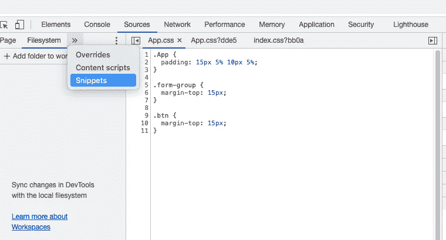
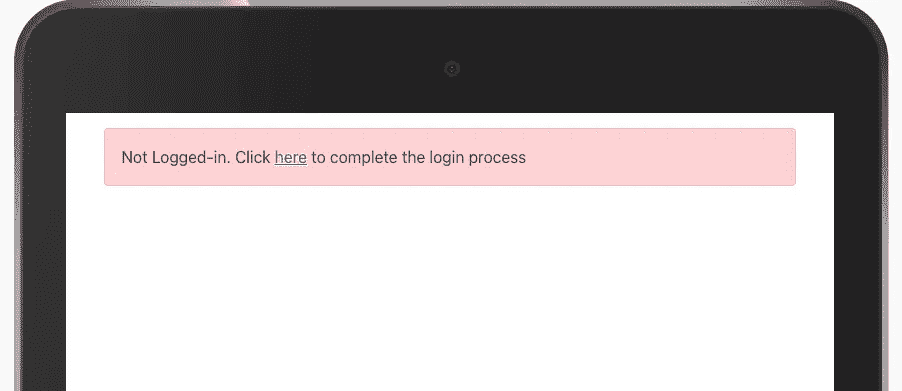
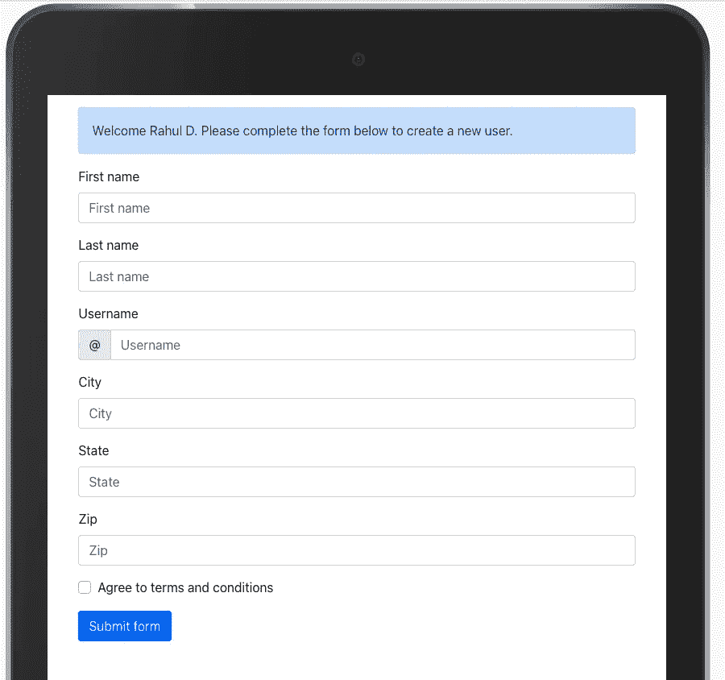
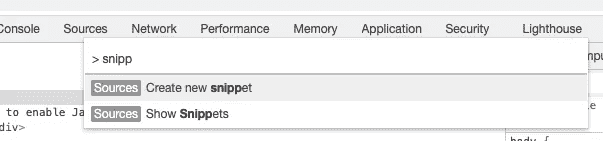
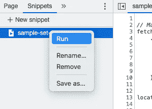
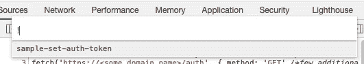

# 谷歌浏览器中的片段

> 原文：<https://levelup.gitconnected.com/snippets-in-google-chrome-62636236b766>

## 使用 Google Chrome 的片段来节省时间和组织脚本。通读以了解该特性在调试 web 应用程序时是如何有用的。

## 使用谷歌 Chrome 像专业人士一样调试


在调试 web 应用程序时，我们经常在 Google Chrome 控制台中运行脚本。这是一个非常有用的工具，不仅提供对变量的访问，还允许更新页面，在会话存储/本地存储中设置值等。

我经常遇到这样的情况，我在应用中调试第 7 或第 8 屏，没有设置上下文就无法直接启动。因此，使用 Chrome 开发工具运行一些语句并设置所需的上下文。但是，很容易丢失这个脚本。每次遇到这种情况，我最终都要输入代码。

在谷歌浏览器中维护这些脚本有一个更简单的方法——那就是*片段*。注意，Chrome Dev Tools 中源代码下的 snippets 选项卡。见下图-1。



图 1:启动片段

# 用例

在详细描述代码片段之前，让我先来阐述一个样例用例。我创建了一个具有表单和登录功能的小应用程序。示例应用程序及其特性没有任何意义。它的目的只是帮助理解代码片段的用法。

我以登录为例，它在会话存储中设置了一个*身份验证令牌*。直到会话存储中的 auth 令牌可用(这是上下文应用程序需要的)，其余的功能才起作用。



图 2:没有登录会话的示例应用程序

为了避免每次都经历登录过程，请运行以下脚本，该脚本检索身份验证令牌、用户名，并将其设置在会话存储中。

我的示例非常简单，只有一个页面。然而，真正的应用程序会有很少的页面，因此每次登录和导航到第八页进行调试是很乏味的。

```
-------------------------- **Snippet-1** --------------------------// Make a call to retrive auth token, with all the needed parametersfetch('https://<some domain name>/auth', { method: 'GET' /*few additional needed parameters*/ }).then(httpResult => httpResult.json()
.then(resultJson => {// take all the fields required and set in session storagesessionStorage.setItem('authToken', resultJson.authToken);// My sample shows name too, obtained from the remote service.sessionStorage.setItem('userName', resultJson.firstName + ' ' + resultJson.lastName);return;}), err => console.log(err)) // not much to error handling, feel free to play with it.// remember, fetch doesn't reject the promise unless it's network error (off-topic).location.reload() // do it if your sample needs it. Sometimes, it might redirect you back to home screen, defeating the purpose.
```

运行这个脚本将在上面的示例应用程序中设置身份验证令牌和用户名上下文。参见图 3 中的结果。



图 3:设置授权令牌和用户名上下文后的示例应用程序

# 在片段中维护脚本

我们可以在片段中维护这些脚本。这节省了我们每次调试时输入代码行的时间。

## 创建新的代码片段

要创建新的代码段，请导航到代码段，

启动 Chrome 开发工具→导航到源代码→在页面旁边的菜单下，选择 Snippets。参见上面的图 1。

或者，启动 Chrome 开发工具→使用 Ctrl + P (Windows)或 Cmd+ P (Mac) →使用文本字段中的符号>。它列出了我们可以在开发工具中执行的所有操作。找到并选择*创建新片段。*见下图-4。

键入脚本并保存。



图 4:创建一个新的代码片段。

> 启动 Chrome 开发工具的快捷键是 Ctrl+Shift+I(Windows)/Cmd+Option+I(Mac)

## 运行代码片段

要运行代码片段，导航到源代码→在页面旁边的菜单下，选择代码片段→右键单击代码片段并选择*运行。*见下图-5A。



图 5A:运行一个片段

或者，使用 Ctrl + P (Windows)或 Cmd+ P (Mac) →键入感叹号(！)，其中列出了所有保存的代码片段。请参见下面的图 5B。



图 5B:运行代码片段的替代方法

# 导出片段

我们可以导出并分发片段(在团队中)。这将帮助团队中的其他人利用这些有用的脚本。但是，没有导出和保存代码片段的简单方法。以下是一个快速破解。

要导出代码片段，请启动开发工具的开发工具。也就是说，在单独的窗口中启动 Chrome Dev 工具(不要与网页对接)。选择开发工具窗口，再次使用 Ctrl+Shift+I(Windows)/Cmd+Option+I(Mac)。它启动第二个开发工具窗口。

在第二个开发工具窗口中，运行以下代码行来导出代码片段

```
InspectorFrontendHost.getPreferences(p => console.log(JSON.stringify(p.scriptSnippets)))
```

它在控制台上打印片段。复制结果并与他人分享。他们可以运行下面一行代码。同样，他们需要为开发工具启动开发工具。

```
InspectorFrontendHost.setPreference("scriptSnippets", "Exported Snippet goes here")
```

重新启动浏览器以查找安装的代码片段。

> 在我们结束之前，在这里多了解一下我和我的观点，[CodeVenkey](https://codevenkey.com)/[Twitter](https://twitter.com/keertikotaru)

# 参考和链接

1.  Google Chrome 文档-[https://developer . Chrome . com/docs/devtools/JavaScript/Snippets/](https://developer.chrome.com/docs/devtools/javascript/snippets/)
2.  由他人创建的六个有用片段—[https://www . telerik . com/blogs/6-Snippets-to-keep-in-your-chrome-dev tools](https://www.telerik.com/blogs/6-snippets-to-keep-in-your-chrome-devtools)