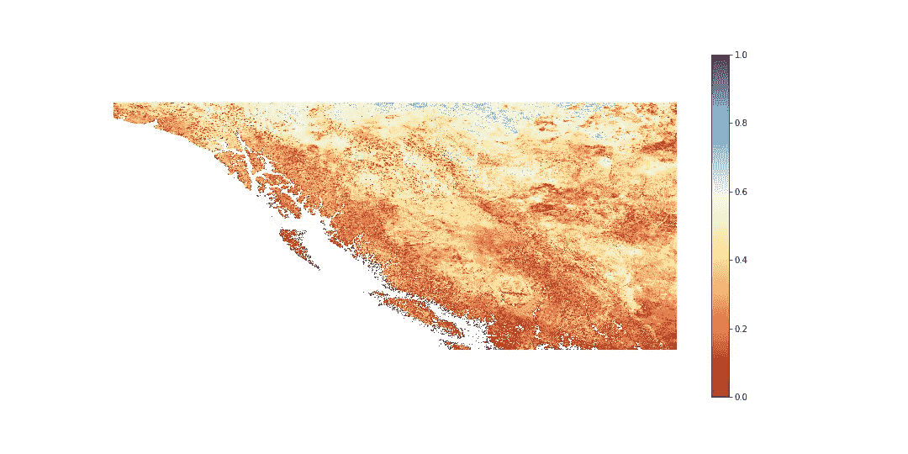

# 利用 MODIS 进行积雪制图

> 原文：<https://levelup.gitconnected.com/snow-mapping-with-modis-251e78ecdf41>

使用美国航天局的 MOD10A 产品绘制一段时间内的降雪图

## 雪地映射

有很多原因可以解释为什么雪地贴图是有益的。在春天，我们可以用它来减轻洪水风险——特别是对于容易发生洪水的地区。在冬季，它可以用来评估雪崩的风险，取决于一段时间内的降雪量和累积量。

## 下载 MODIS

[download.ipynb](https://github.com/BnJam/modis_snowmapping/blob/main/download.ipynb)

上面的脚本下载了不列颠哥伦比亚省 20 天的原始颗粒。我们将关注 2021 年 2 月 5 日至 25 日。该脚本包含一些从 [NSIDC 门户](https://nsidc.org/data/mod10a1)生成的下载脚本重新利用的功能。MODIS 积雪产品的空间分辨率为每像素 500 米 x 500m 米。这提供了积雪覆盖的高层次视图——要获得更多细节，我们可以使用 VIIRS (375m x 375x)(VPN10A1.001)或甚至具有更进一步阈值的 Sentinel-2 L2A。

## 计算 NDSI 随时间的变化

首先，我们必须导入我们需要的库。

```
import osimport xarray as xr
import rioxarray as rioxr
import rasterio
import rasterio.plotimport numpy as np
import matplotlib.pyplot as pltfrom rioxarray.merge import merge_arrays
from glob import glob
```

我们将考虑加拿大不列颠哥伦比亚省周围的包围盒。由于我们将把 MODIS 数据投影到 EPSG4326，所以这些点是纬度/经度(WSG84 格式)。

```
lower_left_lon = -141.899414
lower_left_lat = 47.783635
upper_right_lon = -112.104492
upper_right_lat = 60.866312
bbox = [lower_left_lon, lower_left_lat, upper_right_lon, upper_right_lat]
```

使用我们下载的数据，我们必须首先生成我们的地理标签，将它们剪切到我们的边界框中，并保存为各自的日期。我们将通过创建一个打开的子数据集列表来合并这些使用 rioxarray 下载的原始颗粒。一旦合并，我们重新投影到 EPSG4326 和剪辑到我们的边界框 AOI

```
try:
    os.makedirs('mosaic')
except:
    pass
dates = glob(os.path.join('modis','*'))
for date in dates:
    file_pths = glob(os.path.join(date,'*'))
    src_files = []
    for f_pth in file_pths:
        print(f_pth)
        with rioxr.open_rasterio(f_pth) as src:
            src_files.append(src.NDSI_Snow_Cover)
    ds = merge_arrays(src_files)
    ds = ds.rio.reproject('EPSG:4326')
    ds = ds.rio.clip_box(*bbox)
    out_pth = os.path.join('mosaic',f'{os.path.split(date)[-1]}.tif')
    ds.rio.to_raster(out_pth, recale_transform=True)
```

## NDSI

现在我们有了 AOI 的镶嵌图，我们用阈值迭代它们来考虑一个像素是否是雪。积雪产品记录了 0-100 之间的 NDSI 值，嵌入了超过 200 的额外信息，如无数据、云、缺失信息/犹豫不决等。由于我们只关心 NDSI 值，我们认为阈值大于 20 小于 100(包括 20 和 100)为雪。其他任何东西都将被视为不下雪。频带 4 和频带 6 的和与差之比的结果的 NDSI 值本身([链接](https://nsidc.org/support/faq/what-ndsi-snow-cover-and-how-does-it-compare-fsc)):

NDSI =((频带 4-频带 6) /(频带 4 +频带 6))

不过，这些产品已经应用了波段数学并交付了结果，这是底层方法。

对于每个镶嵌图，我们将无雪像素强制为零，将有雪像素强制为一——这表示那天在 500 米×500 米的区域有雪或没有雪。最后，我们将取所有日期的平均值，以确定在过去 20 天里，该像素被雪覆盖的频率。

```
mosaics = glob(os.path.join('mosaic','*'))
ds = xr.Dataset()
for mosaic in mosaics:
    ndsi = rioxr.open_rasterio(mosaic)
    ndsi.data[(ndsi.data > 100)] = 0
    ndsi.data[(ndsi.data < 20)] = 0
    ndsi.data[(ndsi.data != 0)] = 1
    ds[os.path.split(mosaic)[-1]] = ndsi
nds = ds.to_array(dim='mean').mean(dim='mean', skipna=True)
nds.rio.to_raster('mean.tif')
```

然后，我们可以用 matplotlib 可视化这个每日平均值，并分配一个彩色地图，使每个像素在过去 20 天内被雪覆盖的频率变得明显。

```
with rioxr.open_rasterio('mean.tif') as src:
    d = src.data
fig, ax = plt.subplots(1,1,figsize=(20,10))
ax.axis('off')
d[(d==0)] = np.nan
#ax.set_facecolor('k')
im = ax.imshow(d[0], cmap=plt.cm.RdYlBu, vmin=0, vmax=1, clim=[0,1])
fig.colorbar(im, ax=ax)
```



在过去的 20 天里，一个像素被雪覆盖的频率是多少

正如我们所见，毫不奇怪，最北部的纬度经常被雪覆盖，而海岸线则很少被雪覆盖。大陆左下方巨大的红色区域是温哥华，所以没有太多积雪也就不足为奇了。该省的其他地方，取决于地形，显示中等范围的积雪覆盖，特别是沿着山脉。

[Github 库](https://github.com/BnJam/modis_snowmapping)