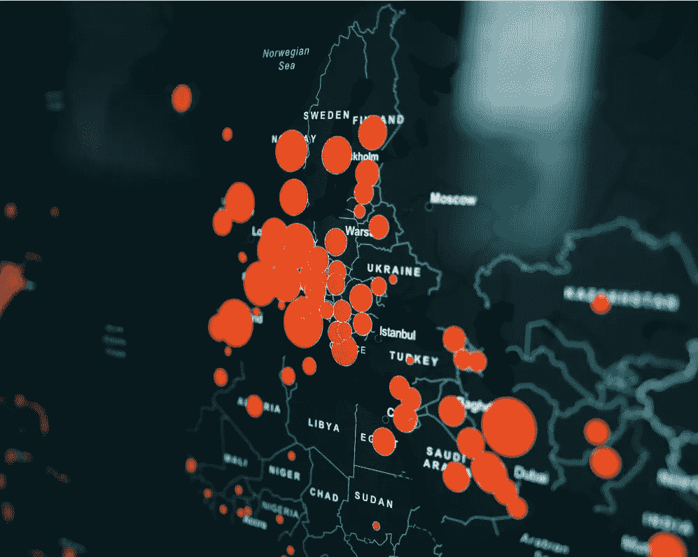
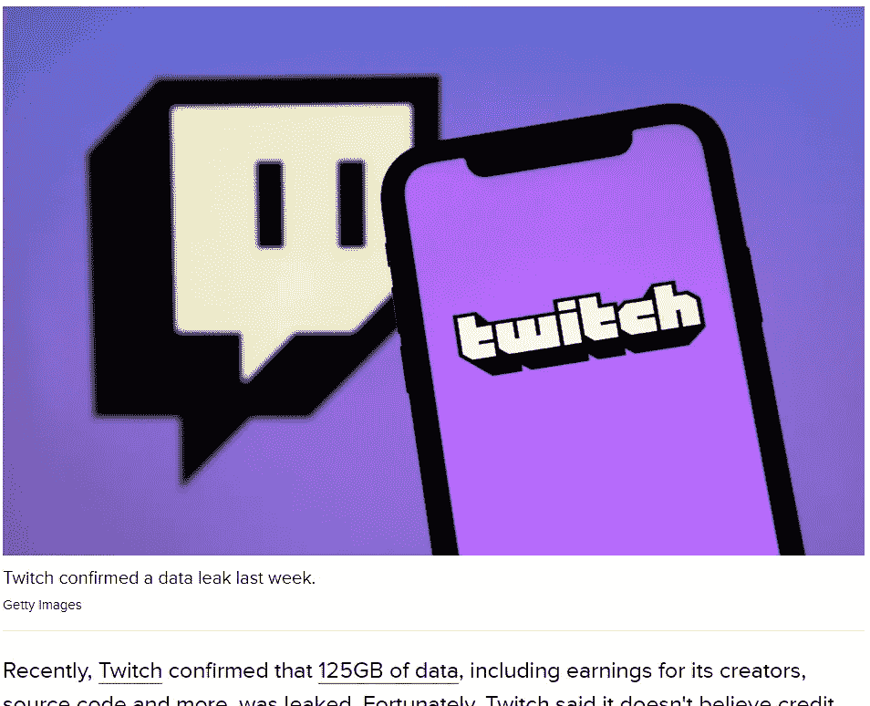

# 雪花—保护您的数据

> 原文：<https://levelup.gitconnected.com/snowflake-securing-your-data-2743b6db1118>

## 说到安全性，雪花是整个架构中最关键的数据存储。确保你做对了！



[粘土银行](https://unsplash.com/@claybanks?utm_source=medium&utm_medium=referral)在 [Unsplash](https://unsplash.com?utm_source=medium&utm_medium=referral) 拍摄的照片

数据泄露似乎越来越频繁，正如我在最近的文章( [*)中提到的，贵公司的数据有多安全？Part1*](/how-safe-is-your-companys-data-f6f969257d49) ， [*Part2*](https://jmarquesdatabeyond.medium.com/data-leaks-everywhere-what-are-we-doing-wrong-5ca6f627aadf) )，它们对公司来说也变得极其昂贵。我们都听说过 Twitch 最近遭受的重大数据泄露( [*BBC 新闻*](https://www.bbc.co.uk/news/technology-58829604) )，作为一个每天都与数据打交道的人，你不禁想知道自己是否做得对。



如此处所示:[https://www . CNET . com/tech/heres-what-the-twitch-data-breach-mean-for-your-data-and-steps-to-take-now/](https://www.cnet.com/tech/heres-what-the-twitch-data-breach-means-for-your-data-and-steps-to-take-now/)

雪花是一个神奇的工具，雪花本身有自己的内部安全团队保护他们的服务器，但他们不会干预你保护自己用户的方式:那是你的责任！您的数据库将有两种类型的用户:人类和机器，每一种都会带来不同类型的挑战。让我们看看我们有什么选择来保护它们。

# 认证您的“人类”用户

## 单点登录(SSO) —同类最佳

正如我在这篇短文中提到的，Snowflake 在他们的 SSO 实现中做了额外的工作:不仅可以使用 SSO 进行 web 认证，还可以将它与 JDBC/一起使用。net/其他驱动程序甚至 Python 库都支持它*(前提是你有可用的浏览器并且代码是交互运行的)*，这意味着你可以让你所有的“人类”访问都被 SSO 覆盖。我已经看到，即使是定制的本地 python 应用程序也能很好地工作。

## 双重用户/密码——唯一“安全”的选择

如果你真的因为什么原因无法设置 SSO，那么这就是你的替代方案。它甚至没有接近您使用 SSO 的无缝体验，但是如果您依赖于用户和密码，启用 DUO 确实是必须的，所以我想它就是这样。如果你坚持这个选择，你可能会发现这篇文章很有用。

## 用户/密码—甚至不是一个替代方案…


由[米凯尔·西根](https://unsplash.com/@mikael_seegen?utm_source=medium&utm_medium=referral)在 [Unsplash](https://unsplash.com?utm_source=medium&utm_medium=referral) 上拍摄的照片

如果您的用户仅使用用户名和密码进行身份验证，而没有多因素身份验证，那么您真的是在自找麻烦。如果你曾经有过数据泄露，这可能足以让你看起来很糟糕。

如果你真的必须使用这个选项，那么你至少应该做 IP 白名单(稍后的会详细介绍*)来缓解这个问题。此外，您应该在您的密码轮换策略上相当积极，并格外小心地尽快删除“*离开者*”。*

**这不会使它“正常”，**但至少会减少许多攻击媒介。

## 专用链接——一个很棒(也很贵)的附加产品

与云提供商建立私人链接是一种奢侈，不是所有公司都能负担得起的。尽管如此，如果您能负担得起，并且如果您在它的基础上使用 SSO，那么很难比这更安全了！
[*(私人链接文档在此)*](https://docs.snowflake.com/en/user-guide/private-snowflake-service.html)

## IP 范围白名单—一个“尽可能使用”的附加组件

IP 白名单是一个很好的附加功能，如果您有一个可以使用的 IP 地址的严格列表，您可以在其中进一步加强安全性。您通常会将其限制在公司的公共 IP 地址。警告:不要忘记配置所有可能的出站 IP 地址。
[*(网络政策文档此处)*](https://docs.snowflake.com/en/user-guide/network-policies.html)

# 认证您的服务用户

诸如 Airflow、ELT workers、报告应用程序等服务将无法使用 AzureAD 进行身份验证，甚至无法使用 MFA，因此给予它们更多的关注非常重要。首先，让我们看看我们的认证选项。

## 加密的 RSA 密钥—最佳选择

这绝对是最好的选择，因为它减少了大多数类型的攻击，只要 RSA 密钥存储在一个集中的密钥保险箱中。这个功能如此强大的原因是，它不仅允许您禁用在线登录，而且私钥实际上并不通过网络传输，这意味着您在网络跟踪应用程序中看不到任何可用的身份验证信息。

为了使这成为一个完整的"*同类最佳的*解决方案，您还需要:

*   删除这些用户的密码验证
*   用密码加密 RSA 密钥
*   将密钥存储在集中的密钥保险箱中，实施自动密钥轮换，每隔 xx 天轮换一次密钥
*   可选的，但可取的:IP 范围白名单

## 用户/密码—不好，除非你真的必须…

正如我们在前面讨论用户访问时看到的，这是一个非常危险的选择。不惜一切代价避免这种类型的身份验证，但如果你真的必须使用它，那么至少要确保每隔几天轮换一次密码，并做好 IP 范围白名单。

# 服务用户—超越身份认证

在保护您的数据平台时，用户身份验证只是您应该考虑的因素之一。事实是，大多数情况下，问题来自于糟糕的安全流程，因此尽早解决这些问题非常重要。

## 1.隔离您的服务帐户

你的服务账户应该尽可能的隔离，比如:一个服务账户对应一个服务/应用/服务器。如果您有 5 个 Airflow 实例在做 ETL，那么您应该有 5 个不同的用户。这将有助于您在 Snowflake 中监控您的应用程序的活动，也将有助于您对这些帐户实施最小特权的*原则。*

## 2.记录目的和所有者

当你有一个名为“ *service_user* 的服务用户，却没人记得为什么要创建它，谁在使用它时，你就知道你做错了。

当创建新的服务用户时，您应该理解(并记录在雪花用户的注释中)为什么需要该用户，哪个应用程序使用它，以及谁拥有它。这应该从一开始就被确定为最低限度。这很简单，因为:

```
COMMENT ON USER "SERVICE__IT_NETWORK_MONITOR" 
IS 'Used by the IT network monitoring app, runs in bare-metal inside the office. RSA Auth, stored in AWS SecretsManager, and rotated every 1 day. OWNER: Jack Jackson';
```

## 3.了解钥匙“保管链”和钥匙轮换程序

这也是极其重要的:在您共享密钥对之后，将如何使用该密钥？它会放在安全的地方吗？在哪里？用户能看到密钥吗，还是直接从密钥库中检索？我们将如何旋转密钥？

所有这些问题都应该问，否则您可能会发现您的服务用户凭证现在以明文形式保存在某个代码库中，并在多个应用程序和用户之间共享。了解这一监管链也将有助于您了解密码轮换(*)所需的步骤，记住，您应该积极地执行这些步骤。*)。

## 4.监控失败的身份验证尝试

计算机通常不会让密码失效，除非密码被更改，而它们并不知道*(这意味着你的自动密钥轮换程序有问题)*。这意味着服务用户的身份验证尝试失败是不应该经常发生的事情，因此这是监控试图戳您的数据库的潜在攻击者的一个很好的方法。

## 5.[通配符]在 Git 中放置一个蜜罐用户，并监控它

这是发现代码泄漏的好方法。通常，当黑客得到 Git repos 时，他们会有自动工具检查所有代码并寻找已知的用户名/密码/密钥模式。那么，如果你让一个项目打开，让它看起来像一个未完成的应用程序，并把用户和密码与服务器信息等放在纯文本中，会怎么样呢？是的，监视该用户的身份验证尝试，并确保该帐户能够登录，但没有任何权限，也不能使用仓库。

冒险？温和地说，但是如果一个黑客已经在遍历你的 Git repos，这个蜜罐用户将是你的问题中最小的，它可以是一个很好的警报系统。

# 结论

我们现在比以往任何时候都更需要认真对待数据安全。这意味着不仅要投入时间规划一个良好的安全流程，还要及时地实施它，始终遵循“最小特权的*原则”，并确保实施大量的最佳实践。完美的安全设置是不存在的，但是良好的安全原则、良好的流程和检查确实可以起到很大的作用。*

## 如果你喜欢这篇文章，请推荐👏和分享，这样其他人也可以找到它！