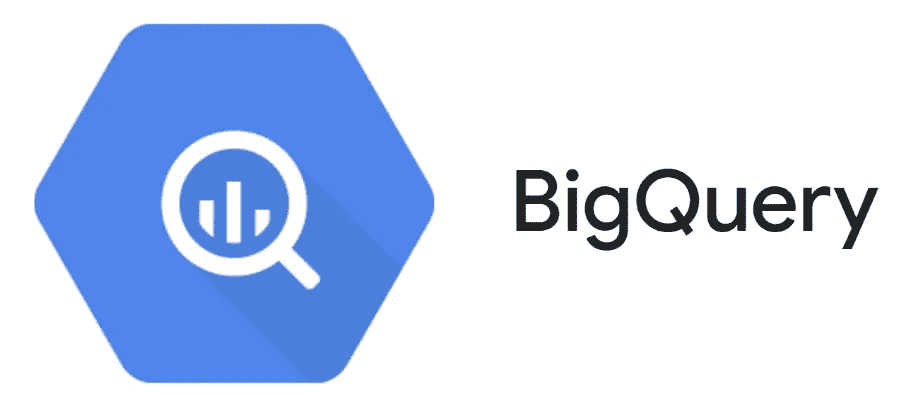
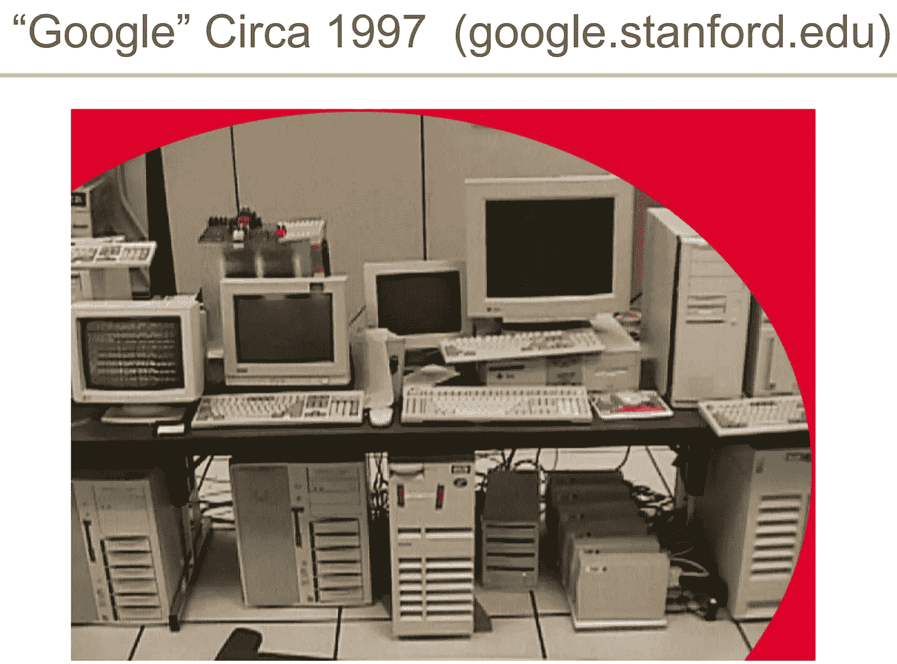
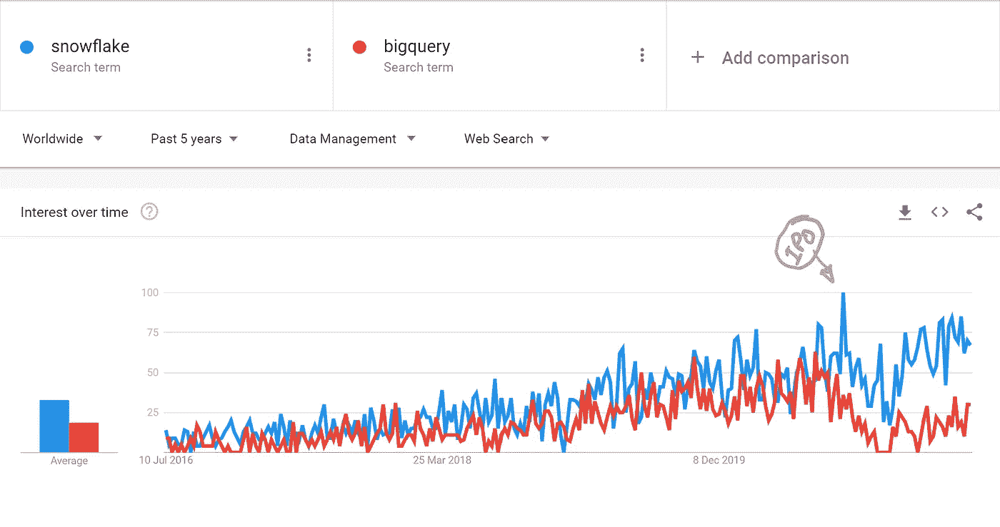

# 雪花大战大查询:泰坦的冲突(第一部分)

> 原文：<https://levelup.gitconnected.com/snowflake-vs-bigquery-clash-of-titans-part-1-9605f4acf88b>

## 雪花和 BigQuery 在很多方面都很相似，人们可能会认为这将是一场简单而平衡的战斗……但真的是这样吗？

自从我写了我的[雪花与红移 RA3 的文章](/snowflake-vs-redshift-ra3-the-need-for-more-than-just-speed-52e954242715)以来，我一直收到读者的请求，要我对 BigQuery 和雪花进行比较。正如一些人指出的那样，它们都分享了存储和计算分离带来的许多好处，因此是有价值的竞争对手。

一如既往，我想指出的是，为您的数据平台选择“正确的”数据库并不是一个明确的决定…有许多可变因素在起作用:数据大小、用户要求、性能要求、价格敏感度、预算、维护成本等…只有您自己知道最适合您的使用情形的选项是什么。

话虽如此，让我们开始吧，还有什么比讲述一下他们的历史更好的方式来开始这场“泰坦之战”呢？

# 谷歌的大数据之路

从很早开始，谷歌就感受到了他们需要存储和访问的数据量的压力。那是 90 年代末，互联网的规模和使用正以前所未有的速度增长，随着谷歌扩大服务，他们正经历着势不可挡的需求增长。扩大服务器的规模变得越来越昂贵。

如 2007 年 6 月在西雅图可伸缩性会议 Google Tech Talks 上所示

他们现在处于适当的大数据领域，但当时没有“大数据”，大数据还不是真正的东西…所以他们做了聪明人会做的事情:他们遇到了问题，所以他们尽最大努力来解决它。正如我们今天所知，他们显然成功了！

2003 年，谷歌发表了著名的 GFS(谷歌文件系统)论文，这是他们新的分布式存储系统，能够处理数 Pb 的数据，一年后，他们发表了关于 MapReduce 的论文，这是他们的大数据处理引擎。经过这些技术多年的内部和社区开发，谷歌在 2010 年和 2011 年发布了下一级分布式存储和计算的论文:Colossus ( *分布式 exabyte 存储系统*)和 Dremel ( *大数据 SQL 查询处理引擎*)。不久之后，他们发布了今天仍被称为谷歌云存储(*巨像即服务*)和 BigQuery ( *dremel 即服务*)的服务。

> 当 Google BigQuery 于 2011 年末发布时，它是多年调查、社区贡献和 Google 内部开发的结晶。从那时到今天，这些服务肯定已经发展了很多，但它们仍然建立在相同的坚实基础上。

**引用:***当你在凌晨 1 点被传呼时，你知道你有一个很大的存储系统，因为你只剩下几 Pb 的存储空间了。*、
、[2010 年谷歌教师峰会](https://cloud.google.com/files/storage_architecture_and_challenges.pdf)

# 简单地说，谷歌大查询

简单来说，数据库有 4 个核心组件:

*   存储层(*，其中数据被持久存储*)，
*   元数据层(*，它使所有数据*有意义)，
*   处理引擎，(*处理数据、连接、逻辑等*)，以及
*   查询引擎/查询规划器(*，将查询转换为完整的执行计划，由较低层执行，并协调执行*)。

Google BigQuery 是一个大规模并行处理(MPP)数据库，就像雪花一样，它具有与计算分离的存储:两个核心工作层(存储和处理)是独立的、分布式的和高度可扩展的。如果您需要更多存储，您可以在不增加更多计算的情况下这样做，同样如此。这当然是可能的，因为谷歌云存储(GCS，基于巨像)和 Dremel。

早在 2011 年，大多数大数据都是通过“*技术血液、汗水和泪水*”处理的，也就是 Hadoop。内部的 hadoop 集群很难设置，很难稳定，维护成本很高，而且它们在实时查询方面也不是很好。那时还没有红移(2013)，没有雪花(2014)，没有 Azure DW (2015)，所以 BigQuery 没有像火箭一样起飞是相当令人惊讶的。我的最佳猜测是，公司仍然对将他们自己的数据发送到云上有点谨慎，并且大多数已经拥有“大数据”的公司仍然对他们自己的设置足够满意(*是 hadoop 或大型数据库集群*)。

> 但是随着时间的推移，收养率确实上升了。[根据这篇文章，现在有 3000 多家公司在使用 BigQuery，包括纽约时报、汇丰银行和 Spotify 等知名公司。](https://www.stitchdata.com/resources/redshift-vs-bigquery/)

# 雪花——黑马

《雪花》[于 2014 年](https://www.bloomberg.com/news/articles/2014-10-21/snowflake-takes-aim-at-amazon-hadoop-with-new-data-service)公开发布，比 biqquery 晚了大约 3 年，就像 BQ 一样，它的早期生活并不轻松(*有人会说，甚至比 biqquery 的*还要艰难)。我很幸运地在 2016 年使用了它，我可以明确地说它已经是一个非常成熟的产品，并且是 BQ 和 Redshift 的明显竞争对手，但事实上，长期以来阻碍雪花的东西一直大多是非技术和非技术的:

*   没有血统(*“没有首席技术官因为收购 IBM 而被解雇”这句老话并不适用*)
*   不是更大的云产品的一部分(*意味着新的合同、采购和涉及法律的*
*   私有(*所有权稳定性问题，云玩家的潜在收购，这将“锁定”公司在*)，以及
*   难以预算，并且成本上限很高*(如果您要 24 小时运行一个集群，而客户端从来不会这样做……仍然难以预算)*

但从技术上来说，在我看来，它总是胜过竞争对手……你可以在[这另一篇文章*【section:****我个人对雪花的体验***](https://jmarquesdatabeyond.medium.com/what-makes-snowflake-so-much-better-than-others-58e839e29e80)*中阅读所有关于我对雪花的体验。*

**

*谷歌趋势比较雪花和谷歌大查询；雪花 IPO 凸显；[链接此处](https://trends.google.com/trends/explore?cat=343&date=today%205-y&q=snowflake,bigquery)*

> *然而，2020 年将会改变一切:雪花公司成为有史以来估值最高的软件 IPO，并且成为新闻焦点。在那之前一直是小众的东西，现在正成为主流，谱系正在建立:雪花现在很性感，市场永远不会满足它！*

**

# *表演*

*几年来，我一直相信 Fivetran 对数据库的年度比较:我觉得他们对各种不同的工作负载做了很好的系统测试，而且他们看起来很公平。这只是我对它的看法…无论如何，根据他们在这里提供的 [2020 年的比较](https://fivetran.com/blog/warehouse-benchmark)，与红移和雪花相比，BigQuery 的性能似乎略有滞后。这不是一个巨大的差异，我确实注意到一个更长的尾巴，这可能暗示了一些可伸缩性问题*(即:好的时候一切都好，但坏的时候就真的坏了)*但事实是这些查询并没有真正优化，我发现任何数据库的情况都可能变得非常糟糕…所以我现在忽略它。*

*鉴于以上，我个人会称之为**小边缘到雪花上的表现**章。*

# *保管费用*

*我听你说过，储藏很便宜……好吧，即使要花很少的钱，但很多花生很快就会装满一个罐子！BQ 和 Snowflake 都以类似的方式对存储进行定价，因此很容易对 TB 进行比较:*

*   ***雪花:**按需热存储压缩 40 美元/TB，如果您预订，每月 23 美元/TB。*
*   ***BigQuery:** 0.02/GB 未压缩/月用于热存储(=20 美元/TB/月)*

***2021 年 7 月 13 日编辑→***

*然而，正如一位读者向我指出的那样，BigQuery 的价格是针对未压缩数据的，而 Snowflake 的价格是针对压缩数据的。我见过 Snowflake 做 3 到 5 次压缩，所以我只取 3 次作为保守的平均值*(压缩非常依赖于数据)。***将雪花的成本降至约 13 美元/TB(未压缩)，**并使**雪花成为这里的明显赢家。***

***←编辑！***

****注意#1:*** 存储预留(雪花)应持保留态度，因为这通常是客户至少一年后才会做的事情，您可能只会预留 70%的需求。*

****注意#2*** :我对 BigQuery 的长期存储折扣也有同样的看法，因为它也带来了相当的数据管理开销，并且很容易打破 90 天规则。*

# *费用*

*BQ 和 Snowflake share 的一个重要功能是按使用付费模式，也就是说，只有在使用计算时，才会向您收取计算费用。但它们的价格相似之处仅此而已...*

***雪花**的定价相当直接，你有被称为*【仓库】*的计算集群，它们按秒计费(*最小使用量= 1 分钟*)，你可以随意启动/暂停/自动暂停。仓库(计算集群)可以有多种规模，从 XSmall 到 x4Large，它们通常在成本和性能方面呈线性扩展。*

> *这挺酷的！仔细想想，你是在为工作单元付费，时间纯粹是仓库大小的问题。如果您愿意，可以在 XSmall 上运行 12 小时的查询，或者在 XLarge 上运行 45 分钟的相同查询…同样的工作，同样的价格…*

*您可以将单个仓库扩展到 512 台服务器，并且可以同时运行多个仓库(*计算集群*)。*

*另一方面，谷歌大查询有两个版本:超级简单和超级复杂！
让我们先来看一个简单的:如果您使用**“按需”**固定成本，那么您只需为每 TB 数据读取支付 5 美元，这意味着您只需为查询所需的数据付费。但是！这种定价与性能和并行性的限制有关。对于简单的用例，这可能不是一个问题，但是让我们面对它:任何数据库都可以解决简单的用例…简单是**而不是**为什么你在读这篇文章！*

*因此，您的数据可能真的没有那么小，也可能不是大数据(*您真幸运！*)，但仍然是一个不错的数据集(比如 1TB+)和相当多的用户。这就是事情开始变得有点复杂的地方，你可能会发现自己被网上的文章所包围，这些文章的名字像“**解码** BQ 定价”、“**解释** BQ 插槽”和“ ***简化*** *BQ 弹性插槽*”([这里是一个很好的例子](https://gcloud.devoteam.com/blog/bigquery-flex-slots-pricing-a-programmatic-approach))。*

**

*[Joshua Hoehne](https://unsplash.com/@mrthetrain?utm_source=medium&utm_medium=referral) 在 [Unsplash](https://unsplash.com?utm_source=medium&utm_medium=referral) 上拍摄的照片*

*为了简单一点，因为我不希望重新发明轮子，我将再次拉出这个 [2020 比较](https://fivetran.com/blog/warehouse-benchmark)。根据比较，对于相同的数据集和查询模式， **BigQuery 似乎比**略贵。*

*现在，你可以在 BQ 中工作的定价方式是如此复杂，以至于很容易根据你的数据集和使用模式来选择任何一种方式。对我来说，这是不利的一面！我不想花几个小时去想如何设置我的定价…我想要一个干净、清晰的定价，可以直接与我的使用情况挂钩…*

*因此，我的最终结论是 **BigQuery 似乎比 Snowflake **稍微贵一点**，但是在成本管理上要复杂得多。在我看来，这让雪花成为计算成本方面的明显赢家。***

# *闲置成本*

*在按使用付费的模式中，成本优化也是关于尽可能将空闲时间成本降低到接近于零，这是你在网上找到的任何比较中永远不会有的东西，很简单，因为它取决于你对它的优化程度。在比较两个 MPP 平台时，您应该假设您会像该工具一样擅长优化空闲时间。这意味着您应该通过它们提供给您的空闲时间优化工具集来评估它们。*

*在**雪花**中，仓库可以在 1 分钟不活动后自动关闭，只要收到查询就会自动唤醒。由于 1 分钟的最低收费和实用性，浪费通常来自即席查询:用户运行一个查询，查看数据，然后运行另一个查询，再次查看，等等。集群越大，这一点就越重要:1 分钟的空闲时间从 0.06 美元( *1 节点*)到 33 美元( *512 节点*)不等。*

*在 **BigQuery** 看情况。如果你坚持统一的价格，那么你将根据读取的字节收费，没有闲置成本。但是，如果您开始使用弹性插槽，那么您可能会产生多少闲置成本？好吧，祝你好运！*

*无论如何，考虑到简单的统一费率定价，**我会在这里给 Google BigQuery 一个胜利**，因为统一费率很简单(*但不要太兴奋…稍后会有更多关于这个主题的内容*)。*

# *未完待续…*

*在下一篇文章中，我将继续比较这两者，但会转移到更有趣的主题:伸缩性、功能性、管理等等。敬请关注！*

*[在此继续第 2 部分](https://jmarquesdatabeyond.medium.com/snowflake-vs-bigquery-clash-of-titans-part-2-7c9724c726de)*

# *雪花系列*

**这篇文章是我的(不断成长的)雪花系列的一部分。如果您想了解更多关于雪花的信息，这些文章可能也会让您感兴趣:**

*   *[*雪花 vs 红移的 RA3——对(不止是)速度的需求*](/snowflake-vs-redshift-ra3-the-need-for-more-than-just-speed-52e954242715)*
*   *[迁徙到雪花？这里是你需要知道的](https://jmarquesdatabeyond.medium.com/migrating-to-snowflake-here-is-what-you-need-to-know-8310b84d2741)*
*   *[是什么让雪花比其他的好那么多](https://jmarquesdatabeyond.medium.com/what-makes-snowflake-so-much-better-than-others-58e839e29e80)*
*   *[你可能不知道存在的雪花结构](https://jmarquesdatabeyond.medium.com/snowflake-configurations-you-probably-didnt-know-existed-ccc0c56c9d21)*
*   *[用雪花？不要犯这些代价高昂的错误](/using-snowflake-dont-make-these-expensive-mistakes-66c1eaa7d1ee)*
*   *[*雪花中的近实时数据摄取(以及如何实现热/冷/冻结数据存储策略)*](/near-realtime-data-ingestion-in-snowflake-7033d45ce860)*
*   *[*使用外部表时的性能考虑*](https://jmarquesdatabeyond.medium.com/using-snowflake-external-tables-you-must-read-this-aeb66ae8e0e6)*