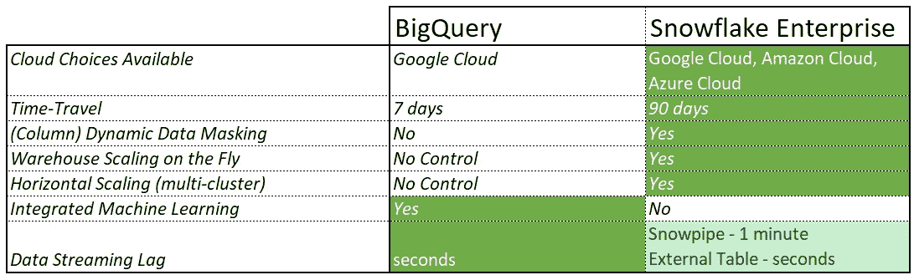

# 雪花大战大查询:泰坦的冲突(第二部分)

> 原文：<https://levelup.gitconnected.com/snowflake-vs-bigquery-clash-of-titans-part-2-7c9724c726de>

## 更深入地看，差异就会显现出来

欢迎来到雪花(SF)和谷歌大查询(BQ)对比的第二部分(也是最后一部分)。在[第 1 部分(可以在这里找到)](/snowflake-vs-bigquery-clash-of-titans-part-1-9605f4acf88b)中，我们查看了简单的“开箱即用”版本的 BigQuery，并尽可能保持简单，以便进行成本和性能比较。但是现在，我们需要更深入的研究:

> 是时候深入细节了，众所周知，**细节决定成败**。


# 超越“按需”定价

为了比较这两种技术，我们必须找到一种方法来匹配它们的计算成本，这可不是小事。这两种技术有不同的性能，最重要的是，雪花 *(SF)* 有多个“版本”，价格相差很大([https://www.snowflake.com/pricing/](https://www.snowflake.com/pricing/))。因为计算既无聊又杂乱，所以我把它移到了本文的末尾，这里我只给你一个标题:

*   **1 个雪花节点(SF-node) ~100 个 big query slots(BQ-slots)** *(见文末计算)*

为了简单起见，我们假设

*   *1-SF-node * 60min = 100-BQ-slots * 60min =****1 个工作单元***

那么，我们可以得出结论，BigQuery slots 的价格相当于雪花的企业版:

*   1 单位工作成本
    …。 **$4 in BigQuery** (100 个灵活插槽)
    … **$2.7 在雪花标** …。**雪花企业 3.9 美元**

雪花企业版可能是最常用的版本，因为它包含了大多数公司需要的功能。但是“工作成本”并不足以衡量一个平台的成本，空闲时间的成本也极其重要。

> 诚然，BigQuery (BQ)和 Snowflake (SF)对于一个**工作单元**来说成本是一样的，但这并不意味着它们的总体成本是一样的！

**我们假设您考虑了任何美国/欧盟地区。**

# 按比例放大


由[沃洛德梅尔·赫里先科](https://unsplash.com/@lunarts?utm_source=medium&utm_medium=referral)在 [Unsplash](https://unsplash.com?utm_source=medium&utm_medium=referral) 上拍摄的照片

您对任何 MPP 数据库的期望之一是按需伸缩的能力，但是:

> 对于像雪花和 BigQuery 这样具有独立存储和计算的技术，您期望更进一步:能够“快速”扩展计算。

在 **Snowflake 中，你可以用一个简单的 DDL 命令进行缩放，**绝对无缝，几乎是即时的(*几秒钟*):

```
ALTER WAREHOUSE WH_SCALE_UP SET WAREHOUSE_SIZE='XLARGE';
>> QUERY GOES IN HERE;
ALTER WAREHOUSE WH_SCALE_UP SET WAREHOUSE_SIZE='SMALL';
```

此外，您可以通过创建多集群仓库来避免查询排队，从而扩展您的集群，所有这一切都只需一个简单的 DDL 命令即可完成。

与 **BigQuery 虽然…一个完全不同的对话**。为了实现可伸缩性，您需要从按需模式转向插槽模式。

插槽是预付的计算单元，您需要使用 UI 或特殊的控制台来分配给项目。插槽需要一个承诺(*您预先购买一定量的计算*)，在统一费率和灵活插槽之间切换是一项管理任务，可以在控制台中完成，也可以通过 BQ 命令行完成。不要误解我的意思，弹性插槽和统一费率理论上很棒，理论上给你很大的灵活性。实现并没有那么好:

> 对于典型的异构工作负载，您真的打算每分钟监控使用情况，并在 BigQuery 控制台中手动调整插槽吗？或者发出 BQ 命令行命令？

这是不切实际的，这很可能意味着你会在大多数时间里“夸大”插槽的数量，这就是事情变得昂贵的地方。

> 诱人的“随需应变”模式到此结束，在这种模式下，您只需为您的查询所使用的内容付费。一旦你移动到插槽，你就为分配/运行时间付费，只要插槽被分配并且没有被使用，你就**产生闲置成本**。

这对于自动化任务来说很容易控制，但是自动化任务往往只占数据仓库使用量的一半，另一半是用户查询和报告。您可以浏览一下这篇 Google Cloud 社区文章，感受一下管理插槽有多难:[揭开 BigQuery 预订的神秘面纱](https://medium.com/google-cloud/demystifying-bigquery-reservations-5e3ac87a4ff8)。

您可能会想"*是的，但这与雪花完全相同，如果它是向上的，您就要为它付费*"，您是对的！但是有一个很大的区别:在雪花中停止计算单元(并停止支付)非常简单，并且可以完全自动化(参见*自动挂起*和*改变仓库集合大小*)。这个工具可以帮助你减少浪费，如果你愿意，你可以把闲置成本降到最低。

所以我的结论很简单:**雪花在这里是一个明显的赢家。在雪花中扩展是完全无缝的，毫不费力的，并且您可以通过自动关闭/ DDL 轻松降低闲置成本。**

**这绝对不是 BigQuery 的情况……**

# 向外扩展


约尔根·哈兰在 [Unsplash](https://unsplash.com?utm_source=medium&utm_medium=referral) 上的照片

假设你正在做一个新的应用程序发布，突然之间，每个人都在试图了解发布进展如何。您的分析师正在进行*特别*查询来回答 cxo，您的数据科学家试图获得数据来预测用户采用情况，您的用户正在刷新报告等待图表移动。由于这个使用高峰，您开始接收比平时多得多的并发查询:您现在有一个临时的查询队列问题。

如果您正在使用雪花，您可以在您的仓库上[启用多集群来管理这个工作负载。它通过分析当前队列中的查询数量来工作，如果查询数量超过某个阈值，它就加 1..n 更多的集群到您的仓库计算能力，直到队列被处理。一旦查询被排序，它将再次扩展，并在无人需要时自动挂起。这发生在“引擎盖下”,对您的用户来说是 100%无缝的。](https://docs.snowflake.com/en/user-guide/warehouses-multicluster.html)

如果你在 BigQuery 上，那么你需要回答的第一个问题是“*我应该买多少个插槽？*“…那么，您就有一个问题:您无法预测使用情况…那么您将如何管理插槽呢？好吧，你必须做出选择，是让你的用户在高峰期感到满意，并支付大量的闲置成本，还是让他们的查询速度变慢，但保持低闲置成本。

在 BigQuery 中，您需要提前决定购买多少个插槽，为每个项目部署/分配多少个插槽，所有这些都需要手动或编程访问(控制台/bq cmd 行)。如果您的用户需要计算来运行查询，您需要分配插槽，这意味着您要为 100%的时间付费，即使您的用户当前没有使用它。

为了“扩大规模”(并停止付费)，你将需要手动取消分配插槽，我不认为你的 500 个用户会打电话告诉你他们什么时候完成...如果你问我，这一切都变得非常昂贵…

**雪花再次取得了明显的胜利:多集群仓库就是为了解决这一问题而设计的，它们可以无缝地动态扩展，并且无需任何管理。**

# 盒子里的好东西——其他功能


Monique Carrati 在 [Unsplash](https://unsplash.com?utm_source=medium&utm_medium=referral) 上拍摄的照片

既然我们知道 BigQuery 的单位工作成本与雪花的企业版相当，那么我们就来谈谈它们所提供的特性的一些主要差异(*注意:这不是一个详尽的列表，只突出主要差异)*:



聚焦差异— BigQuery vs 雪花企业

## 云锁定因子

Google BigQuery 暗示了与 Google Cloud 的巨大“锁定”。有了雪花，你可以使用任何大-3。

## 机器学习(BigQuery)

我喜欢机器学习越来越接近数据库的水平，但与此同时，我一直质疑它对公司到底有多大用处。成熟的数据科学团队不喜欢“黑盒巫师”，他们希望处于控制之中，能够使用自己的模型，随心所欲地调整它们，并且他们喜欢自己的工具。最重要的是，BigQuery ML 模型将总是落后于社区中可用的模型，这也是不理想的。鉴于这一点，尽管我喜欢它作为一个功能，但它基本上是一个很好的功能，大多数公司自然会避免使用它。

## 实时数据流

实时(几秒)数据流入数据仓库的用例很少见。通常你可以等一分钟，如果你不能，你可能使用了错误的技术来解决你的问题。无论如何，如果您确实需要这样做，那么 BigQuery 似乎更容易设置。在 Snowflake 中，即使您使用外部表来实现，也没有那么好和无缝。

# 十个分析师走进一家酒吧…

我想以一个真实的生活场景来结束我的演讲。假设你正试图找出解决公司工作量的最佳方法。您发现您的 10 位分析师通常需要 32 个日常工作单元来处理他们的查询。另外:

*   他们需要这个用于多个*特定*查询。
*   你不知道他们什么时候会需要它。
*   他们可能会同时查询所有内容，也可能不会，但是大多数查询需要不到 1 个工作单元。
*   他们的时间是宝贵的，您被要求确保他们的查询具有高优先级，并且不要花费太多时间来运行。
*   他们的查询需要大量数据，这使得 BQ 随需应变模型过于昂贵 *(* [*)这是关于这个主题的一个有趣的阅读*](https://huq.io/technology/how-to-save-costs-using-google-bigquery-slots/) *)* 。

让我们看看如何在每种技术中进行配置。

**雪花企业** 创建仓库**分析师 _WH** ，设置为 size **XLarge，**设置为 **auto-suspend=60sec** 。告诉您的分析师在他们不再需要仓库时暂停仓库。他们有时可能会忘记这样做，但是你已经设置了自动暂停 1 分钟，所以这是你最坏的情况。如果他们忘记暂停 10 次(*10 * 1 分钟*)，那么这将花费你最多

> ~32 信用点(**工作= 32**)+10/60 * 16 信用点(**空闲=2.6** ) = 32.6 工作单位 **= 127.14 美元/天**

因为学分/小时等同于工作/小时，所以运行时最坏的情况是

> 32 学分/ 16 学分/小时~ 2 小时

运行(*如果我们假设没有查询并行，即:没有两个查询并行运行*)。

为您的分析师创建一个项目，他们将使用这个项目来运行他们的查询。配置此项目使用槽位，分配 1600 个槽位*(SF XLarge Warehouse equivalent)。*

因为您无法预测分析师在一天中的什么时候会需要计算能力，所以您需要让它在大部分时间运行。你能优化的最好情况是，假设分析师只需要从早上 8 点到下午 6 点进行计算，你可以在这段时间之外恢复按需计算。您的最佳选择是:

> 弹性时段+按需= 1600 个弹性时段* 10 小时* $ 4/100 =**$ 640/天**

比方说，你发现执行查询花费双倍的时间是可以接受的，但你仍然会看到 320 美元/天，这仍然比雪花高得多。为什么？因为您为未使用的容量(闲置成本)付费…

值得指出的是，所有未使用的容量都在项目之间共享，因此如果其他人在其他项目中运行查询，这些槽将在那里使用。但这并没有改变最终的结论:无论是在团队层面，还是在公司层面，你都会在你的职位分配中遇到这个问题。问题依然存在:您需要预测使用情况，并且您无法控制暂停/恢复。**这意味着你注定要浪费很大一部分预留容量，使插槽比乍看上去贵得多。**

## 那么 BigQuery 中缺少了什么呢？

暂停你的计算机的能力……对谷歌来说解决这个问题并不难:简单地引入一个暂停和/或自动暂停功能。

如果“插槽”在 1 分钟无活动后自动挂起，并在再次收到查询时恢复，那么整个问题就会消失，空闲时间的最大成本将是 1 分钟，而不是几个小时…

# 结论

这最后一篇文章更深入地讨论了扩展功能，并深入研究了定价。在这种类型的平台中，每小时的工作成本不能很好地反映总成本，您需要更多地考虑如何轻松地管理空闲时间。

现实生活中的用例暴露了 BigQuery 的大问题:您的业务用户不能轻松地动态扩展，他们(普通用户)不能简单地暂停计算资源，因为这需要控制台管理操作或 BQ 命令行。

你能试着解决这个问题吗？是的，你可以。您可以创建各种界面来尝试和管理这一点，但它们将是“较差”的解决方案，并且很可能会产生其他问题…

因此，总的结论是，雪花是一个更容易管理的工具，他们将所有工具都放在您的手中，因此您可以优化您的成本，动态无缝扩展，甚至可以无缝横向扩展来处理查询数量的峰值。我可以向你保证，我已经多次使用过所有上述功能，就是这么简单…

# 雪花系列

这篇文章是我的(不断成长的)雪花系列的一部分。如果你很好奇想了解更多关于雪花的知识，这些文章可能也会让你感兴趣:

*   [*雪花 vs 红移的 RA3——需要(不止是)速度*](/snowflake-vs-redshift-ra3-the-need-for-more-than-just-speed-52e954242715)
*   [迁移到雪花？下面是你需要知道的](https://jmarquesdatabeyond.medium.com/migrating-to-snowflake-here-is-what-you-need-to-know-8310b84d2741)
*   [是什么让雪花比其他的好那么多](https://jmarquesdatabeyond.medium.com/what-makes-snowflake-so-much-better-than-others-58e839e29e80)
*   [你可能不知道存在雪花结构](https://jmarquesdatabeyond.medium.com/snowflake-configurations-you-probably-didnt-know-existed-ccc0c56c9d21)
*   [使用雪花？不要犯这些代价高昂的错误](/using-snowflake-dont-make-these-expensive-mistakes-66c1eaa7d1ee)
*   [*雪花中的近实时数据摄取(以及如何实现热/冷/冻结数据存储策略)*](/near-realtime-data-ingestion-in-snowflake-7033d45ce860)
*   [*使用外部表时的性能注意事项*](https://jmarquesdatabeyond.medium.com/using-snowflake-external-tables-you-must-read-this-aeb66ae8e0e6)

# 附加

# 估计 BigQuery 和 Snowflake 之间的计算等效性

看一下我一直用作参考的这个比较，让我们假设两种技术都是线性扩展的，将 BQ 在插槽中的等价物外推至雪花节点:

*   **雪花—大**
    > 8 节点，平均查询时间:8.21 秒
    > 1 节点~= *8*8.21 =* 65.7 秒
*   **BigQuery**
    > 600 槽，平均查询时间:11.18 秒
    > 100 槽~= *11.18*6 =* 67.0 秒
*   **1 个雪花节点~100 个大查询槽**

为简单起见，让我们将 1 小时内使用 1 个节点表示为 1 个工作单元:

*   *1-SF-node * 60min = 100-BQ-slots * 60min =****1 个工作单元***

那么，我们可以得出结论，BigQuery 价格相当于雪花的企业版:

*   1 单位工作成本
    …。 **$4 in BigQuery** (100 个灵活插槽)
    … **$2.7 在雪花标** …。**雪花企业 3.9 美元**

## 管理 BigQuery 工作负载— JustEat 的第一手经验

我发现这是一本非常好的读物，有助于理解一家公司在 BigQuery 中的历程，他们必须如何调整他们的工作方式，以及降低 BigQuery 成本所需的管理开销:

[https://tech . justeataway . com/2020/09/25/managing-costs-efficient-with-big query/](https://tech.justeattakeaway.com/2020/09/25/managing-costs-efficiently-with-bigquery/)