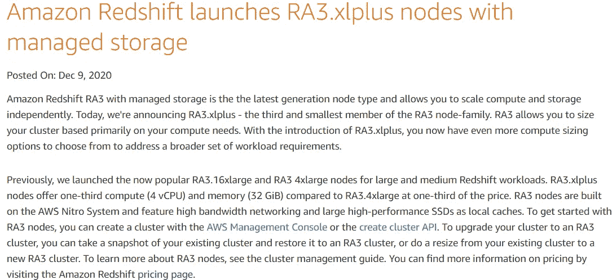
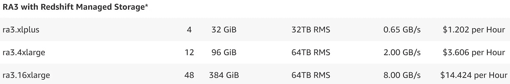
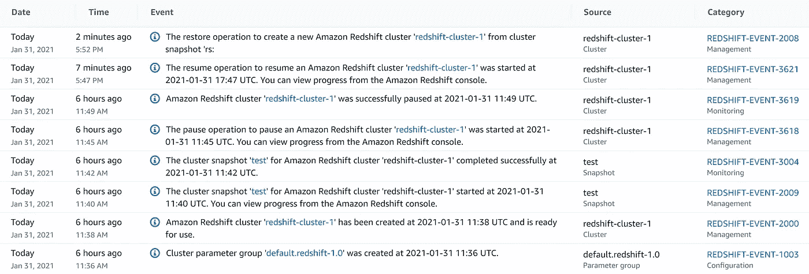
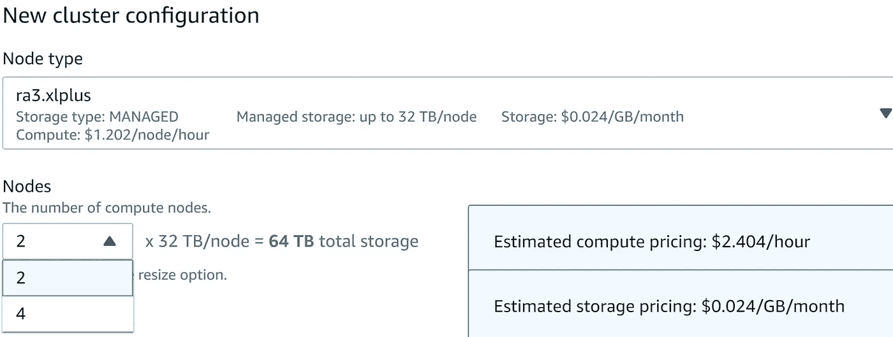
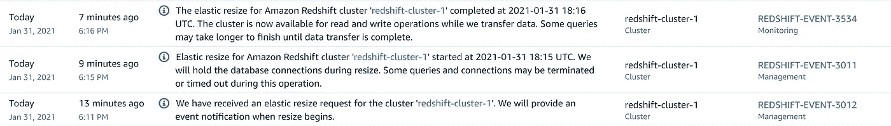

# 雪花 vs 红移 RA3——对(不仅仅是)速度的需求

> 原文：<https://levelup.gitconnected.com/snowflake-vs-redshift-ra3-the-need-for-more-than-just-speed-52e954242715>

## 亚马逊红移的 RA3 星系团是朝着正确方向迈出的一步，但它们与雪花相比如何呢？

多年来，雪花和红移一直是我的“T0”MPP 平台。我很幸运有很多机会与这两个平台合作，在 2016 年交付了一个雪花 *(+AWS)* 全数据平台，另一个雪花平台目前正在进行中，另外四个数据平台在*(或部分使用)*红移交付。我认为它们都是非常好的技术，但在我看来，雪花一直有一个优势:完全计算与存储分离，工作负载隔离，出色的性能，无需管理。

> 但是随着红移 RA3 星系团变得更加便宜和容易获得，这一切都要改变了吗？



亚马逊新闻 2020 年 12 月发布的最新和更实惠的 RA3.xlplus 节点

# 亚马逊红移

当亚马逊[在 2013 年【1】](https://aws.amazon.com/about-aws/whats-new/2012/11/28/announcing-amazon-redshift/)发布红移时，它是一个相当大的游戏改变者。它不是第一个面向分析的平台，显然也不是第一个大规模并行平台(MPP)数据库，可能是 Teradata(或者 Vertica？).实际上，Redshift 本身是使用 ParAcell 的技术构建的，它本身就是一个 MPP 数据库。那么，到底是什么在大惊小怪？在我看来，这是一种整体大于部分之和的情况。

> 一个大规模并行平台，能够处理 TB 级和 GB 级数据，专为分析而构建，在云上管理和托管，按小时收费，您可以按需扩展。然后，最重要的是:使用纯 SQL。总的来说，这是一个相当有吸引力的提议。

让我们不要忘记，在那个时候，如果您拥有*(或计划拥有)*大数据，您可能会“被迫”进入 Hadoop 兔子洞，这仍处于早期阶段，仍然非常专注于内部部署。以上所有这些使得 AWS Redshift 成为当时许多公司的完美解决方案，从那以后更多的公司也是如此。

几年过去了，公司变得更加苛刻，速度快和在云上已经不够了。这些年来增加了许多好的功能，但两个最大的缺点仍然存在:存储和计算之间的耦合，以及扩展的难度*(和破坏性)*。对于许多公司来说，这是一个问题，他们可能拥有大量数据，但不需要几十台服务器的计算能力。或者那些需要非常大的机器来进行夜间 ETL，而不是全天 ETL，并且希望能够相应地伸缩的人。

> 这两个问题的核心都是整体架构设计的“特征”(或者可能是缺陷):Redshift 的[无共享架构【2】](https://en.wikipedia.org/wiki/Shared-nothing_architecture)实际上共享了一些东西，服务器准系统。

横向扩展计算速度缓慢，是一项真正的管理任务，因为这意味着数据复制和/或重新分配，而增加磁盘容量意味着更多磁盘，这意味着更多服务器。这意味着存储不再便宜…

经过多次尝试缓解这些问题(2017 年红移光谱；Redshift Elastic Resize in 2018)，亚马逊终于在[2019 年 12 月发布了一个备受期待的新架构:红移 RA3 集群[12]](https://aws.amazon.com/about-aws/whats-new/2019/12/amazon-redshift-announces-ra3-nodes-managed-storage/) ，它使用 S3 分布式存储作为一种最终将存储与计算解耦的方式。然而，尽管朝着正确的方向迈出了一大步，但仍然有一个*(非常昂贵)*问题:只有一种机器类型可用(rs3.16xlarge)，每小时收费 14 美元，这意味着成本让大多数客户望而却步。这意味着对大多数红移客户来说，这真的不是一个可行的选择(*财务上*)。

然后，在 2020 年 3 月，他们发布了暂停集群的功能，在第一台“负担得起的”RA3 机器发布后，ra3.4xlarge 的收费为 3.6 美元/小时。更实惠，但对大多数人来说可能还是不够。**今年，他们终于发布了可以让 Redshift 成为雪花一个有价值的竞争对手的机器:1.2 美元/小时的 RA3.xlplus。**



红移定价页面，见 2021 年 1 月 30 日

# 雪花

雪花[于 2014 年【6】](https://www.bloomberg.com/news/articles/2014-10-21/snowflake-takes-aim-at-amazon-hadoop-with-new-data-service)公开发布，距离亚马逊红移发布不到两年，但它的增长速度更慢。我在 2016 年第一次遇到它，当时我们的数据经理建议我们在新的数据仓库中尝试它。我天生对新技术持怀疑态度，团队的其他成员也是如此，所以我们进行了几次测试来证明这项技术是有价值的。的确如此，然后有些……你可以在本文【3】的*我对雪花的个人体验*部分[中读到我对雪花的所有体验。](https://jmarquesdatabeyond.medium.com/what-makes-snowflake-so-much-better-than-others-58e839e29e80)

多年来，我一直向我所有的客户推荐雪花，但即使优点很明显，不幸的是，我总是发现它很难推销。它缺乏大型云供应商的支持，而且定价策略完全不同，这让首席技术官们感到紧张。他们通常担心潜在的收购(【TO】一位著名的首席技术官曾经对我说“我想继续全力支持 AWS。如果雪花被 XYZ 收购，那会怎么样？”)，他们还发现很难用按使用付费的定价来建立严密的预算。红移是更安全的方法，我完全明白。即使大牌变了，老话本身依然站得住脚: ***【没有 CTO 因为收购 IBM 而被解雇】* …**

> 然而，自那以后发生了很多事情，随着[有史以来估值最高的软件 IPO【4】](https://fortune.com/2020/09/16/snowflake-ceo-doubling-of-stock-price-after-ipo-reflects-frothy-market/)，我相信公司会更认真地考虑它。
> 
> 但是 AWS 红移真的同时追上雪花了吗？会不会是优势已经没有了？

# 为数据分析选择正确的 MPP 平台


照片由[布伦丹·丘奇](https://unsplash.com/@bdchu614?utm_source=medium&utm_medium=referral)在 [Unsplash](https://unsplash.com?utm_source=medium&utm_medium=referral) 上拍摄

构建新的数据平台是一条充满选择的漫长道路，而技术的选择可能是项目成功的决定性因素。我的经验是，大多数项目倾向于在达到第一个周年纪念日之前交付某种类型的第一批数据交付，但是我见过错误的技术选择将这延迟了半年到一年的情况。

在我看来，在选择 MPP 数据库时，我不认为任何人真的会在红移或雪花中出错。它们都有很好的性能，适合用户查询和数据仓库 ELT 所需的工作类型。

然而，正如您将看到的，这并不意味着它们同样优秀。它们可能在查询性能方面有所收敛，但在其他方面却大相径庭。

> 也许他们都没有“错”，但在我看来，仍然有一个比其他的“更正确”。

# 表演

我仍然记得当我第一次使用 Redshift 时，对于来自 Oracle 和 SQL Server 这样的公司的人来说，它是多么地快。大型分析查询是如此之快！

但那几乎是 10 年前的事了…现在，这种类型的性能是我们的基准，你会发现

> 所有“最好的”MPP 平台在性能方面已经趋同(*Hadoop/Presto 一直落后，他咧嘴笑着说……*)。

为了证明这一点，看一下[这个比较[5]](https://fivetran.com/blog/warehouse-benchmark) 就足够了，我发现这是一套非常好的、彻底的测试，并且每年都更新。出于这个原因，我将把性能比较委托给上面提到的博客[【5】](https://fivetran.com/blog/warehouse-benchmark)，并接受/得出结论，就性能而言，雪花和红移之间是一个**关系。**

# 使用成本

相信这个比较[5] ，可以合理地假设雪花和红移 RA3 实例的使用价格相似。同样，我将避免重复他们的工作。从底线的角度来看，红移可能看起来有优势，考虑到他们更便宜的节点仅花费 1.2 美元/小时，但是他们至少需要 2 个节点，使最低成本达到 2.4 美元/小时，这与雪花的 2.5 美元/小时几乎相同。

**这意味着就使用成本而言，这是一个平手**。

> 然而，在按使用付费模式中，使用只是等式的一部分…

# 闲置成本

在按使用付费的模式中，成本优化也是关于尽可能将空闲时间成本降低到接近于零，这是你在网上找到的任何比较中永远不会有的东西，很简单，因为它取决于你对它的优化程度。在比较两个 MPP 平台时，您应该假设您会像该工具一样擅长优化空闲时间。这意味着您应该通过它们提供给您的空闲时间优化工具集来评估它们。

## 自动挂起和自动恢复

自动暂停是一个非常方便的成本优化工具。当与自动恢复结合使用时，它在优化集群使用方面非常有效，因为它在保持完全可用性的同时将正常运行时间减少到最小。

> **雪花有自动挂起和自动恢复**，两者都以完全无缝和透明的方式发生。
> 
> 没有管理，没有麻烦…

**雪花有我见过最无缝的自动挂起和自动恢复**。假设您要运行一个查询，仓库处于挂起状态。一旦仓库“*感知到*你的查询，它会自动恢复并为你运行查询，你甚至不会注意到它事先在睡觉*(除了缺少热缓存，可能会影响一些查询)*。最后，如果您愿意，您只需发出一个 *alter warehouse suspend* ，它就会挂起，使计算成本回到零。如果您忘记挂起它，可以将其配置为在配置的时间后自动挂起。这是为每个集群单独配置的。完全无缝，没有管理，没有麻烦。

> 另一方面，有了红移 RA3，暂停和恢复离无缝体验还很远…

红移 RA3 的暂停和恢复离无缝体验还有很长的路要走……尽管它支持暂停和恢复，但两者都是通过控制台或 API 完成的“管理”任务，与使用无关。一个**空的 xlplus 2 节点集群**花了我**1 ms0s 启动和 5 分钟暂停。**而且情况变得更糟…再次恢复我的集群，让我们记住，仍然是完全空的，花了我将近 7 分钟！
( *注:7 分钟包括从快照恢复完成的时间，不记录在*下面的控制台中)。



我的空 2 节点集群“创建-挂起-恢复”日志:7 分钟恢复？？？哦，来吧…

这具有很大的可用性含义:一个典型的公司可能能够在晚上实现这一点，但它认为这在白天是非常不可用的，因为当用户发出查询时，你不能自动唤醒它，并且因为它需要太多的时间来暂停和恢复。

雪花队在这里取得了绝对的胜利。

# 缩放比例

MPP 平台的另一个重要特性是其无缝扩展的能力。这里的用例非常明显:如果您正在运行 ETL，您可能需要一个非常大的集群，因为您正在处理大量的数据，但是在数据被清理并准备好供您的用户使用之后，一个小的集群可能就足够了。

在雪花中，这不到几秒钟就完成了，而且还是无缝的。您可能正在处理一个查询，当您扩展到一个更大的集群时，下一个查询可以直接使用它。此外，您可以在集群处于暂停状态时调整其大小，以便下一个查询将使用该集群大小。另一个扩展选项是[“多集群”横向扩展【13】](https://docs.snowflake.com/en/user-guide/warehouses-multicluster.html)，其中您的集群“自我复制”到多个集群中，以适应更大的工作负载。这可以手动或自动进行。

再一次，红移 RA3 的故事完全不同。扩展远远不是无缝的，它需要控制台或 API 访问，最接近的可比选项是弹性调整大小，它只允许我将我的集群翻倍，这花费了我大约 5 分钟(*两分钟，其中集群不稳定*)。



弹性调整大小—适用于我的 2 节点集群的选项(双倍或无！)



将一个空集群从 2 个节点扩展到 4 个节点，大约需要 6 分钟

**雪花再次大获全胜。**

# 工作负载隔离

AWS 红移的另一个问题一直是缺乏工作负载隔离。分析师倾向于有大而重的查询，大多数时候这些查询是针对特定战术计划的特别查询(*对调优*没有意义)或者只是针对数据探索的特别查询。没有一个[良好的工作负载管理(WLM)配置【7】](https://docs.aws.amazon.com/redshift/latest/dg/c_workload_mngmt_classification.html)，我一次又一次地看到那些分析师查询导致红移集群停止。然而，让 WLM 正确是相当棘手的，这有点像短篇小说恶作剧，无论你用什么方式拉它，总有一点缺失。

尽管体系结构似乎允许这样做，但红移 RA3 服务器还没有解决这个限制。所有常规用户、分析师和 ETL 工作负载仍将共享同一个有限的计算资源池。

另一方面，雪花具有完全的工作负载隔离。您可以旋转任意多的新集群，所有集群都是相互完全隔离的。通常，您希望一个集群用于分析师，一个用于 ETL，一个用于报告，您可以独立定义他们的计算能力，甚至可以独立跟踪他们的成本…

**雪花又一次大获全胜……**

# 自动数据屏蔽

数据安全对每一家公司都很重要*(无论他们是否意识到)*，数据屏蔽在其中扮演着重要角色。通过为不需要数据或没有权限查看数据的用户屏蔽数据，您不仅可以省去大量麻烦，还可以免去一些公司因内部数据泄露而不得不支付的巨额罚款。现在，您比以往任何时候都更需要确保使用良好的访问控制层来保护任何个人数据。

对于 Redshift，我一直使用我自己的安全框架，它是配置驱动的，通过视图层实现数据屏蔽。还有一些像[DataSunrise【11】](https://aws.amazon.com/blogs/big-data/protect-and-audit-pii-data-in-amazon-redshift-with-datasunrise-security/)这样的厂商出售的付费附加软件，尽管我一直觉得它们有点贵。

Snowflake 通过其[动态数据屏蔽【10】](https://docs.snowflake.com/en/user-guide/security-column-ddm-use.html)确实让事情变得稍微简单了一些。

**尽管如此，我还是认为这是一场平局。**老实说，你可以在这两个方面都做到，即使雪花在这方面有一点优势，它也没有大到足以影响技术决策。

# 其他不错的小福利

还存在其他一些差异，即使它们很简洁、很有用，也不足以决定技术选择。尽管如此，我还是不想不提它们(如果你想了解所有这些功能的更多细节，你可以在这里找到对这些的很好的覆盖)。

## **时间旅行**

雪花允许[无缝时间旅行【14】](https://docs.snowflake.com/en/user-guide/data-time-travel.html)使用简单的

```
*select from table* at(timestamp => '2020-13-31 12:01');
```

Redshift 支持从以前的快照进行表级恢复，但只能通过管理任务进行[9]。

**雪花又赢了。**

## **取消下拉表**

这两种技术都支持这一点，即使遵循不同的过程和不同的难度水平([雪花 UNDROP 查询【8】](https://docs.snowflake.com/en/sql-reference/sql/undrop-table.html)；[从快照中恢复红移表【9】](https://aws.amazon.com/about-aws/whats-new/2016/03/amazon-redshift-now-supports-table-level-restore/))。

## 自动化数据摄取

两者都支持。

## 外部表格

两者都支持(雪花带外表，红石带谱)。

# 摘要

当我开始这篇评论时，我非常兴奋:经过这么长时间，Redshift 终于致力于更好的架构。然而，我原以为已经是目的地了，实际上只是离目的地又近了一步。实际上，我对 Redshift 的一些行为感到非常困惑:如果 RA3 有一个 S3 支持的存储层，为什么要花近 5 分钟来暂停一个空集群？为什么我需要先创建一个快照，而暂停无论如何都会创建一个快照？

不要误会我的意思，亚马逊显然走在正确的道路上，这些新的集群类型对于那些被红移锁定或出于其他原因更喜欢它的人来说已经是一件大事。但是对于那些现在正在考虑选择哪一个的人来说，在我看来，雪花仍然是一个更好的产品，也是管理员和开发人员的一个更大的推动者。

## 雪花系列

*这篇文章是我的(不断成长的)雪花系列的一部分。如果您想了解更多关于雪花的信息，这些文章可能也会让您感兴趣:*

*   [是什么让雪花比其他的好得多](https://jmarquesdatabeyond.medium.com/what-makes-snowflake-so-much-better-than-others-58e839e29e80)
*   [用雪花？不要犯这些代价高昂的错误](/using-snowflake-dont-make-these-expensive-mistakes-66c1eaa7d1ee)
*   [*雪花中近乎实时的数据摄取(以及如何实现热/冷/冻结数据存储策略)*](/near-realtime-data-ingestion-in-snowflake-7033d45ce860)
*   [*使用外部表时的性能考虑*](https://jmarquesdatabeyond.medium.com/using-snowflake-external-tables-you-must-read-this-aeb66ae8e0e6)

[【1】宣布亚马逊红移，AWS 新闻，2012 年 11 月](https://aws.amazon.com/about-aws/whats-new/2012/11/28/announcing-amazon-redshift/)
[【2】Share-nothing 架构，维基百科](https://en.wikipedia.org/wiki/Shared-nothing_architecture)
[【3】是什么让雪花比别人好这么多，若昂品牌](https://jmarquesdatabeyond.medium.com/what-makes-snowflake-so-much-better-than-others-58e839e29e80)
[【4】雪花 IPO 新闻，Fortune.com](https://fortune.com/2020/09/16/snowflake-ceo-doubling-of-stock-price-after-ipo-reflects-frothy-market/)
[【5】2020 云数据仓库基准:红移，雪花，Presto 和 biqquery](https://fivetran.com/blog/warehouse-benchmark)
[【6】雪花发布文章 雪花文档](https://www.bloomberg.com/news/articles/2014-10-21/snowflake-takes-aim-at-amazon-hadoop-with-new-data-service)
[【9】表级还原、AWS 红移文档](https://aws.amazon.com/about-aws/whats-new/2016/03/amazon-redshift-now-supports-table-level-restore/)
[【10】动态数据屏蔽、雪花文档](https://docs.snowflake.com/en/user-guide/security-column-ddm-use.html)
[【11】DataSunrise](https://aws.amazon.com/blogs/big-data/protect-and-audit-pii-data-in-amazon-redshift-with-datasunrise-security/)
[【12】亚马逊红移引入 RA3 节点、亚马逊新闻](https://aws.amazon.com/about-aws/whats-new/2019/12/amazon-redshift-announces-ra3-nodes-managed-storage/)
[【13】多集群仓库、雪花文档](https://docs.snowflake.com/en/user-guide/warehouses-multicluster.html)