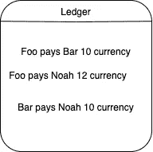
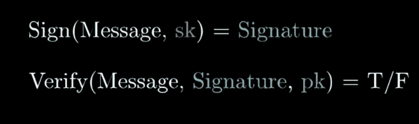
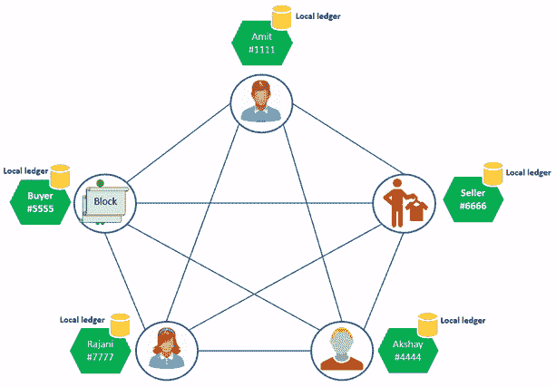
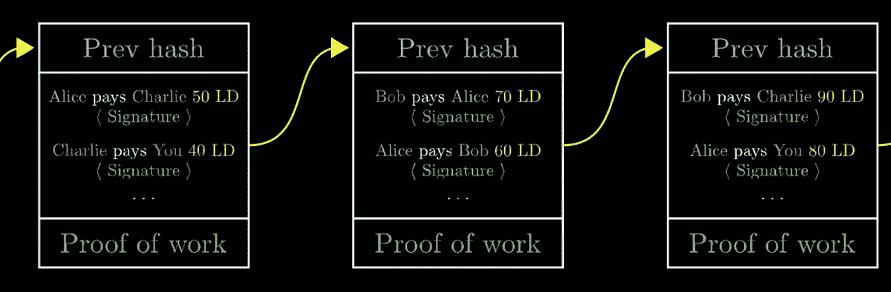
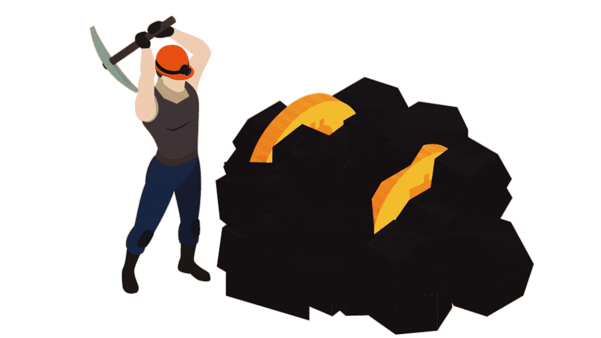

# 那么区块链和加密货币实际上是如何工作的呢？—探索网络 3

> 原文：<https://levelup.gitconnected.com/so-how-do-blockchains-and-cryptocurrencies-actually-work-exploring-web3-ea1a886ad408>

# 什么是区块链？

区块链是一种记录交易的系统，其记录方式不受任何单一实体或组织的控制，从而减少了数据被篡改的机会。由于这是一个**分散网络**，任何个人或组织几乎不可能改变节点包含的信息。所有的加密货币，如比特币、以太坊等。使用区块链技术进行操作。

要使用这些加密货币，不需要知道这些交易的基本工作方式，但非常有趣的是，要知道这些交易实际上是如何发生的，以及协议中存在哪些保护措施，使得区块链的分散系统如此可靠和可用。

我将用一个类比来说明区块链是如何工作。

## 类比

假设有一群朋友，他们经常互相换钱。他们决定在一个普通的**分类账**中维护交易，而不是实际交换现金。

> 分类账是记录账户交易的账簿。

每当有人记录一笔交易并在分类账中增加一个分录时，他们都要签名。该签名可以使用 SHA256 算法以数字方式创建。

> SHA256 由公钥-私钥对组成。密钥对只有创建签名的人知道。而公共密钥与每个人共享，以验证签名是使用该人拥有的秘密密钥创建的。这使得签名可信。没有密钥，就无法创建签名。

对于添加到分类帐的每个新条目，其他人使用公钥验证对应于该交易的签名是否有效。这确保了只有有效的交易被记录在分类账中。每个签名都是`transaction and its unique id`的散列。这确保了其他人不能以数字方式重复使用以前交易的签名。

理论上，有了这个分类账系统，就不需要实际的货币了。一个人有多少钱可以通过分类账(交易历史)找到。**是不是很有趣！这正是加密货币的含义——交易的历史。**

在上面的类比中，我使用了一个普通的分类账。但是这将使系统集中化，因为只有一台服务器维护分类帐。为了分散管理，我会让每个人都有自己的账本。

每当有交易发生时，人们就把信息广播出去，让每个人都把交易记录到他们的私人账上。

## 这个系统有什么问题吗？

是的，当然，当任何交易发生时，每个人如何确定并相信交易确实发生了。**此外，如何确保每个人都在以相同的顺序记录相同的交易？**这是由**中本聪- (** 一个开发比特币协议的不知名的人在最初的比特币论文中提出的问题。)

## 解决方案—工作证明

记录任何带有**工作证明**的块。在这种情况下，工作的证明是投入了最多计算工作量的工作。这里的想法是，如果有任何欺诈性的广播消息，它将需要不可行的计算量来欺骗系统。让我解释一下-

每个块将有一个`list of transactions`和一个`hash`。假设一个人说他发现了一个数字，使得整个块的散列以 30 个零开始。这是一个计算量很大的任务，可以说与这个**工作证明**相关联的`block`可能是真实的。

# 区块链

现在我们有了一个分布式分类账系统，我们希望有一种方法让每个人都同意什么是正确的分类账，什么是交易的顺序。核心思想是信任投入最多工作的块。分类账上的交易与工作证明一起被分成若干块。**工作证明**是添加到块中的数字，使其哈希以一定数量的 0 开始。

如果交易由发送方签名，则交易有效。如果有工作证明，区块是有效的。为了确保顺序正确，一个块包含它前面的块的散列。

如果有人改变块的顺序或块中的信息，所有随后的散列都将改变，任何人都不可能做如此大的计算工作，因此做出任何这样的改变都是不可能的。

## 因为积木是用链条连接在一起的，所以叫做区块链。

> 如果你喜欢我的博客，你可以[点击下面的按钮或者点击下面的链接](https://www.buymeacoffee.com/gouravdhar)给我买杯咖啡:[https://www.buymeacoffee.com/gouravdhar](https://www.buymeacoffee.com/gouravdhar)

# 区块链矿工

有一大群人创造积木。他们监听交易，为这些交易创建一个块，为这些块做工作证明，并广播这些块，以便每个人都可以将这些交易添加到他们的分类帐中。作为对区块创建者的奖励，对于每个被接受的区块，区块创建者被支付一定数量的加密货币。**这只是凭空而来的钱。**这叫做**格挡奖励**。

创建一个区块也被称为**采矿**，因为它需要大量的工作，并且随着每个区块被接受，新的资金被添加到系统中。创建这个区块的区块创建者被称为**矿工**。

从一个**矿工的**的角度来看，创建块是高度竞争的，因为每个人都在监听相同的事务并创建块。其区块被接受的矿工将获得奖励。

**对于监听这些块的任何人来说，当他们接收到冲突块时会发生什么？**

他们将等待一段时间并监听更多的块，较长的`blockchain`将被接受，因为它有更多的计算工作要做。

# 阻止奖励

随着矿工人数的增加，工作的挑战或证明实际上变得更加困难。对于**比特币**，矿工通常需要 10 分钟来完成工作证明，但对于其他加密货币，这个时间更短。

比特币中所有的钱都是以集体奖励的形式出现的。每完成 **210，000 块**，奖励减半。目前，对于**比特币**，一名矿工每块获得 **12.5 个比特币**。由于这个奖励减少到一半，所以只有固定数量的比特币可以存在。现存的比特币不会超过 2100 万枚**。**

矿工也可以收取采矿交易费。这种工作方式是为每笔交易，发送者可以指定一个矿工费用(可选)，这是一种明显的矿工会优先交易有更多的交易费用。

在比特币中，每个区块仅限 2400 次交易。但是这个数字对于不同的加密货币是不同的。

> 这里邀请您探索我们的博客平台**。一个让您了解软件开发和技术领域最新发展的一站式平台。我们在 [**的极客头脑**](https://www.thegeekyminds.com/) 旨在写一些你实际上可以用来提高工作效率和充实你的职业生活的内容。**
> 
> **邀请您在[**https://thegeekyminds.com**](https://thegeekyminds.com/)通过我们的平台。并订阅我们的时事通讯，以便在我们每次发布新帖子时收到电子邮件。我们承诺不会向您的收件箱发送垃圾邮件。点击下面的按钮订阅我们的时事通讯**

****