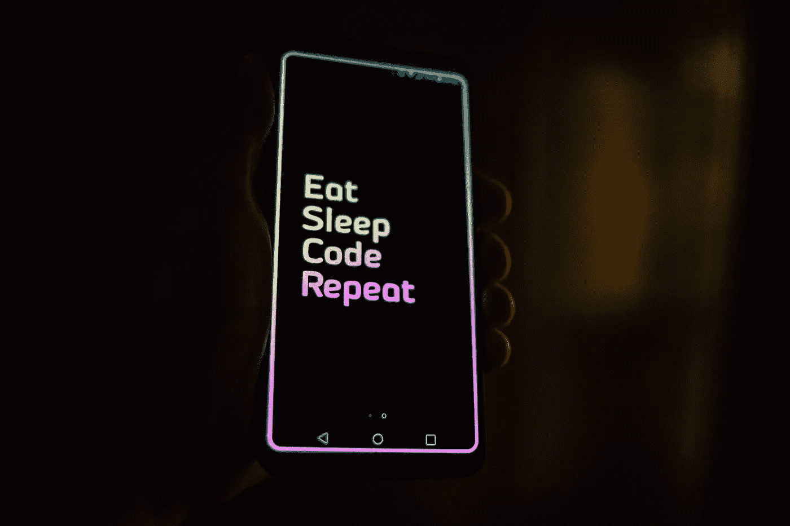
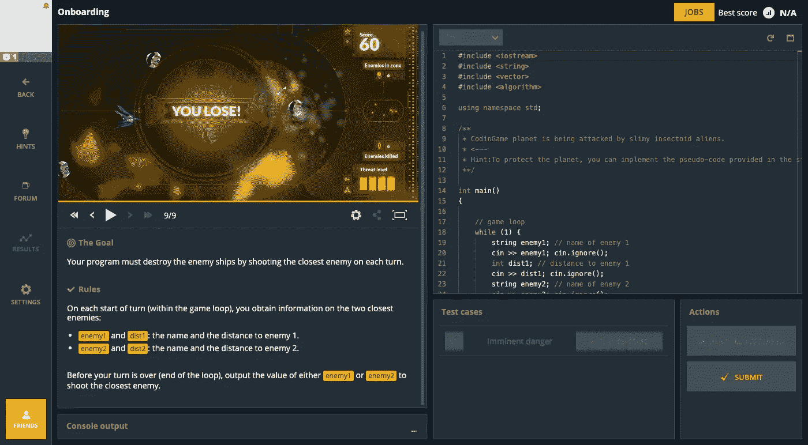
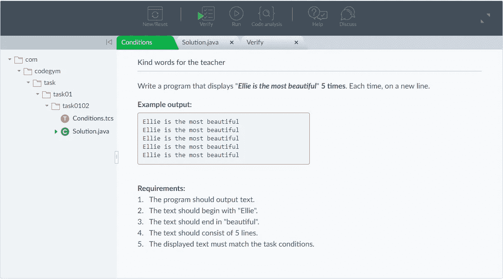
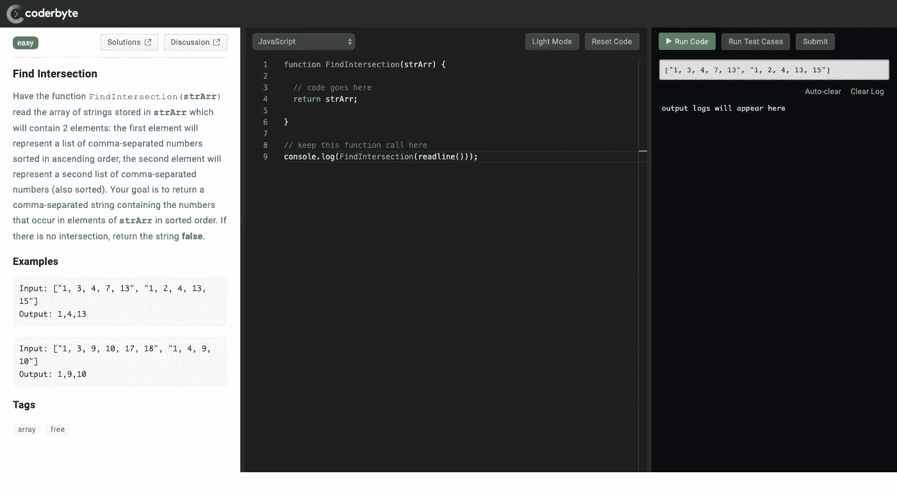
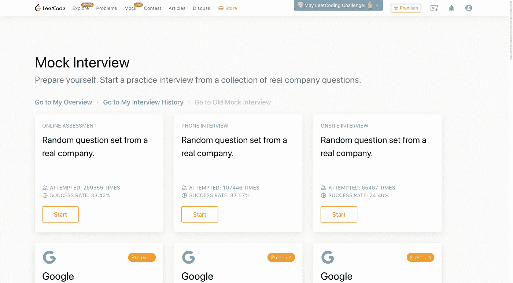

# 所以你学了一门编程语言，太好了！但是如何开始编码呢？

> 原文：<https://levelup.gitconnected.com/so-you-learn-a-programming-language-great-but-how-do-you-start-coding-5e0c1bc19e24>

每当我访问 r/programming 时，总会有一个程序员发帖说“我已经完成了 Sololearn 课程，通读了编码书籍，并完成了我的 CS 课程。我甚至能理解大多数编程笑话。那么，我已经够好了吗？”。

通常，当我看到这些帖子，然后说“不，你不是。你用代码思考的方式和你用母语思考的方式一样吗？如果没有，那就去重读《像程序员一样思考》。

通往编程语言流利的道路是漫长的，没有终点，最终你需要放弃 CS 测验，开发自己的产品，并且(我知道你一直在等待这一天)找工作。

如何摆脱一个编程学习者的不自信，成为一个专业人士？以下是对我个人历程的描述，一步一步来。

# 第一步。用选择的语言完成基本项目

看到有多少编程学生掌握了一门语言，却对一系列抽象概念一无所知，这让我很难过。这就是为什么我不厌其烦地强调简单明了的项目对于成为自信的程序员的重要性——以下是我最喜欢的几个。

# 用你正在学习的语言创建一个井字游戏

就其本身而言，这个游戏很简单，但是这个项目对建立你对编程逻辑的理解的影响是惊人的。以下是编码要遵循的规则:

*   创建一个九块瓷砖的操场
*   将“X”分配给玩家，而将“O”分配给电脑
*   添加一个弹出窗口，询问玩家他想把 X 放在哪里
*   在玩家放置一个 X 之后，电脑放置一个 O
*   确定获胜者

# 建立一个刽子手游戏(有或没有图形用户界面)

这项任务分为两个部分——将游戏的底层逻辑翻译成代码，并构建一个用户友好的界面，使玩家体验愉快。首先，让我们概述一下游戏规则:

1.  创建一个字母列表，每个列表中有 5-6 个字母，这样每场比赛都会显示一个随机条目
2.  请游戏参与者猜测所选单词的字母
3.  如果一个玩家猜对了字母，用它来填充相应的空格
4.  如果一个玩家猜错了，让他知道他有多少次尝试的机会，直到这个人被绞死

在代码中实现上述原则后，集中精力包装最终产品。因为编程不是关于创造性而是关于功能性，所以使用现成的 GUI 包是非常合适的。对于 Java，我通常使用 Swing——有许多可用的界面元素。

# 做你的研究

如果这些示例项目太简单，网上有大量的例子可以帮助你提高程序员的技能。下面是编程学生必备的平台列表。

*   [Codegym](https://codegym.cc/) 是一门 Java 学习课程，为新手和中级学习者提供数十款 Java 游戏。
*   [ZetCode](http://zetcode.com/) 分享一组令人惊艳的 Java 2D 游戏(你既可以查找多个现有项目的代码，也可以通过练习问题获得一些游戏开发的实践经验)。
*   [Codingame](https://www.codingame.com/) 是我最喜欢的实践项目之一，有超过 25 种语言版本，因为它教导开发新手承担责任。基本上，这个平台允许程序员从你的同伴停止的地方开始，为创建一个全球游戏做出贡献。

# 第二步。使用编码挑战平台

为了确保您有信心在现实世界中应用编程语言，请将软件开发教育的最后阶段致力于获得尽可能多的编码实践经验。

好消息是，有很多有用的资源可以挑战开发人员的难题和实践问题。以下是我最喜欢的几个:

# 1. [CodeGym](https://codegym.cc/) (Java)

我是一名 Java 导师和爱好者——这就是为什么我对讨论新项目特别兴奋。现在，CodeGym 是我通常引导学生去的第一个平台。首先，该资源只针对 Java 因此，开发团队对该语言的理解非常深入。

除此之外，我发现 CodeGym 提供的学习曲线结构非常好——所有练习问题都根据它们针对的概念进行分组。您可以找到许多关于 Java 语法的任务，然后继续学习集合、类型转换、OOP 和其他概念。

总共有超过 1200 道练习题——完成所有这些后，你一定会为工作面试做好准备。

# 2.Coderbyte (JS、Java、Python、Objective-C、Swift 等)

Coderbyte 可用于 10 多种编程语言，为具有不同经验和技能水平的开发人员提供了数百种语言。根据您的技能，您可以选择简单的任务(在字符串中找到最短的单词)或高级的谜题(如图形基数匹配)。

# 3. [Codechef](https://www.codechef.com/) (支持 35 种编程语言:C+ C++、Java、Python 等。)

如果想在学习过程中引入友谊赛，绝对要给 Codechef 一个尝试。该平台定期举办编程竞赛，并为 Java、Python、C 和其他流行语言提供了广泛的挑战。您可以使用工具内置的编辑器编写并检查代码的正确性(如果您问我的话，这是一个非常方便的界面)。

# 4. [LeetCode](https://leetcode.com/) (C，C#，C++，Python，Ruby，Java，JS)

如果你开始寻找编程工作，不要错过 LeetCode。这个平台是在真实世界条件下练习编码和准备雇主面试的真实交易。

LeetCode 支持七种编程语言——C、C#、C++、Python、Ruby、Java 和 JS。您可以探索该平台的两种模式——按主题分组的挑战或“模拟面试”——在这种模式下，您会受到与语言所有方面相关的编码问题的轰炸，并且只有有限的时间来回答问题。

# 5.[球体在线法官](https://www.spoj.com/)(超过 45 种编程语言，包括 Haskell、Ocaml 和深奥的语言)

SPOJ 是最大的编码实践平台之一，有超过 20k 个编程挑战。Sphere Online Judge 也定期举办黑客马拉松，允许开发者面对面交流，共同提高。

就我个人而言，我对 SPOJ 是完全对等的这一事实有异议，这意味着你不会看到官方的实践问题答案，并且必须信任其他开发人员。

# 第三步。向同行求助

即使你解决了实践中的问题，并且非常好地理解了语言的理论，要成为一流的程序员还有很多事情要做。

沉浸在编程社区中会帮助你发现专业人士通常会面临哪些挑战，哪些项目最受欢迎，了解行业内的笑话等等。

这样，当你得到第一份编程工作时，你就可以把办公室当成你的第二个家。

从哪里可以接触到程序员？我整理了论坛和交流渠道，以便与同行交流——希望这些能有所帮助。

# Reddit 频道

**通用编程**:

*   [r/编程](https://www.reddit.com/r/programming/)
*   [r/learn 编程](https://www.reddit.com/r/learnprogramming/)
*   [r/codetogether](https://www.reddit.com/r/codetogether/)
*   [r/编程工具](https://www.reddit.com/r/programmingtools/)
*   [r/gamedev](https://www.reddit.com/r/gamedev/)
*   [r/Prog articles](https://www.reddit.com/r/prograrticles/)
*   [r/webdev](https://www.reddit.com/r/webdev/)
*   每日程序设计员

**编程语言**:

*   Java: [r/java](https://www.reddit.com/r/java/) ， [r/javahelp](https://www.reddit.com/r/javahelp/)
*   JavaScript: [r/javascript](https://www.reddit.com/r/javascript/) ， [r/LearnJavaScript](https://www.reddit.com/r/learnjavascript/)
*   Swift: [r/swift](https://www.reddit.com/r/swift/)
*   目标 C:[r/目标 c](https://www.reddit.com/r/ObjectiveC/)
*   PHP: [r/php](https://www.reddit.com/r/PHP/)
*   Python: [r/python](https://www.reddit.com/r/Python/) ， [r/learnpython](https://www.reddit.com/r/learnpython/)
*   C#: [r/csharp](https://www.reddit.com/r/csharp/)
*   C: [遥控 _ 编程](https://www.reddit.com/r/C_Programming/)

# 松弛渠道

**一般**

*   **标签开发者**——Slack 上最大的编程频道。
*   欧洲开发者资源(European Dev Explorer)——一个为考虑移居欧洲国家的开发者提供帮助的渠道——涵盖就业市场、生活成本、税收等。
*   **Angular JS Chat** —最好的 Angular 开发者分享案例，回答编码问题的地方。
*   **DevOps 聊天**——最无聊的 Slack 社区之一，主要涵盖深度 DevOps 概念。

**编程语言**:

*   #红宝石
*   #php
*   #python
*   #node.js
*   #去吧

# 其他平台

以下是初学者和高级程序员通常会去的其他知名论坛:

*   这个平台在点对点论坛中独占鳌头。在这里，你可以得到一个理论问题的答案，实用的建议，以及对你的代码的良好反馈。
*   SitePoint 是另一个受 web 开发人员和设计人员欢迎的论坛——除了让你了解开发之外，在 SitePoint 上闲逛将有助于了解其他部门的同事(UI/UX、市场营销等)。).
*   [黑客新闻](https://news.ycombinator.com/) —黑客第一论坛，涵盖行业最新消息，回答问题，分享工作经验。

# 第四步。在线共享您的项目

养成一种习惯，对你完成的每个项目的代码和自述文件进行格式化，这样员工在阅读时就不会费劲了。如果你还没有一个 Github 账户，马上申请一个(对我来说，大量的 GitHub 项目是编程学生和专业人士的区别)。

如何确保您的项目准备好与全世界共享？下面是一个简短而有用的代码格式清单:

*   在自述文件中详细描述项目，让员工了解您的工作背景
*   避免粘贴现成的 StackOverflow 或 Github 代码片段。重写是可以的，但是直接使用别人写的就不行了，因为你无法详细解释代码的工作原理
*   努力命名所有的对象和变量。对于初学者来说，用奇怪的仅供内部使用的名称创建变量是很常见的，比如“0hy1”。这样的命名实践可能看起来更快——但是，从长远来看，它会使您的代码变得非常难以理解和难以维护
*   留下评论，以确保不同的程序员会理解这个项目。因为，在某个时候，你将在一家公司工作，留下评论来指导将接管项目的同事是一个必须的做法。这就是为什么最好尽早养成评论你的行为的习惯，并且只公开分享评论过的代码
*   对您的项目进行单元测试。每个人都知道单元测试是开发人员的工作，所以员工们已经开始期待候选人的工作了
*   在整个项目中坚持一致的代码结构和风格

# 结论

如您所见，学习编程语言只是您编程之旅的开始。好消息是，无论前方等待你的是什么，都是有趣和令人兴奋的，因为你终于可以构建现实生活中的解决方案，寻找有报酬的工作，并自豪地称自己为开发人员。

为了弥合学习和专业之间的差距，专注于使用理论知识解决实践问题，在线创建和共享您的项目，不要忘记访问在线开发人员社区——Stack overflow、Reddit threads 和 Slack channels。

 [## 编写面试问题

### 一个完整的平台，在这里我会教你找到下一份工作所需的一切，以及…

技术开发](https://skilled.dev)