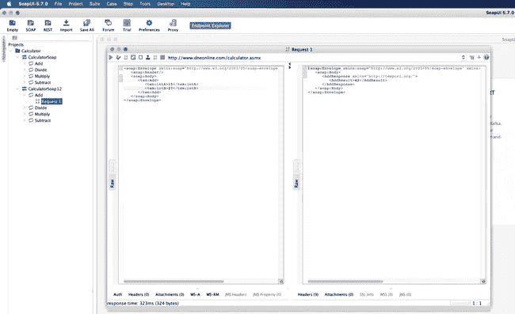
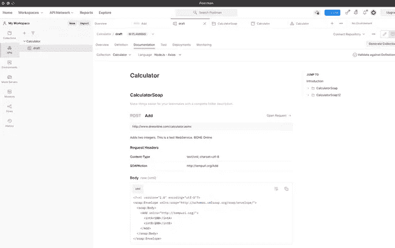
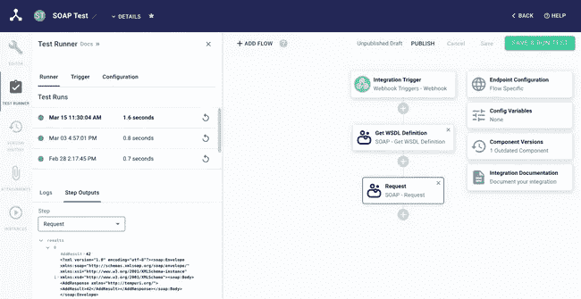

# SOAP APIs 并不可怕:在构建 SOAP 集成之前您应该知道什么

> 原文：<https://levelup.gitconnected.com/soap-apis-arent-scary-what-you-should-know-before-you-build-a-soap-integration-176c59128726>


构建与基于 SOAP 的 API 的第一次集成可能会令人望而生畏。

最近，我帮助了几家公司将他们的应用程序与使用基于 SOAP 的 API 的第三方应用程序和服务集成在一起。对于有 SOAP 经验的开发人员来说，集成轻而易举。但是对于门外汉来说，SOAP 有一个相当陡峭的学习曲线，并且抛出了许多新的术语和缩略语:XML、WSDL、信封、过程……以及其他几十个术语。

今天我想看看 SOAP 的一些基本概念，然后深入一些工具和资源，这些工具和资源使 SOAP 集成更容易构建(毕竟，SOAP 中的“S”代表“简单”)！

# 什么是肥皂？

首先，我们来谈谈一些 SOAP 基础知识。如果你想通读整个 SOAP 规范及其历史，你可以去 w3.org。我会试着给出 TL；我是医生。

最初，SOAP 代表“简单对象访问协议”它主要是为了处理 CRUD(创建、读取、更新、删除)操作而构建的，它是一个*协议*以一种*简单的*方式*访问*你的*对象*(比如库存或客户数据)。SOAP API 将公布外部服务可以获取和操作的对象类型，并准确概述第三方应该如何发出 CRUD 请求。

SOAP 已经放弃了这个缩写，因为它不仅仅做对象操作，但是思想仍然是一样的:它是两个系统以可预测的方式相互通信的协议。

# Web 服务和 WSDLs

SOAP API 提供了一个 **web 服务**。这些 web 服务由一个或多个**过程**(称为操作)组成。例如，您可以创建一个“天气预报”web 服务，它可以包括“获取 10 天预报”操作，或者“我是气象站，这是我们最新的温度数据”操作。

对每个操作的请求都采用非常特殊的输入格式，它们的响应也有可预测的格式。“get the 10 day forecast”操作可能将一个数字邮政编码作为其输入，并返回一个以华氏温度为单位的浮点温度数组，该数组是对该邮政编码未来十天的预测。

当发布基于 SOAP 的 web 服务时，会发布一个摘要 WSDL (Web 服务描述语言)文件。用 XML 编写的 WSDL 概述了服务提供的各种操作，以及每个操作可以预期的输入和响应。

让我们看一个简单的 WSDL 来实现基本的“计算器服务”WSDL ( [这里是](http://www.dneonline.com/calculator.asmx?WSDL))定义了一些基本的计算器运算(如加、减、乘、除)。计算器 WSDL 的这一部分声明该服务有一个额外的“添加”操作:

```
<wsdl:operation *name*="Add">
 <wsdl:documentation *xmlns:wsdl*="http://schemas.xmlsoap.org/wsdl/">
  Adds two integers. This is a test WebService. ©DNE Online
 </wsdl:documentation>
 <wsdl:input *message*="tns:AddSoapIn"/>
 <wsdl:output *message*="tns:AddSoapOut"/>
</wsdl:operation>
```

如果我们进一步研究这个 XML，我们会看到`wsdl:input`引用了一个消息类型`tns:AddSoapIn`。在声明一些参数的前几行，我们看到了这一部分:

```
<wsdl:message *name*="AddSoapIn">
 <wsdl:part *name*="parameters" *element*="tns:Add"/>
</wsdl:message>
```

WSDL 的这一部分引用了一个元素`tns:Add`，它在 WSDL 的另一个先前的部分中被发现。`tns:Add`元素用几个整数定义了一个复杂的输入类型:

```
<s:element *name*="Add">
 <s:complexType>
  <s:sequence>
   <s:element *minOccurs*="1" *maxOccurs*="1" *name*="intA" *type*="s:int"/>
   <s:element *minOccurs*="1" *maxOccurs*="1" *name*="intB" *type*="s:int"/>
  </s:sequence>
 </s:complexType>
</s:element>
```

现在，对 SOAP 的一个批评是它非常冗长——这个 WSDL 也不例外，但是用外行人的话来说，上面的 XML 实际上说的是“这个服务有一个`Add`操作，它接受两个整数`intA`和`intB`作为输入。”

# 使用 SOAP API

好吧…我们想调用一个加法过程，它需要两个整数。太好了。我们该如何称呼它呢？SOAP APIs 几乎总是基于 HTTP 的，所以我们需要从我们看到的 WSDL 创建一个 HTTP 请求。

SOAP APIs 总是与 XML 通信，所以我们将从添加一个将我们的`Content-Type`设置为`text/xml; charset=utf-8`的头开始。

我们发送的数据需要是 XML 格式，SOAP 将来回发送的数据包装在 SOAP **信封**中(信封定义了消息的结构)。如果我们再看看计算器 WSDL，我们可以收集信封的结构。在 SOAP 信封的“body”中，我们将声明将要运行什么过程(`Add`)，并且我们将包含该过程所期望的输入值(对于`intA`和`intB`)。我们的 HTTP 请求将会像这样结束:

```
curl http://www.dneonline.com/calculator.asmx \
  --request POST \
  --header *"Content-Type: text/xml; charset=utf-8"* \
  --data \
*'<?xml version="1.0" encoding="utf-8"?>
<soap:Envelope
 xmlns:xsi="http://www.w3.org/2001/XMLSchema-instance"
 xmlns:xsd="http://www.w3.org/2001/XMLSchema"
 xmlns:soap="http://www.w3.org/2003/05/soap-envelope">
 <soap:Body>
	<Add >
	 <intA>15</intA>
	 <intB>27</intB>
	</Add>
 </soap:Body>
</soap:Envelope>'*
```

在从我们的命令行运行 HTTP 请求后，我们得到一个同样是 XML 格式的响应，也是封装在信封中的。响应的主体包括在 WSDL 中定义的`AddResponse`，还有一个`AddResult`——我们发送给服务器的两个数字的总和:

```
<?xml version="1.0" encoding="utf-8"?>
<soap:Envelope
 *xmlns:soap*="http://www.w3.org/2003/05/soap-envelope"
 *xmlns:xsi*="http://www.w3.org/2001/XMLSchema-instance"
 *xmlns:xsd*="http://www.w3.org/2001/XMLSchema">
 <soap:Body>
  <AddResponse *xmlns*="http://tempuri.org/">
   <AddResult>42</AddResult>
  </AddResponse>
 </soap:Body>
</soap:Envelope>
```

唷……仅仅为了将两个数字相加，就需要通过 WSDL 进行大量的解析，并对 XML 模式进行修改。拥有可预测的请求和响应格式是件好事，但是缺少`xmlns` XML 属性或输入错误的操作名称会导致 SOAP 服务器拒绝您的请求。手工编写这些 XML 请求很容易出错。让我们使用一些工具来简化事情。

# 肥皂工具

显然，用眼睛手动解析 WSDL 和手写 HTTP 请求是很麻烦的，应该不惜一切代价避免。我建议使用一个 SOAP 工具，它可以为您解析 WSDL，并为您提供一个您可以调用的操作(及其输入)列表。有几个很棒的应用程序就是为此而开发的:

*   来自 SmartBear 的 SoapUI 是一个流行的工具，它为你提供了一个很棒的图形用户界面来浏览 WSDL。打开任何操作都会提供一个示例请求，您可以在他们的应用程序中填写并执行该请求:



*   流行的 HTTP 客户端 [Postman](https://blog.postman.com/postman-now-supports-wsdl/) 的最新版本也支持导入 WSDL，它甚至为您提供了预先填充的示例请求，您可以从应用程序内部将这些请求发送到 web 服务:



这些图形工具对于[探索 SOAP API](https://prismatic.io/blog/how-to-build-an-integration-to-a-third-party-app/#explore-the-api-with-an-http-client) 非常有用，我建议您在坐下来编写集成代码之前熟悉一下 web 服务的操作。一旦您对 SOAP API 的工作原理有了很好的了解，就该转向代码了。

# 编写与 SOAP APIs 交互的代码

手动解析 WSDL 和手写 HTTP 请求容易出错，而且通常是一种糟糕的体验。您肯定不想求助于用字符串文字模板化 XML。让我们在编写与基于 SOAP 的 web 服务交互的代码时避免这种情况。

无论您是使用 Python、NodeJS、C#还是任何其他现代编程语言，都很有可能有一个 SOAP 库可以用来简化 web 服务操作的调用。例如，在 NodeJS 中，您可以在 NPM 上找到名副其实的 [soap](https://www.npmjs.com/package/soap) 包。

这个库可以将 WSDL 的 URL 作为参数，这样就创建了一个功能完整的 HTTP 客户端对象，它可以调用 web 服务的任何操作。我们可以执行类似于`client.Add`的操作来调用“Add”操作，传入几个输入参数，其余的(解析 WSDL，格式化信封中的 XML 请求，反序列化 XML 响应，等等。)为您办理。只用了半打代码行(我不算括号！)，我们可以向计算器 API 发出请求:

```
var soap = require(*"soap"*);
const wsdlUrl = *"http://www.dneonline.com/calculator.asmx?WSDL"*;
const args = { intA: 15, intB: 27 };
soap.createClient(wsdlUrl, function (err, client) {
  client.Add(args, (err, result) => {
    console.log(*`The API returned a sum of* ${result.AddResult}*`*);
  });
});
```

对我们请求的响应包含一个`AddResult`属性，我们的函数打印出`The API returned a sum of 42`，就像我们期望的那样。

# 进一步提取 SOAP

如果您正在构建将您自己的产品连接到您客户使用的其他应用程序的集成，像[prism](https://prismatic.io/)这样的嵌入式集成平台即服务(嵌入式 iPaaS)可以抽象出与 SOAP APIs 交互的大部分复杂性。嵌入式集成平台包括低代码集成构建器，为流行的基于 SOAP 的应用程序(如 Salesforce)预建了连接器，这完全消除了编写代码与许多基于 SOAP 的 API 进行交互的需要。

对于不太常见的没有内置连接器的基于 SOAP 的 API，它们通常提供一个 SOAP 组件，抽象出发出 SOAP 请求的复杂性:



在许多情况下，您可以利用嵌入式 iPaaS 与基于 SOAP 的 API 进行交互，而只需编写很少的代码，甚至不需要编写代码。

# 结论

显然，calculator web 服务非常简单，但是我认为它很好地说明了 SOAP web 服务最初看起来是多么令人生畏，但是使用正确的工具，构建与基于 SOAP 的 API 的集成是相对干净和简单的。