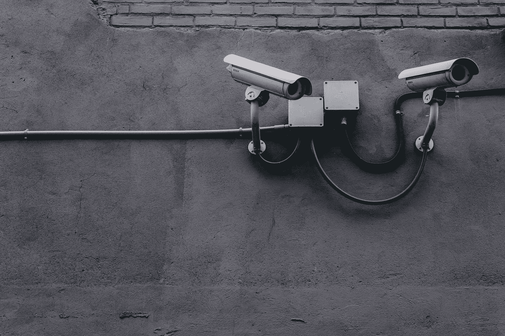
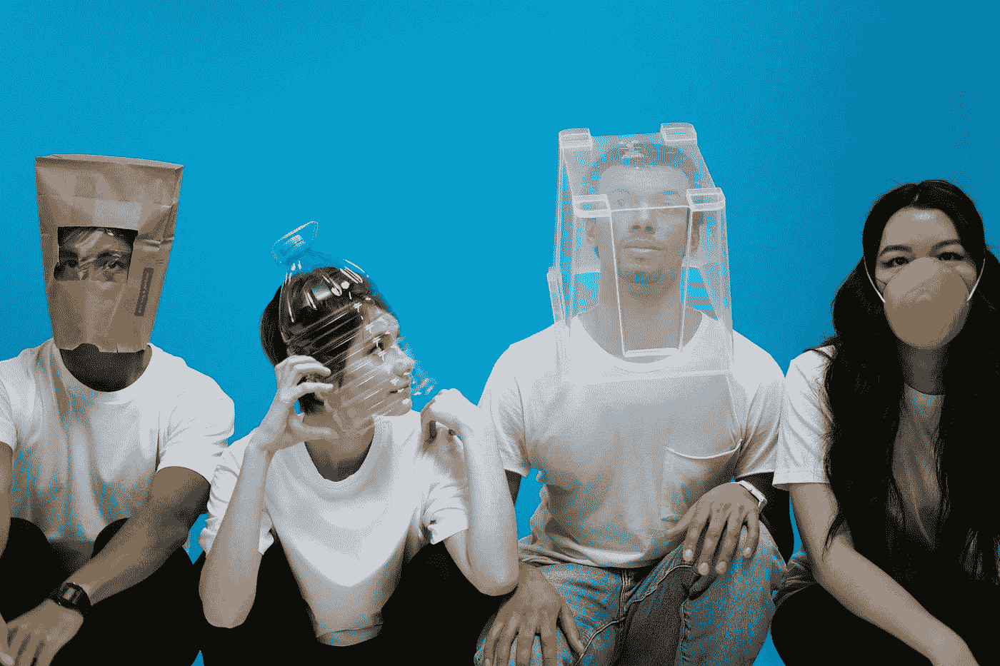
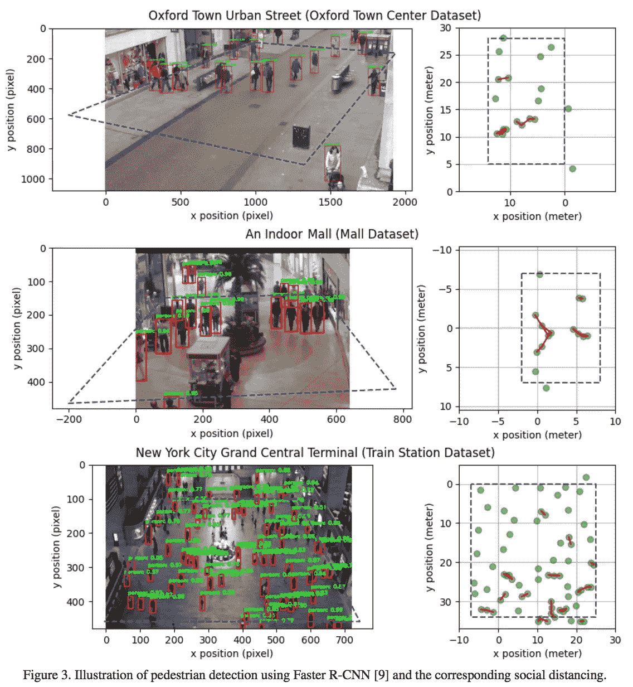
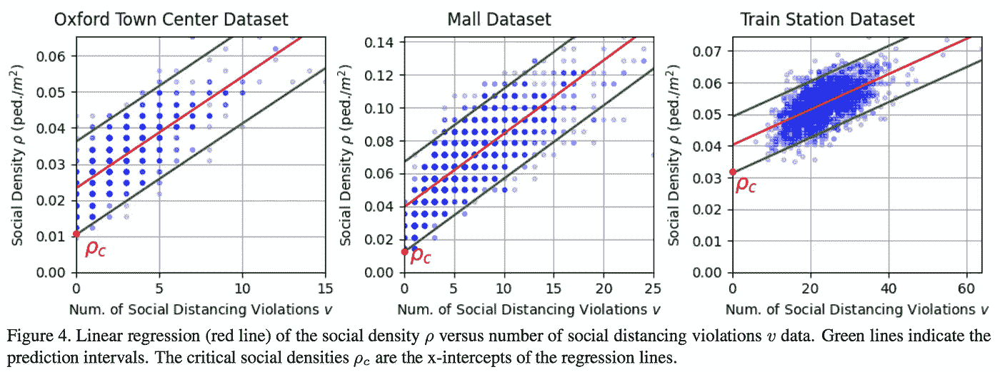
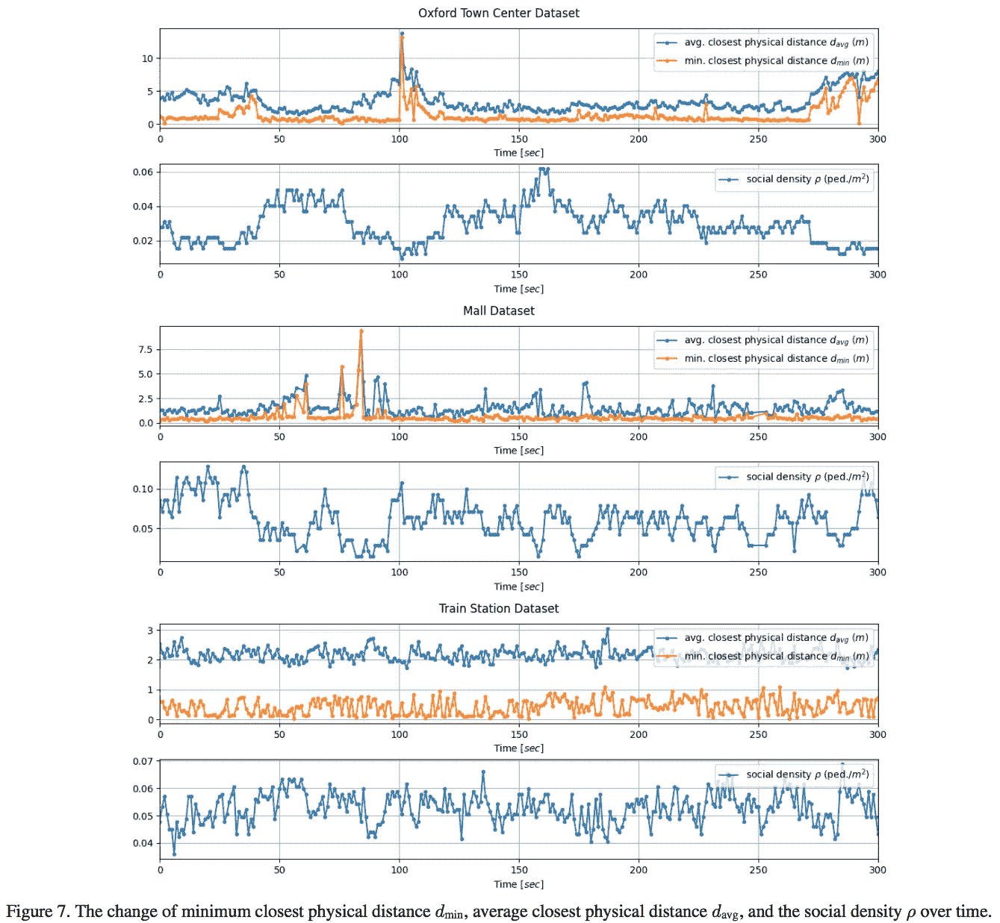

# 用深度 CNN 和线性回归解决社交距离？

> 原文：<https://levelup.gitconnected.com/social-distancing-solved-with-deep-cnns-and-linear-regression-df234b7e3b0c>

## 我对俄亥俄州立大学一篇关于使用深度 CNN 和线性回归的基于视觉的社交距离和临界密度检测系统的论文的看法

照片由来自[佩克斯](https://www.pexels.com/photo/equipment-pavement-security-security-camera-430208/?utm_content=attributionCopyText&utm_medium=referral&utm_source=pexels)的[斯科特·韦伯](https://www.pexels.com/@scottwebb?utm_content=attributionCopyText&utm_medium=referral&utm_source=pexels)拍摄

如果你住在美国，你可能已经被某种形式的“呆在家里”命令 5 个月了(快 6 个月了！).这比世界上任何一个国家孤立 T4 的时间都长。

为什么我们被封锁了？

> 来减缓扩散对吗？

嗯……是的……但是我们所有人陷入孤立的主要原因，实际上是为了给政府争取时间来制定一个攻击计划，以解决很多很多的后续影响(健康、社会、经济等)。)全球疫情发起的。

这段时间不仅仅是躲起来，直到“传播减缓和/或停止，直到它完全消失才重新开放”，而是实际上提出，**和部署，**措施，允许安全，逐步重新开放。

我们可以采取两种简单而有效的方法来控制疫情的蔓延，让疫情安全地重新恢复。

1.  戴上面具
2.  社交距离

与普遍的看法相反，这两件事不是政治声明。

照片由 [cottonbro](https://www.pexels.com/@cottonbro?utm_content=attributionCopyText&utm_medium=referral&utm_source=pexels) 从 [Pexels](https://www.pexels.com/photo/people-wearing-diy-masks-3951628/?utm_content=attributionCopyText&utm_medium=referral&utm_source=pexels) 拍摄

我最近一直在阅读正在进行的研究，以提出创新的想法，解决大规模测试的部署，隐私相关的接触追踪方法和短期社交距离协议，以在工作场所和公共场所实施。

在锁定的最初几个月，应该听取这些想法，但是让我们试着不要沮丧和纠结于过去，而是着眼于未来…

现在，这不是一个

> 我们应该重新开业吗？

而是一个

> 我们是有计划地重开呢，还是没有计划？

没有计划的重新开放将意味着我们将永远处于一种忽冷忽热的状态，时而孤立，看不到真正的结束。

我想分享我读到的一篇论文的结果，该论文提出了一种基于视觉的社交距离和临界密度检测系统。

我想把重点放在这方面的技术实现上，而不是“我们是否应该这样做”的社会和政治争论。但我确实认为看到有人努力工作，试图找到解决方案，让我们度过难关，这很有趣(也令人耳目一新)!

# 论文:

[本文](https://arxiv.org/abs/2007.03578)的标题为*‘新冠肺炎基于视觉的社交距离和临界密度检测系统’*，作者为杨东方、Ekim Yurtsever、Vishnu Renganathan、Keith A. Redmill 和俄亥俄州立大学哥伦布分校的üMIT ozgüner。

我想澄清的是，我只是在转述这项工作的方法和结果，这肯定不是我的工作(引用如下)。

# 动机

作者承认，个人不习惯跟踪自己与他人之间所需的 6 英尺距离，视听系统可以帮助提醒平民任何社会距离侵犯。他们还承认需要控制社会密度，该系统还努力控制流入超过一定社会密度阈值的地区的人口。

该论文提出了一种“基于人工智能的实时社会距离检测和警告系统”。这项工作的优先事项是

1.  通过不记录/缓存任何数据来确保平民的隐私
2.  确保警报系统不针对个人(这不是为了羞辱别人)
3.  在检测/报警回路中没有人工监管
4.  代码应该是开放源代码的，并且可以公开透明

# 方法简单地说:

该方法旨在解决两个感兴趣的领域:

1.  社会距离检测
2.  社会密度检测

这项工作利用固定的单目摄像机捕捉感兴趣区域的图像，然后使用预训练的深度卷积神经网络(CNN)进行对象检测。在这个场景中，唯一感兴趣的类标签是“person”。你可以阅读更多关于这项工作中使用的两种 CNN 方法:[更快的 R-CNN](https://arxiv.org/pdf/1506.01497.pdf) 和 [YOLOv4](https://arxiv.org/pdf/2004.10934.pdf) 。

使用简单的线性回归模型来确定临界社会密度值。

该系统在三个行人拥挤的数据集上进行了测试:纽约中央车站、一个室内商场和牛津一个繁忙的城镇中心(城市街道)。

“场景”被定义为一个 6 元组的对象:

1.  **I:** 由固定单目摄像机捕获的图像矩阵(包含图像的高度、宽度和 RGB)
2.  A₀:感兴趣区域的面积
3.  dᶜ***:社交距离的最小物理距离(通常为 6 英尺)
4.  c₁:二元控制发送非侵入性线索，如果任何两个人之间的距离小于 dᶜ
5.  用于社会密度检测的 c₂:二元控制。如果社会密度高于某个阈值𝝆，则设置为 1，并提示信号控制流入该区域。
6.  U₀:在给定临界社会密度值(𝝆ᶜ)的情况下，确保违反社会距离的概率保持在以下的概率阈值，例如 U₀ = 0.05 表明𝝆ᶜ的违规概率为 0.05。

# 实施:

这个系统的实施可以归纳为三个步骤****:

## 第一步:

确定每个数据集的透视变换矩阵 M。这就是如何从图像中确定感兴趣区域的真实尺寸。该转换矩阵的结果可以在下图中看到，其中感兴趣的区域(以及“人”标记的对象)从图像转换到现实世界的维度，并投射到 *x-y* 平面上。

引用:[论文](https://arxiv.org/pdf/2007.03578.pdf)第 5 页图 3。杨，尤尔特西弗，伦加纳坦，雷德米尔，奥兹居纳。

有关如何确定每个数据集的面积的详细信息，请参见第 5.1 节。报纸的。

## 第二步:

在部署深度 CNN 模型来检测该区域中的“人”类对象之后，这些对象也从它们的图像坐标转换到现实世界的坐标系统，如上图右侧所示。“真实世界”坐标平面上的点被计算为由所使用的 CNN 方法确定的盒子边界的下边缘的中点。

## **第三步:**

按照步骤 1 和 2，可以计算𝝆ᶜ、dᵤ,ᵥ和 *v* 的值，其中

> *𝝆ᶜ是临界社会密度值，*
> 
> *dᵤ,ᵥ是行人* u *和* v *(文中用的* i，j *)和*之间的距离
> 
> v *是感兴趣区域在任何特定时间的违规次数。*

为了确定 6 元组“场景”对象的值，需要计算𝝆ᶜ、dᵤ,ᵥ和 *v* ，这最终确定了系统的操作。

> dᵤ,ᵥ

一旦计算出每个人对象的真实坐标，我们将拥有一组二维向量 P，表示每个人的坐标。从这里，我们可以计算每个可能的人的组合之间的欧几里德距离(u，v)。然后，这些距离将用于与 6 元组中的 dᶜ值进行比较，以确定社交距离违规。

我们还可以计算每个人与其他每个人之间的最小物理距离，以及每个人所有最小距离的平均值。

> v

现在我们有了所有的 dᵤ,ᵥ值，就可以计算出违反社交距离的次数( *v* )。

这是通过取所有 dᵤ,ᵥ的和来完成的，使得 dᵤ,ᵥ < dᶜ.

The function here being piece-wise, that

if dᵤ,ᵥ < dc, then vᵤ,ᵥ = 1 and

if dᵤ,ᵥ≥ dc, then vᵤ,ᵥ = 0.

So we then have that

*v* = 𝚺(vᵤ,ᵥ)

—这是使用我自己的符号，它总结了论文的符号/解释(见第 4.4 节)。的论文)。

> 𝝆和𝝆ᶜ

𝝆是社会密度的量度，

𝝆 =行人数量/米

发现𝝆和 *v* 具有线性关系(如下图所示),因此采用简单的线性回归模型来确定𝝆ᶜ.的值

𝝆ᶜ是确保违反社交距离的概率保持低于 U₀的值(如在 6 元组“场景”定义中所发现的)。

一旦线性回归模型被拟合，𝝆ᶜ就被确定为 95%置信区间的下限，其中 *v* = 0(即，没有社交距离违规)。

引用:[论文](https://arxiv.org/pdf/2007.03578.pdf)第 6 页图 4。杨，尤尔特西弗，伦加纳坦，雷德米尔，奥兹居纳。

还发现𝝆和每个人的最小平均物理距离有很强的负相关性。这是有道理的，因为如果社会密度低，你会期望人们之间的最小距离更大(即不违反社会距离)，反之亦然。您可以在下图中看到这一点:

引用:[论文](https://arxiv.org/pdf/2007.03578.pdf)第 8 页图 7。杨，尤尔特西弗，伦加纳坦，雷德米尔，奥兹居纳。

# 结论

正如你所看到的，这是一个简单而有效的系统实现，可以真正帮助人们和企业的社交距离。一些大公司已经在他们的工作场所采用这样的系统，以使他们的员工在想要/需要返回工作岗位时更加安全。

也许，作为第一步，这样的系统可以更容易地在工作场所、办公室环境中实现。由于零售、商业和公共场所有其自身的细微差别，一开始在公共场所实施可能会比较困难。

文件中指出的一个局限是它没有考虑群体。这可能是系统中的一个主要缺陷，需要在公共使用中加以克服，因为人们经常成双成对地或成群结队地购物和旅行，因此如果系统无法检测到群体，它会不断地警告该地区的违规行为。

我对群组检测问题的一个简单解决方案是基于时间的解决方案(假设系统是基于实时数据的)。可能实现某个时间阈值，使得如果人坐标停留在某个预定距离内超过某个时间阈值，则他们被认为是相关的“组”。当然，这也有它自己的细微差别，但可能是一个开始解决群体检测问题的地方。

有许多像本文中详述的想法，提出了安全地重新开放经济的方法。我希望你和我一样喜欢读这篇文章。

我希望我们能继续对这个问题保持好奇，并利用我们在这个世界上拥有的一些最好的大脑！

在外面注意安全！

## 脚注:

*   *我这里说的“安全”非常宽泛…
*   * *引用:摘要，第 1 页，第 2 段
*   * * *在论文中实际标注为“d 下标 c ”,但在介质中无法得到下标 c…
*   * * * *为了这篇博客文章，我当然简化了这些步骤！

## 论文引用:

yang2020visionbased，题目:*一个基于视觉的新冠肺炎社交距离和临界密度检测系统*，作者:{杨东方和 Ekim Yurtsever 和 Vishnu Renganathan 和 Keith A. Redmill 和üMIT ozgüner }，年份:2020，eprint: {2007.03578}，archivePrefix: {arXiv}，primaryClass: {eess。四}