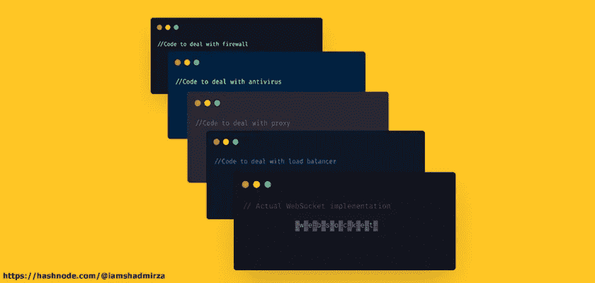
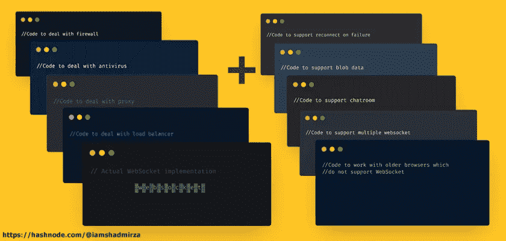
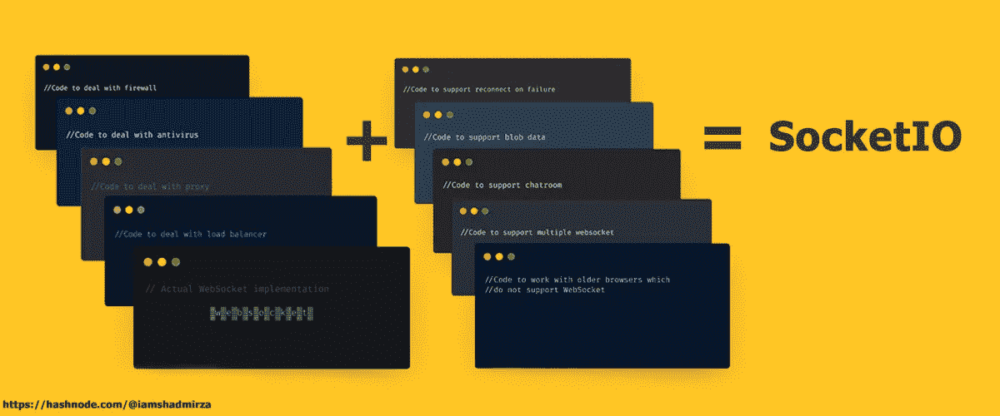
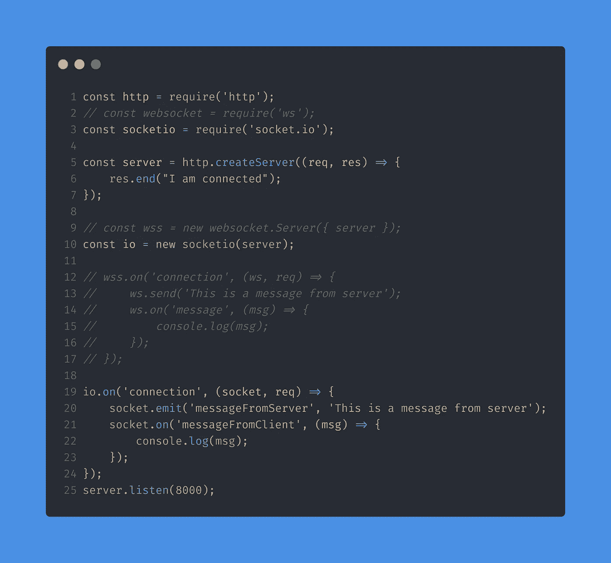
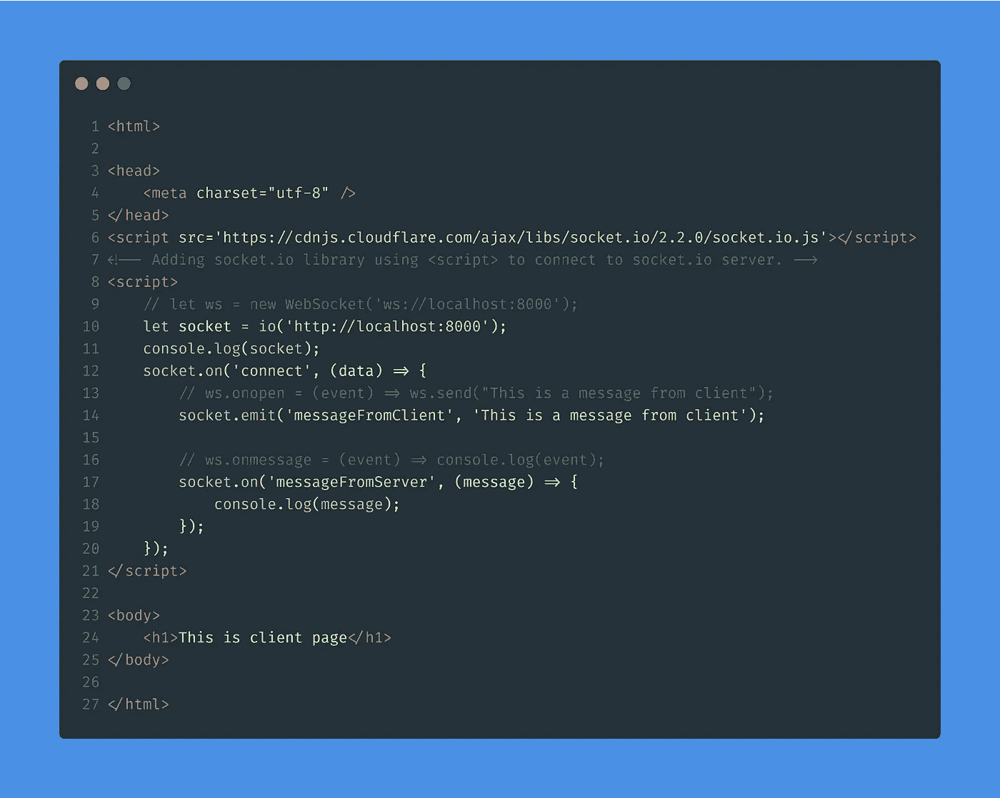

# 插座。木卫一——什么、为什么和如何？

> 原文：<https://levelup.gitconnected.com/socket-io-what-why-and-how-ffdf5c2c863a>

这是系列文章 **WebSockets 简化版**的第二篇博文。如果你没有看过第一部分，看看这里的。你必须读完第一部分才能更好地理解这一部分。同样，目标是让事情尽可能简单。所以我会用不同的方式来探讨这个话题。我们开始吧。

在前一篇文章中，我们成功地构建了我们的基本 WebSocket 服务器和客户端，并且它是功能性的。所以你可能想知道为什么要用 socket.io？如果没有它也能正常工作，为什么还要使用一个臃肿的库呢？让我们考虑这个场景:

假设你的老板告诉你在网站上添加实时通信，你决定使用本地 WebSocket 而不是任何库。
你正确地编写了 WebSockets 代码，除了之外，大部分都运行良好*。测试显示还有一些问题。*

经过一些调试，你发现当这个人在一个*防火墙*或者一个*杀毒软件后面时，它就不起作用了。*

> *在有防火墙和防病毒软件的情况下，WebSocket 不能理想地工作。*

您还发现，如果客户端位于代理或负载平衡器之后，那么 WebSocket 也不会工作。

> *WebSocket 在存在代理和负载平衡器的情况下也不能理想地工作。*

这意味着你必须自己处理所有这些问题。您工作了几个小时并添加了额外的代码来解决所有这些问题，您的 WebSocket 连接终于正常工作了。查看我们目前所做工作的可视化展示:

现在假设服务器由于某种原因关闭，连接断开。在这种情况下，浏览器现在处于理想状态，不做任何事情，因为握手对于建立连接是必要的。所以你现在还有一件事要做:

> *如果由于服务器故障或其他原因断开连接，Websockets 应自动重新连接。*

所以现在你添加了更多的代码来解决这个问题。很好，你是一个非常好的开发者。

你的老板赞赏你的努力，但是现在他告诉你也要增加对图像(blobs)的支持。

> *注意:到目前为止，我们发送的是 JSON 数据(纯文本)。*

不仅如此，你还必须为群聊添加聊天室，多个端点，这样你就可以连接多个 WebSockets。此外，可能有一些旧的浏览器不支持 WebSockets，所以你也必须注意这一点。

现在看起来很多了，不是吗？

通过更多的代码和艰苦的工作，你也解决了这些问题。现在，您的 WebSocket 实现如下所示:

你猜怎么着，这整个集合其实就是你说的[插座。IO](https://hashnode.com/util/redirect?url=http://Socket.IO) 。看看下面的图片，让事情变得一清二楚。

*Socket.io* 在幕后使用 WebSockets，处理所有这些问题，这样我们就不用自己处理了。它只是原生 WebSocket 上的一个包装器，提供了一堆其他很酷的特性，使我们作为开发人员的工作变得容易。

# socket.io 概述

插座。IO 是一个用于实时 web 应用程序的 JavaScript 库。它支持 web 客户端和服务器之间的实时双向通信。

插座。IO 主要使用带有 ***轮询的 WebSocket 协议作为回退选项*** ，同时提供相同的接口。虽然它可以简单地用作 WebSockets 的包装器，但是它 ***提供了更多的功能*** ，包括向多个套接字广播、存储与每个客户端相关的数据以及异步 I/O

> 注意:再读一遍，特别注意粗体字。我们已经在“为什么”部分讨论过了。现在说得通了吧？

我们将了解 Socket 的核心特性。本系列的第三部分。让我们转换我们的 WebSocket 客户端和服务器文件(在[第一部分](/websocket-simplified-b532f266cc9f)中创建)来使用 Socket。木卫一快。

# 怎么会？

我假设你已经阅读了[第一部分](/websocket-simplified-b532f266cc9f)，并且知道本地 WebSockets 的工作原理。让我们快速升级到 Socket.io。

> *注释代码是 WebSocket 用法。我加了比较。*

# 计算机网络服务器

**解释**

1.  我们不是导入`websocket from ‘ws’`，而是导入`socketio from ‘socket.io’`库。
2.  创建一个服务器并交给`socketio`而不是`websocket`。
3.  代替`send`，我们现在在`io`对象上使用`emit`函数。唯一的区别是我们添加了*事件名*作为第一个参数。我们将使用这个*事件名*在客户端检索消息。
4.  方法“开”仍然有效，唯一的区别是增加了*事件名称*。够简单吗？

# 客户

**解释**

1.  正在导入“socket.io”库，因为它不是由 JavaScript 现成提供的。这将公开“io”命名空间。
2.  为 io 连接提供 URL。(与 WebSocket 用法不同，我们没有使用新键盘，因为它是可选的。你想不想用由你决定。)
3.  “发送”再次被“发出”代替，我们添加了事件名称(检查服务器部分的第 21 行)。
4.  方法“on”仍然是相同的，只是增加了*事件名称*(检查服务器部分的第 20 行)。有道理？

干杯！我们已经创建了简单的套接字。IO 服务器和客户端。

我尽量让事情变得简单。我们将深入探讨[插座。本系列第三部 IO](https://hashnode.com/util/redirect?url=http://Socket.IO) 。让我知道这是否有帮助。
鲥鱼

# 参考

*   插座。IO 服务器 API—[socket.io/docs/server-api](https://hashnode.com/util/redirect?url=https://socket.io/docs/server-api/)
*   插座。IO 客户端 API—[socket.io/docs/client-api](https://hashnode.com/util/redirect?url=https://socket.io/docs/client-api/)

*最初发布于*[*https://iamshadmirza . hashnode . dev*](https://iamshadmirza.hashnode.dev/socketio-what-why-and-how-cjyb5k1k6000cbes17g4yasd2)*。*