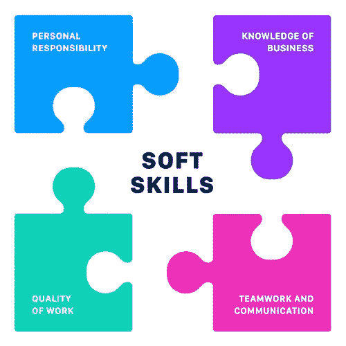
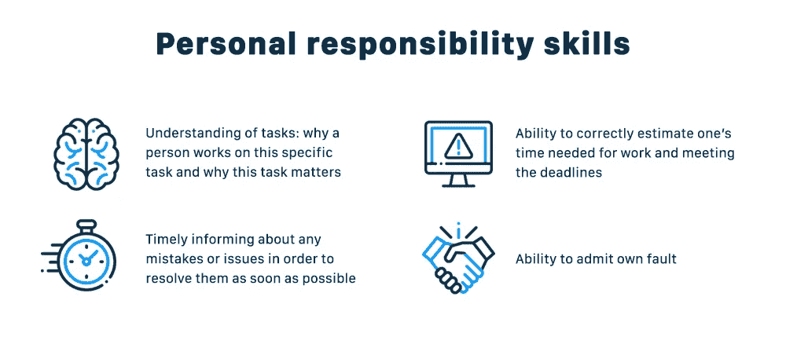
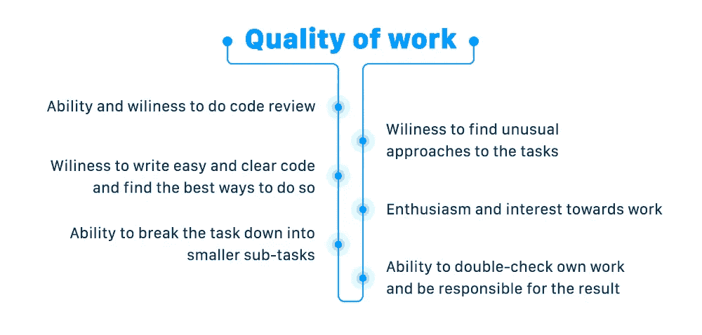
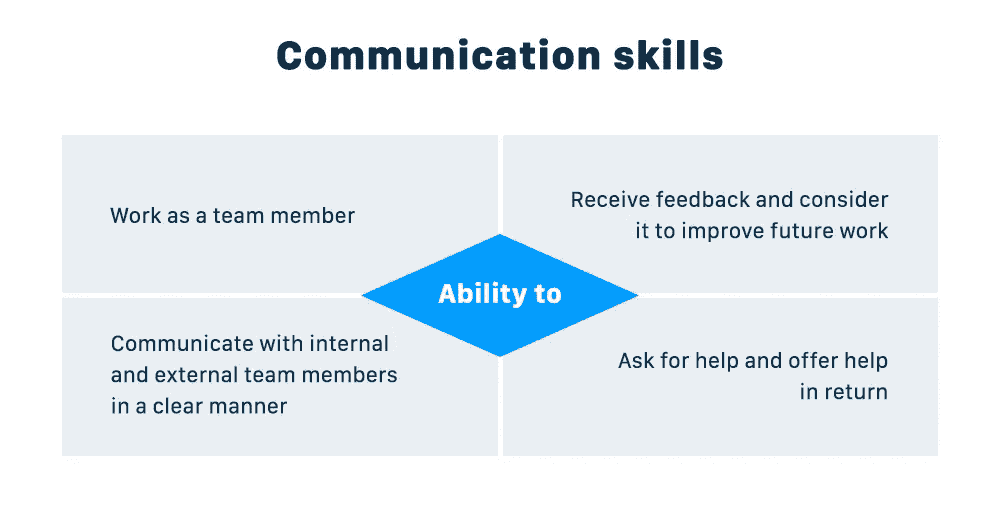
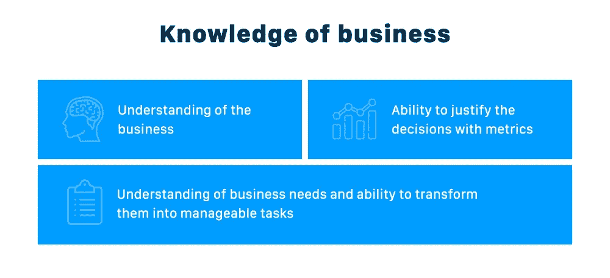

# 开发人员的软技能:为什么它们很重要，哪些是最重要的？

> 原文：<https://levelup.gitconnected.com/soft-skills-for-developers-why-do-they-matter-and-which-ones-are-the-most-important-859afe8fa05a>

对于 [**开发者**](https://dashbouquet.com/blog/management/philosophy-of-development-rules-we-live-by) 来说，技术和软技能都很关键。

虽然雇主首先会看技术背景和使用特定工具的经验，但软技能决定了这个人是否适合团队。

但是到底什么是“软技能”，你如何确定哪些是真正重要的？让我们找出答案。

# 定义软技能及其重要性

如果我们查阅牛津词典，我们会得到如下定义:“使某人能够与其他人有效和谐地互动的个人属性”。

换句话说，软技能是帮助人们实现其潜力并与其他人有效互动的个人特质。它可以是同理心的水平、团队工作的能力、热情的程度等等。

但是这些技能真的会影响开发人员的工作吗？

事实上，是的——而且很多。

思考以下问题。在软件开发中，项目是一组人的共同任务，他们必须并肩工作，相互支持，朝着一个目标前进。因此，如果一个人过于傲慢，对工作没有任何热情，或者不能够有效地沟通，这不仅会对他的工作产生负面影响，而且会通过推迟工作或搞砸某些部分来对整个项目产生负面影响。

既然我们已经清楚了什么是软技能以及为什么它们很重要，那么让我们继续讨论对任何软件开发人员来说都非常可取的实际技能列表。为了更好地组织和理解，我们将把它们分成几个部分。

# 个人责任

承担责任的能力至关重要。例如，如果这个人承认了他的错误，识别错误并解决问题会更容易更快，而不是花费宝贵的时间去找出谁是负责人。

以下是一些与个人责任相关的技能:

所有这些软技能将有助于更快地识别任何错误，确保团队中的每个人都理解他们的任务，并保证无缝的工作流程。

# 工作质量

编码是任何开发项目的核心。它的质量不仅依赖于技术，也依赖于软技能。

一个充满热情和兴趣的开发者会比一般的开发者提供更好更高效的解决方案。虽然大多数人都是在众所周知的工具的帮助下做他们被告知要做的事情，但是一个热情的开发人员会花费一些时间和精力来提出一个不寻常的解决方案，这个解决方案会工作得更好。

# 团队合作和沟通

客户有一定的需求，软件开发人员需要理解这些需求，并将客户的想法转化为成熟的软件。以下是需要的技能:

任何沟通问题都可能严重影响项目，甚至伤害项目。如果一个人不理解需求并且犹豫再三检查它们，这将导致时间和资源的损失，因为这个人将在错误的任务上浪费时间。

# 商业知识

没人说开发人员必须做商业分析，并在商业策略问题上咨询客户。然而，一个好的项目领导应该对行业有一个扎实的了解，以便提供最佳的解决方案。

例如，如果团队已经有了类似的经验，通过向客户提供类似的解决方案，可以节省大量时间。同样，如果一个团队知道什么是特定行业的最佳解决方案，这就增加了它的可靠性。

# 总结

[**软件开发**](https://dashbouquet.com/blog/management/philosophy-of-development-rules-we-live-by) 是一个竞争异常激烈的行业。虽然几乎所有的开发人员都可以执行一般的任务，但是真正优秀的项目是由热爱他们所做的事情的人创建的，他们总是努力学习更多的东西，以便不断掌握他们的技能。

在[**dash bounk**](https://dashbouquet.com/)，我们热爱我们所做的事情——这是我们所有项目背后的驱动力。

[*德米特里·布德科*](https://www.linkedin.com/in/dmitrybudko/%5C)