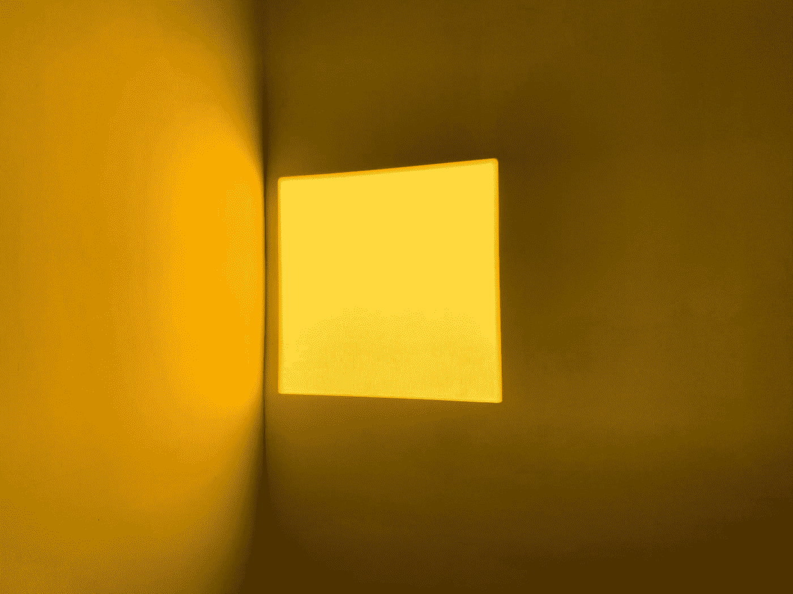

# 软件抽象:正方形是长方形吗？

> 原文：<https://levelup.gitconnected.com/software-abstractions-is-a-square-a-rectangle-494bf957f353>

## *软件抽象本质上并不反映现实世界。*



文森特·拉维尼亚在 [Unsplash](https://unsplash.com?utm_source=medium&utm_medium=referral) 上拍摄的照片

大多数人，甚至是孩子，都能明确地回答这个问题。是的，正方形是矩形的子类型；因此，它是一个所有边都相等的长方形。

那么，为什么这个问题会让有经验的软件开发人员踌躇不前呢？

我们在这里学习一个警示性的故事，软件抽象是困难的，即使它们看起来很容易。

在正方形/矩形的例子中，一个有经验的软件开发人员会说正方形不是矩形，原因很简单。让我们比较一下类`Rectangle`和`Square`的抽象。

```
class Rectangle {
  length: number;
  width: number; getArea(): number {
    return this.length * this.width
  }
}class Square {
  size: number; getArea(): number {
    return Math.pow(this.size, 2)
  }
}
```

这两个类是不一样的，因为前者的属性是`length`和`width`，后者的属性是`size`。所以，如果我们尝试`Square extends Rectangle`甚至`Rectangle extends Square`，我们打破了各种最佳实践；来自固体的[利斯科夫-替代原理](https://en.wikipedia.org/wiki/Liskov_substitution_principle)和[是-关系](https://en.wikipedia.org/wiki/Is-a)法则。因此，正方形不是长方形。

另一方面，说这两个阶级之间没有关系也是错误的。他们共享什么软件属性？他们都有方法`getArea`。

那么，我们如何在软件中建立这些联系而不破坏利斯科夫替代原理或 is-a 关系呢？

```
interface Shape {
  getArea(): number;
}class Rectangle implements Shape {...}class Square implements Shape {...}
```

[界面偏析原理](https://en.wikipedia.org/wiki/Interface_segregation_principle)，来自固体，来自救援。该原则鼓励更小、更具体的接口。

对于这个例子，接口`Shape`将包含在`Rectangle`、`Square`和其他未来形状之间共享的属性。这样，我们就满足了利斯科夫替代原理和 is-a 关系规则。

让我们通过考虑现实世界中所有不同的形状来仔细检查这个解决方案。例如，球体是具有体积的形状。然而，长方形和正方形没有体积。所以我们的抽象，尽管是通过我们对现实世界的了解，却有了错误的名称。

抽象和它们的名字应该有意义。

所有这些都是说，抽象是困难的，所以不要厌倦创造它们。

*旁注。参见文章“*[](https://henrietteharmse.com/2015/04/18/the-rectanglesquare-controversy)**”对这一具体用例的进一步解释。**

```
*interface Quadrilateral {
  getArea(): number
}class Rectangle implements Quadrilateral {
  length: number
  width: number getArea(): number {
    return this.length * this.width
  }
}class Square implements Quadrilateral {
  size: number getArea(): number {
    return Math.pow(this.size, 2)
  }
}*
```

**上面的方案最好，但不是重点。我跑题了。**

*软件抽象本质上并不反映现实世界，同时，我们也不能将我们的软件抽象与现实世界完全分离。这个警示性的故事是为了鼓励正确的命名，遵循最佳实践，如坚实的原则，并允许一定程度的重复，直到“啊哈！”你有那一瞬间的清醒。*

*在以后的文章中，我将深入探讨后者，解释只要我们继续清理代码，通过复制发现抽象是可以的。*

# *分级编码*

*感谢您成为我们社区的一员！在你离开之前:*

*   *👏为故事鼓掌，跟着作者走👉*
*   *📰查看[升级编码出版物](https://levelup.gitconnected.com/?utm_source=pub&utm_medium=post)中的更多内容*
*   *🔔关注我们:[Twitter](https://twitter.com/gitconnected)|[LinkedIn](https://www.linkedin.com/company/gitconnected)|[时事通讯](https://newsletter.levelup.dev)*

*🚀👉 [**将像你这样的开发人员安置在顶级创业公司和科技公司**](https://jobs.levelup.dev/talent/welcome?referral=true)*