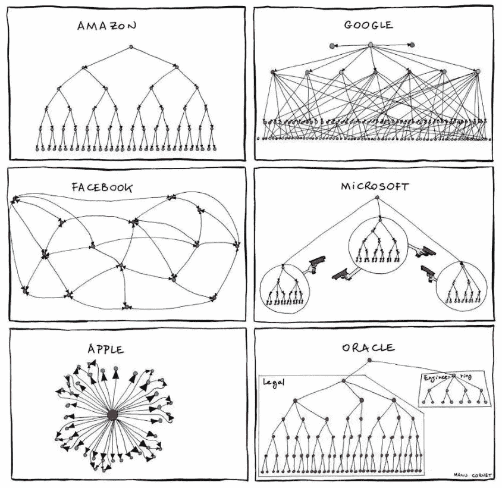
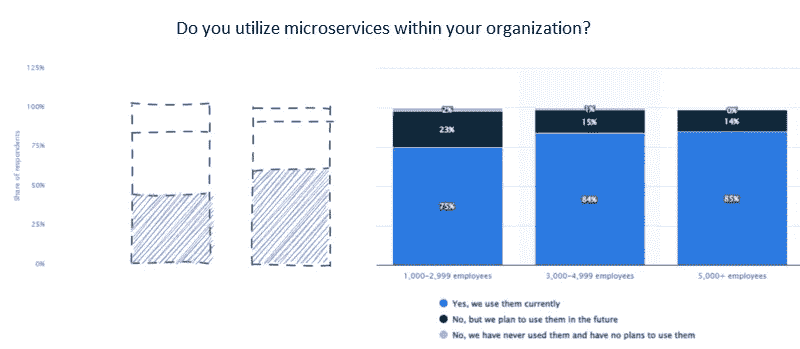

# 软件架构来源于通信模型

> 原文：<https://levelup.gitconnected.com/software-architecture-is-derived-from-the-communications-model-fb55ef211ee8>

> 当你读这篇文章的时候，我勇敢的祖国乌克兰正在和俄罗斯恐怖分子战斗。每个人都可以向支持基金捐款，并通过关注 21 世纪欧洲最大的战争来提供帮助。不要沉默。

对新知识和有价值的成就的渴望经常刺激我们在当前的业务中采用新的、热门的和潮流的技术。同样，对新成就的渴望通常是变革的驱动力，而不是业务需求。

照片由[克拉克·蒂布斯](https://unsplash.com/@clarktibbs?utm_source=medium&utm_medium=referral)在 [Unsplash](https://unsplash.com?utm_source=medium&utm_medium=referral) 上拍摄

显然，风险是一项崇高的事业，因此，即使是尝试新技术的意图也会带来有用的礼物，并为进一步的转型变革奠定良好的基础:**好奇心**，**集体升级需求**，以及**自我提升**。在一个思想保守、管理保守的公司里，这些集体品质很难得到支持。

通常，如果我们认为自己是敏捷的追随者，技术、程序和组织的变化是进化的基础。**静态**、**惯性、**和**长期规划**是现代系统反模式的特征。**乐于接受变化**、**灵活应对业务向量变化**、**无痛修正**、更**有效应对短期挑战**是现代公司更可取的进化模式。

但也有不可避免的变化。这些变化必须发生，因为某些条件得到了满足。我们常常只是推迟不可避免的事情或者抗拒它。这就像沿着相反方向的自动扶梯往上走——如果你停下来，你会往回走，但是付出比需要更多的努力会给你一些正的速度。但是选择自动扶梯的右侧有助于我们毫不费力地移动，任何额外的力只是增加了这个速度。

乔恩·泰森在 [Unsplash](https://unsplash.com?utm_source=medium&utm_medium=referral) 上拍摄的照片

选择正确的架构模式更多的是选择正确的自动扶梯侧。要么我们努力保持任何非负的速度，要么我们默认地行动，并利用我们的努力在需要的时间内更有成效。

> 设计系统的组织被限制生产这些组织的通信结构的复制品

这种令人信服的力量(之前比喻中的自动扶梯方向)是[康威定律](https://en.wikipedia.org/wiki/Conway%27s_law)，它预测最终系统架构将反映团队拓扑，或者更准确地说，将反映参与设计和开发的团队之间的沟通模式。

该定律预测，由单个大团队产生的产品架构，最终将包含来自 monolith 项目的许多特征(甚至将解决方案表示为一组单独的独立服务)。这不仅可以反映在特定的服务设计中，还可以反映在交付或部署细节中，以及对所有现有子系统使用公共模块、公共安全层或整体应用程序升级等。

因此，在这种情况下，“错误方向的自动扶梯”意味着当前的模型需要永久的努力来保持解决方案是“微服务一样的”。与此同时，canary deployment 等任何“微服务原生”特性都会成为挑战，尽管它们是当前架构的原生特性。这样的“原生”特性只是增加了系统的熵，而不是使其更加可靠。

老好 [Raffi Krikorian](https://medium.com/u/e89e136d5220?source=post_page-----fb55ef211ee8--------------------------------) org 视图

与此同时，康威定律也在另一个方向上起作用——系统的架构创造了力量和刺激，来改造团队，以改变组织的拓扑结构来支持这样的架构。

有了宏观服务或整体架构模型，最终，负责模块或层的小团队将被迫连接到更大的单元、空间或其他组织元素中。同样，这种联系的证据并不总是拓扑上的变化，而是越来越多的 scrum-of-scrum 会议或许多团队之间的共同回顾、重构的随叫随到流程、事件或事后回顾等。再次，对可靠性的需求(系统熵的减少)是一个转换刺激。

总之，选择整体架构、宏观架构或微服务架构更多的是选择设计该架构的组织或部门内部的通信拓扑。也许小型团队在迁移到微服务架构时很快就会“过度疲劳”的原因正是因为团队成员之间的紧密耦合。类似地，随着公司规模的扩大和责任的下放，大公司迫切需要在单一的保护伞下用一系列相互关联的模块取代单一的产品。

毕竟，世界范围内的统计数据表明，随着部门规模的扩大，微服务的使用有增加的趋势，这并不奇怪。相反，尽管有进步市场的推动，小公司表现出相反的趋势。

[https://www . statista . com/statistics/1236823/micro services-usage-per-organization-size/](https://www.statista.com/statistics/1236823/microservices-usage-per-organization-size/)

因此，虽然世界由中小型企业统治，但“真正的微服务架构”与其说是一家部门规模小、没有业务极端的公司的迫切需要，不如说是一本招聘年轻进步工程师的广告手册。