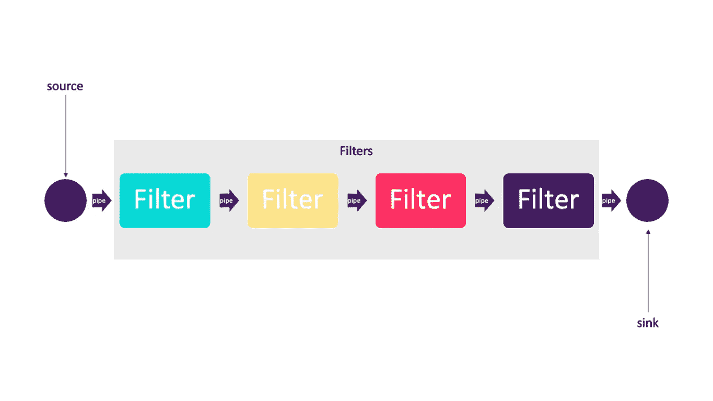

# 软件架构:你需要知道的最重要的架构模式

> 原文：<https://levelup.gitconnected.com/software-architecture-the-important-architectural-patterns-you-need-to-know-a1f5ea7e4e3d>

## [思维程序员](https://medium.com/tag/thought-programmer)

## 解释**的共同**不同**的建筑模式**

亚历山大·安德鲁斯在 [Unsplash](https://unsplash.com?utm_source=medium&utm_medium=referral) 上的照片

架构模式是一种通用的、可重用的解决方案，用于解决给定环境下软件架构中常见的问题。

> 模式是对上下文中问题的解决方案。

许多程序员现在仍然对架构模式之间的区别感到困惑，或者甚至不太了解它。

让我给你解释一下…！

*   分层架构
*   管道和过滤器
*   客户
*   模型视图控制器
*   事件驱动架构
*   微服务架构

 [## 大数据:Lambda 架构概述

### 我们如何打败 CAP 定理？

levelup.gitconnected.com](/big-data-lambda-architecture-in-a-nutshell-fd5e04b12acc) 

# **分层架构**

最常见的架构模式是分层架构或称为 n 层架构。它被大多数软件架构师、设计者、开发者所熟知。尽管在必须存在的层的数量和类型方面没有具体的限制，但是大多数分层体系结构由四层组成:表示层、业务层、持久层和数据库层，如下所示。

n 层架构的一个流行示例

## **上下文**

所有复杂的系统都需要独立地开发和发展系统的各个部分。由于这个原因，系统的开发人员需要清晰的和文档化的关注点分离，以便系统的模块可以独立开发和维护。

## **问题**

软件需要以这样的方式分割，即模块可以单独开发和发展，各部分之间的交互很少，支持可移植性、可修改性和可重用性。

## **解决方案**

为了实现这种关注点的分离，分层模式将软件划分为称为层的单元。每一层都是一组模块，提供一组内聚的服务。使用必须是单向的。层将一组软件完全分区，每个分区通过一个公共接口公开。

*   第一个概念是每一层都有特定的角色和职责。例如，表示层将负责处理所有的 UI。因为分层体系结构中关注点的分离使得建立有效的角色和职责变得容易。
*   关于第二个概念，分层架构模式是一种技术上划分的架构，与领域划分的架构相对。它们是组件组，而不是按域。
*   最后一个概念是分层架构中的每一层都被标记为封闭或开放。封闭层意味着一个请求从一层移动到另一层，它必须通过它下面的一层才能到达下一层。请求不能跳过任何层。

*关闭图层并请求访问*

## 弱点

层会造成性能损失。这种模式不适合高性能的应用程序，因为通过多层架构来满足业务请求的效率很低。

层的增加也增加了系统的前期成本和复杂性。

## 习惯

我们应该为小而简单的应用程序或网站使用这种风格。对于预算和时间非常紧张的情况，这是一个很好的选择。

 [## 设计模式:设计类和对象的结构模式

### 适配器、装饰器、代理、信息专家、复合、桥接、低耦合、轻量级、受保护的变体和…

levelup.gitconnected.com](/design-patterns-structural-patterns-of-design-classes-and-objects-79d58a6519b) 

# 多层模式

## 语境

在分布式部署中，通常需要将系统的基础设施分布到不同的子集中。

## 问题

我们如何将系统分成许多计算上独立的执行结构:由一些通信媒体连接的软件和硬件组？

## 解决办法

一个多层次的例子——消费者网站 J2EE

许多系统的执行结构被组织为一组组件的逻辑分组。每个分组被称为一个层。

## 弱点

大量的前期成本和复杂性。

## 习惯

用于分布式系统。

# 管道和过滤器

软件架构中反复出现的模式之一是管道过滤器模式。

管道过滤器样式

## 语境

许多系统需要从输入到输出转换离散数据项的流。许多类型的转换在实践中会重复出现，因此最好将它们创建为独立的、可重用的部分。

## 问题

这样的系统需要被分成可重用的、松散耦合的组件，这些组件具有简单的、通用的交互机制。这样，它们可以灵活地相互结合。这些组件是通用的、松散耦合的，很容易重用。这些独立的组件可以并行执行。

## 解决办法

这种架构中的管道形成了过滤器之间的通信通道。第一个概念是，出于性能原因，每个管道都是不定向的和点对点的，从一个源接受输入，并总是将输出定向到另一个源。

这种样式中有四种类型的过滤器，如下所示。

*   生产者(`source`):流程的起点。
*   transformer ( `map`):对部分或全部数据执行转换。
*   测试者(`reduce`):测试一个或多个标准。
*   消费者(`sink`):终结点。

## 弱点

对于交互系统来说不是好的选择，因为它们的转换特性。

过多的解析和解解析会导致性能下降，并增加编写过滤器本身的复杂性。

## 习惯

管道过滤器体系结构用于各种应用，尤其是便于简单单向处理的任务，如 EDI、ETL 工具。

编译器:连续过滤器执行词法分析、解析、语义分析和代码生成。

# 客户

## 语境

存在大量分布式客户端希望访问的共享资源和服务，并且我们希望控制对这些资源和服务的访问或服务质量。

## 问题

通过管理一组共享的资源和服务，我们可以提高可修改性和重用性，将公共服务分解出来，只需在一个位置或少数位置修改它们。我们希望通过集中控制这些资源和服务，同时将资源本身分布在多个物理服务器上，来提高可伸缩性和可用性。

## 解决办法

在客户机-服务器风格中，组件和连接器具有特定的行为。

*   称为“客户机”的组件向称为“服务器”的组件发送请求，并等待回复。
*   服务器组件接收来自客户端的请求，并向其发送回复。

## 弱点

服务器可能会成为性能瓶颈和单点故障。

在系统构建完成后，决定将功能定位在哪里(在客户机还是在服务器)通常是复杂且昂贵的。

## 习惯

我们可以使用客户机-服务器风格来对系统的一部分进行建模，该系统有许多组件(客户机)向另一个提供服务的组件(服务器)发送请求:电子邮件、文档共享和银行等在线应用程序。

# 模型视图控制器

## 语境

用户界面通常是交互式应用程序中修改最频繁的部分。用户通常希望从不同的角度查看数据，例如条形图或饼图。这些表示都应该反映数据的当前状态。

 [## MVC vs MVP vs MVVM

### 它们之间有什么不同？

levelup.gitconnected.com](/mvc-vs-mvp-vs-mvvm-35e0d4b933b4) 

## 问题

如何将用户界面功能从应用程序功能中分离出来，同时仍然能够响应用户输入或底层应用程序数据的变化？

当底层应用程序数据发生变化时，如何创建、维护和协调用户界面的多个视图？

## 解决办法

模型-视图-控制器(MVC)模式将应用程序功能分成三种组件，如下所示。

*   包含应用程序数据的模型。
*   视图，显示底层数据的某个部分，并与用户交互。
*   控制器，它在模型和视图之间起中介作用，并管理状态变化的通知。

## 弱点

对于简单的用户界面来说，这种复杂性可能不值得。

模型、视图和控制器抽象可能不太适合某些用户界面工具包。

## 习惯

MVC 是一种架构模式，在开发用户界面时常用于 web、移动应用程序中。

# 事件驱动架构

## 语境

需要提供计算和信息资源来处理独立的异步应用程序生成的事件，其方式可以随着需求的增加而扩展。

## 问题

构建分布式系统，该系统可以为与事件相关的异步到达消息提供服务，并且可以从小而简单扩展到大而复杂。

## 解决办法

为事件处理部署独立的事件流程/处理器。到达的事件被排队。调度程序从队列中取出事件，并根据调度策略将它们分发到适当的事件处理程序。

## 弱点

性能和错误恢复可能是问题。

## 习惯

使用这种方法的电子商务应用程序将如下工作:
订单服务创建一个处于待定状态的订单，并发布一个`OrderCreated`事件。

*   客户服务接收事件并尝试为该订单保留信用。然后，它发布信用保留事件或`CreditLimitExceeded`事件。
*   订单服务从客户服务接收事件，并将订单的状态更改为已批准或已取消

# 微服务架构

## 语境

部署支持各种浏览器和本机移动客户端的基于服务器的企业应用程序。应用程序通过执行业务逻辑、访问数据库、与其他系统交换消息以及返回响应来处理客户端请求。应用程序可能会公开第三方 API。

## 问题

整体式应用程序可能变得过于庞大和复杂，无法提供高效的支持和部署，以实现最佳的分布式资源利用率，例如在云环境中。

## 解决办法

将应用程序构建为服务套件。每个服务都可以独立部署和扩展，并且有自己的 API 边界。不同的服务可以用不同的编程语言编写，管理自己的数据库，由不同的团队开发。

## 弱点

系统的设计必须能够承受需要更多系统监控的服务故障。服务编排和事件协作开销。

我们还需要更多的内存。

## 习惯

许多用例适用于微服务架构，尤其是那些涉及大量数据管道的用例。例如，基于微服务的系统非常适合作为公司零售店销售的报告系统。数据准备过程中的每一步都将由微服务处理:数据收集、清理、规范化、丰富、聚合、报告等。

很简单，对吧？

在 Medium 上关注我，了解我的最新文章，如下所示。

 [## 如何设计一个系统来扩展到你的第一个 1 亿用户

### 想得大，做得小，学得快

levelup.gitconnected.com](/how-to-design-a-system-to-scale-to-your-first-100-million-users-4450a2f9703d)  [## 我是如何根据目的对 50 种图表类型进行分类的？

### 可视化的目的是洞察力，而不是图片

towardsdatascience.com](https://towardsdatascience.com/how-did-i-classify-50-chart-types-by-purpose-a6b0aa5b812d)  [## 软件工程:软件开发中重用的最佳实践

### 不要多此一举

levelup.gitconnected.com](/software-engineering-best-practices-for-reusing-in-software-development-6006f9d8d364) 

# 分级编码

感谢您成为我们社区的一员！ [**订阅我们的 YouTube 频道**](https://www.youtube.com/channel/UC3v9kBR_ab4UHXXdknz8Fbg?sub_confirmation=1) 或者加入 [**Skilled.dev 编码面试课程**](https://skilled.dev/) 。

 [## 编写面试问题

### 掌握编码面试的过程

技术开发](https://skilled.dev)