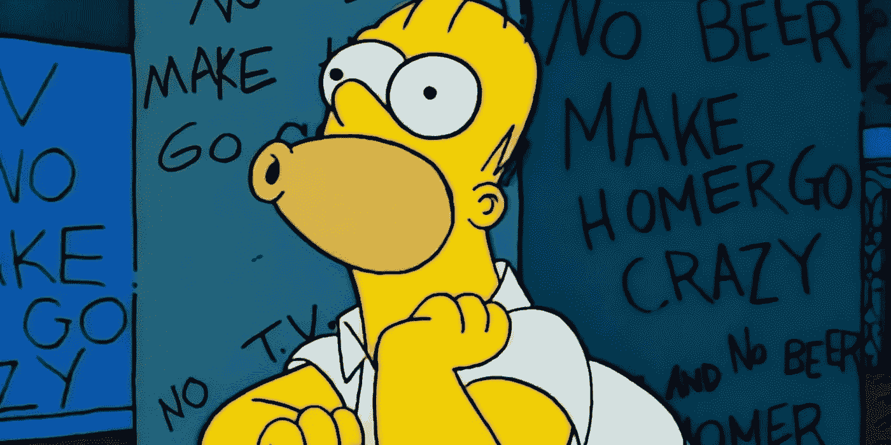

# 软件设计:熵

> 原文：<https://levelup.gitconnected.com/software-design-entropy-e6c6da33f631>

# 熵是什么？

这个术语最初是在热力学中引入的，作为一种定量的度量，表示一个系统的热能转化为机械功的不可用性。在更广泛的意义上，它被解释为系统中无序或随机的**程度。**

> 热力学定律保证宇宙中的熵趋于最大值。(更读)

# 软件熵

尽管熵起源于物理学，但它也在软件开发中占有一席之地。

无论是工作还是你自己的项目，你都会在你的软件系统中遇到某种程度的混乱。当软件中的无序增加时，我们称之为“软件腐烂”或更常见的术语——“技术债务”。

为了避免软件系统中的熵，我们需要了解它的来源，让我们看一个真实世界的例子来更好地说明这个问题。

# 破碎的窗户

归功于[T5【辛普森世界】T6](http://www.simpsonsworld.com/)

破窗是一种流行的犯罪学理论，认为犯罪和社会混乱的明显迹象创造了一种鼓励进一步犯罪和混乱的环境……等等。

在斯坦福大学心理学家进行的一项实地研究中，两辆汽车被遗弃并停在街上，牌照被拿走一周。整整一个星期，两辆车都没碰过。

第二周开始时，研究人员打碎了一辆汽车的一扇窗户。在一天结束前，汽车被拆成零件，更多的窗户被打碎，汽车侧面被涂鸦——它被摧毁了。

> 心理学家得出结论，有一个触发机制，“一扇破窗”**。**

**类似地，这个概念可以应用于建筑物、整个街区等等。忽视一个明显破裂的情况所带来的被遗弃感和绝望感通常会传达出这样的信息:它无法修复，没人关心，或者情况注定要发生。**

**贷记[**simpsonsworld**](http://www.simpsonsworld.com/)**

**这些消极的想法在经过受损汽车的每个人中间传播，导致进一步的破坏和损害。**

# **软件中破碎的窗口**

**在软件中，一旦有一个破碎的窗口，干净的系统会恶化得更快。我们的目标是避免生活在破碎的窗户中。起作用的因素通常来自工作中的心理或文化，或者某个特定的项目。**

**即使是最好的开发团队，一个单一的破碎窗口也会为将来交付的代码质量设置优先级。人们很容易陷入“代码库是垃圾，所以我也会发布不合格的代码”的思维定势。如果你一直认为没有人有时间去清理一个项目的所有碎玻璃，那么你就让熵赢了。**

> **忽视比其他任何事情都更能加速软件的腐烂**

**功劳归于 [**辛普森世界**](http://www.simpsonsworld.com/)**

**正如我们从物理学家同事那里了解到的那样，这种疾病可以不受控制地传播，我们该如何与之斗争呢？**

# **防止破窗**

**正如使用一个蹩脚的代码库会促使你发布更蹩脚的代码一样，同样的心理也适用于那些原始编写、良好设计和优雅维护的代码库。你倾向于格外小心不把事情弄糟——**你不想成为第一个把事情弄糟的人。****

> **一扇破窗太多了——务实的程序员**

**完美的软件是不存在的，所以我们不能指望时不时地不碰到坏掉的窗户。糟糕的设计、错误的决策和糟糕的代码都会导致失败。这些要马上修好，不要留个破窗，破了。**

**即使在时间至关重要的高压情况下，也要用木板封住破损的窗户，并制定计划尽快修复。**

**归功于 [**辛普森世界**](http://www.simpsonsworld.com/)**

**我希望你在阅读这篇文章的时候发现了一些有价值的信息。如果你想在你的项目中应用这些经验，我在下面列出了一些建议。*为建立更好的系统干杯！🍻***

## **建议**

**通过调查“邻里”项目来帮助加强你的团队。选择几扇破损的窗户，与你的团队讨论你将如何修理它们，然后开始修理窗户。**

> **让这成为一个循环的事件——机制起作用，良好的意图不起作用。**

**当发现窗户破损时，问你自己和你的团队以下问题…**

*   **你能说出它第一次坏掉是什么时候吗？**
*   **你的团队对破窗有什么反应？**
*   **这扇破窗户是什么造成的？**
*   **你能对这扇破窗户做什么？**

***感谢您的阅读！如果你喜欢这篇文章并想了解更多关于软件设计的知识，请订阅我的电子邮件列表并关注我！* [*成为*](https://yenvanio.medium.com/membership) *会员，支持媒体上的作家社群。***