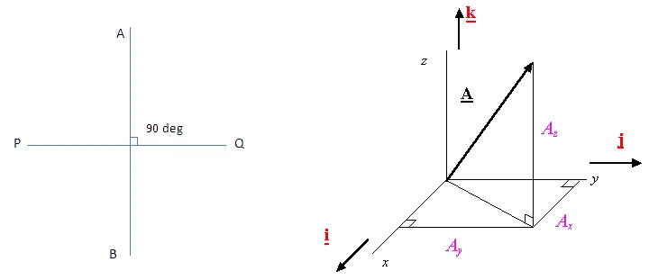

# 软件设计—正交性

> 原文：<https://levelup.gitconnected.com/software-design-orthogonality-7cd2d50267b6>

功劳归于 [**马尔多瑙**](https://www.instagram.com/maldonaut/)

> 软件设计可能看起来棘手或复杂，它可能会远离你。幸运的是，随着多年软件开发的发展，设计干净、健壮的软件已经有了很好的原则和指南。
> 
> 其中一个原则是正交性，所以让我们看看这意味着什么，为什么它在软件开发和设计中如此重要。

# 什么是正交性？

正交性的起源来自数学！如果两条直线相交成直角，它们就是正交的。也可以用向量来解释——*两个向量若独立则正交*。 *(* [*阅读更多*](https://en.wikipedia.org/wiki/Orthogonality) *)*

# 但是…我们在写代码！

在软件开发中，我们使用正交性来定义软件组件之间的分离或独立性。用最简单的术语来说，这意味着**改变 A 不会改变 B** 。

虽然认为你的系统可以 100%正交是幼稚的。这里的目标是在设计您的系统时遵循这一原则，以获得可能的最佳结果。

一个简单的现实世界的例子是收音机，其中改变电台不改变音量，反之亦然。非正交系统是直升机，改变速度会影响方向。

> 为什么这很重要？

编写具有单一定义目的的自包含、独立的组件将使您能够构建一个更容易开发、测试、扩展和最小化错误风险的软件系统。

> 一个原则是如何实现所有这些的？

想象一下，有一个数据库，每当您在前端接口上更改一个字段时，它都需要更改。听起来很可怕，对吧？这就是为什么分离软件组件很重要。这是一个简单而显而易见的例子，但是我们将在本文后面深入探讨更多在软件开发中可能被忽略的例子

# 探索代码中的正交性

为了理解代码中的正交性，我们将会看到一个**非正交用户**类和一个**正交用户**类。

NonOrthogonalUser.java

## 是什么使得这不是正交的呢？

*   作为 Java 中的一个普通对象类，它定义了一些属性和一个初始化它的构造函数。现在显然有一个突出的属性— `textFileStrings`。

> 用户类正在处理一个它不应该负责的任务，导致它与`loadFile()`函数以及它返回的值紧密耦合。

*   对`loadFile()`函数或返回数据格式的更改将波及到`User`类，导致该类的修改。
*   将这个逻辑放在`User`类中可以防止它被单独重用。此外，知识和功能也不能分开测试。

OrthogonalUser.java

## 是什么让这个正交？

*   现在这个`User`类符合您通常所期望的。

> `CustomerTextObjectReader`类包含解析文本文件的功能，专门用于执行这个单一的功能。

*   比方说，我们想修改加载数据的方式——使用数据库或从 API 获取数据，可以修改 reader 类来实现这一目的，而不会影响`User`类。
*   如果数据对象改变了，只有`CustomTextObject`和`CustomerTextObjectReader`类需要改变。
*   最后，为了真正说明这一点，可测试性也得到了提高——它可以单独测试，因为功能被很好地封装了。您可以使用模块或单元级测试来测试功能。例如，这些比集成测试更容易实现。

# 正交性的好处

[演职员表**约翰·克里斯喜剧**演职员表](https://giphy.com/johnbcrist/)

## 生产力

正交系统减少了编写测试甚至开发时间，因为组件是自包含的。我认为我们都可以欣赏为一个独立的组件编写测试，而不是担心所有不同的连接部分需要被合并以运行测试。

## 复用性

当我们开始设计正交系统时，每个组件都应该是独立的，有一个明确的目的。这促进了可重用性，因为当您将它们合并到多个位置时，您不必担心意外的副作用。

组件可以为了不同的目的而被重新配置和重新设计，即使不是组件的作者最初设想的。

## 测试和最小化风险

正交系统的测试要简单得多，它们通常在模块或单元级进行。如上所述，这比集成测试更可取，在集成测试中，您需要担心设置多个其他组件来测试一个`Reader`类的简单功能。

当系统的一部分出现故障时，它将被控制住。它们可以被视为“患病”模块，应该用正交方法隔离，这样它就不会扩散。

此外，由于组件的隔离，调试和修复错误变得更简单，错误将被本地化，比在高度耦合的系统中更容易定位。

如果真的是正交的，那么与外部供应商通信的接口应该可以被多个供应商重用，以避免供应商锁定。

# 设计正交系统

[演职员表**克里斯**甘农](https://giphy.com/chrisgannon)

至此，您可能已经了解了设计正交系统的要点……我保证，我们就快完成了！以下是设计系统时需要记住的一些最终想法。

*   正交系统包含一组协作模块。每个模块服务于一个目的，并且独立于其他模块实现该功能。
*   抽象是正交系统的关键组成部分。抽象层只使用下面一层提供的抽象，这允许在不影响其他代码的情况下更灵活地改变底层实现。
*   第三方库可以极大地简化您的工作量，但是要小心，它不会对您的代码强加不应该有的更改。如前所述，将这些从代码中分离出来有助于避免供应商锁定。**不要依赖你无法控制的东西的属性。**

> 如果你戏剧性地改变了特定功能背后的需求，有多少模块会受到影响？答案应该是 1。
> 
> —务实的程序员

我希望你在阅读这篇文章的时候发现了一些有价值的信息。如果你想深入了解这个原则，我在下面列出了一些相关的主题。为建立更好的系统干杯！🍻

## 干燥原理

*   不要重复你自己

## 害羞原则

*   不要向别人暴露你自己
*   不向他人透露任何不必要的东西，并且不依赖他人实现的模块

## 德米特里定律

*   Demeter 法则规定，一个模块不应该知道它所操作的对象的内部细节。换句话说，软件组件或对象不应该知道其他对象或组件的内部工作原理。