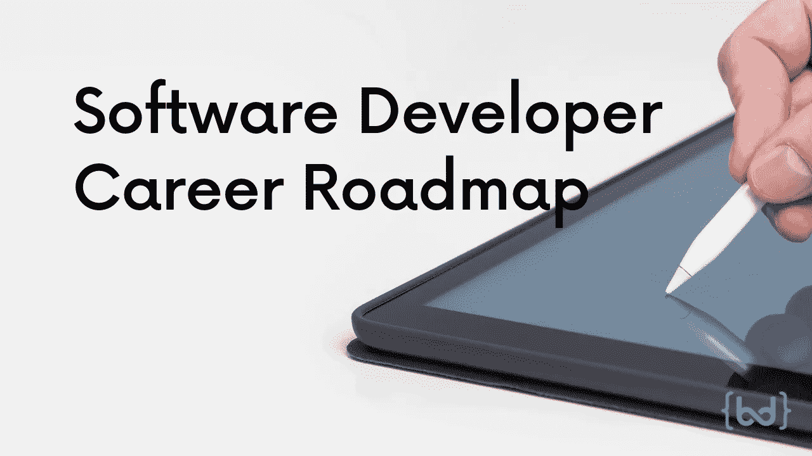

# 软件开发人员职业路线图

> 原文：<https://levelup.gitconnected.com/software-developer-career-roadmap-30b83d78997b>

软件开发人员职业路线图

软件开发人员有许多不同的角色和头衔。作为一名新的开发人员，您可能会对自己有资格胜任什么样的职位以及期望看到和遵循什么样的职业路线图感到困惑。

我将列出可供开发人员选择的不同职业道路，你可以期待什么样的职业变化，以及所有这些不同的职称实际上意味着什么。

软件开发的现实是，有许多不同的领域你可以专攻:前端、后端、安全、DevOps、全栈等等。

尽管软件开发中有许多不同的专业，但是这些路径中的每一个都有大致相同的核心角色和进展。最常见的是实习生、初级开发人员、软件开发人员和高级软件开发人员。

软件开发人员核心角色路线图

我们将介绍与这些核心角色相对应的不同职位，以及您期望承担的职责。

应该提到的是，您不一定需要逐步完成这些角色中的每一个，但是这些角色代表了软件开发人员在他们的职业生涯中所期望承担的责任的不同阶段。

对于那些有兴趣在 sr 开发人员的角色之外进一步发展职业生涯的人，请务必继续阅读以下部分:个人贡献者(IC)职业道路和人员管理职业道路。这两种途径都源于这些核心角色，并且不管你作为开发人员的专业是什么，它们都是相当一致的。

# 开发人员/工程师/程序员

关于你将听到的不同头衔，有一点很重要:在科技行业，开发人员、工程师和程序员这三个术语经常互换使用。有些人会争辩说，有这些区别的标题之间有明显的差异，但一般来说，这三个术语的意思大致相同。

# 拘留

对于许多刚刚起步的开发人员来说，他们的第一个角色是实习生。软件开发实习生通常会有 3-6 个月的时间，在这段时间里，他们可以和其他开发人员一起工作，完成一个中小型项目，积累公司使用的语言和技术方面的经验。这些实习通常发生在夏季的 5 月至 8 月，此时大多数学生都不在学校，新开发人员的春季招聘季节即将结束。

大多数公司利用这些实习机会来寻找适合他们组织的开发人员。许多实习生还被赋予了与公司入门级开发人员相同的职称，如助理开发人员或初级开发人员。

# 初级/助理软件开发人员

初级(或助理)软件开发人员是一个头衔，通常用于刚刚起步的开发人员，他们需要额外的资源和时间来达到与普通开发人员相同的产出数量和质量。

初级开发人员这个术语在公司里经常被用来定义他们软件开发的初级职位。根据公司的不同，这个头衔可能略有不同，但另一个常用的头衔是入门级* *插入语言或框架* *开发人员。

尽管对产出的期望较低，但在这个职位的第一年，你将获得进入下一个角色所需的技能:软件开发人员。

# 软件开发人员

软件开发人员是指拥有一年或一年以上专业软件开发经验，能够独立完成任务的人。

通常，初级开发人员和普通开发人员之间的障碍是他们独立处理“大多数”任务的能力。有时需要结对编程或建议来快速推进工作，但大多数情况下，软件开发人员可以独立于外部帮助处理自己的任务。

其他一些用来描述这个角色的常见头衔有:软件工程师，* *插入语言或框架* *开发人员，或者仅仅是开发人员。一些较大的公司会给他们的开发人员分配一个数值，以表示他们在他们的开发团队中的经验，例如软件工程师 I、软件工程师 II 等。

对于区分软件开发人员和软件工程师的重要性有一些小争论，但是大多数人会同意这些头衔通常具有相同的权重。

# 高级软件开发人员

高级软件开发人员通常是大多数开发人员职业生涯的主要目标。尽管不同公司的头衔差别很大，但这表明你是一名技术高超的开发人员。在大多数情况下，高级开发人员都有 5 年以上的专业软件开发经验。

你会经常看到被定义为高级* *插入语言或框架** 开发人员的头衔。

一旦你担任了高级开发人员的角色，如果你想进一步发展你的职业生涯，你可以选择两条不同的职业道路，这两条道路你都可以在接下来的章节中了解到:个人贡献者职业道路和人员管理职业道路。

# 个人贡献者(IC)职业道路

对于那些喜欢编码并希望继续从事软件开发，同时继续提高工资和地位的人来说，个人贡献者(IC)职业道路是理想的。

一眼看去，IC 们主要关注于提高他们现有的技能，并继续在他们的开发团队中承担更多的责任。尽管他们没有选择管理道路，集成电路仍然被期望成为团队和组织中的领导者和指导者。对于这种类型的领导，IC 可以晋升到一些更明确的角色。他们可以进入的两个主要角色是团队领导和软件架构师。

# 团队领导

团队领导就像标题一样，是领导者。他们承担了作为负责执行项目技术方面的开发人员的额外责任。这通常需要负责代码审查，帮助协调不同的特性如何组合在一起，等等。其他类似的头衔可以称为项目领导、首席开发人员等。

# 软件架构师

对于那些主要对深入软件开发和设计感兴趣的人，他们在高级开发人员之后的下一步是软件架构师。架构师通常更多地处理系统的总体结构，以及它们如何相互作用和工作。他们对在项目中使用和实现哪些技术做出重要的决策。根据公司的规模，这个角色的职责可能会有所不同。

这两个角色都可以成为晋升到高层管理职位的一个很好的起点，因为它们赋予了开发人员在该领域的技能和经验以可信度。

除非你想过渡到管理职位，否则这通常是你在职业生涯中能得到的最大进步，同时仍然是一名软件开发人员，并亲自参与开发。

如果你渴望进入人事管理岗位，请继续阅读下面的人事管理职业道路部分。

# 人员管理职业道路

人员管理包括与团队领导和执行相关的所有类型的角色。这是实践发展之外的一步，也是迈向管理职业阶梯的一步。

对于那些对领导职位感兴趣或渴望在公司管理层工作的人来说，这条职业道路非常适合他们。

人员管理包含各种角色:软件开发经理、项目或产品经理、主管职位和各种高管职位。重要的是要注意，人们不一定要通过这些职位中的每一个来进步，但如果他们选择了人员管理职业道路，这些只是最常见的角色。

# 软件开发经理

软件开发经理是在大公司更常见的角色。他们的主要职责是管理和协助软件开发人员。这可能需要:

*   雇佣/培训新开发人员
*   在开发团队中设定/管理目标
*   监控和分配任务
*   为软件开发团队和高层管理人员制定计划、报告和其他辅助工具
*   在某些情况下，这些经理将负责与客户沟通

# 项目/产品经理

类似于软件开发经理，项目和产品经理有许多相同的职责。然而，他们的核心职责是领导一个给定的团队或项目，分配必要的工作，并努力完成项目。

您可以期望经常与客户沟通，并将开发团队的关注点和问题传达给客户，同样，也将客户的关注点和问题传达给开发团队。

最终，产品或项目经理要对特定项目和/或团队的成败负责。

# 上层管理人员(CTO、工程总监等。)

对于那些渴望超越经理职责的人来说，下一步就是晋升到高层管理职位。另一条通往高层管理的途径是成为一名软件架构师，这个角色我们在个人贡献者职业道路视频中讨论过，也可以在本系列中找到。

高层管理职位的类型取决于公司的规模。在更小的公司(<200 employees), you’ll often see Chief Technology Officer as the main and sometimes only role available.

In larger companies, however, there are various opportunities in positions as a director of engineering or director of various departments within the company. Some also use the title of “Vice President of Engineering, etc.”. These titles often depend on the company structure. The roles and responsibilities of these positions are very similar, despite having different titles.

VPs and Directors are often responsible for everything occurring internally in a company in regards to software development endeavors. They work with product/project managers to ensure projects are moving along smoothly and identify areas that need improvement within the companies processes.

CTOs on the other hand typically work mostly with other C-Suite level employees as well as shareholders. Their responsibilities are to be company evangelists and their day-to-day activities often revolve more around networking and going to board meetings. VPs and Directors of Engineering report to the CTO and apprise them of everything going on internally in regards to software development efforts.

If a company is smaller, then oftentimes you’ll see CTOs take on all of the responsibilities we listed for VPs and Directors. Many times, you’ll even see CTOs at startups still involved in the actual hands-on development of products, meaning, they are actively contributing to building out these products. As startups grow into larger companies, these types of responsibilities get handed off to others, as their scope of focus broadens.

**想要联系？**

在[推特](https://twitter.com/BleylDev)上关注我，或者订阅我的 Y [outube 频道](https://www.youtube.com/c/bleyldev)。