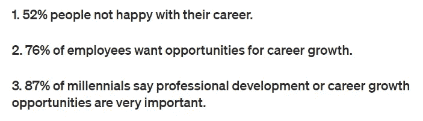

# 作为程序员，如何实现非凡的职业发展

> 原文：<https://levelup.gitconnected.com/software-developers-guide-how-to-achieve-an-extraordinary-career-growth-8b9952f3d163>

## 软件开发人员指南

## #1.你的职业是你的责任。

图片由[伊戈尔链接](https://pixabay.com/users/fotografielink-6316043/?utm_source=link-attribution&utm_medium=referral&utm_campaign=image&utm_content=2748752)来自 [Pixabay](https://pixabay.com/?utm_source=link-attribution&utm_medium=referral&utm_campaign=image&utm_content=2748752)

最近，我们对员工进行了一次全公司范围的调查。我们组织中出现的一个共同主题是，人们需要更好的职业发展机会。

做了一点研究，我发现一半的软件行业员工对他们的职业发展不满意。这里有一些相关主题的统计数据。

基于来自[职业伙伴](https://medium.com/@careercompanion/list-of-10-career-development-stats-ba7e68a5aa7f)的文章

看着上面的数字，你会发现软件工程师的职业成长并不乐观。那么，你应该怎么做才能拥有一个出色的软件开发职业生涯呢？怎样才能比同龄人成长更快，实现梦想目标？

> 那么，你应该怎么做才能拥有一个出色的软件开发职业生涯呢？怎样才能比同龄人成长更快，实现梦想目标？

这里有一个七步公式；如果你坚持不懈，它会帮助你成为一名软件工程师，这是最不平凡的职业。这些步骤中有一些是我们那些已经在他们的职业中取得巨大成就的领导者所共有的。

# 1.你的职业是你的责任

首先要明白的是——*你的职业生涯不是别人的责任*。如果你想要出色的职业发展，那么你需要拥有自己的职业道路。

> 你的职业不是别人的责任。

许多人无所事事，默默地做着他们的工作，期望他们会引起经理的注意。但职业发展并非如此。

**软件业不像政府机构那样工作，在政府机构中，一段时间后你会在层级结构中流动。如果你能系统地处理你的职业发展，那将是最好的。**

你的同事和朋友可以激励你。你的公司和经理可以提供足够的支持。但是提高你的技能以实现职业目标的努力完全是你的责任。

根据我的经验，如果你想要一份非凡的职业***——你需要在各方面都比你周围的人表现得更好。***

它有助于拥有积极和真诚的态度。把你的努力交付得比你的团队成员更好。当您的同事或联锁需要帮助时，请毫不犹豫地帮助他们。

掌控自己的职业是打造非凡职业的第一步。

# 2.知道你想要什么

许多软件开发人员渴望专业成长，但不知道他们到底想要什么。他们对自己的职业没有远景规划。没有目标，他们的职业生涯就像一艘漫无目的的船。

作为一名开发人员，我看到人们对自己想要什么感到困惑。许多人认为 PM 或 PO 的角色是一个更好的视角。有些人喜欢成为经理。

当我问他们为什么要选择这些职位时，答案几乎总是——***我认为这些职位有更好的发展机会*。**

> 下一个问题:你所说的增长机会是什么意思？
> 
> 回答:经理们得到更多的钱，并且对一切都有控制权。PM/POs 从不需要编码。他们的责任更少，但赚的钱更多。

我不知道他们怎么知道一个经理/PM / PO 挣多少钱，或者他们实际上要工作多少。然而，这些回答清楚地表明，这些人不知道他们想在工作中做什么。他们觉得感觉到的更多的钱或更少的工作会帮助他们在职业生涯中成长。

基于假设来决定职业目标注定会失败。

将你的决定建立在事实而不是假设的基础上是至关重要的。向已经实现了你想要实现的目标的人寻求建议。

慢慢分析细节，决定自己的职业目标。同样重要的是，要为实现这一目标设定明确的时间表。

# 3.找出你需要做什么来实现你想要的

一旦你在*尽职调查*后设定了目标，接下来就是找出实现目标的方法。*要记住的重要一点是，你的目标是你的责任*。你必须投入工作去发现实现它的方法。

假设你是一名初级开发人员，你的目标是在未来几年内成为一名高级开发人员。为此，您需要了解成为一名高级开发人员需要什么。与公司里有经验的人交谈，了解他们对这个职位的期望。

也许你的目标是在几年后成为一名建筑师。请咨询您的经理，了解对架构师的期望。征求贵公司建筑师的意见。请他们看看你是否能直接学习他们的一些作品。

一个渴望成为 PO 或 PM 角色的开发人员并没有错。与已经在执行该职能的人交谈，看看有什么先决条件。弄清楚你是否需要参加任何特定的*课程*或获得任何*认证*才能获得目标职位。

> 仅仅知道自己想要什么，却没有实现它的计划，是不会让你更接近目标的。

你的目标应该是了解进入理想角色的要求。仅仅知道自己想要什么，却没有实现它的计划，不会让你更接近目标。

# 4.有多个计划

现在你有了目标和实现目标的计划。这给了你职业道路上的一个良好开端。*接下来就是要明白没有计划是完美的。沿途有许多因素会打乱你的计划。*

> 我在第一份工作中有一个固定的计划，并且进展顺利。然后 2008 年的衰退发生了。与此同时，我的公司在历史上注册了印度最大的公司诈骗案。

对于我的第一份工作，我有一个固定的计划 [***，而且进展很顺利***](https://medium.com/illumination/how-my-first-job-experience-shaped-my-professional-career-71d55ac775a8) 。然后 2008 年的衰退发生了。与此同时，我的公司在历史上注册了印度最大的公司诈骗案。我别无选择，只能在我的就业状况面临任何风险之前赶紧去找另一份工作。

我吸取了教训，为下一个公司的任何伤亡做好了准备。

我不是说你必须跳槽去实现你的梦想。但是你应该有不止一个计划来实现你的目标。

也许你的团队无法完成你的成长目标。在这种情况下，你应该准备好更换团队。也许你渴望得到的职位还有很长的一段路要走。在这种情况下，在组织外寻找类似的机会可能是一个明智的想法。

你比任何人都清楚自己的处境。因此，做好相应的计划，并在你的袖子里藏着不止一个诡计。

# 5.不要等待别人来帮助你

行动时间到了。开始着手你的计划吧。每个人都有自己的计划，并且正在为之努力。不要等待他们暂停他们的计划来实现你的梦想。

人们经常想出职业规划，然后与他人分享，期望得到某种形式的认可。回顾你的目标是好的，但是在你开始实施之前不要期望得到批准。

我见过有人抱怨好几个月没有接到面试电话，但他们既没有好的简历，也没有积极参与社交。他们期待一个工作网站为他们创造奇迹。

在你的团队中——如果你的队友不能给出 KT，那么就要文件并开始阅读。不要等待别人来解释一项新技术的细节。去注册一个在线课程，自己学习吧。参加认证课程，为考试做好准备。

> 人们将忙于实现他们的梦想。如果你等着他们来帮助你，那么你就会被甩在后面。

人们将忙于实现他们的梦想。如果你等着他们来帮助你，那么你就会被甩在后面。**是你的事业；拥有它，并付诸行动。**

# 6.使用可用的工具

利用所有可用的工具在软件开发领域保持相关性。**参加贵公司的培训项目。**如果没有正式的培训计划，那么请你的经理安排一个。

使用日常工作中可用的软件来学习新东西。*如果你使用现有的工具来提高工作之外的技能，你的公司不会抱怨。*

我使用我们公司提供的在线培训平台来学习关于领导力和写作的课程。我的角色是解决方案架构师。但是学习领导力和写作是我的热情所在。

找到贵公司的内部招聘网站。查看是否有适合你职业目标的职位空缺。和你的经理谈谈，申请空缺职位。

*一对一会谈*也是与你的经理就你的职业道路进行对话的最有力的工具之一。 [***有效利用***](https://medium.com/illumination/how-to-make-the-best-of-one-on-one-meetings-as-an-individual-contributor-b92479ea1ea1) 。

会议是了解最新发展和建立关系网的好方法。看看你的经理是否能批准它的预算。也有许多免费的会议，你可以参加，并采取类似的好处。

# 7.向他人学习

反馈是最好的学习工具之一。从你的同事、上司、朋友和经理那里获得反馈。

如果你想达到一个特定的目标，那么观察已经在那个位置上的人。会有某些方面比你强的人。直接向他们学习。

> 如果你认为你是小组中最聪明的人，那么你可能想改变你的小组。加入一个你能学到比你知道的更多东西的团体。

如果你认为你是小组中最聪明的人，你可能想改变你的小组。加入一个你能学到比你知道的更多东西的团体。知识是帮助你职业发展的关键因素。

# 思想

你不会在每次面试中都被选中。当你认为自己已经为下一个角色做好准备时，你可能不会得到提升。会有这样的时候，当它到期的时候，你得不到贷款。然而，不要因为最初的失败而丧失信心。

当你有了既定的计划和实现计划的坚定决心时，你会发现自己会从每次挫折中恢复过来，并以新的活力向前迈进。

在你的职业生涯中坚持这 7 个步骤，你无疑会获得非凡的成长。

*   **自己的**职业道路。*这是你的责任*。
*   **明白**自己真正想要的是什么。
*   找出如何达到期望的结果。
*   为糟糕的日子做好准备。*有多个计划*。
*   不要指望别人来掌控你的职业生涯。
*   最大限度地利用可用的工具。
*   努力向他人学习。

感谢您阅读这篇文章。我祝你在职业生涯中一切顺利。

你可能也想读一些我在软件工程领域最受欢迎的文章:

 [## 有毒老板在工作场所做的幽默清单

### 如果你从未面对过这些，你应该感到幸运。

levelup.gitconnected.com](/humorous-list-of-things-a-toxic-boss-does-at-workplace-21947df6a565)  [## 如何成为一名优秀的软件开发人员

### #3 客户永远是对的——直到你证明他们是错的。

levelup.gitconnected.com](/how-to-become-an-outstanding-software-developer-8409f23716a)  [## 世界上最难的 5 种编程语言

### 你以前听说过多少？

levelup.gitconnected.com](/5-most-difficult-programming-languages-in-the-world-549c3cf91b23)