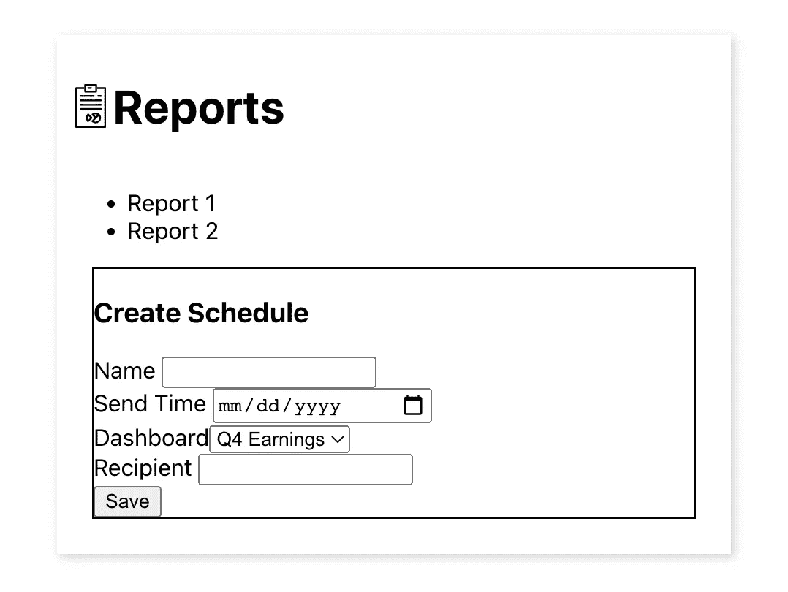

# 软件开发和放手的艺术

> 原文：<https://levelup.gitconnected.com/software-development-and-the-art-of-letting-go-1d60a2990cde>

## *一次冥想*

在每一个中等规模的面向用户的软件项目的开始，都有那么一个时刻，它看起来可能是这样的:

没有设计系统的生活

一个界面的眼中钉，几乎不起作用的代码——其中一半可能是从其他地方复制粘贴的。源代码中充斥着肯定是错误的代码，但之所以保留下来，是因为您还不太确定这些代码将如何组合在一起。占位符图像，未经校对的文本。坦白说，很乱。

但是那里有*的东西*。埋藏在混乱中的是一种功能性产品。它正在做你想让它做的事情，即使你永远不会在这种状态下发布它，你也可以最终尝试一下，看看它是否真的是你想要的。如果你太在意外观或代码质量，你可能会在项目结束时发现它完全失败了。

所以你为了学习而放手。

当然，在开始编码之前，有计划。有人已经确定了一种需求，人们努力找出解决这种需求的方法。确定需求，进行设计，规划架构。当然你不能为每一个可能发生的事情做计划，但是你要为自己的成功做好准备。

如果你不是一个人在工作，也许你并不同意所做的每一个决定。每个人对项目应该是什么都有不同的想法，因为他们都来自不同的地方。你认为一个设计元素是多余的，但设计师说它更容易获得。你认为一个功能不值得努力，但产品经理说它会带来更多的流量。

照片由 [Afif Kusuma](https://unsplash.com/@javaistan?utm_source=medium&utm_medium=referral) 在 [Unsplash](https://unsplash.com?utm_source=medium&utm_medium=referral) 拍摄

不管你对自己的信念有多确定，总有一天你必须开始。毕竟，你没有无限的时间，即使你们可能会在一些事情上达成一致，无休止的争论只会让你更接近你的最后期限，而没有什么可以展示的。你表达自己的观点，并虚心倾听。

但后来你放手了，这样你就可以向前看了。

当你工作的时候，你开始看到事情走到一起，看到生活来到你用自己的头脑建造的东西那里，这是一种真正的快乐。代码得到清理，界面得到固化，整个事情开始看起来更令人愉快。但是仍然有一些问题。它的行为不完全符合您的预期，所以您调试它。

在坚持自我的同时成功调试自己的代码是不可能的。你可能认为你对这个系统的工作原理有着坚如磐石的理解——毕竟是你写的。但是事实上，事情并没有按照你期望的方式发展，这意味着你错了。你们的理解有差距。可能小到一个打字错误，也可能大到不知道浏览器是如何工作的。但是你遗漏了一些东西，调试的行为就是找出这些，不管你的自我是怎么说的。

所以你放弃了你以为你知道的。

当你接近尾声时，所有的部分都就位了。它不完全像最初的设计，甚至更好。你弄清楚了自己的一些不正确的假设，你在一个看起来很好，感觉很好，很有用的地方得到的。已经准备好发布了。

当然，你还可以做更多的事情。一个组件可以被重新设计以更具可扩展性。一个盒子偏离中心一个像素，因为你永远不知道如何对齐它。如果用户点击 cmd-x，cmd-z，打开文件选择器，旋转四次，然后对着月亮嚎叫，浏览器就会死机。有一些小方法可以让它变得更好。

戴维·皮斯诺伊在 [Unsplash](https://unsplash.com?utm_source=medium&utm_medium=referral) 上的照片

但你把它放在一边，因为你必须这样做。小事情不会决定产品的成败。当有更多数据时，难以触发的错误可以得到修复。现在发布一些有用的东西比永远不发布没有缺陷的东西要好。

所以你放弃了完美，专注于好的方面。

通过所有这些放手，你会发现一些事情。一个交互需要一个大的检修，当它还很便宜的时候你就发现了。项目经理一直是对的——现在你无法想象没有那个特性的产品。您学习了一些关于浏览器如何工作的知识。没有人在乎盒子差了一个像素，因为他们的工作流程现在快了十倍。你仍然想努力做到尽善尽美，但是既然已经做到了，你会为你所做的感到骄傲。

你会思考这样一个事实，即任何创造性行为都是如此。你心中的理想和现实之间总是有差距的。如果你紧紧抓住你心中的东西，它就会呆在那里。但是通过让它进入这个世界，不管它有没有缺点，你都可以看到它是如何存在的。你看着它成长，看着人们如何回应，你加入了与世界的对话。

你发现通过放手，你真的把一切都拉近了。