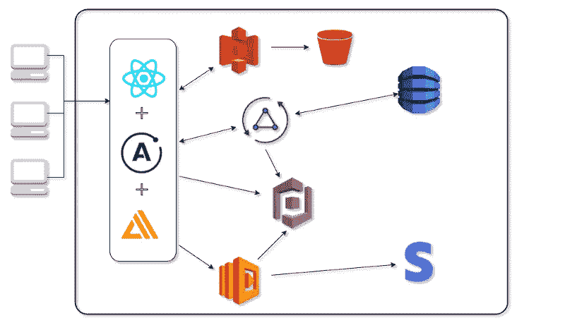

# 软件文档:为了维护工程师的利益

> 原文：<https://levelup.gitconnected.com/software-documentation-for-the-good-of-the-maintenance-engineer-704347010cb9>


几天前，我妻子问我什么是软件文档。我和她分享说，这有点像帮助读者理解软件细节的路线图，比如它是如何构建的，以及它意味着如何使用。如果你曾经写过任何类型的软件文档，你会知道这个过程没有什么特别迷人的地方，这可能是为什么它通常被抛到一边，至少在我的经验中是这样。

我以前确实觉得有点无聊和乏味。后来这种情况发生了变化，我发现自己越来越支持它。有很多很好的理由为软件编制文档，并且文档对于它旨在帮助的各方或角色来说意味着不同的事情。我想更多地关注软件维护的重要性，以及在下一阶段继承系统的工程师。

**文档的“内容”**

软件项目作为一个整体由几个部分组成，包括系统架构、源代码、开发过程中应用的风格和编程范例、工程师对逻辑的特殊应用、软件解决的问题等等。如果你从一开始就参与到这个项目中，你可能不会很难回答围绕上述项目的问题。文档通过书写文本和/或任何图形说明来说明这些以及更多内容，这些文本和/或图形说明有助于以清晰简单的方式描述软件的这些方面，以便其他人可以容易地理解软件。

下面是一个如何以图形方式显示技术堆栈和应用程序整体架构的示例。



**文档的“为什么”**

正如我在开始提到的，我特别关注文档对于继承和维护开发系统的团队的重要性。软件部署和实现后，通常会进入维护阶段(或过程),并且通常没有结束日期。你可能从笔记本电脑上正在进行的软件更新中了解到这一点。软件所有者将希望他们的系统改变、改进、升级，并消除在先前开发阶段产生的任何错误和技术债务。这是一件了不起的事情，我们支持这一过程的最佳方式是帮助维护工程师团队对系统进行清晰、详细和结构化的描述。

**文档的“细节”**

文档中要包含的内容列表可能非常广泛，并且可能包含内容的必要性会有所不同。下面是一些可能添加到文档或源代码中的内容，对维护团队有很大的帮助:

```
- An overview of the system, what it does, the problem it is meant to solve and how it solves it- The overall system architecture- The tech stack used- How to install and run the software- How to run automated unit tests- Any prerequisites to get the system up and running- What to do or consider in the case that the system doesn't run as it should after following the guide- Directory structure- Project structure- For each component or sub system, a design description and specification- Well commented source code, especially complex sections of the code- A guide to known existing problems and how they can potentially be resolved or improved- Who to contact for any kind of support
```

**话虽如此…**

当涉及到文档时，你不必太花哨，要考虑的重要事情是它的存在，它对其他人来说是清晰可读的。好的展示会有所帮助，因为你不想让你的读者被糟糕的结构/布局、糟糕的语法或不正确的拼写吓跑。从添加和编辑“README.md”文件到您的项目开始，这对团队有好处，他们将不得不在您开发的基础上进行构建。