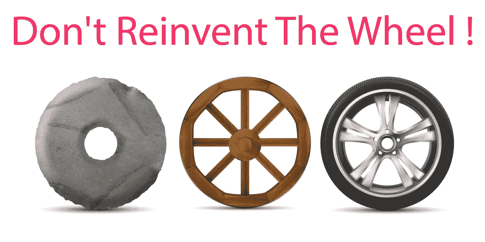

# 软件工程:软件开发中重用的最佳实践

> 原文：<https://levelup.gitconnected.com/software-engineering-best-practices-for-reusing-in-software-development-6006f9d8d364>

## 思维程序员

## 不要多此一举

作者图片

事实上，对于类似的问题，我们总是使用相同的解决方案。例如，每当需要类似的功能时，我们通常重用为另一个项目编写的代码——这是软件开发中重用的一个例子。

> 软件重用是使用现有软件资产实现或更新软件系统的过程。

# 什么是基于复用的软件工程？

基于重用的软件工程是一种软件工程策略，其中开发过程适合于重用现有的软件。

## 应用系统

一个应用系统的整体可以被重用，要么不加改变地把它合并到他们的系统中，要么开发应用程序系列。

## 子系统、组件和模块

从子系统到模块的应用程序组件可以重用。

## 对象、函数或过程

实现单个明确定义的对象或功能的软件组件可以被重用。

# 重用的好处

软件复用有 ***两个关键好处*** 如下。

## 缩短软件开发时间

当程序员正在开发的应用程序需要一段已经存在的代码时，他们可以节省时间。

## 更多的时间和成本效益

在良好的实践环境中，现有的代码伴随着现有的文档、现有的质量保证和兼容的测试结果。

> 当时间就是金钱时，代码的重用可以节省大量的金钱并改进应用程序。

# 如何应用它们？

尽管可重用性显然是软件开发中最有用的原则之一，但它并没有在大多数组织中应用。在过去 20 年的软件开发中，已经开发了许多支持软件重用的技术，它们被分为三个主要类别，并采用了如下各种方法。

*   模式的重用。
*   创建通用程序或可配置框架，为各种用例及环境支持类似的解决方案。
*   使用带有模型模式的模型驱动方法。

## 建筑模式

架构模式是标准的软件架构，支持作为应用程序基础的常见类型的应用程序系统。

 [## 软件架构:你需要知道的最重要的架构模式

### 解释常见的不同架构模式

levelup.gitconnected.com](/software-architecture-the-important-architectural-patterns-you-need-to-know-a1f5ea7e4e3d) 

它们是在给定的上下文中，软件架构中常见问题的通用的、可重用的解决方案。

## 设计模式

设计模式是一种描述或模板，可以重复应用于软件设计中经常出现的问题。

有三种模式类型，即创造模式、结构模式和行为模式。

*   **创造**:将实例化过程抽象化，以便在对象如何组成和最终表示之间有一个逻辑分离。
*   **Structural** :更加关注类和对象如何使用不同的结构技术组成，并形成具有更多或更大灵活性的结构。
*   **行为**:关注内部算法、流程、职责分配以及对象之间的相互通信。

## 基于组件的开发

通过集成符合组件模型标准的组件来开发系统。

它产生于面向对象开发的失败，以支持有效的重用。单个对象类过于详细和具体。组件比对象类更抽象，可以被认为是独立的服务提供者。它们可以作为独立的实体存在。

## 应用框架

它们是可以使用的中等大小的实体。应用程序框架介于系统和组件重用之间。

我们收集经过改编和扩展的抽象和具体的类来创建应用系统。

## 遗留系统包装

遗留系统通过定义一组接口并通过这些接口提供对这些遗留系统的访问而被“包装”。

## 面向服务的系统

系统是通过链接共享服务开发的，共享服务可能是外部提供的。

## 软件产品线

软件产品线是一组具有公共架构和共享组件的应用程序，以便它们可以适应不同的客户。我们可以实现如下一些调整。

*   组件和系统配置
*   向系统添加新组件
*   从现有组件库中选择
*   修改组件以满足新要求

## 商业现货(COTS)产品再利用

通过配置和集成现有的应用系统来开发系统，而不改变系统的源代码。

它们通过使用内置的配置机制进行调整，允许系统的功能根据特定的客户需求进行定制。

## ERP 系统

封装通用业务功能和规则的大型系统是为组织配置的。

常见的业务流程，如订购和开具发票、制造等。

## 可配置的垂直应用

通用系统的设计使得它们可以根据特定系统客户的需求进行配置。

## 程序库

实现常用抽象的类库和函数库可供重用。

## 模型驱动工程

软件被表示为领域模型和独立于实现的模型，代码从这些模型中生成。

## 程序生成器

生成器系统嵌入了应用程序类型的知识，用于从用户提供的系统模型生成该领域中的系统。

## 面向方面的软件开发

当程序被编译时，共享组件在不同的地方被编织到应用程序中。

很简单，对吧？