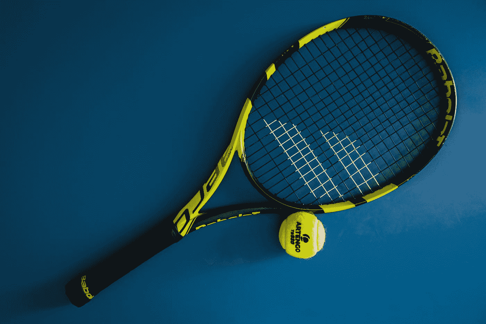

# 软件工程是失败者的游戏

> 原文：<https://levelup.gitconnected.com/software-engineering-is-a-losers-game-94cf1f4df0c6>

## 要变得更好，从你的错误中学习，停止犯非受迫性错误

照片由[nathanal Desmeules](https://unsplash.com/@nathanael240606?utm_source=medium&utm_medium=referral)在 [Unsplash](https://unsplash.com?utm_source=medium&utm_medium=referral) 拍摄

我最近迷上了“赢家的游戏”和“输家的游戏”的概念有几篇很棒的文章深入地解释了这个想法，但是这里有一个简短的总结:

Simon Ramo 在 1973 年观察到，业余网球和职业网球比赛的获胜方式有很大的不同。

当两个业余对手在比赛时，比赛往往不是通过胜利者的高超技巧而是由于失败者的失误而获胜。失败者经常犯非受迫性失误，如击球出界、错过容易的击球或双误。换句话说，输的人打自己。失败者“失去”的分数多于胜利者“赢得”的分数。这是一场“失败者的游戏”

当两个职业对手在比赛时，比赛的胜负主要取决于胜者的技巧。两个球员都没有犯很多非受迫性错误。胜利者把他的球打得很好，并且胜过他的对手来击败他。在这种游戏中，胜利者“赢得”的点数多于失败者“失去”的点数。这是一场“赢家的游戏”

所以，如果你在玩一个失败者的游戏，一个成功的策略就是尽量避免犯错，让你的对手打败自己。

(如果你以前打过网球或乒乓球，我希望此时你点头表示认可。作为一名狂热的乒乓球运动员，我每天都在办公室里看到这样的场景。)

这个观察的应用是，你应该试图理解你参与的任何给定的活动是赢家的游戏还是输家的游戏。获得这种理解会教会你应该如何玩这个游戏。

你可以在 Charles Ellis 的这篇[文章](https://www.empirical.net/wp-content/uploads/2012/06/the_losers_game.pdf)、FS 博客的这篇[文章](https://fs.blog/2014/06/avoiding-stupidity/)或者 Ben Hosking 的这篇[文章](https://thehosk.medium.com/software-development-is-a-losers-game-fc68bb30d7eb)中读到更多关于这些想法的内容。

# 与软件工程相似

现在，如果我们认为软件工程是失败者的游戏呢？也就是说，我们经常通过犯非受迫性错误和犯错来打败自己。如果我们是业余爱好者，可以这么说，我们如何让球保持在比赛中，而不是把它打到网里？

说“如果你想变好，就停止犯错”是很简单的事情。但这多少有些于事无补。这就像对那些贫穷的人说，“你为什么不停止贫穷？”

如果我们把这个类比做得太过，也是无益的。如果避免错误是软件工程的终极目标，那么最好的软件工程师就是不写代码或者什么都不做的人吗？显然，不是的。软件工程师是靠写代码来帮助实现一些产品，以实现一些愿景(赚钱、解决现实世界的问题、简化任务等)。)，所以那一定是真正的终极目标。

因此，看来我们必须在生产有价值的产品和避免错误之间取得平衡。这就引出了一个有趣的思想实验:我们在哪些方面战胜了自己，如何才能避免犯这些业余错误？

# 非受迫性失误

以下是我们可能犯的非受迫性错误的列表。我相信你也可以在这个列表中添加更多的内容。

*   在尝试编码解决方案之前不了解问题
*   不了解我们使用的工具或编程语言
*   在要求代码审查之前，没有仔细审查我们自己的代码
*   在要求代码评审之前，不要手工测试我们自己的代码
*   不编写单元测试
*   不遵守商定的公司标准

# 解决这些非受迫性错误

既然我们已经确定了一些潜在的非受迫性错误，我们如何避免犯这些错误呢？

首先，我们可以实施保护措施，帮助我们在错误变得代价高昂之前发现并纠正错误。所有代码仓库都应该配置代码链接器、代码格式化器和一套自动化测试。在允许任何代码被合并之前，这些安全措施可以作为 CI 管道的一部分运行。

在编写代码时，我们也可以更彻底地关注细节。在创建了一个合并请求之后，我们应该总是在请求其他人审查我们的代码之前进行自我代码审查。我们也应该总是手动验证我们的更改。

作为一个代码审查者，没有什么比审查别人的代码更令人沮丧的了，这些代码显然不是他们自己做的。当代码评审者不得不捕捉简单的错误，如注释掉的代码、错误的格式、失败的单元测试或代码中损坏的功能时，这浪费了他的时间。所有这些错误都很容易被代码作者或 CI 管道发现。

当合并请求经常充满错误时，它将代码审查过程变成了一个把关过程，在这个过程中，少数更高级的工程师充当把关者。这是一个不利的场景，会产生瓶颈并降低团队的速度。它还分散了代码评审的更高目的，即知识共享。

我们可以使用清单和合并请求模板来提醒自己要仔细检查的事情。你审查过你自己的代码吗？你写过单元测试吗？您是否根据需要更新了任何文档？对于前端代码，您是否在公司支持的每个浏览器中验证了您的更改？你确保所有面向用户的文本都被翻译了吗？您是否确保了 UI 符合可访问性标准和指南？

在自动化工具的帮助下，通过我们自己进行这些检查，我们表现出了更多的专业精神和对同事的尊重。信任会增长，速度会提高。关键是要勤快自律。

# 结论

软件工程是失败者的游戏。所以让我们学会玩游戏，不要再输给自己了。