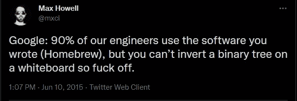
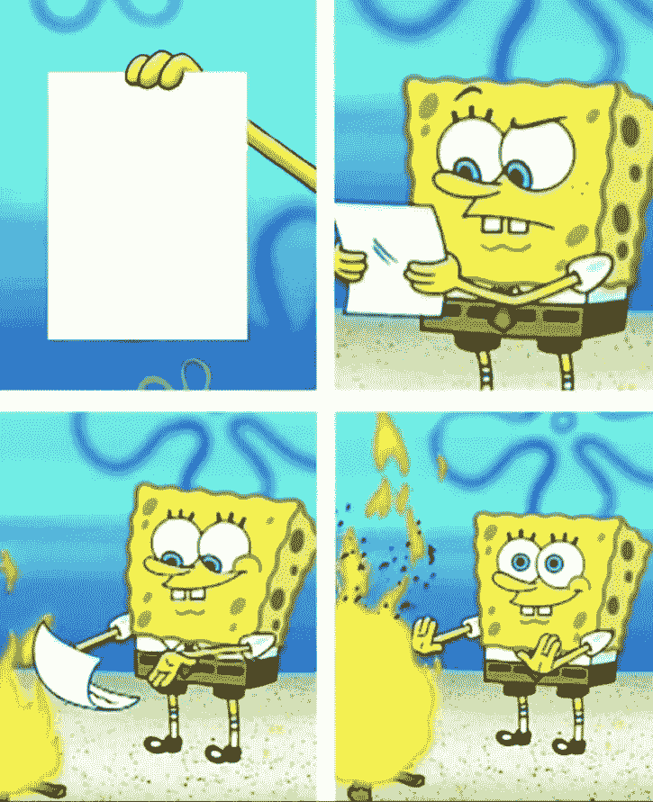

# 软件面试糟透了——让我们来解决它们

> 原文：<https://levelup.gitconnected.com/software-interviews-suck-here-is-how-to-fix-them-ea587f89db89>

## 改善面试的 7 个具体步骤

图片来源:[https://unsplash.com/photos/bmJAXAz6ads](https://unsplash.com/photos/bmJAXAz6ads)

在我 7 年左右的开发生涯中，我经历过糟糕的面试(双方都有)。我一只手就能数出成功面试的次数。这是为什么呢？为什么现在盛行的观点是软件面试普遍很烂？工程是不是太难了，以至于没有享受的空间？几乎没有。这里有 7 个简单的步骤来恢复软件开发人员面试过程的人性。

# 1.重新思考/去除一对一编码

在我们的行业中有一个荒谬的谬论，即编码能力独立于上下文和环境因素。我们都有过这样的经历——熬过了一轮又一轮的面试，飞过了整个国家，我们梦想的工作悬而未决，却在一对一的编码会议上被冻结了。总是一些愚蠢的事情。忘记我多年的经验和我每天只睡两个小时的事实——我在 15 分钟内编写的这个井字游戏并不是亚线性运行的。所以很明显我不是一个真正的程序员。

[传奇推文](https://twitter.com/mxcl/status/608682016205344768?lang=en)总结了编码采访的错误。

我最讨厌一对一的是他们太明显的做作。以下是几个例子:

*   程序员不会在 30 分钟的生死期限内工作。
*   程序员不会和评判他们每一次击键的人一起工作。
*   程序员思考一个问题需要 60 秒以上。
*   程序员并不特别擅长进行这些面试。

## 这里有一些很好的替代一对一会议的方法

1.  *HackerRank*
    如果你坚持要测试一个专业开发人员能不能写代码，至少把情况解压成 HackerRank。这些测试更公平，因为它们通常为候选人提供 90 分钟的时间，一个 ide 的外观，以及具体的测试用例来运行。
2.  带回家的项目这包括给候选人一个完整的工作项目，例如一个 web 应用程序，让他们添加一个功能或修复一些坏的测试。这为应聘者提供了一个更轻松、更现实、更全面的场景，也更容易被招聘者客观地评估。
3.  **—职业面试官* 沃尔玛的迎宾员不面试也是有原因的。他没有资格。而且说实话，大部分工程师也不是。相反，试试 Karat——这家公司想出了一个令人难以置信的主意，竟然训练工程师去面试。是的，还是一对一面试，但是当筛选员不在你应聘的公司工作时，体验就完全不一样了。当我做一个的时候，它让我震惊。面试官很优秀；问题是公平的(即。没有谜语，先易后难等等，…)，压力减轻；面试官真心希望你成功；最重要的是，你可以选择免费重做，没有任何问题。*

# ***2。创建一个标题:标准化、评分和排名***

*接受了足够多的采访后，就成了例行公事。我和我的伙伴把它归结为一门科学，或者说我们是这样认为的。但是当一个新的开发人员加入时，我们开始正式写下我们的过程。尽管我们已经做了很多次，但是把它写在纸上的简单行为暴露了许多缺点。例如，我们没有一个公平的方法给候选人打分。我们没有做足够的笔记等等...*

*撰写面试候选人的模板至关重要。这个共享的文档应该包含面试官提问、评估和评分候选人所需的一切。一个第一次面试的人应该能从这份文件中学到她需要的一切。它至少应包含:*

*   ***理想人选总结** —即。最看重什么特质。*
*   ***打破僵局**并介绍让面试开始的要点。*
*   ***分配给每节课的时间表、时间和面试官**。*
*   ***问题库**包含清晰的全部细节和解决方案。*
*   ***评分表和记分卡**以便面试官可以在面试开始时或之后立即对候选人进行评估。*
*   ***题库**用于挑战行为和体验问题。*

*当面试一群候选人时，我们发现两个候选人的排名和分数都很有帮助。例如，我们会让所有面试官先给候选人 A、B、C 排名，然后公布他们的总分。对于优秀的候选人，排名和得分往往是一致的。但在其他情况下，排名高的候选人可能平均分低。接下来的对话通常对候选人和面试过程本身都有启发。*

# *3.不要抄袭苹果，谷歌，网飞等...*

*[FAANG](https://en.wikipedia.org/wiki/Big_Tech) 公司超级成功，但这并不意味着复制他们就能让你的公司超级成功。例如，让[在单个代码库中拥有数十亿行代码](https://research.google/pubs/pub45424/)对谷歌来说是可行的，但它会削弱大多数其他公司。同样，伟大的工程师可能愿意忍受谷歌面试的烦恼，因为他们期待谷歌的津贴和薪酬。抱歉，但是你的中型公司的小隔间和“这是一个成本中心”的心态并没有吸引谷歌员工。所以不要这样对待候选人。*

*说到不做谷歌做的事…*

# ***4。停止在任何白色的东西上编码***

*"擅长在白板上写代码."我们都听说过。我们都讨厌它；我们都接受。没有任何意义。一个真正的编码者可以毫不费力地适应任何媒体，而不应该受制于特定的东西，比如键盘……这种借口是什么时候业界集体接受的？*

*我清楚地记得为一次谷歌面试而学习的情景，当时我惊讶地发现自己将在一个空白的谷歌文档中编程。没错——一个怪异的谷歌文档。如果我通过了，只有到那时，谷歌才会让我飞去参加马拉松式的白板演示。*

**

*当面试官说“我们要在这个空白的 word 文档上进行编码”时，我的大脑*

*这就像纳斯卡评估凯尔·布什的自行车骑得有多好。自行车有轮子和齿轮——有什么问题。如果凯尔是一个“真正的赛车手”，他可以在任何东西上比赛。对不起，凯尔，你没有有效地起草-我们将不得不通过”。*

*作为一个行业，我们可以抛弃一切白色吗？我说的是白板、文档、IDE 配色方案、马克·扎克伯格……扔掉它们。而是采用一个编码平台——hacker rank、CodeSignal、TestGorilla[这么多](https://www.youtube.com/watch?v=EuPSibuIKIg)。*

*PS——我已经与一名员工确认，截至 2021 年底，他们仍然使用谷歌文档进行面试。*

# ***5。强调良好的对话***

*如果你和一个能毫不费力地描述开颅手术的著名脑外科医生谈话，你会拿出一个猪头让他证明吗？根据我的经验，详细的谈话可以很好地代表人们的表现。例如，我们最近雇佣的一个候选人，他很聪明地谈到了 Angular，结果证明，信不信由你，他擅长 Angular。*

*这不仅仅是技术上的。候选人能很好地讲述过去的经历吗？他们会说前团队成员的坏话吗？他们能对软件的团队性质给出一个相关的观点吗？你雇佣的是人，不是软件猴子。为了记录在案，我说的是人与人之间的真实对话，而不是这种[亚马逊行为明星问题](https://igotanoffer.com/blogs/tech/amazon-behavioral-interview#:~:text=The%20STAR%20method%20(Situation%2C%20Task,have%20already%20heard%20of%20it.)的废话。*

*对话是双向的。我曾经被一个明显很犀利的家伙采访过——然而他无法阻止自己不停地咆哮用户是多么愚蠢，总是问他关于应用程序如何工作的问题。他接着提到，用户是一组博士统计学家。他认为这些博士都很愚蠢，他真的很讨厌他们，而不是考虑这个软件可能对用户不友好。五分钟的谈话，我知道我不想在那里工作！*

## *如何保持生产力*

*我不是建议你进去即兴表演。为了避免跑题和失误，**准备了一个题库**。它应该包括技术和行为两方面的调查，并且应该探究什么有效，什么无效。以下是一些例子:*

*   *说一个用了微服务的项目。这种体系结构的难点是什么，您将来如何避免它们？*
*   *假设您正在运行一个流行的网站，但是用户报告速度很慢。你将如何进行调试？您可以使用什么工具来衡量和监控任何绩效改进？*
*   *告诉我你不得不与一个难相处的人一起工作来完成一个目标的时候。主要的挑战是什么？你是怎么处理的？*

*另一个开始谈话的好方法是让候选人带来一个个人项目，比如他们建立的图书馆或网站。如果没有，让他们选择一个他们特别喜欢的网站或平台。用它来框定问题，比如“你会给它添加什么样的下一个功能，你会如何评价用户对它的满意度？”你会发现，当候选人带来他们自己的项目时，他们会更自在，也更有能力明智地谈论它。你还会发现，项目的质量往往与候选人的质量相关。*

# ***6。尊重人的时间***

*不要花一个月的时间去做面试。不要等两个星期再决定是还是不是。我曾经在一家公司面试了 4 个星期——我真的很想在那里工作，但另一份工作邀请来了，我接受了。第二家公司虽然没有第一家那么有魅力，但在第一周给了我两次面试机会和一份工作邀请。穿过这些废话让人耳目一新。这给我留下了非常糟糕的第一印象——我的第一份薪水要花 6 个月才能存进去吗？我要两年后才能完全入职吗？*

**

*提交申请与接受聘用。*

*PS:我的朋友也申请了那里，7 周后仍在申请中...*

# *7 .**。给出反馈***

*我明白了。这是一种责任。但是站在我的角度想想。我做了一份全职工作，然后在回家的路上在长岛铁路的地板上学习两个小时。我脑子里塞满了关于散列表和寻路算法的晦涩细节。我放弃了周六的时间，花了 7 个小时在你的“应该只花 90 分钟”的课后作业上。我飞越了整个国家，住在一家旅馆里。我下班了，花了两天时间做现场采访。我让妻子燃起了希望，因为这份梦寐以求的工作会让我们在完美的时间来到一个完美的城市。我屏住呼吸又等了两天，而你却犹豫不决。经过这一切，我终于收到了以…开头的电子邮件*

> *虽然我们很感谢你的时间，不幸的是…*

*压碎了。又来了。*

*我很努力。我认为我做得很好——感觉我做到了。哪里出了问题？我应该做些什么不同的事情？怎样才能避免再次经历？我说了什么吗？我是狗屎工程师吗？我接近了吗？我妻子不相信我真的不知道发生了什么——我该告诉她什么？他们至少可以给我一些建设性的批评…*

> *很抱歉，我们的政策不允许提供反馈…*

*是的，你和你的政策可以走了。*

***你怎么看？**得到了不同的拍摄？我漏了什么吗？评论一下，让我知道。*