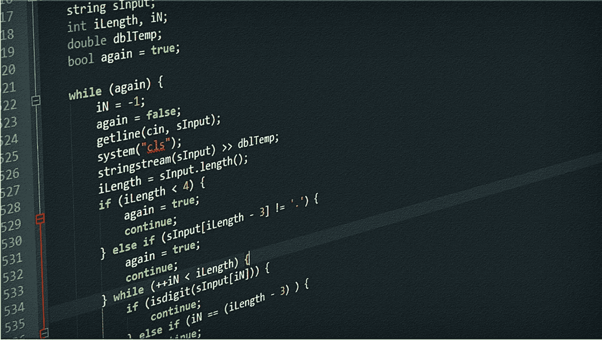

# 软件可靠性第 1 部分:它是什么，为什么开发人员应该关注它

> 原文：<https://levelup.gitconnected.com/software-reliability-pt-1-what-is-it-why-developers-should-care-f2a71274772c>

还记得你去自动提款机取钱时，提款机给你的钱数不对吗？还是那次你从未订购的优步之旅被记入借方？我知道你在想什么，这两件事都比不上你飞往迪拜的飞机导航系统的故障，对吗？

等等，那是什么？你不记得这些时刻了吗？嗯……也许是因为它们没有发生(或者至少我希望它们没有发生)。

我不知道你怎么想，但我通常不会祈祷打开我最喜欢的应用程序时不会遇到运行错误。这是对软件质量的证明，更确切地说，是对其可靠性的证明。

这个特性可以说是软件系统中最重要的。不可靠的软件可能导致最终用户和软件开发者的高成本。用户不希望采用经常出现故障、不能满足他们期望的基本需求或要求的软件，而那些不可靠系统的开发人员很可能会因为质量差而受到指责，并失去未来的商业机会。

**大家不知道可靠性是什么意思吗？**

我认为大多数开发人员对可靠软件都有正确的理论理解。毕竟，当你按下(或触摸)屏幕上的右键时，你希望它打开。当您按下键盘上的某个键时，您希望正确的键被注册。因此，简而言之，事情应该像它们应该的那样工作，简单明了。

对于那些认为自己是问题解决者的人来说，我们应该很好地理解这一点，并努力提供解决方案，使我们的用户不会担心什么样的输入或行为会引发下一次系统故障。

> “通俗地说，软件系统的可靠性是用户认为它能提供他们所需要的服务的一种度量。更正式地说，可靠性通常被定义为在特定环境中为特定目的在特定时间内无故障运行的概率。”—伊恩·萨默维尔

**软件可靠性因用户而异**

你可能会想到这一点，这绝对是值得记住的事情。软件可靠性是主观的。为什么用户并不认为所有的服务都同等重要。应用程序可能有不同的服务或交互点，供用户根据需要执行某些功能。

这些不同的交互点意味着可能有不同的输入数据集被传递给软件，并且一些输入数据可能导致软件以其他输入数据不会的方式失败。例如，假设您使用社交媒体应用程序向其他人发送消息，根据您的经验，这些数据是以正确的方式处理的，并且您的消息总是会被发送出去(当网络条件合适时)。然而，假设你的一个朋友使用相同的应用程序，但只是更新他或她的状态，但这个操作经常失败。

这两个人对软件的可靠性会有不同的看法，因为他们希望通过同一个应用程序来满足不同的需求。

**软件故障与软件故障**

等等，这两个不是同一个吗？我想当两者互换使用时，可能很难区分，但我认为它们是不一样的。

软件故障发生在运行时或程序执行期间。当系统不能提供用户所期望的东西时，就会发生这种情况，就像我在开始提到的虚构的 ATM 情况一样。它们本质上是动态的。

另一方面，软件故障是静态的。它们是导致软件不符合其规格或要求的编程或设计错误。软件故障可以在程序的源代码中找到。您可能已经意识到，这些错误是系统中发生故障的原因，当坏的源代码与暴露软件错误的一组特定输入一起执行时。开发者不喜欢听到这些，我知道我肯定不喜欢。

那么这意味着什么呢，软件故障越少，可靠性越高？我希望事情能这么简单。这一切都要追溯到用户如何与软件互动。你可以开发一个错误率非常低的应用程序，但是如果这些错误存在于大多数用户交互的特定服务中，他们会认为它非常不可靠。而在用户不太可能使用的服务中存在高得多的软件故障百分比的应用程序可能被认为是高度可靠的。

您甚至可能会遇到这样的情况，一些有经验的用户绕过他们知道会导致失败的软件错误。我不得不在一个特定的银行应用程序上这么做。

**工程流程**

我知道你在想什么，“这些所谓的错误，或者通常所说的‘bug’，究竟是如何进入软件的？”。这个问题的答案通常(不总是)离家很近。软件系统的可靠性很大程度上受工程过程的影响，所以当房间里的人转向开发人员时，我们不应该回头看。这是一个简单的等式:

*糟糕的软件工程===糟糕的软件质量*

现在，我明白了可靠性并不总是仅仅依赖于开发团队。如果规范没有说明软件应该如何反应或处理异常，那么这在很大程度上就落在了负责软件规范的团队身上。然而，开发人员仍然有责任以这样一种方式进行编程，即系统可以处理这些错误，但是我将在第 2 部分中讨论这些细节。

**话虽如此…**

软件的日常使用只会呈指数级增长，作为开发人员，我们有特权改变它的工作方式以满足他人的需求。我们也受益于工程师们的精湛技术，他们构建了可靠的系统，帮助并使我们能够完成我们所做的许多事情，无论是 IDE，银行还是保险应用，优步，网飞，等等。

不可否认，我们最喜爱的软件产品背后的工程师非常关心生产满足需求的可靠软件，我们也应该如此。

参考资料:

伊恩·萨默维尔的软件工程

 [## 构建可靠的软件

### 《大西洋月刊》最近发表了一篇关于软件业如何不断产生不可靠代码的报道…

medium.com](https://medium.com/misfit-coders/building-reliable-software-work-in-progress-691423c22ac8)  [## 可靠软件系统的设计方法:学术文章摘要

### 让我们深入研究 Barbara Liskov 在 1972 年发表的可靠软件系统的设计方法。

medium.freecodecamp.org](https://medium.freecodecamp.org/a-design-methodology-for-reliable-software-systems-a-summary-394dfd0dcbc2)